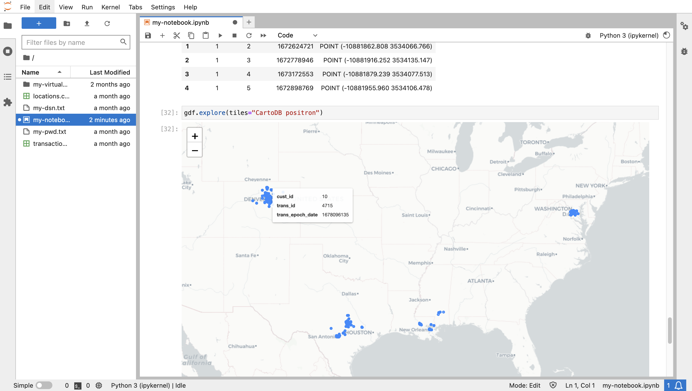

# データの探索

## 概要

ここでは、前の演習で準備した事業所とトランザクションのデータを確認します。Autonomous Databaseでデータを管理することで、バックエンドの処理および分析操作を実行し、特殊な分析のために適切なデータ・サブセットをPythonに取り込むことができます。

推定ラボ時間: 10分

### 目標

*   Autonomous DatabaseからPythonへのspatiotemporalデータとクエリ結果の取得
*   Pythonでのデータのビジュアル化と探索

### 前提条件

*   演習5の完了: データの準備

## タスク1: Pythonでの空間データ処理

データ処理の最も一般的なPythonライブラリはPandasで、列および行を含む表と同様にデータ構造としてDataFrameを提供します。GeoPandasライブラリは、空間データ処理のためにPandasを拡張します。ここで、DataFrameはジオメトリ列を含むGeoDataFrameに拡張されます。Shapelyライブラリは、ジオメトリ列の移入に使用される空間タイプを提供します。Foliumは、一般的なマップ視覚化ライブラリであり、GeoPandasによって使用されます。

1.  空間データ処理およびマップ・ビジュアライゼーション用のライブラリをインポートします。
    
        <copy>
        import geopandas as gpd
        import shapely
        import folium
        </copy>
        
    
    
    
2.  Pythonの空間データの基本的な例として、次を実行して、複数の都市の点位置を含むGeoDataFrameを手動で作成します。ジオメトリ値は、GeoDataFrameで使用される形式であるため、Well-Known Text (WKT)形式です。
    
        <copy>
        gdf = gpd.GeoDataFrame(
          {
            "city": ["Buenos Aires", "Brasilia", "Santiago", "Bogota", "Caracas"],
            "country": ["Argentina", "Brazil", "Chile", "Colombia", "Venezuela"],
            "geometry": ["POINT(-58.66 -34.58)",
                         "POINT(-47.91 -15.78)",
                         "POINT(-70.66 -33.45)",
                         "POINT(-74.08 4.60)",
                         "POINT(-66.86 10.48)",
                ],})
        gdf["geometry"] = gpd.GeoSeries.from_wkt(gdf["geometry"])
        gdf.set_geometry("geometry")
        gdf.crs="EPSG:4326"
        gdf
        </copy>
        
    
    
    
3.  データをビジュアル化するには、次を実行して背景マップとマーカー・サイズの両方を指定します。マップ・マーカーの上にマウスを移動すると、その属性が表示されます。
    
        <copy>
        gdf.explore(tiles="CartoDB positron", marker_kwds={"radius":8})
        </copy>
        
    
    
    
4.  Oracle Spatialには、GeoDataFrameで使用されるWKT形式への変換など、ネイティブ空間型から共通形式に変換する関数およびメソッドが含まれています。そのため、Oracle Spatialの結果からGeoDataFrameを作成することは簡単です。オブジェクト・メソッドの変換構文は、同等のSQL関数よりもコンパクトです。たとえば、**(geometry).get\_wkt()**メソッドと **sdo\_util.to\_wktgeometry(geometry)**関数があります。オブジェクト・メソッドを使用して、ハードコードされたSDO\_GEOMETRYからWKTおよびGeoJSON形式への書式変換の基本的な例を参照するには、次を実行します。
    

    ```
    <copy>
    cursor = connection.cursor()
    cursor.execute("""
      WITH x AS (
        SELECT sdo_geometry(2001,4326,sdo_point_type(-100.12, 22.34,null),null,null) 
               as geometry
        FROM dual)
      SELECT geometry, 
             (geometry).get_wkt(), 
             (geometry).get_geojson()
      FROM x
      """)
    for row in cursor.fetchone():
       print(row)
    </copy>
    ```
     
    

5.  前の演習では、LOCATIONS表をファンクションベースの空間索引で構成しました。この関数はlonlat\_to\_proj\_geom( )で、World Mercator座標系で経度、緯度をSDO\_GEOMETRYに変換し、後の演習で使用するライブラリとの互換性を確保します。次を実行して、その関数をWKT形式として使用してジオメトリを取得します。

    ```
    <copy>
    cursor = connection.cursor()
    cursor.execute("""
      SELECT lon, lat, (lonlat_to_proj_geom(lon,lat)).get_wkt()
      FROM locations
      """)
    for row in cursor.fetchmany(10):
       print(row)
    </copy>
    ```
     
    

6.  次を実行してLOCATIONS表を取得し、GeoDataFrameを作成します。
    
        <copy>
        cursor.execute("""
         SELECT location_id, owner, (lonlat_to_proj_geom(lon,lat)).get_wkt()
         FROM locations
         """)
        gdf = gpd.GeoDataFrame(cursor.fetchall(), columns = ['location_id', 'owner', 'geometry'])
        gdf['geometry'] = shapely.from_wkt(gdf['geometry'])
        gdf.crs="EPSG:3857"
        gdf.head()
        </copy>
        
    
    
    
7.  次を実行して、GeoDataFrameをビジュアル化します。
    
        <copy>
        gdf.explore(tiles="CartoDB positron")
        </copy>
        
    
    
    

## タスク2: トランザクション・データの調査

1.  次に、TRANSACTIONSからLOCATIONSに結合する問合せからGeoDataFrameを作成します。次を実行して、GeoDataFrameを作成します。
    
        <copy>
        cursor = connection.cursor()
        cursor.execute("""
         SELECT a.cust_id, a.trans_id, a.trans_epoch_date, 
          (lonlat_to_proj_geom(b.lon,b.lat)).get_wkt() 
         FROM transactions a, locations b
         WHERE a.location_id=b.location_id
         """)
        gdf = gpd.GeoDataFrame(cursor.fetchall(), columns = ['cust_id', 'trans_id', 'trans_epoch_date', 'geometry'])
        gdf['geometry'] = shapely.from_wkt(gdf['geometry'])
        gdf.crs="EPSG:3857"
        gdf.head()
        </copy>
        
    
    
    
2.  次を実行して、GeoDataFrameをビジュアル化します。トランザクション属性を表示するには、アイテムの上にマウスを置きます。
    
        <copy>
        gdf.explore(tiles="CartoDB positron") 
        </copy>
        
    
    
    

**次の演習に進む**ことができます。

## さらに学ぶ

*   GeoPandasの詳細は、[https://geopandas.org](https://geopandas.org)を参照してください

## 確認

*   **著者** - Oracle、データベース製品管理、David Lapp氏
*   **コントリビュータ** - Rahul Tasker、Denise Myrick、Ramu Gutierrez
*   **最終更新者/日付** - David Lapp、2023年8月