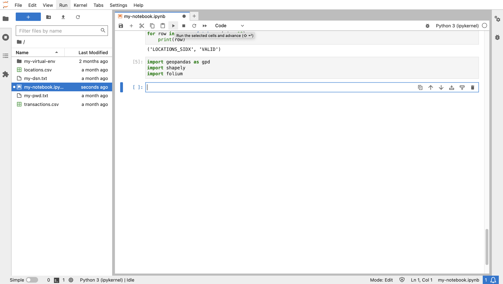

# 데이터 탐색

## 소개

이제 이전 연습에서 준비한 위치 및 트랜잭션 데이터를 살펴봅니다. Autonomous Database에서 데이터를 관리함으로써 백엔드 처리 및 분석 작업을 수행한 다음 전문 분석을 위해 적절한 데이터 하위 세트를 Python으로 가져올 수 있습니다.

예상 실험 시간: 10분

### 목표

*   Autonomous Database에서 Python으로 spatiotemporal 데이터 및 쿼리 결과 가져오기
*   Python의 데이터 시각화 및 탐색

### 필요 조건

*   실습 5 완료: 데이터 준비

## 작업 1: Python에서 공간 데이터 처리

데이터 처리를 위한 가장 일반적인 Python 라이브러리는 Pandas입니다. Pandas는 열과 행이 있는 테이블과 유사한 데이터 구조로 DataFrame를 제공합니다. GeoPandas 라이브러리는 공간 데이터 처리를 위해 Pandas를 확장합니다. 여기서 DataFrame는 "geometry" 열을 포함하여 GeoDataFrame로 확장됩니다. Shapely 라이브러리는 형상 열을 채우는 데 사용되는 공간 유형을 제공합니다. Folium은 인기 있는 맵 시각화 라이브러리이며 GeoPandas에서 사용됩니다.

1.  공간 데이터 처리 및 맵 시각화를 위해 라이브러리를 임포트합니다.
    
        <copy>
        import geopandas as gpd
        import shapely
        import folium
        </copy>
        
    
    
    
2.  Python에서 공간 데이터의 기본 예로 다음을 실행하여 여러 도시에 대한 점 위치를 포함하는 GeoDataFrame를 수동으로 만듭니다. 지오메트리 값은 GeoDataFrame에서 사용되는 형식이므로 잘 알려진 텍스트("WKT") 형식입니다.
    
        <copy>
        gdf = gpd.GeoDataFrame(
          {
            "city": ["Buenos Aires", "Brasilia", "Santiago", "Bogota", "Caracas"],
            "country": ["Argentina", "Brazil", "Chile", "Colombia", "Venezuela"],
            "geometry": ["POINT(-58.66 -34.58)",
                         "POINT(-47.91 -15.78)",
                         "POINT(-70.66 -33.45)",
                         "POINT(-74.08 4.60)",
                         "POINT(-66.86 10.48)",
                ],})
        gdf["geometry"] = gpd.GeoSeries.from_wkt(gdf["geometry"])
        gdf.set_geometry("geometry")
        gdf.crs="EPSG:4326"
        gdf
        </copy>
        
    
    
    
3.  데이터를 시각화하려면 다음을 실행하여 배경 맵과 마커 크기를 모두 지정합니다. 맵 마커 위로 마우스를 가져가면 해당 속성이 표시됩니다.
    
        <copy>
        gdf.explore(tiles="CartoDB positron", marker_kwds={"radius":8})
        </copy>
        
    
    
    
4.  Oracle Spatial에는 GeoDataFrame에서 사용되는 WKT 형식으로의 변환을 포함하여 고유 공간 유형에서 공통 형식으로 변환하는 함수와 메소드가 포함되어 있습니다. 따라서 Oracle Spatial 결과에서 GeoDataFrame를 생성하는 작업은 간단합니다. 객체 메소드의 변환 구문은 동등한 SQL 함수보다 압축되어 있습니다. 예를 들어, **(geometry).get\_wkt()** 메소드와 **sdo\_util.to\_wktgeometry(geometry)** 함수를 비교합니다. 다음을 실행하여 객체 메소드를 사용하여 하드 코딩된 SDO\_GEOMETRY에서 WKT로 형식 변환의 기본 예와 GeoJSON 형식을 확인합니다.
    

    ```
    <copy>
    cursor = connection.cursor()
    cursor.execute("""
      WITH x AS (
        SELECT sdo_geometry(2001,4326,sdo_point_type(-100.12, 22.34,null),null,null) 
               as geometry
        FROM dual)
      SELECT geometry, 
             (geometry).get_wkt(), 
             (geometry).get_geojson()
      FROM x
      """)
    for row in cursor.fetchone():
       print(row)
    </copy>
    ```
     
    

5.  이전 연습에서 함수 기반 공간 인덱스를 사용하여 LOCATIONS 테이블을 구성했습니다. 함수는 lonlat\_to\_proj\_geom( )이며 이후 연습에서 사용되는 라이브러리와의 호환성을 위해 World Mercator 좌표계에서 경도, 위도를 SDO\_GEOMETRY로 변환합니다. 다음을 실행하여 해당 함수를 WKT 형식으로 사용하여 형상을 검색합니다.

    ```
    <copy>
    cursor = connection.cursor()
    cursor.execute("""
      SELECT lon, lat, (lonlat_to_proj_geom(lon,lat)).get_wkt()
      FROM locations
      """)
    for row in cursor.fetchmany(10):
       print(row)
    </copy>
    ```
     
    

6.  다음을 실행하여 LOCATIONS 테이블을 검색하고 GeoDataFrame를 생성합니다.
    
        <copy>
        cursor.execute("""
         SELECT location_id, owner, (lonlat_to_proj_geom(lon,lat)).get_wkt()
         FROM locations
         """)
        gdf = gpd.GeoDataFrame(cursor.fetchall(), columns = ['location_id', 'owner', 'geometry'])
        gdf['geometry'] = shapely.from_wkt(gdf['geometry'])
        gdf.crs="EPSG:3857"
        gdf.head()
        </copy>
        
    
    
    
7.  다음을 실행하여 GeoDataFrame를 시각화합니다.
    
        <copy>
        gdf.explore(tiles="CartoDB positron")
        </copy>
        
    
    
    

## 작업 2: 트랜잭션 데이터 탐색

1.  다음으로 TRANSACTIONS를 LOCATIONS에 조인하는 query에서 GeoDataFrame를 생성합니다. 다음을 실행하여 GeoDataFrame를 만듭니다.
    
        <copy>
        cursor = connection.cursor()
        cursor.execute("""
         SELECT a.cust_id, a.trans_id, a.trans_epoch_date, 
          (lonlat_to_proj_geom(b.lon,b.lat)).get_wkt() 
         FROM transactions a, locations b
         WHERE a.location_id=b.location_id
         """)
        gdf = gpd.GeoDataFrame(cursor.fetchall(), columns = ['cust_id', 'trans_id', 'trans_epoch_date', 'geometry'])
        gdf['geometry'] = shapely.from_wkt(gdf['geometry'])
        gdf.crs="EPSG:3857"
        gdf.head()
        </copy>
        
    
    
    
2.  다음을 실행하여 GeoDataFrame를 시각화합니다. 트랜잭션 속성을 보려면 항목 위로 마우스를 가져갑니다.
    
        <copy>
        gdf.explore(tiles="CartoDB positron") 
        </copy>
        
    
    
    

이제 **다음 실습을 진행하십시오**.

## 자세히 알아보기

*   GeoPandas에 대한 자세한 내용은 [https://geopandas.org](https://geopandas.org)을 참조하십시오.

## 확인

*   **작성자** - David Lapp, Oracle 데이터베이스 제품 관리
*   **제공자** - Rahul Tasker, Denise Myrick, Ramu Gutierrez
*   **최종 업데이트 수행자/날짜** - David Lapp, 2023년 8월