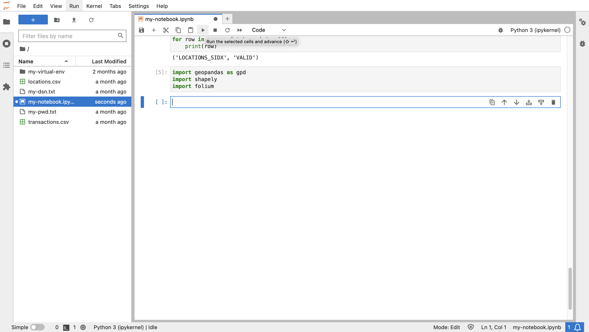
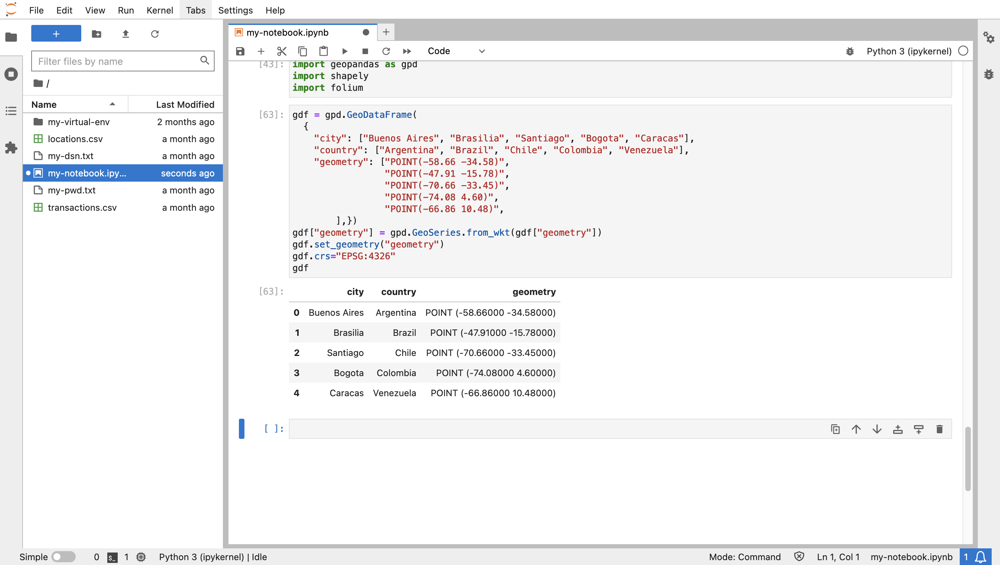
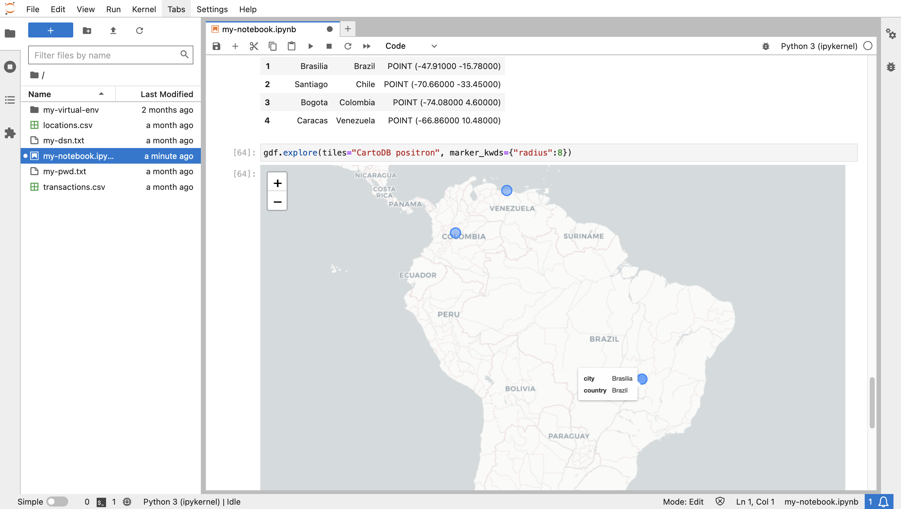
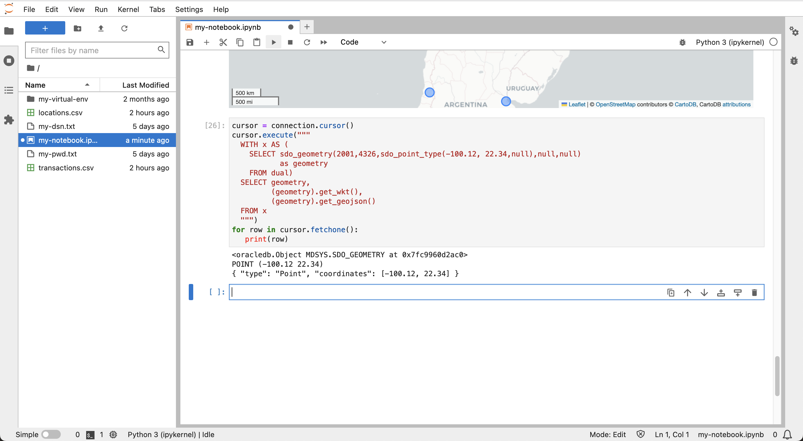
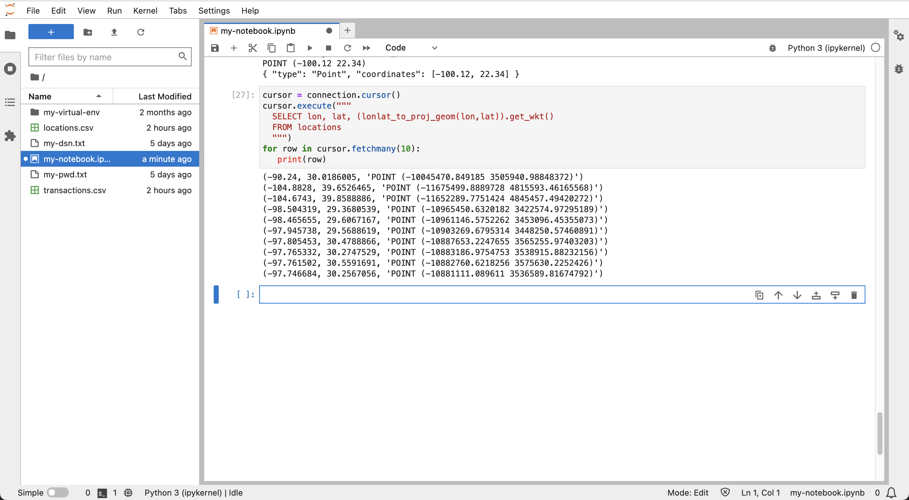
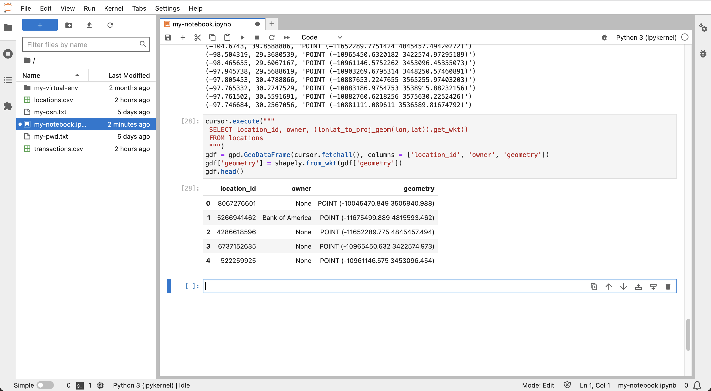
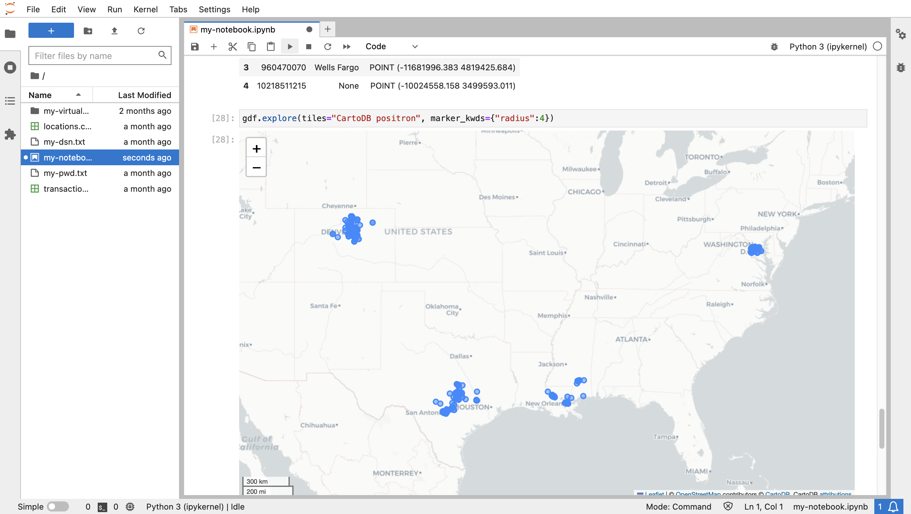
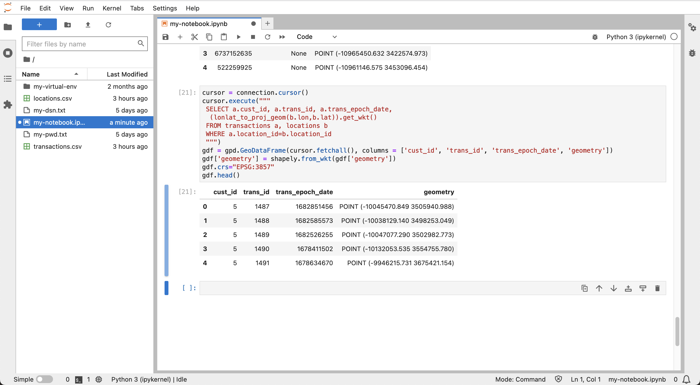
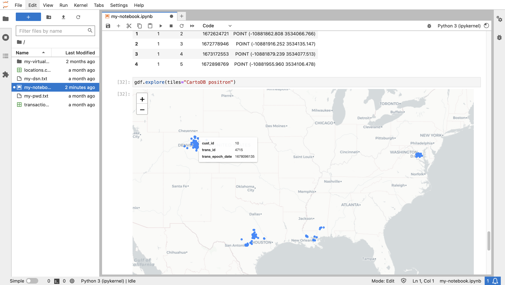

# 浏览数据

## 简介

现在，您将了解在上一个实验室中准备的位置和事务处理数据。通过管理 Autonomous Database 中的数据，您可以执行后端处理和分析操作，然后将适当的数据子集引入 Python 进行专门分析。

估计的实验室时间：10 分钟

### 目标

*   将 Autonomous Database 中的时空数据和查询结果引入 Python
*   用 Python 可视化和浏览数据

### 先备条件

*   完成实验室 5：准备数据

## 任务 1：Python 中的空间数据处理

用于数据处理的最常见的 Python 库是 Pandas，它提供 DataFrame 作为数据结构，类似于包含列和行的表。GeoPandas 库扩展 Pandas 以进行空间数据处理，其中 DataFrame 扩展到 GeoDataFrame，包括 "geometry" 列。Shapely 库提供用于填充几何列的空间类型。Folium 是一个流行的地图可视化库，由 GeoPandas 使用。

1.  导入用于空间数据处理和映射可视化的库。
    
        <copy>
        import geopandas as gpd
        import shapely
        import folium
        </copy>
        
    
    
    
2.  作为 Python 中空间数据的基本示例，运行以下命令手动创建包含多个城市的点位置的 GeoDataFrame。几何值采用已知文本 ("WKT") 格式，因为这是 GeoDataFrame 中使用的格式。
    
        <copy>
        gdf = gpd.GeoDataFrame(
          {
            "city": ["Buenos Aires", "Brasilia", "Santiago", "Bogota", "Caracas"],
            "country": ["Argentina", "Brazil", "Chile", "Colombia", "Venezuela"],
            "geometry": ["POINT(-58.66 -34.58)",
                         "POINT(-47.91 -15.78)",
                         "POINT(-70.66 -33.45)",
                         "POINT(-74.08 4.60)",
                         "POINT(-66.86 10.48)",
                ],})
        gdf["geometry"] = gpd.GeoSeries.from_wkt(gdf["geometry"])
        gdf.set_geometry("geometry")
        gdf.crs="EPSG:4326"
        gdf
        </copy>
        
    
    
    
3.  要可视化数据，请在下面同时指定背景地图和标记大小。将鼠标移到地图标记上可查看其属性。
    
        <copy>
        gdf.explore(tiles="CartoDB positron", marker_kwds={"radius":8})
        </copy>
        
    
    
    
4.  Oracle Spatial 包含从本机空间类型转换为通用格式的函数和方法，包括转换为 GeoDataFrame 中使用的 WKT 格式。因此，从 Oracle Spatial 结果创建 GeoDataFrame 非常简单。对象方法的转换语法比等效的 SQL 函数更紧凑。例如，方法 **(geometry).get\_wkt()** 与函数 **sdo\_util.to\_wktgeometry(geometry)** 对比。运行以下命令可查看使用对象方法将硬编码 SDO\_GEOMETRY 转换为 WKT 和 GeoJSON 格式的基本格式转换示例。
    

    ```
    <copy>
    cursor = connection.cursor()
    cursor.execute("""
      WITH x AS (
        SELECT sdo_geometry(2001,4326,sdo_point_type(-100.12, 22.34,null),null,null) 
               as geometry
        FROM dual)
      SELECT geometry, 
             (geometry).get_wkt(), 
             (geometry).get_geojson()
      FROM x
      """)
    for row in cursor.fetchone():
       print(row)
    </copy>
    ```
     
    

5.  在上一个实验室中，您为 LOCATIONS 表配置了基于函数的空间索引。该函数是 lonlat\_to\_proj\_geom( ) 并将经度、纬度转换为 World Mercator 坐标系统中的 SDO\_GEOMETRY，以便与以后实验室中使用的库兼容。运行以下命令以使用该函数作为 WKT 格式检索几何图形。

    ```
    <copy>
    cursor = connection.cursor()
    cursor.execute("""
      SELECT lon, lat, (lonlat_to_proj_geom(lon,lat)).get_wkt()
      FROM locations
      """)
    for row in cursor.fetchmany(10):
       print(row)
    </copy>
    ```
     
    

6.  运行以下命令以检索 LOCATIONS 表并创建 GeoDataFrame。
    
        <copy>
        cursor.execute("""
         SELECT location_id, owner, (lonlat_to_proj_geom(lon,lat)).get_wkt()
         FROM locations
         """)
        gdf = gpd.GeoDataFrame(cursor.fetchall(), columns = ['location_id', 'owner', 'geometry'])
        gdf['geometry'] = shapely.from_wkt(gdf['geometry'])
        gdf.crs="EPSG:3857"
        gdf.head()
        </copy>
        
    
    
    
7.  运行以下命令可显示 GeoDataFrame。
    
        <copy>
        gdf.explore(tiles="CartoDB positron")
        </copy>
        
    
    
    

## 任务 2：浏览事务处理数据

1.  接下来，从将 TRANSACTIONS 联接到 LOCATIONS 的查询创建 GeoDataFrame。运行以下命令以创建 GeoDataFrame。
    
        <copy>
        cursor = connection.cursor()
        cursor.execute("""
         SELECT a.cust_id, a.trans_id, a.trans_epoch_date, 
          (lonlat_to_proj_geom(b.lon,b.lat)).get_wkt() 
         FROM transactions a, locations b
         WHERE a.location_id=b.location_id
         """)
        gdf = gpd.GeoDataFrame(cursor.fetchall(), columns = ['cust_id', 'trans_id', 'trans_epoch_date', 'geometry'])
        gdf['geometry'] = shapely.from_wkt(gdf['geometry'])
        gdf.crs="EPSG:3857"
        gdf.head()
        </copy>
        
    
    
    
2.  运行以下命令可显示 GeoDataFrame。将鼠标悬停在货品上可查看事务处理属性。
    
        <copy>
        gdf.explore(tiles="CartoDB positron") 
        </copy>
        
    
    
    

现在，您可以**进入下一个练习**。

## 了解详细信息

*   有关 GeoPandas 的详细信息，请参见 [https://geopandas.org](https://geopandas.org)

## 确认

*   **作者** - David Lapp，Oracle 数据库产品管理
*   **贡献者** - Rahul Tasker、Denise Myrick、Ramu Gutierrez
*   **上次更新者/日期** - David Lapp，2023 年 8 月