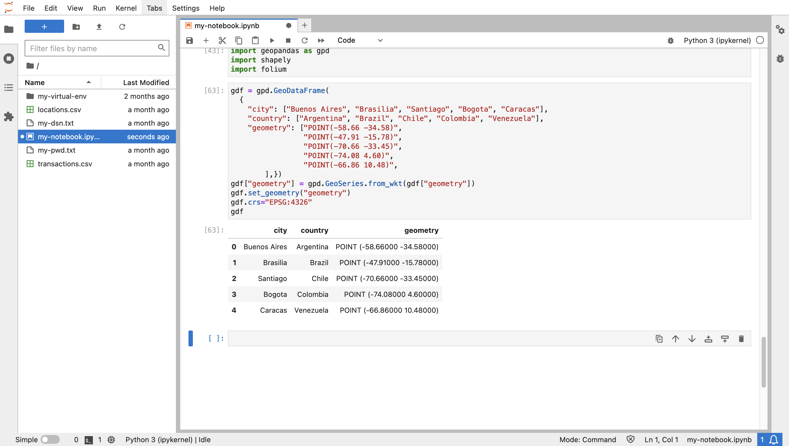
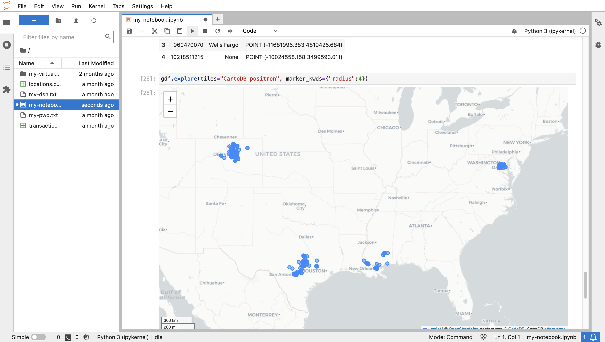

# 瀏覽資料

## 簡介

您現在可探索前一個實驗室中編制的地點和交易資料。藉由管理 Autonomous Database 中的資料，您可以執行後端處理與分析作業，然後將適當的資料子集帶入 Python 中進行專業化分析。

預估實驗室時間：10 分鐘

### 目標

*   將 spatiotemporal 資料及查詢結果從 Autonomous Database 帶入 Python
*   以視覺化方式和探索 Python 中的資料

### 先決條件

*   完成實驗室 5：準備資料

## 工作 1：Python 中的空間資料處理

資料處理最常見的 Python 程式庫是 Pandas，它提供 DataFrame 作為資料結構 (位於具有資料欄與資料列的表格中)。GeoPandas 程式庫將 Pandas 延伸至空間資料處理，其中 DataFrame 延伸至 GeoDataFrame，包括 "geometry" 資料欄。Shapely 函式庫提供用來植入幾何資料欄的空間類型。Folium 是常用的地圖視覺化程式庫，由 GeoPandas 使用。

1.  匯入程式庫以處理空間資料並對應視覺化。
    
        <copy>
        import geopandas as gpd
        import shapely
        import folium
        </copy>
        
    
    
    
2.  以 Python 中的空間資料為基本範例，執行下列動作以手動建立包含數個城市之點位置的 GeoDataFrame。幾何值是以「已知文字」(WKT) 格式表示，因為這是 GeoDataFrame 中使用的格式。
    
        <copy>
        gdf = gpd.GeoDataFrame(
          {
            "city": ["Buenos Aires", "Brasilia", "Santiago", "Bogota", "Caracas"],
            "country": ["Argentina", "Brazil", "Chile", "Colombia", "Venezuela"],
            "geometry": ["POINT(-58.66 -34.58)",
                         "POINT(-47.91 -15.78)",
                         "POINT(-70.66 -33.45)",
                         "POINT(-74.08 4.60)",
                         "POINT(-66.86 10.48)",
                ],})
        gdf["geometry"] = gpd.GeoSeries.from_wkt(gdf["geometry"])
        gdf.set_geometry("geometry")
        gdf.crs="EPSG:4326"
        gdf
        </copy>
        
    
    
    
3.  若要將資料視覺化，請執行下列位置，同時指定背景地圖和標記大小。將滑鼠移至地圖標記上方即可查看其屬性。
    
        <copy>
        gdf.explore(tiles="CartoDB positron", marker_kwds={"radius":8})
        </copy>
        
    
    
    
4.  Oracle Spatial 包含將原生空間類型轉換為一般格式的函數和方法，包括轉換成 GeoDataFrame 中使用的 WKT 格式。因此，從 Oracle Spatial 結果建立 GeoDataFrame 會很簡單。物件方法的轉換語法比同等 SQL 函數精簡。例如 **(geometry) .get\_wkt()** 方法與 **sdo\_util.to\_wktgeometry (geometry)** 函數比較。執行以下步驟，即可查看使用物件方法之硬式編碼 SDO\_GEOMETRY 到 WKT 和 GeoJSON 格式的格式轉換基本範例。
    

    ```
    <copy>
    cursor = connection.cursor()
    cursor.execute("""
      WITH x AS (
        SELECT sdo_geometry(2001,4326,sdo_point_type(-100.12, 22.34,null),null,null) 
               as geometry
        FROM dual)
      SELECT geometry, 
             (geometry).get_wkt(), 
             (geometry).get_geojson()
      FROM x
      """)
    for row in cursor.fetchone():
       print(row)
    </copy>
    ```
     
    

5.  在上一個實驗室中，您已使用以函數為基礎的空間索引設定 LOCATIONS 表格。此函數是 lonlat\_to\_proj\_geom () 並將經度、緯度轉換成 World Mercator 座標系統的 SDO\_GEOMETRY，以便與稍後實驗室使用的程式庫相容。執行以下步驟，以使用該函數作為 WKT 格式擷取幾何圖形。

    ```
    <copy>
    cursor = connection.cursor()
    cursor.execute("""
      SELECT lon, lat, (lonlat_to_proj_geom(lon,lat)).get_wkt()
      FROM locations
      """)
    for row in cursor.fetchmany(10):
       print(row)
    </copy>
    ```
     
    

6.  執行下列項目以擷取 LOCATIONS 表格並建立 GeoDataFrame。
    
        <copy>
        cursor.execute("""
         SELECT location_id, owner, (lonlat_to_proj_geom(lon,lat)).get_wkt()
         FROM locations
         """)
        gdf = gpd.GeoDataFrame(cursor.fetchall(), columns = ['location_id', 'owner', 'geometry'])
        gdf['geometry'] = shapely.from_wkt(gdf['geometry'])
        gdf.crs="EPSG:3857"
        gdf.head()
        </copy>
        
    
    
    
7.  執行以下步驟可將 GeoDataFrame 視覺化。
    
        <copy>
        gdf.explore(tiles="CartoDB positron")
        </copy>
        
    
    
    

## 作業 2：探索交易資料

1.  接下來，請從結合 TRANSACTIONS 至 LOCATIONS 的查詢建立 GeoDataFrame。執行以下步驟來建立 GeoDataFrame。
    
        <copy>
        cursor = connection.cursor()
        cursor.execute("""
         SELECT a.cust_id, a.trans_id, a.trans_epoch_date, 
          (lonlat_to_proj_geom(b.lon,b.lat)).get_wkt() 
         FROM transactions a, locations b
         WHERE a.location_id=b.location_id
         """)
        gdf = gpd.GeoDataFrame(cursor.fetchall(), columns = ['cust_id', 'trans_id', 'trans_epoch_date', 'geometry'])
        gdf['geometry'] = shapely.from_wkt(gdf['geometry'])
        gdf.crs="EPSG:3857"
        gdf.head()
        </copy>
        
    
    
    
2.  執行以下步驟可將 GeoDataFrame 視覺化。將滑鼠移至項目上方即可查看交易屬性。
    
        <copy>
        gdf.explore(tiles="CartoDB positron") 
        </copy>
        
    
    
    

您現在可以**進入下一個實驗室**。

## 進一步瞭解

*   如需有關 GeoPandas 的詳細資訊，請參閱 [https://geopandas.org](https://geopandas.org)

## 確認

*   **作者** - Oracle 資料庫產品管理 David Lapp
*   **貢獻者** - Rahul Tasker，Denise Myrick，Ramu Gutierrez
*   **上次更新者 / 日期** - David Lapp，2023 年 8 月