# Preparar datos

## Introducción

En este laboratorio, los datos de transacciones financieras ficticias se cargan en Autonomous Database y se configuran para el análisis espacial y temporal ("spaciotemporal").

Tiempo de laboratorio estimado: 10 minutos

### Objetivos

*   Carga de datos de transacciones financieras en Autonomous Database
*   Configurar datos para análisis espacio-temporales

### Requisitos

*   Finalización del laboratorio 4: Conexión a Autonomous Database desde Python

## Tarea 1: Cargar archivos de datos

1.  Utilice los siguientes enlaces para descargar los archivos de datos:

*   [locations.csv](./data/locations.csv)
*   [transactions.csv](./data/transactions.csv)

2.  Haga clic en el icono **Cargar** para cargar los archivos de datos. 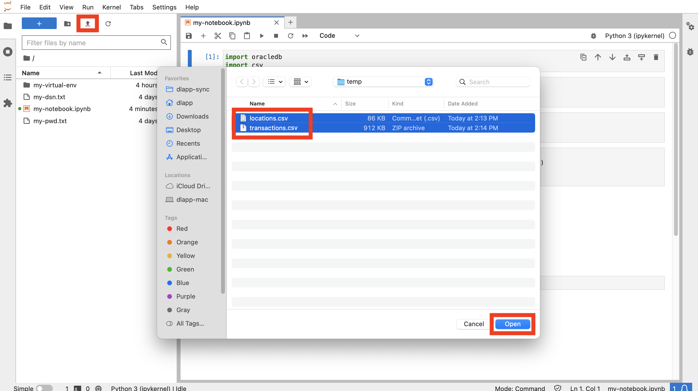
    
3.  En el panel izquierdo, haga doble clic en locations.csv y transactions.csv para obtener una vista previa de los archivos de datos en nuevos separadores.
    
    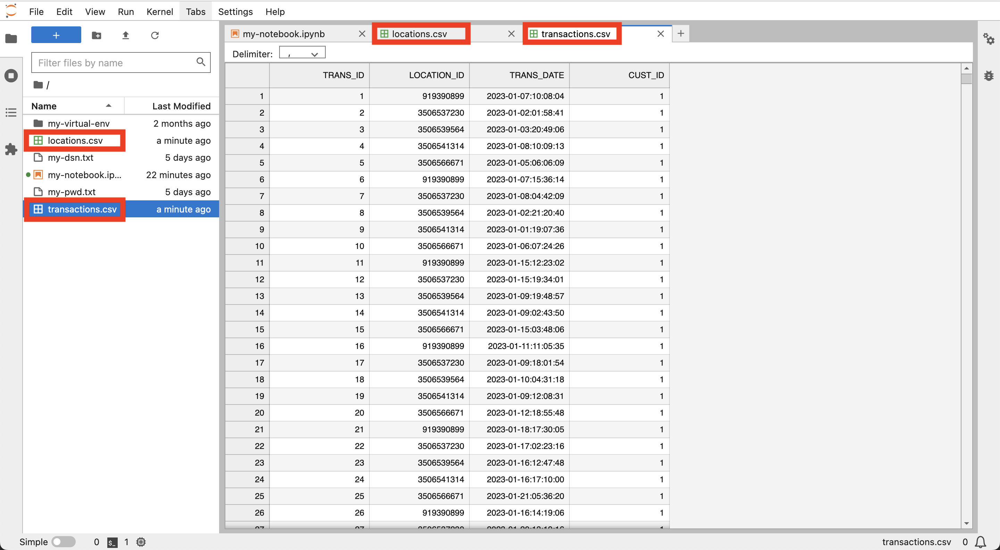
    

Observe que locations.csv tiene una fila por ubicación de cajero automático y las transacciones tienen una fila por transacción financiera. A continuación, cierre los separadores con la vista previa de los datos y vuelva a su bloc de notas.

## Tarea 2: Crear y cargar tablas

1.  En la siguiente celda del bloc de notas, pegue la siguiente sentencia y, a continuación, haga clic en el botón **Ejecutar**. De esta forma, se crea la tabla para los datos de ubicaciones.
    
        <copy>
        # Create table for locations data
        cursor.execute("""
         CREATE TABLE locations (
                   location_id INTEGER,
                   owner VARCHAR2(100),  
                   lon NUMBER,
                   lat NUMBER)""")
        </copy>
        
    
    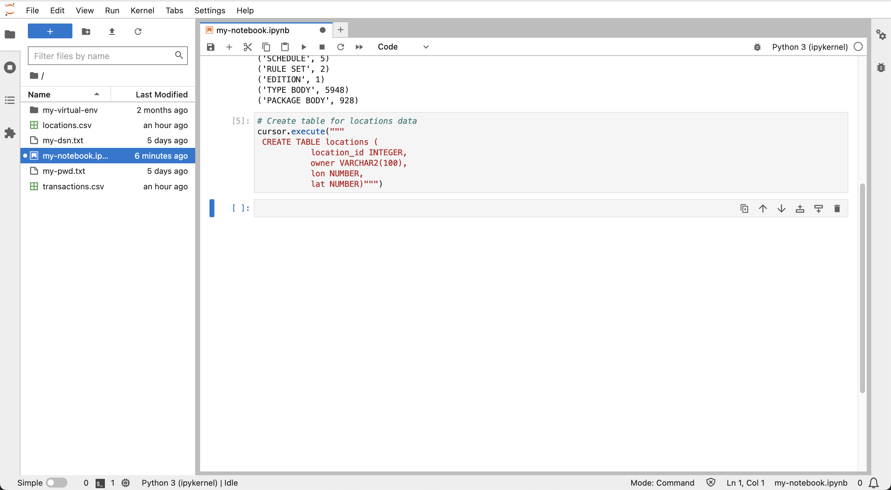
    
2.  Ejecute lo siguiente para cargar los datos de ubicaciones.
    
        <copy>
        # Load the locations data
        import csv
        BATCH_SIZE = 1000
        with connection.cursor() as cursor:
            with open('locations.csv', 'r') as csv_file:
                csv_reader = csv.reader(csv_file, delimiter=',')
                #skip header
                next(csv_reader)
                #load data
                sql = "INSERT INTO locations VALUES (:1, :2, :3, :4)"
                data = []
                for line in csv_reader:
                    data.append((line[0], line[1], line[2], line[3]))
                    if len(data) % BATCH_SIZE == 0:
                        cursor.executemany(sql, data)
                        data = []
                if data:
                    cursor.executemany(sql, data)
                connection.commit()
        </copy>
        
    
    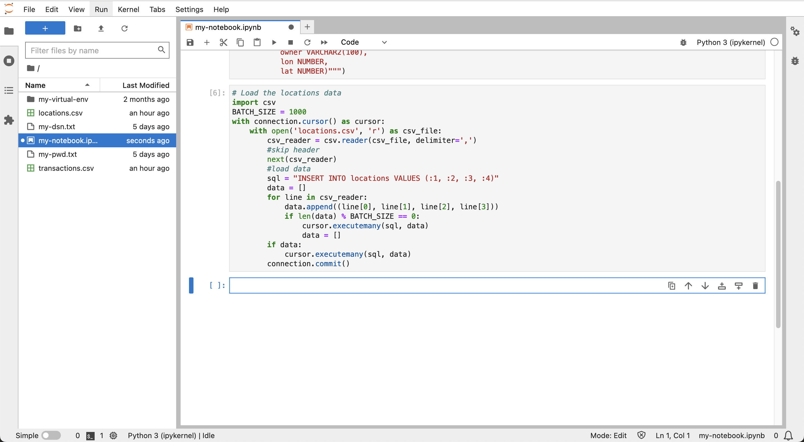
    
3.  Ejecute lo siguiente para obtener una vista previa de los datos de ubicaciones, que contiene una fila para cada ubicación de cajero automático, incluidas las coordenadas y un ID de ubicación único.
    
        <copy>
        # Preview locations data
        cursor = connection.cursor()
        cursor.execute("SELECT * FROM locations")
        for row in cursor.fetchmany(size=10):
            print(row)
        </copy>
        
    
    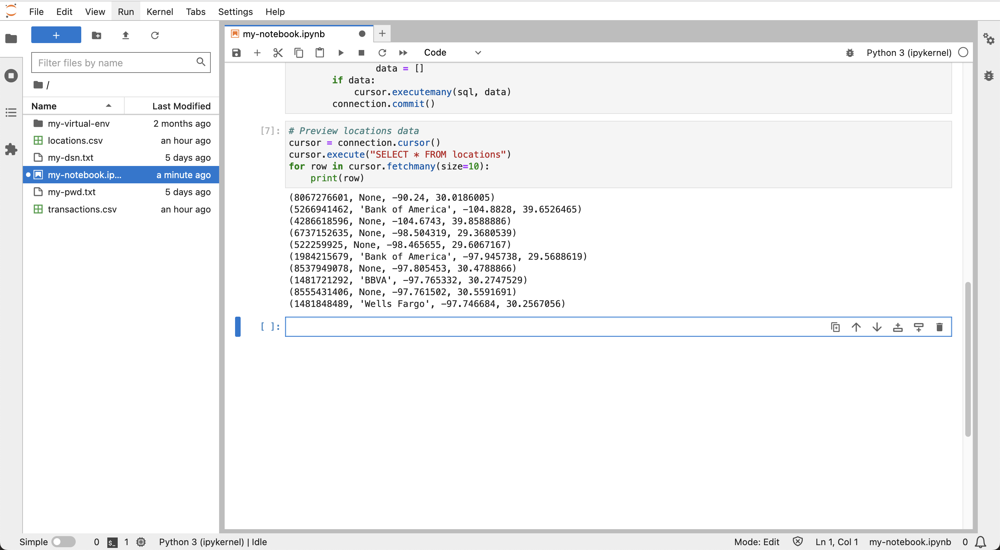
    
4.  En la siguiente celda, pegue la siguiente sentencia y, a continuación, haga clic en el botón **ejecutar**. De esta forma se crea la tabla para los datos de transacción.
    
        <copy>
        # Create table for transactions data
        cursor.execute("""
           CREATE TABLE transactions (
                          trans_id INTEGER,
                          location_id INTEGER,
                          trans_date DATE,
                          cust_id INTEGER)""")
        </copy>
        
    
    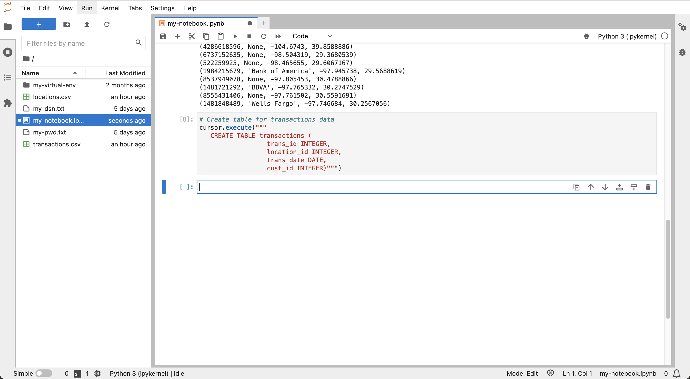
    
5.  Ejecute lo siguiente para cargar los datos de transacciones.
    
        <copy>
        # Load the transactions data
        BATCH_SIZE = 1000
        with connection.cursor() as cursor:
            with open('transactions.csv', 'r') as csv_file:
                csv_reader = csv.reader(csv_file, delimiter=',')
                #skip header
                next(csv_reader)
                #load data
                sql = "INSERT INTO transactions VALUES (:1, :2, TO_DATE(:3,'YYYY-MM-DD:HH24:MI:SS'), :4)"
                data = []
                for line in csv_reader:
                    data.append((line[0], line[1], line[2], line[3]))
                    if len(data) % BATCH_SIZE == 0:
                        cursor.executemany(sql, data)
                        data = []
                if data:
                    cursor.executemany(sql, data)
                connection.commit()
        </copy>
        
    
    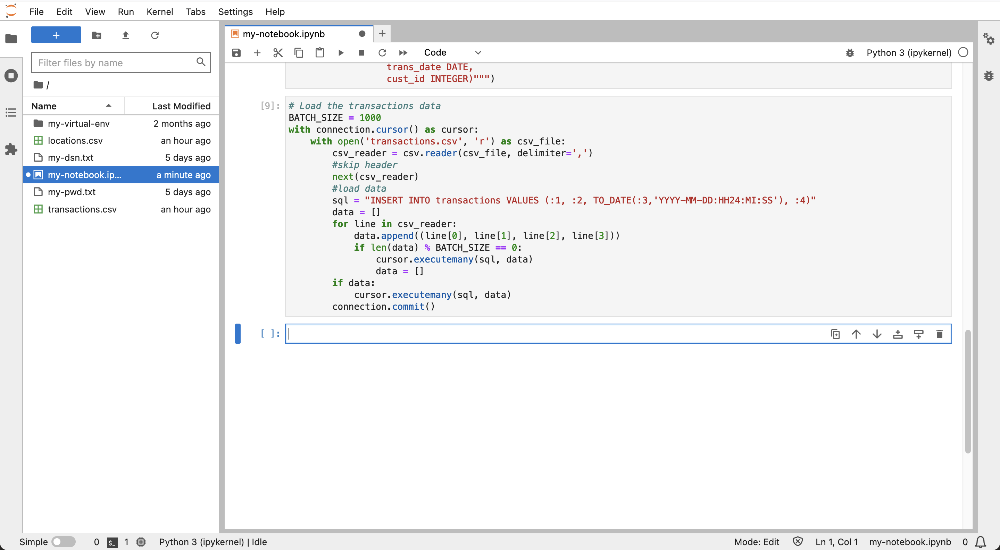
    
6.  Ejecute lo siguiente para obtener una vista previa de los datos de transacciones, que contiene una fila para cada transacción, incluidos los datos y el ID de ubicación.
    
        <copy>
        # Preview transactions data
        cursor = connection.cursor()
        cursor.execute("SELECT * FROM transactions")
        for row in cursor.fetchmany(size=10):
            print(row)
        </copy>
        
    
    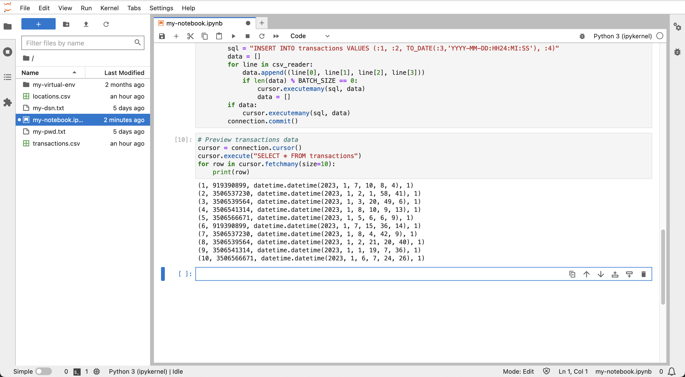
    
7.  Ejecute lo siguiente para mostrar los distintos ID de cliente.
    
        <copy>
        # Customer ID's
        cursor = connection.cursor()
        cursor.execute("SELECT DISTINCT cust_id FROM transactions ORDER BY cust_id")
        for row in cursor.fetchall():
            print(row[0])
        </copy>
        
    
    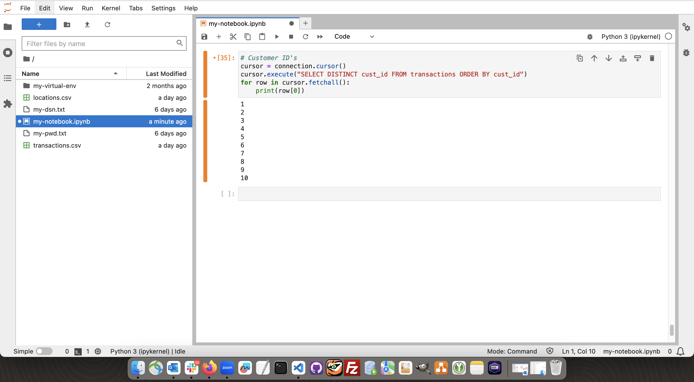
    

## Tarea 3: Agregar fecha de época

Los cálculos temporales son un componente clave de este taller y se realizan mejor en una representación de entero de fecha y hora. Esta representación de enteros se conoce generalmente como tiempo de época o más específicamente tiempo de UNIX. En esta tarea, agrega tiempo de época para todas las transacciones.

1.  Ejecute lo siguiente para agregar y rellenar una columna para la fecha de época.
    
        <copy>
        # add column for epoch date
        cursor.execute("ALTER TABLE transactions ADD (trans_epoch_date integer)")
        </copy>
        
    
        <copy>
        # add column for epoch date
        cursor.execute("""UPDATE transactions
                          SET trans_epoch_date = (trans_date - date'1970-01-01') * 86400""")
        connection.commit()
        </copy>
        
    
    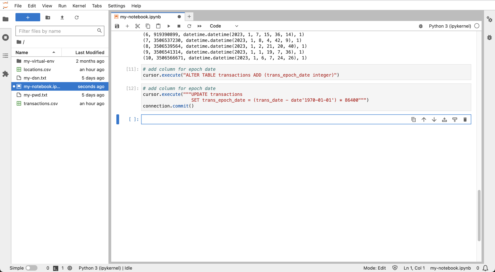
    
2.  Ejecute lo siguiente para volver a obtener una vista previa de los datos de transacciones. Observe que se ha agregado la columna de fecha de época.
    
        <copy>
        # Preview transactions data
        cursor.execute("SELECT * FROM transactions")
        for row in cursor.fetchmany(size=10):
            print(row)
        </copy>
        
    
    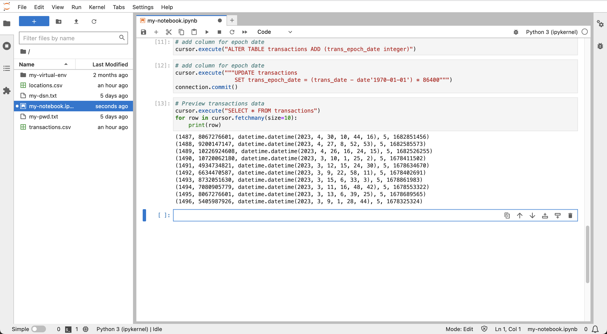
    

## Tarea 4: Configurar datos para operaciones espaciales

Los cálculos espaciales son un componente clave adicional de este taller. En esta tarea, configurará los datos de las ubicaciones para utilizar las funciones espaciales de Autonomous Database. La tabla de ubicaciones incluye las coordenadas de longitud/latitud. Una opción es crear y rellenar una nueva columna utilizando el tipo de dato espacial nativo. Aunque eso funcionaría perfectamente bien, hay otra opción que aprovecha una función principal de Oracle Database denominada "índice basado en funciones". Este enfoque permite toda la capacidad asociada a la creación de una nueva columna espacial, pero sin tener que crear la columna. En su lugar, se crea una función de base de datos que convierte las coordenadas en un elemento de datos espaciales y, a continuación, se crea un índice en esa función. Una vez creada la función y el índice, todas las operaciones espaciales se comportan como si se hubiera creado una nueva columna espacial. Si bien esto no es esencial para el pequeño volumen de datos en este taller, el enfoque es de gran beneficio para los sistemas a gran escala donde la sobrecarga de agregar una columna es significativa.

1.  Ejecute lo siguiente para crear una función que convierta las coordenadas de longitud/latitud en el tipo de dato espacial nativo de Oracle (es decir, SDO\_GEOMETRY, denominado "geometría"). La función no solo convierte las coordenadas al tipo espacial nativo, sino que también convierte las coordenadas de longitud / latitud en un sistema de coordenadas llamado "mercator mundial". Este es el sistema de coordenadas esperado por las bibliotecas Python utilizadas en laboratorios posteriores, por lo que es conveniente realizar esta conversión en esta función.
    
        <copy>
        # Create function to return lon/lat coordinates as a geometry.
        cursor.execute("""
         CREATE OR REPLACE FUNCTION lonlat_to_proj_geom (longitude IN NUMBER, latitude IN NUMBER)
         RETURN SDO_GEOMETRY DETERMINISTIC IS
         BEGIN
           IF latitude IS NULL OR longitude IS NULL
           OR latitude NOT BETWEEN -90 AND 90
           OR longitude NOT BETWEEN -180 AND 180
           THEN
             RETURN NULL;
           ELSE
              RETURN sdo_cs.transform(
                SDO_GEOMETRY(2001, 4326,
                             sdo_point_type(longitude, latitude, NULL),NULL, NULL),
                3857);
           END IF;
        END;""")
        </copy>
        
    
    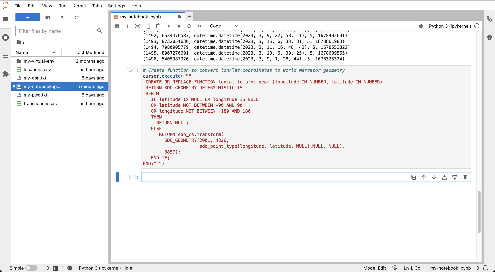
    
2.  La consulta de geometrías y geometrías convertidas en representaciones de cadena implica "objetos grandes" o "LOB". Aplique la siguiente configuración a python-oracledb para que los LOB se recuperen directamente en lugar de recuperar un localizador de LOB y, a continuación, recuperar el contenido de LOB en un segundo viaje de ida y vuelta.
    
        <copy>
        # return LOBs directly as strings or bytes
        oracledb.defaults.fetch_lobs = False  
        </copy>
        
    
    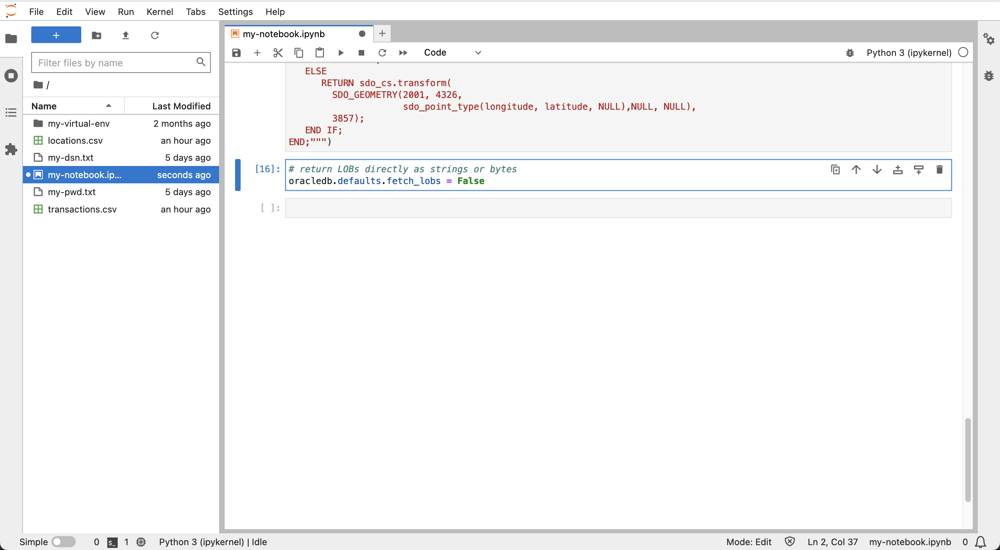
    
3.  Ejecute lo siguiente para probar la función.
    
        <copy>
        # test the function
        cursor.execute("""
         with x as (
            SELECT location_id, lonlat_to_proj_geom(lon,lat) as geom FROM locations)
         SELECT location_id, geom, (geom).get_wkt()
         FROM x
         """)
        for row in cursor.fetchone():
            print(row)
        </copy>
        
    
    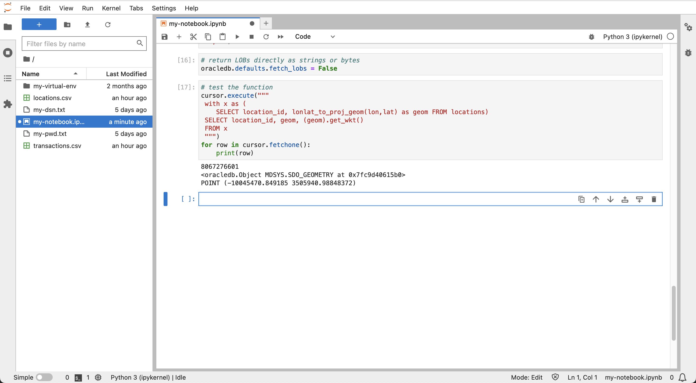
    
4.  Las consultas espaciales se basan en un índice espacial para un rendimiento óptimo. Un índice espacial solo se puede crear en datos que tengan una dimensionalidad uniforme (es decir, 2D o 3D) y un sistema de coordenadas. Antes de crear un índice espacial, es necesario insertar una fila de metadatos que describan estas propiedades para indexar la geometría. Esto incluye el nombre de tabla, el nombre de columna de geometría (o, en este caso, una función que devuelve geometría), la dimensionalidad y un código de sistema de coordenadas. Al crear un índice espacial, los datos se verifican primero para que se ajusten a los metadatos. La indexación espacial se completa correctamente solo si los datos cumplen con los metadatos. Ejecute lo siguiente para crear metadatos espaciales para la geometría de ubicación.
    
        <copy>
        cursor.execute("""
         INSERT INTO user_sdo_geom_metadata VALUES (
            'LOCATIONS', 'ADMIN.LONLAT_TO_PROJ_GEOM(LON,LAT)',
             SDO_DIM_ARRAY(SDO_DIM_ELEMENT('LON', 0, 0, 0.05),
                           SDO_DIM_ELEMENT('LAT', 0, 0, 0.05)),
             3857)
                    """)
        </copy>
        
    
    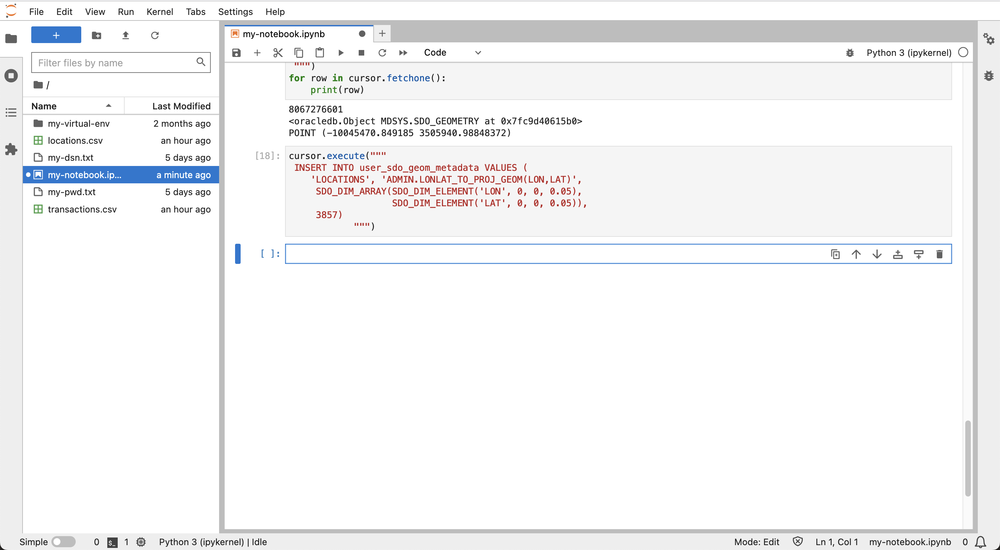
    
5.  Ejecute lo siguiente para crear un índice espacial para la geometría de ubicación.
    
        <copy>
        cursor.execute("""
         CREATE INDEX locations_sidx
         ON locations(LONLAT_TO_PROJ_GEOM(LON,LAT))
         INDEXTYPE IS mdsys.spatial_index_v2
                    """)
        </copy>
        
    
    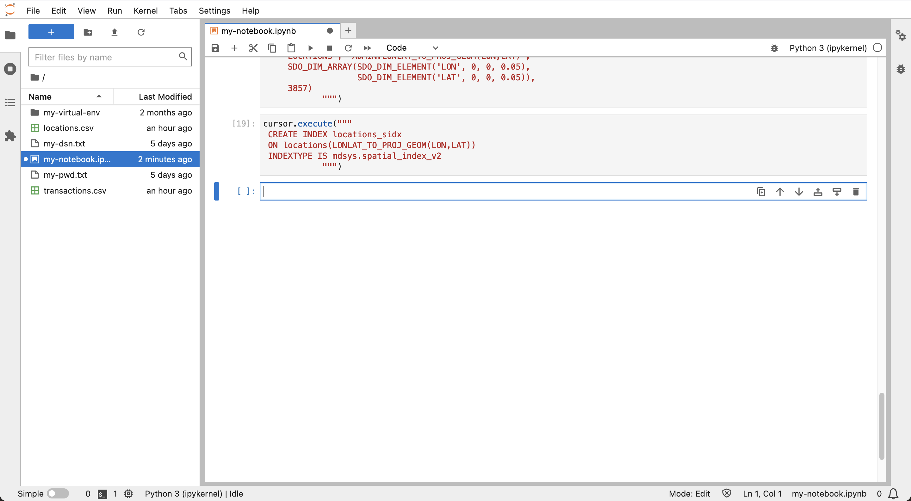
    
6.  Para verificar el índice espacial, ejecute la siguiente consulta espacial de ejemplo. Esta consulta devuelve los 5 elementos más cercanos de la tabla **locations** a una coordenada de longitud y latitud, junto con las distancias. Esto se denomina consulta de "vecino más cercano" y utiliza el operador **sdo\_nn( )** que utiliza el índice espacial. Para obtener más información sobre las consultas de vecinos más cercanos, consulte la [documentación](https://docs.oracle.com/en/database/oracle/oracle-database/19/spatl/spatial-operators-reference.html#GUID-41E6B1FA-1A03-480B-996F-830E8566661D).
    
        <copy>
        cursor.execute("""
         SELECT location_id, round(sdo_nn_distance(1), 2) FROM locations
         WHERE sdo_nn(
           LONLAT_TO_PROJ_GEOM(LON,LAT),
           LONLAT_TO_PROJ_GEOM( -97.6, 30.3),
           'sdo_num_res=5 unit=mile', 1) = 'TRUE' """)
        for row in cursor.fetchmany():
            print(row)  
        </copy>
        
    
    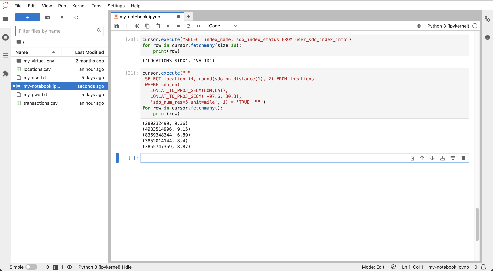
    

Ahora puede **proceder al siguiente laboratorio**.

## Más información

*   Para obtener detalles sobre la hora de UNIX, consulte [https://en.wikipedia.org/wiki/Unix\_time](https://en.wikipedia.org/wiki/Unix_time).
*   Para obtener más información sobre la indexación espacial basada en funciones, consulte la [documentación](https://docs.oracle.com/en/database/oracle/oracle-database/19/spatl/extending-spatial-indexing.html#GUID-CFB6B6DB-4B97-43D1-86A1-21C1BA853089)

## Reconocimientos

*   **Autor**: David Lapp, Database Product Management, Oracle
*   **Contribuyentes**: Rahul Tasker, Denise Myrick, Ramu Gutiérrez
*   **Última actualización por/fecha**: David Lapp, agosto de 2023