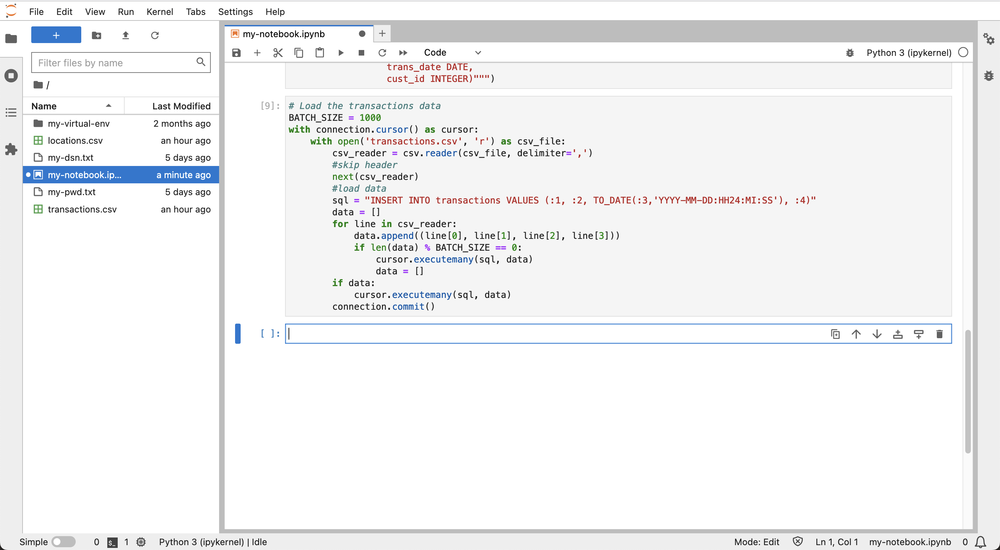
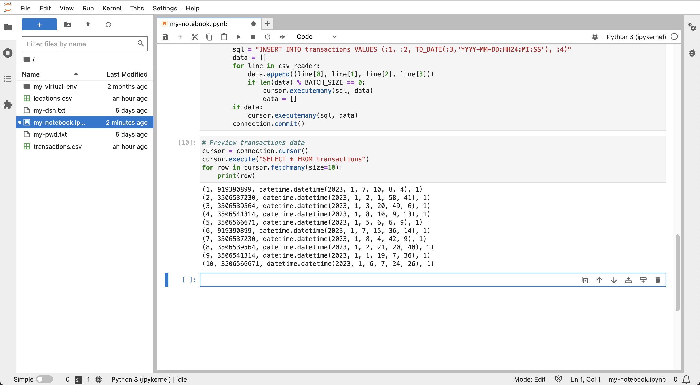

# Préparation des données

## Présentation

Dans cet exercice, des données de transactions financières fictives sont chargées dans votre instance Autonomous Database et configurées pour une analyse spatiale et temporelle ("spatiotemporal").

Temps de laboratoire estimé : 10 minutes

### Objectifs

*   Chargement des données de transactions financières vers Autonomous Database
*   Configurer les données pour l'analyse spatio-temporelle

### Prérequis

*   Achèvement de l'atelier 4 : connexion à Autonomous Database à partir de Python

## Tâche 1 : télécharger des fichiers de données

1.  Utilisez les liens suivants pour télécharger les fichiers de données :

*   [locations.csv](./data/locations.csv)
*   [transactions.csv](./data/transactions.csv)

2.  Cliquez sur l'icône **Télécharger** pour charger les fichiers de données. 
    
3.  Dans le panneau de gauche, cliquez deux fois sur locations.csv et transactions.csv pour prévisualiser les fichiers de données dans les nouveaux onglets.
    
    
    

Notez que locations.csv comporte une ligne par emplacement GAB et que les transactions comportent une ligne par transaction financière. Fermez ensuite les onglets avec l'aperçu des données et revenez à votre bloc-notes.

## Tâche 2 : Créer et charger des tables

1.  Dans la cellule suivante de votre bloc-notes, collez l'instruction suivante, puis cliquez sur le bouton **Exécuter**. Cela crée la table pour les données de lieux.
    
        <copy>
        # Create table for locations data
        cursor.execute("""
         CREATE TABLE locations (
                   location_id INTEGER,
                   owner VARCHAR2(100),  
                   lon NUMBER,
                   lat NUMBER)""")
        </copy>
        
    
    
    
2.  Exécutez la commande suivante pour charger les données d'emplacement.
    
        <copy>
        # Load the locations data
        import csv
        BATCH_SIZE = 1000
        with connection.cursor() as cursor:
            with open('locations.csv', 'r') as csv_file:
                csv_reader = csv.reader(csv_file, delimiter=',')
                #skip header
                next(csv_reader)
                #load data
                sql = "INSERT INTO locations VALUES (:1, :2, :3, :4)"
                data = []
                for line in csv_reader:
                    data.append((line[0], line[1], line[2], line[3]))
                    if len(data) % BATCH_SIZE == 0:
                        cursor.executemany(sql, data)
                        data = []
                if data:
                    cursor.executemany(sql, data)
                connection.commit()
        </copy>
        
    
    
    
3.  Exécutez la commande suivante pour prévisualiser les données d'emplacement, qui contient une ligne pour chaque emplacement GAB, y compris les coordonnées et un ID d'emplacement unique.
    
        <copy>
        # Preview locations data
        cursor = connection.cursor()
        cursor.execute("SELECT * FROM locations")
        for row in cursor.fetchmany(size=10):
            print(row)
        </copy>
        
    
    
    
4.  Dans la cellule suivante, collez l'instruction suivante, puis cliquez sur le bouton **Exécuter**. Cela crée la table pour les données de transaction.
    
        <copy>
        # Create table for transactions data
        cursor.execute("""
           CREATE TABLE transactions (
                          trans_id INTEGER,
                          location_id INTEGER,
                          trans_date DATE,
                          cust_id INTEGER)""")
        </copy>
        
    
    
    
5.  Exécutez la commande suivante pour charger les données de transactions.
    
        <copy>
        # Load the transactions data
        BATCH_SIZE = 1000
        with connection.cursor() as cursor:
            with open('transactions.csv', 'r') as csv_file:
                csv_reader = csv.reader(csv_file, delimiter=',')
                #skip header
                next(csv_reader)
                #load data
                sql = "INSERT INTO transactions VALUES (:1, :2, TO_DATE(:3,'YYYY-MM-DD:HH24:MI:SS'), :4)"
                data = []
                for line in csv_reader:
                    data.append((line[0], line[1], line[2], line[3]))
                    if len(data) % BATCH_SIZE == 0:
                        cursor.executemany(sql, data)
                        data = []
                if data:
                    cursor.executemany(sql, data)
                connection.commit()
        </copy>
        
    
    
    
6.  Exécutez la commande suivante pour prévisualiser les données de transaction, qui contient une ligne pour chaque transaction, y compris les données et le code site.
    
        <copy>
        # Preview transactions data
        cursor = connection.cursor()
        cursor.execute("SELECT * FROM transactions")
        for row in cursor.fetchmany(size=10):
            print(row)
        </copy>
        
    
    
    
7.  Exécutez la commande suivante pour répertorier les différents ID client.
    
        <copy>
        # Customer ID's
        cursor = connection.cursor()
        cursor.execute("SELECT DISTINCT cust_id FROM transactions ORDER BY cust_id")
        for row in cursor.fetchall():
            print(row[0])
        </copy>
        
    
    
    

## Tâche 3 : Ajouter une date de période

Les calculs temporels sont un élément clé de cet atelier et sont mieux réalisés sur une représentation entière de la date et de l'heure. Cette représentation d'entier est généralement appelée temps d'époque ou plus précisément temps UNIX. Dans cette tâche, vous ajoutez une période pour toutes les transactions.

1.  Exécutez la commande suivante pour ajouter et renseigner une colonne pour la date de la période.
    
        <copy>
        # add column for epoch date
        cursor.execute("ALTER TABLE transactions ADD (trans_epoch_date integer)")
        </copy>
        
    
        <copy>
        # add column for epoch date
        cursor.execute("""UPDATE transactions
                          SET trans_epoch_date = (trans_date - date'1970-01-01') * 86400""")
        connection.commit()
        </copy>
        
    
    
    
2.  Exécutez la commande suivante pour prévisualiser à nouveau les données de transaction. Observez que la colonne de date de période a été ajoutée.
    
        <copy>
        # Preview transactions data
        cursor.execute("SELECT * FROM transactions")
        for row in cursor.fetchmany(size=10):
            print(row)
        </copy>
        
    
    
    

## Tâche 4 : configurer les données pour les opérations spatiales

Les calculs spatiaux constituent un élément clé supplémentaire de cet atelier. Dans cette tâche, vous configurez les données de vos emplacements afin d'utiliser les fonctionnalités spatiales d'Autonomous Database. La table des lieux inclut les coordonnées de longitude/latitude. Une option consiste à créer et à remplir une nouvelle colonne à l'aide du type de données spatiales natif. Bien que cela fonctionne parfaitement, il existe une autre option qui tire parti d'une fonctionnalité Oracle Database traditionnelle appelée "indexation basée sur les fonctions". Cette approche permet toute la capacité associée à la création d'une nouvelle colonne spatiale, mais sans avoir à créer la colonne. Au lieu de cela, vous créez une fonction de base de données qui convertit les coordonnées en un élément de données spatiales, puis vous créez un index sur cette fonction. Une fois la fonction et l'index créés, toutes les opérations spatiales se comportent comme si une nouvelle colonne spatiale avait été créée. Bien que cela ne soit pas essentiel pour le petit volume de données de cet atelier, l'approche est d'un grand avantage pour les systèmes à grande échelle où la surcharge liée à l'ajout d'une colonne est importante.

1.  Exécutez la commande suivante pour créer une fonction qui convertit les coordonnées de longitude/latitude en type de données spatiales natives d'Oracle (par exemple, SDO\_GEOMETRY, appelé "géométrie"). Non seulement la fonction convertit les coordonnées en type spatial natif, mais elle convertit également les coordonnées de longitude/latitude en un système de coordonnées appelé"mercateur mondial". Il s'agit du système de coordonnées attendu par les bibliothèques Python utilisées dans les exercices suivants, il est donc pratique d'effectuer cette conversion dans cette fonction.
    
        <copy>
        # Create function to return lon/lat coordinates as a geometry.
        cursor.execute("""
         CREATE OR REPLACE FUNCTION lonlat_to_proj_geom (longitude IN NUMBER, latitude IN NUMBER)
         RETURN SDO_GEOMETRY DETERMINISTIC IS
         BEGIN
           IF latitude IS NULL OR longitude IS NULL
           OR latitude NOT BETWEEN -90 AND 90
           OR longitude NOT BETWEEN -180 AND 180
           THEN
             RETURN NULL;
           ELSE
              RETURN sdo_cs.transform(
                SDO_GEOMETRY(2001, 4326,
                             sdo_point_type(longitude, latitude, NULL),NULL, NULL),
                3857);
           END IF;
        END;""")
        </copy>
        
    
    
    
2.  La recherche de géométries et de géométries converties en représentations de chaînes implique "Large Objects"ou"LOBs". Appliquez le paramètre suivant à python-oracledb afin que les objets LOB soient extraits directement au lieu d'extraire un pointeur de LOB, puis d'extraire le contenu de LOB dans un deuxième aller-retour.
    
        <copy>
        # return LOBs directly as strings or bytes
        oracledb.defaults.fetch_lobs = False  
        </copy>
        
    
    
    
3.  Exécutez la commande suivante pour tester la fonction.
    
        <copy>
        # test the function
        cursor.execute("""
         with x as (
            SELECT location_id, lonlat_to_proj_geom(lon,lat) as geom FROM locations)
         SELECT location_id, geom, (geom).get_wkt()
         FROM x
         """)
        for row in cursor.fetchone():
            print(row)
        </copy>
        
    
    
    
4.  Les requêtes spatiales s'appuient sur un index spatial pour des performances optimales. Un index spatial ne peut être créé que sur des données ayant une dimensionnalité uniforme (c'est-à-dire, 2D ou 3D) et un système de coordonnées. Avant de créer un index spatial, il est nécessaire d'insérer une ligne de métadonnées décrivant ces propriétés pour la géométrie à indexer. Cela inclut le nom de la table, le nom de la colonne de géométrie (ou, dans ce cas, une fonction renvoyant la géométrie), la dimensionnalité et un code de système de coordonnées. Lors de la création d'un index spatial, les données sont d'abord vérifiées pour être conformes aux métadonnées. L'indexation spatiale se termine avec succès uniquement si les données sont conformes aux métadonnées. Exécutez la commande suivante pour créer des métadonnées spatiales pour la géométrie d'emplacement.
    
        <copy>
        cursor.execute("""
         INSERT INTO user_sdo_geom_metadata VALUES (
            'LOCATIONS', 'ADMIN.LONLAT_TO_PROJ_GEOM(LON,LAT)',
             SDO_DIM_ARRAY(SDO_DIM_ELEMENT('LON', 0, 0, 0.05),
                           SDO_DIM_ELEMENT('LAT', 0, 0, 0.05)),
             3857)
                    """)
        </copy>
        
    
    
    
5.  Exécutez la commande suivante pour créer un index spatial pour la géométrie d'emplacement.
    
        <copy>
        cursor.execute("""
         CREATE INDEX locations_sidx
         ON locations(LONLAT_TO_PROJ_GEOM(LON,LAT))
         INDEXTYPE IS mdsys.spatial_index_v2
                    """)
        </copy>
        
    
    
    
6.  Pour vérifier l'index spatial, exécutez l'exemple de requête spatiale suivant. Cette requête renvoie les 5 éléments les plus proches de la table **locations** à une coordonnées de longitude et de latitude, ainsi qu'aux distances. Il s'agit d'une requête "voisin le plus proche" qui utilise l'opérateur **sdo\_nn( )** qui utilise l'index spatial. Pour plus d'informations sur les requêtes du voisin le plus proche, consultez la [documentation](https://docs.oracle.com/en/database/oracle/oracle-database/19/spatl/spatial-operators-reference.html#GUID-41E6B1FA-1A03-480B-996F-830E8566661D).
    
        <copy>
        cursor.execute("""
         SELECT location_id, round(sdo_nn_distance(1), 2) FROM locations
         WHERE sdo_nn(
           LONLAT_TO_PROJ_GEOM(LON,LAT),
           LONLAT_TO_PROJ_GEOM( -97.6, 30.3),
           'sdo_num_res=5 unit=mile', 1) = 'TRUE' """)
        for row in cursor.fetchmany():
            print(row)  
        </copy>
        
    
    
    

Vous pouvez maintenant **passer à l'exercice suivant**.

## En savoir plus

*   Pour plus d'informations sur l'heure UNIX, reportez-vous à [https://en.wikipedia.org/wiki/Unix\_time](https://en.wikipedia.org/wiki/Unix_time)
*   Pour plus de détails sur l'indexation spatiale basée sur les fonctions, reportez-vous à la [documentation](https://docs.oracle.com/en/database/oracle/oracle-database/19/spatl/extending-spatial-indexing.html#GUID-CFB6B6DB-4B97-43D1-86A1-21C1BA853089).

## Accusés de réception

*   **Auteur** - David Lapp, Database Product Management, Oracle
*   **Contributeurs** - Rahul Tasker, Denise Myrick, Ramu Gutierrez
*   **Dernière mise à jour par/date** - David Lapp, août 2023