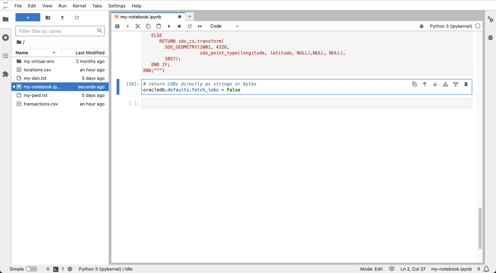
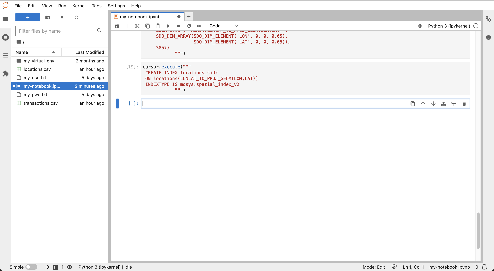

# データの準備

## 概要

このラボでは、架空の財務トランザクション・データがAutonomous Databaseにロードされ、空間分析および時間分析(spatiotemporal)用に構成されます。

推定ラボ時間: 10分

### 目標

*   Autonomous Databaseへの財務トランザクション・データのロード
*   時空間分析用のデータの構成

### 前提条件

*   演習4の完了: PythonからのAutonomous Databaseへの接続

## タスク1: データ・ファイルのアップロード

1.  次のリンクを使用して、データファイルをダウンロードします。

*   [locations.csv](./data/locations.csv)
*   [transactions.csv](./data/transactions.csv)

2.  **「アップロード」**アイコンをクリックして、データ・ファイルをロードします。 
    
3.  左側のパネルで、locations.csvおよびtransactions.csvをダブルクリックして、新しいタブでデータファイルをプレビューします。
    
    
    

locations.csvにはATMの場所ごとに1つの行があり、トランザクションには財務トランザクションごとに1つの行があることを確認します。次に、データ・プレビューでタブを閉じ、ノートブックに戻ります。

## タスク2: 表の作成およびロード

1.  ノートブックの次のセルで、次の文を貼り付けて**「実行」**ボタンをクリックします。これにより、事業所データの表が作成されます。
    
        <copy>
        # Create table for locations data
        cursor.execute("""
         CREATE TABLE locations (
                   location_id INTEGER,
                   owner VARCHAR2(100),  
                   lon NUMBER,
                   lat NUMBER)""")
        </copy>
        
    
    
    
2.  次を実行してロケーション・データをロードします。
    
        <copy>
        # Load the locations data
        import csv
        BATCH_SIZE = 1000
        with connection.cursor() as cursor:
            with open('locations.csv', 'r') as csv_file:
                csv_reader = csv.reader(csv_file, delimiter=',')
                #skip header
                next(csv_reader)
                #load data
                sql = "INSERT INTO locations VALUES (:1, :2, :3, :4)"
                data = []
                for line in csv_reader:
                    data.append((line[0], line[1], line[2], line[3]))
                    if len(data) % BATCH_SIZE == 0:
                        cursor.executemany(sql, data)
                        data = []
                if data:
                    cursor.executemany(sql, data)
                connection.commit()
        </copy>
        
    
    
    
3.  次を実行して、位置データをプレビューします。このデータには、座標や一意の位置IDなど、ATMの場所ごとに1つの行が含まれます。
    
        <copy>
        # Preview locations data
        cursor = connection.cursor()
        cursor.execute("SELECT * FROM locations")
        for row in cursor.fetchmany(size=10):
            print(row)
        </copy>
        
    
    
    
4.  次のセルで、次の文を貼り付け、**「実行」**ボタンをクリックします。これにより、トランザクション データのテーブルが作成されます。
    
        <copy>
        # Create table for transactions data
        cursor.execute("""
           CREATE TABLE transactions (
                          trans_id INTEGER,
                          location_id INTEGER,
                          trans_date DATE,
                          cust_id INTEGER)""")
        </copy>
        
    
    
    
5.  トランザクション・データをロードするには、次を実行します。
    
        <copy>
        # Load the transactions data
        BATCH_SIZE = 1000
        with connection.cursor() as cursor:
            with open('transactions.csv', 'r') as csv_file:
                csv_reader = csv.reader(csv_file, delimiter=',')
                #skip header
                next(csv_reader)
                #load data
                sql = "INSERT INTO transactions VALUES (:1, :2, TO_DATE(:3,'YYYY-MM-DD:HH24:MI:SS'), :4)"
                data = []
                for line in csv_reader:
                    data.append((line[0], line[1], line[2], line[3]))
                    if len(data) % BATCH_SIZE == 0:
                        cursor.executemany(sql, data)
                        data = []
                if data:
                    cursor.executemany(sql, data)
                connection.commit()
        </copy>
        
    
    
    
6.  トランザクション・データをプレビューするには、次を実行します。トランザクション・データには、データおよび場所IDを含むトランザクションごとに1行が含まれます。
    
        <copy>
        # Preview transactions data
        cursor = connection.cursor()
        cursor.execute("SELECT * FROM transactions")
        for row in cursor.fetchmany(size=10):
            print(row)
        </copy>
        
    
    
    
7.  次を実行して、個別の顧客IDをリストします。
    
        <copy>
        # Customer ID's
        cursor = connection.cursor()
        cursor.execute("SELECT DISTINCT cust_id FROM transactions ORDER BY cust_id")
        for row in cursor.fetchall():
            print(row[0])
        </copy>
        
    
    
    

## タスク3: エポック日付の追加

時間計算はこのワークショップの重要な要素であり、日付と時間の整数表現で実行するのが最適です。この整数表現は通常、エポック時間またはより具体的にはUNIX時間と呼ばれます。このタスクでは、すべてのトランザクションのエポック時間を追加します。

1.  次を実行して、エポック日付の列を追加および移入します。
    
        <copy>
        # add column for epoch date
        cursor.execute("ALTER TABLE transactions ADD (trans_epoch_date integer)")
        </copy>
        
    
        <copy>
        # add column for epoch date
        cursor.execute("""UPDATE transactions
                          SET trans_epoch_date = (trans_date - date'1970-01-01') * 86400""")
        connection.commit()
        </copy>
        
    
    
    
2.  トランザクション・データを再度プレビューするには、次を実行します。エポック日付列が追加されていることを確認します。
    
        <copy>
        # Preview transactions data
        cursor.execute("SELECT * FROM transactions")
        for row in cursor.fetchmany(size=10):
            print(row)
        </copy>
        
    
    
    

## タスク4: 空間操作のデータの構成

空間計算は、このワークショップの追加の重要な要素です。このタスクでは、Autonomous Databaseの空間機能を利用するようにロケーション・データを構成します。ロケーション表には、経度/緯度の座標が含まれています。1つのオプションは、ネイティブ空間データ型を使用して新しい列を作成および移入することです。これは完全に機能しますが、「ファンクション・ベースの索引付け」と呼ばれるOracle Databaseの主流機能を利用する別のオプションがあります。この方法では、新しい空間列の作成に関連するすべての機能を使用できますが、列を作成する必要はありません。かわりに、座標を空間データ要素に変換するデータベース関数を作成し、その関数に索引を作成します。ファンクションおよび索引が作成されると、すべての空間操作は、新しい空間列が作成されたかのように動作します。このワークショップでは、小規模なデータ量では必須ではありませんが、列の追加のオーバーヘッドが大きい大規模なシステムでは、このアプローチが大きなメリットとなります。

1.  次を実行して、経度/緯度座標をOracleのネイティブ空間データ型(SDO\_GEOMETRY、ジオメトリと呼ばれます)に変換するファンクションを作成します。この関数は座標をネイティブ空間型に変換するだけでなく、座標を経度/緯度から「ワールド・マーケータ」と呼ばれる座標系に変換します。これは後続の演習で使用されるPythonライブラリで想定される座標系であるため、この関数でこの変換を実行すると便利です。
    
        <copy>
        # Create function to return lon/lat coordinates as a geometry.
        cursor.execute("""
         CREATE OR REPLACE FUNCTION lonlat_to_proj_geom (longitude IN NUMBER, latitude IN NUMBER)
         RETURN SDO_GEOMETRY DETERMINISTIC IS
         BEGIN
           IF latitude IS NULL OR longitude IS NULL
           OR latitude NOT BETWEEN -90 AND 90
           OR longitude NOT BETWEEN -180 AND 180
           THEN
             RETURN NULL;
           ELSE
              RETURN sdo_cs.transform(
                SDO_GEOMETRY(2001, 4326,
                             sdo_point_type(longitude, latitude, NULL),NULL, NULL),
                3857);
           END IF;
        END;""")
        </copy>
        
    
    
    
2.  文字列表現に変換されたジオメトリおよびジオメトリの問合せには、「ラージ・オブジェクト」または「LOB」が含まれます。次の設定をpython-oracledbに適用して、LOBロケータをフェッチしてから2回目のラウンドトリップでLOBコンテンツをフェッチするのではなく、LOBを直接フェッチするようにします。
    
        <copy>
        # return LOBs directly as strings or bytes
        oracledb.defaults.fetch_lobs = False  
        </copy>
        
    
    
    
3.  関数をテストするには、次を実行します。
    
        <copy>
        # test the function
        cursor.execute("""
         with x as (
            SELECT location_id, lonlat_to_proj_geom(lon,lat) as geom FROM locations)
         SELECT location_id, geom, (geom).get_wkt()
         FROM x
         """)
        for row in cursor.fetchone():
            print(row)
        </copy>
        
    
    
    
4.  空間問合せは、最適なパフォーマンスを得るために空間索引に依存します。空間索引は、均一な次元(2Dまたは3D)および座標系を持つデータに対してのみ作成できます。空間索引を作成する前に、索引付けするジオメトリのこれらのプロパティを記述するメタデータの行を挿入する必要があります。これには、テーブル名、ジオメトリ列名(この場合はジオメトリを返す関数)、寸法、座標系コードが含まれます。空間索引を作成する場合、データは最初にメタデータに準拠していることが検証されます。空間索引付けは、データがメタデータに準拠している場合にのみ正常に完了します。次を実行して、位置ジオメトリの空間メタデータを作成します。
    
        <copy>
        cursor.execute("""
         INSERT INTO user_sdo_geom_metadata VALUES (
            'LOCATIONS', 'ADMIN.LONLAT_TO_PROJ_GEOM(LON,LAT)',
             SDO_DIM_ARRAY(SDO_DIM_ELEMENT('LON', 0, 0, 0.05),
                           SDO_DIM_ELEMENT('LAT', 0, 0, 0.05)),
             3857)
                    """)
        </copy>
        
    
    
    
5.  次を実行して、ロケーション・ジオメトリの空間索引を作成します。
    
        <copy>
        cursor.execute("""
         CREATE INDEX locations_sidx
         ON locations(LONLAT_TO_PROJ_GEOM(LON,LAT))
         INDEXTYPE IS mdsys.spatial_index_v2
                    """)
        </copy>
        
    
    
    
6.  空間索引を確認するには、次の空間問合せの例を実行します。この問合せは、距離とともに、**locations**表から経度、緯度座標に最も近い5つの項目を返します。これは近傍問合せと呼ばれ、空間索引を使用する**sdo\_nn( )**演算子を使用します。最寄りの問合せの詳細は、[ドキュメンテーション](https://docs.oracle.com/en/database/oracle/oracle-database/19/spatl/spatial-operators-reference.html#GUID-41E6B1FA-1A03-480B-996F-830E8566661D)を参照してください。
    
        <copy>
        cursor.execute("""
         SELECT location_id, round(sdo_nn_distance(1), 2) FROM locations
         WHERE sdo_nn(
           LONLAT_TO_PROJ_GEOM(LON,LAT),
           LONLAT_TO_PROJ_GEOM( -97.6, 30.3),
           'sdo_num_res=5 unit=mile', 1) = 'TRUE' """)
        for row in cursor.fetchmany():
            print(row)  
        </copy>
        
    
    
    

**次の演習に進む**ことができます。

## さらに学ぶ

*   UNIX時間の詳細は、[https://en.wikipedia.org/wiki/Unix\_time](https://en.wikipedia.org/wiki/Unix_time)を参照してください
*   ファンクションベースの空間索引付けの詳細は、[ドキュメンテーション](https://docs.oracle.com/en/database/oracle/oracle-database/19/spatl/extending-spatial-indexing.html#GUID-CFB6B6DB-4B97-43D1-86A1-21C1BA853089)を参照してください

## 謝辞

*   **著者** - Oracle、データベース製品管理、David Lapp氏
*   **コントリビュータ** - Rahul Tasker、Denise Myrick、Ramu Gutierrez
*   **最終更新者/日付** - David Lapp、2023年8月