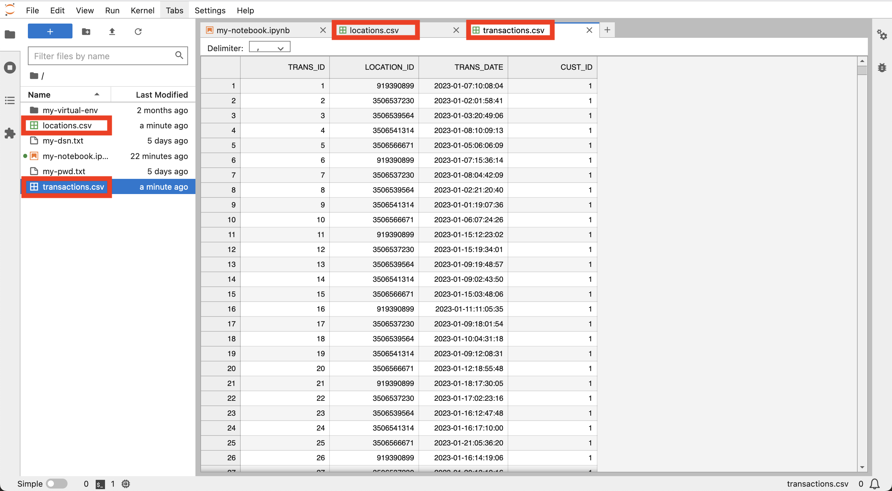
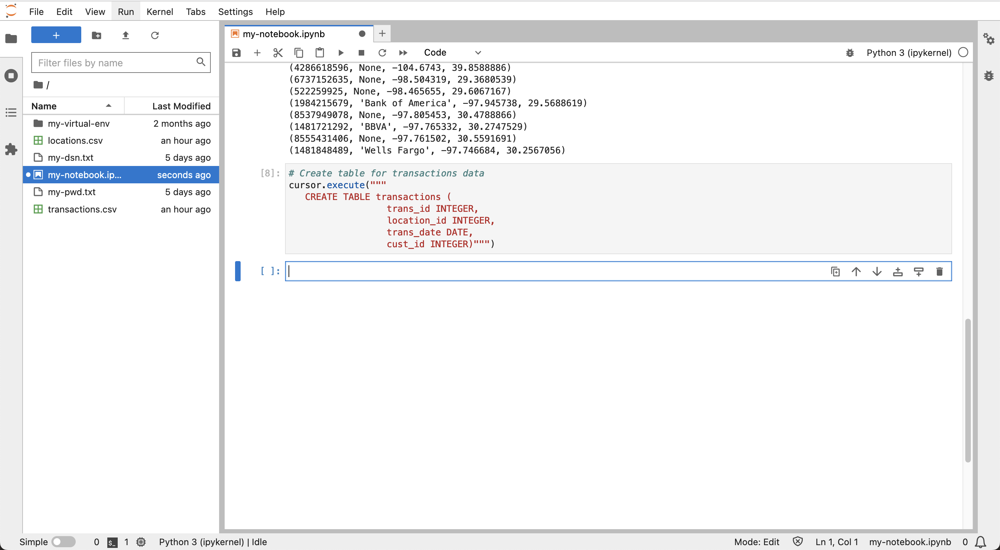
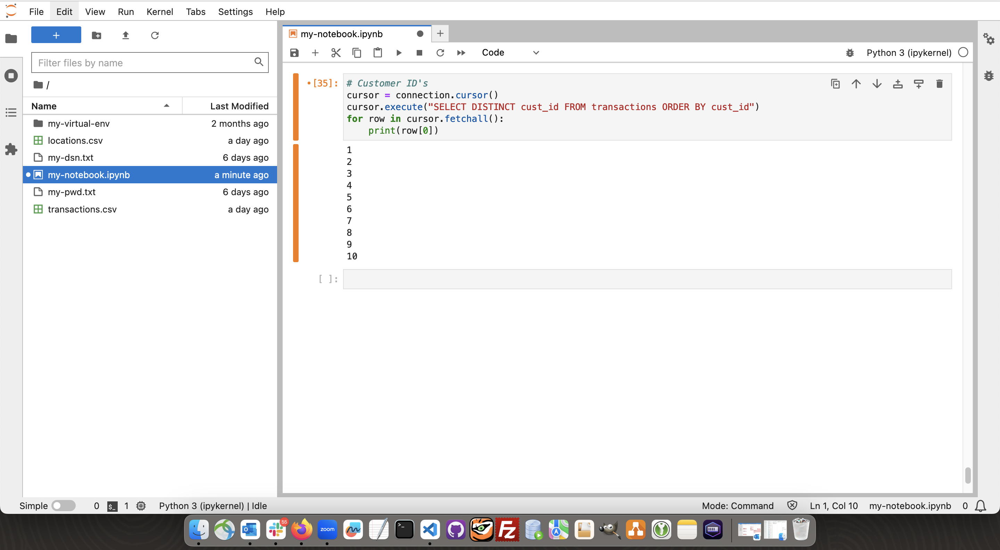
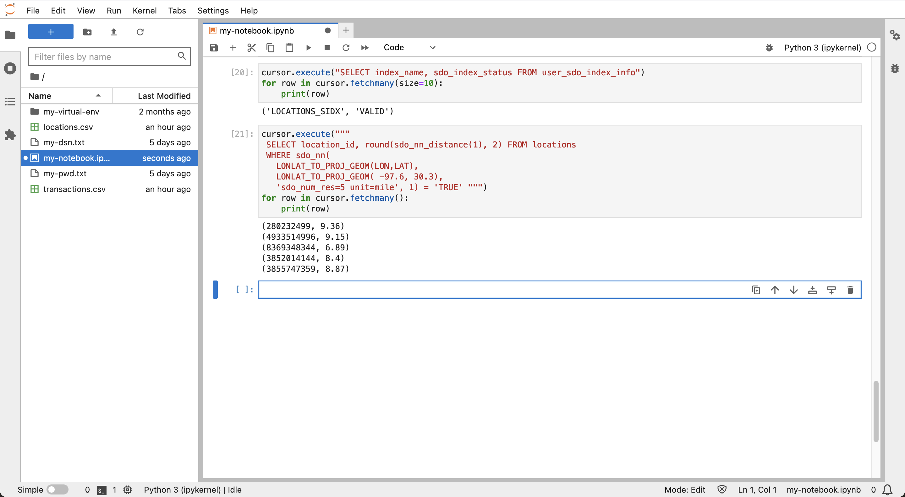

# Preparar Dados

## Introdução

Neste laboratório, os dados de transações financeiras fictícias são carregados no Autonomous Database e configurados para análise espacial e temporal ("espacial-temporal").

Tempo de Laboratório Estimado: 10 minutos

### Objetivos

*   Carregar dados de transações financeiras para o Autonomous Database
*   Configurar dados para análise espaço-temporal

### Pré-requisitos

*   Conclusão do Laboratório 4: Estabelecer Conexão com o Autonomous Database pelo Python

## Tarefa 1: Fazer upload de arquivos de dados

1.  Use os seguintes links para fazer download dos arquivos de dados:

*   [locations.csv](./data/locations.csv)
*   [transactions.csv](./data/transactions.csv)

2.  Clique no ícone **Fazer Upload** para carregar os arquivos de dados. 
    
3.  No painel esquerdo, clique duas vezes em locations.csv e transactions.csv para visualizar os arquivos de dados em novas guias.
    
    
    

Observe que locations.csv tem uma linha por local ATM e as transações têm uma linha por transação financeira. Em seguida, feche as guias com a visualização de dados e retorne ao seu notebook.

## Tarefa 2: Criar e carregar tabelas

1.  Na próxima célula do notebook, cole a instrução a seguir e clique no botão **executar**. Isso cria a tabela para os dados de locais.
    
        <copy>
        # Create table for locations data
        cursor.execute("""
         CREATE TABLE locations (
                   location_id INTEGER,
                   owner VARCHAR2(100),  
                   lon NUMBER,
                   lat NUMBER)""")
        </copy>
        
    
    
    
2.  Execute o seguinte para carregar os dados de locais.
    
        <copy>
        # Load the locations data
        import csv
        BATCH_SIZE = 1000
        with connection.cursor() as cursor:
            with open('locations.csv', 'r') as csv_file:
                csv_reader = csv.reader(csv_file, delimiter=',')
                #skip header
                next(csv_reader)
                #load data
                sql = "INSERT INTO locations VALUES (:1, :2, :3, :4)"
                data = []
                for line in csv_reader:
                    data.append((line[0], line[1], line[2], line[3]))
                    if len(data) % BATCH_SIZE == 0:
                        cursor.executemany(sql, data)
                        data = []
                if data:
                    cursor.executemany(sql, data)
                connection.commit()
        </copy>
        
    
    
    
3.  Execute o seguinte para visualizar os dados dos locais, que contêm uma linha para cada local ATM, incluindo coordenadas e um ID de local exclusivo.
    
        <copy>
        # Preview locations data
        cursor = connection.cursor()
        cursor.execute("SELECT * FROM locations")
        for row in cursor.fetchmany(size=10):
            print(row)
        </copy>
        
    
    
    
4.  Na próxima célula, cole a instrução a seguir e clique no botão **executar**. Isso cria a tabela para os dados da transação.
    
        <copy>
        # Create table for transactions data
        cursor.execute("""
           CREATE TABLE transactions (
                          trans_id INTEGER,
                          location_id INTEGER,
                          trans_date DATE,
                          cust_id INTEGER)""")
        </copy>
        
    
    
    
5.  Execute o seguinte para carregar os dados das transações.
    
        <copy>
        # Load the transactions data
        BATCH_SIZE = 1000
        with connection.cursor() as cursor:
            with open('transactions.csv', 'r') as csv_file:
                csv_reader = csv.reader(csv_file, delimiter=',')
                #skip header
                next(csv_reader)
                #load data
                sql = "INSERT INTO transactions VALUES (:1, :2, TO_DATE(:3,'YYYY-MM-DD:HH24:MI:SS'), :4)"
                data = []
                for line in csv_reader:
                    data.append((line[0], line[1], line[2], line[3]))
                    if len(data) % BATCH_SIZE == 0:
                        cursor.executemany(sql, data)
                        data = []
                if data:
                    cursor.executemany(sql, data)
                connection.commit()
        </copy>
        
    
    
    
6.  Execute o seguinte para visualizar os dados das transações, que contêm uma linha para cada transação, incluindo dados e ID do local.
    
        <copy>
        # Preview transactions data
        cursor = connection.cursor()
        cursor.execute("SELECT * FROM transactions")
        for row in cursor.fetchmany(size=10):
            print(row)
        </copy>
        
    
    
    
7.  Execute o seguinte para listar os diferentes IDs de cliente.
    
        <copy>
        # Customer ID's
        cursor = connection.cursor()
        cursor.execute("SELECT DISTINCT cust_id FROM transactions ORDER BY cust_id")
        for row in cursor.fetchall():
            print(row[0])
        </copy>
        
    
    
    

## Tarefa 3: Adicionar data de época

Os cálculos temporais são um componente-chave deste workshop e são melhor realizados em uma representação inteira de data e hora. Essa representação de número inteiro é geralmente chamada de tempo de época ou, mais especificamente, tempo UNIX. Nesta tarefa, você adiciona tempo de época para todas as transações.

1.  Execute o seguinte para adicionar e preencher uma coluna para data de época.
    
        <copy>
        # add column for epoch date
        cursor.execute("ALTER TABLE transactions ADD (trans_epoch_date integer)")
        </copy>
        
    
        <copy>
        # add column for epoch date
        cursor.execute("""UPDATE transactions
                          SET trans_epoch_date = (trans_date - date'1970-01-01') * 86400""")
        connection.commit()
        </copy>
        
    
    
    
2.  Execute o seguinte para visualizar novamente os dados das transações. Observe que a coluna epoch date está adicionada.
    
        <copy>
        # Preview transactions data
        cursor.execute("SELECT * FROM transactions")
        for row in cursor.fetchmany(size=10):
            print(row)
        </copy>
        
    
    
    

## Tarefa 4: Configurar dados para operações espaciais

Os cálculos espaciais são um componente-chave adicional deste workshop. Nesta tarefa, você configura os dados de seus locais para utilizar os recursos espaciais do Autonomous Database. A tabela de locais inclui coordenadas de longitude/latitude. Uma opção é criar e preencher uma nova coluna usando o tipo de dados espaciais nativos. Embora isso funcione perfeitamente bem, há outra opção que aproveita um recurso convencional do Oracle Database chamado " indexação baseada em função". Essa abordagem permite toda a capacidade associada à criação de uma nova coluna espacial, mas sem precisar criar a coluna. Em vez disso, você cria uma função de banco de dados que converte coordenadas em um elemento de dados espaciais e, em seguida, cria um índice nessa função. Uma vez criada a função e o índice, todas as operações espaciais se comportam como se uma nova coluna espacial tivesse sido criada. Embora isso não seja essencial para o pequeno volume de dados neste workshop, a abordagem é de grande benefício para sistemas de grande escala em que a sobrecarga de adicionar uma coluna é significativa.

1.  Execute o seguinte para criar uma função que converta coordenadas de longitude/latitude para o tipo de dados espaciais nativos da Oracle (ou seja, SDO\_GEOMETRY, conhecido como "geometria"). Não só a função converte coordenadas para o tipo espacial nativo, mas também converte as coordenadas de longitude / latitude para um sistema de coordenadas chamado "mercador mundial". Este é o sistema de coordenadas esperado pelas bibliotecas Python usadas em laboratórios subsequentes, portanto, é conveniente executar essa conversão nesta função.
    
        <copy>
        # Create function to return lon/lat coordinates as a geometry.
        cursor.execute("""
         CREATE OR REPLACE FUNCTION lonlat_to_proj_geom (longitude IN NUMBER, latitude IN NUMBER)
         RETURN SDO_GEOMETRY DETERMINISTIC IS
         BEGIN
           IF latitude IS NULL OR longitude IS NULL
           OR latitude NOT BETWEEN -90 AND 90
           OR longitude NOT BETWEEN -180 AND 180
           THEN
             RETURN NULL;
           ELSE
              RETURN sdo_cs.transform(
                SDO_GEOMETRY(2001, 4326,
                             sdo_point_type(longitude, latitude, NULL),NULL, NULL),
                3857);
           END IF;
        END;""")
        </copy>
        
    
    
    
2.  Consultar geometrias e geometrias convertidas em representações de string envolve "Objetos Grandes" ou "LOBs". Aplique a seguinte definição ao python-oracledb para que os LOBs sejam extraídos diretamente, em vez de buscar um localizador LOB e, em seguida, extrair o conteúdo LOB em um segundo round-trip.
    
        <copy>
        # return LOBs directly as strings or bytes
        oracledb.defaults.fetch_lobs = False  
        </copy>
        
    
    
    
3.  Execute o seguinte para testar a função.
    
        <copy>
        # test the function
        cursor.execute("""
         with x as (
            SELECT location_id, lonlat_to_proj_geom(lon,lat) as geom FROM locations)
         SELECT location_id, geom, (geom).get_wkt()
         FROM x
         """)
        for row in cursor.fetchone():
            print(row)
        </copy>
        
    
    
    
4.  As consultas espaciais dependem de um índice espacial para obter o desempenho ideal. Um índice espacial só pode ser criado em dados com dimensionalidade uniforme (ou seja, 2D ou 3D) e sistema de coordenadas. Antes de criar um índice espacial, é necessário inserir uma linha de metadados descrevendo essas propriedades para que a geometria seja indexada. Isso inclui o nome da tabela, o nome da coluna de geometria (ou, neste caso, uma função que retorna geometria), dimensionalidade e um código de sistema de coordenadas. Ao criar um índice espacial, os dados são verificados primeiro de acordo com os metadados. A indexação espacial só será concluída com sucesso se os dados estiverem em conformidade com os metadados. Execute o seguinte para criar metadados espaciais para a geometria do local.
    
        <copy>
        cursor.execute("""
         INSERT INTO user_sdo_geom_metadata VALUES (
            'LOCATIONS', 'ADMIN.LONLAT_TO_PROJ_GEOM(LON,LAT)',
             SDO_DIM_ARRAY(SDO_DIM_ELEMENT('LON', 0, 0, 0.05),
                           SDO_DIM_ELEMENT('LAT', 0, 0, 0.05)),
             3857)
                    """)
        </copy>
        
    
    
    
5.  Execute o seguinte para criar um índice espacial para a geometria da localização.
    
        <copy>
        cursor.execute("""
         CREATE INDEX locations_sidx
         ON locations(LONLAT_TO_PROJ_GEOM(LON,LAT))
         INDEXTYPE IS mdsys.spatial_index_v2
                    """)
        </copy>
        
    
    
    
6.  Para verificar o índice espacial, execute o exemplo de consulta espacial a seguir. Essa consulta retorna os 5 itens mais próximos da tabela **locations** para uma coordenada de latitude e longitude, juntamente com as distâncias. Isso é chamado de consulta de "vizinho mais próximo" e usa o operador **sdo\_nn( )** que usa o índice espacial. Para obter mais informações sobre consultas de vizinhos mais próximos, consulte a [documentação](https://docs.oracle.com/en/database/oracle/oracle-database/19/spatl/spatial-operators-reference.html#GUID-41E6B1FA-1A03-480B-996F-830E8566661D).
    
        <copy>
        cursor.execute("""
         SELECT location_id, round(sdo_nn_distance(1), 2) FROM locations
         WHERE sdo_nn(
           LONLAT_TO_PROJ_GEOM(LON,LAT),
           LONLAT_TO_PROJ_GEOM( -97.6, 30.3),
           'sdo_num_res=5 unit=mile', 1) = 'TRUE' """)
        for row in cursor.fetchmany():
            print(row)  
        </copy>
        
    
    
    

Agora você pode **prosseguir para o próximo laboratório**.

## Saiba Mais

*   Para obter detalhes sobre o horário UNIX, consulte [https://en.wikipedia.org/wiki/Unix\_time](https://en.wikipedia.org/wiki/Unix_time)
*   Para obter detalhes sobre indexação espacial baseada em funções, consulte a [documentação](https://docs.oracle.com/en/database/oracle/oracle-database/19/spatl/extending-spatial-indexing.html#GUID-CFB6B6DB-4B97-43D1-86A1-21C1BA853089)

## Agradecimentos

*   **Autor** - David Lapp, Database Product Management, Oracle
*   **Colaboradores** - Rahul Tasker, Denise Myrick, Ramu Gutierrez
*   **Última Atualização em/Data** - David Lapp, agosto de 2023