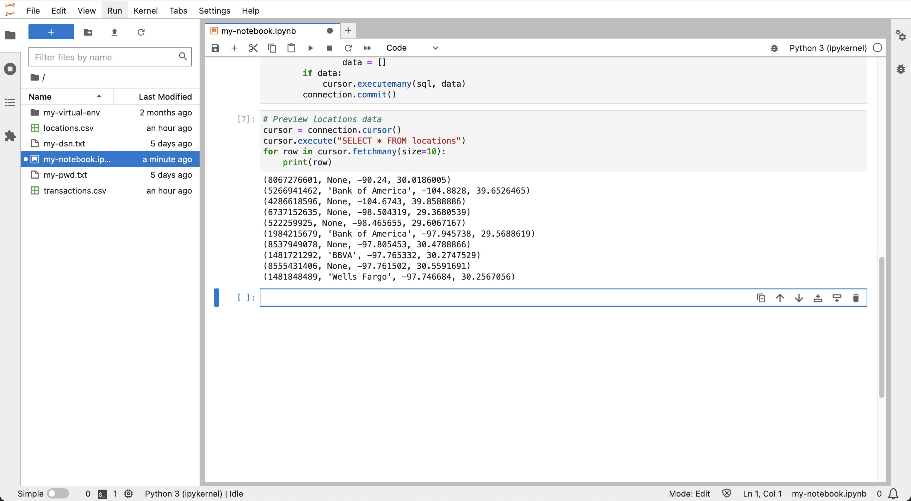

# 准备数据

## 简介

在此实验室中，虚拟财务交易数据将加载到 Autonomous Database 中，并配置为进行空间和时间（“时空”）分析。

估计的实验室时间：10 分钟

### 目标

*   将财务事务数据加载到 Autonomous Database
*   配置数据以进行时空分析

### 先备条件

*   完成实验室 4：从 Python 连接到 Autonomous Database

## 任务 1：上载数据文件

1.  使用以下链接下载数据文件：

*   [locations.csv](./data/locations.csv)
*   [transactions.csv](./data/transactions.csv)

2.  单击**上载**图标以加载数据文件。 
    
3.  在左侧面板中，双击 locations.csv 和 transactions.csv 以在新选项卡中预览数据文件。
    
    
    

请注意，locations.csv 每个 ATM 地点有一行，每个财务交易的交易有一行。然后用数据预览关闭标签页并返回到您的笔记本。

## 任务 2：创建和加载表

1.  在笔记本的下一个单元中，粘贴以下语句，然后单击**运行**按钮。这将创建位置数据的表。
    
        <copy>
        # Create table for locations data
        cursor.execute("""
         CREATE TABLE locations (
                   location_id INTEGER,
                   owner VARCHAR2(100),  
                   lon NUMBER,
                   lat NUMBER)""")
        </copy>
        
    
    
    
2.  运行以下命令加载地点数据。
    
        <copy>
        # Load the locations data
        import csv
        BATCH_SIZE = 1000
        with connection.cursor() as cursor:
            with open('locations.csv', 'r') as csv_file:
                csv_reader = csv.reader(csv_file, delimiter=',')
                #skip header
                next(csv_reader)
                #load data
                sql = "INSERT INTO locations VALUES (:1, :2, :3, :4)"
                data = []
                for line in csv_reader:
                    data.append((line[0], line[1], line[2], line[3]))
                    if len(data) % BATCH_SIZE == 0:
                        cursor.executemany(sql, data)
                        data = []
                if data:
                    cursor.executemany(sql, data)
                connection.commit()
        </copy>
        
    
    
    
3.  运行以下命令预览地点数据，其中每个 ATM 地点包含一行，包括坐标和唯一地点 ID。
    
        <copy>
        # Preview locations data
        cursor = connection.cursor()
        cursor.execute("SELECT * FROM locations")
        for row in cursor.fetchmany(size=10):
            print(row)
        </copy>
        
    
    
    
4.  在下一个单元格中，粘贴以下语句，然后单击**运行**按钮。这将创建事务处理数据的表。
    
        <copy>
        # Create table for transactions data
        cursor.execute("""
           CREATE TABLE transactions (
                          trans_id INTEGER,
                          location_id INTEGER,
                          trans_date DATE,
                          cust_id INTEGER)""")
        </copy>
        
    
    
    
5.  运行以下命令加载事务处理数据。
    
        <copy>
        # Load the transactions data
        BATCH_SIZE = 1000
        with connection.cursor() as cursor:
            with open('transactions.csv', 'r') as csv_file:
                csv_reader = csv.reader(csv_file, delimiter=',')
                #skip header
                next(csv_reader)
                #load data
                sql = "INSERT INTO transactions VALUES (:1, :2, TO_DATE(:3,'YYYY-MM-DD:HH24:MI:SS'), :4)"
                data = []
                for line in csv_reader:
                    data.append((line[0], line[1], line[2], line[3]))
                    if len(data) % BATCH_SIZE == 0:
                        cursor.executemany(sql, data)
                        data = []
                if data:
                    cursor.executemany(sql, data)
                connection.commit()
        </copy>
        
    
    
    
6.  运行以下命令预览事务处理数据，其中包含每个事务处理的一行，包括数据和地点 ID。
    
        <copy>
        # Preview transactions data
        cursor = connection.cursor()
        cursor.execute("SELECT * FROM transactions")
        for row in cursor.fetchmany(size=10):
            print(row)
        </copy>
        
    
    
    
7.  运行以下命令以列出不同的客户 ID。
    
        <copy>
        # Customer ID's
        cursor = connection.cursor()
        cursor.execute("SELECT DISTINCT cust_id FROM transactions ORDER BY cust_id")
        for row in cursor.fetchall():
            print(row[0])
        </copy>
        
    
    
    

## 任务 3：添加纪元日期

时间计算是此研讨会的关键组成部分，最好以日期和时间整数表示形式执行。这种整数表示通常称为纪元时间或更具体的 UNIX 时间。在此任务中，您可以为所有事务处理添加纪元时间。

1.  运行以下命令以添加和填充纪元日期的列。
    
        <copy>
        # add column for epoch date
        cursor.execute("ALTER TABLE transactions ADD (trans_epoch_date integer)")
        </copy>
        
    
        <copy>
        # add column for epoch date
        cursor.execute("""UPDATE transactions
                          SET trans_epoch_date = (trans_date - date'1970-01-01') * 86400""")
        connection.commit()
        </copy>
        
    
    
    
2.  运行以下命令重新预览事务处理数据。观察是否已添加纪元日期列。
    
        <copy>
        # Preview transactions data
        cursor.execute("SELECT * FROM transactions")
        for row in cursor.fetchmany(size=10):
            print(row)
        </copy>
        
    
    
    

## 任务 4：为空间操作配置数据

空间计算是本研讨会的另一个关键组成部分。在此任务中，您将位置数据配置为利用 Autonomous Database 的空间功能。位置表包括经度/纬度坐标。一个选项是使用本机空间数据类型创建和填充新列。虽然这很好，但还有一个选项可以利用称为“基于函数的索引”的主流 Oracle Database 功能。此方法允许与创建新空间列关联的所有功能，但不必创建该列。而是创建一个数据库函数，将坐标转换为空间数据元素，然后在该函数上创建索引。创建函数和索引后，所有空间操作的行为就好像创建了一个新的空间列一样。虽然这对于本研讨会中的小数据量不是必不可少的，但这种方法对于添加列开销显著的大规模系统具有巨大的好处。

1.  运行以下命令创建将经度/纬度坐标转换为 Oracle 本机空间数据类型的函数（即 SDO\_GEOMETRY，称为“几何体”）。该函数不仅将坐标转换为本机空间类型，而且还将坐标从经度/纬度转换为称为“世界雇佣兵”的坐标系统。这是后续实验中使用的 Python 库所期望的坐标系统，因此在此函数中执行此转换非常方便。
    
        <copy>
        # Create function to return lon/lat coordinates as a geometry.
        cursor.execute("""
         CREATE OR REPLACE FUNCTION lonlat_to_proj_geom (longitude IN NUMBER, latitude IN NUMBER)
         RETURN SDO_GEOMETRY DETERMINISTIC IS
         BEGIN
           IF latitude IS NULL OR longitude IS NULL
           OR latitude NOT BETWEEN -90 AND 90
           OR longitude NOT BETWEEN -180 AND 180
           THEN
             RETURN NULL;
           ELSE
              RETURN sdo_cs.transform(
                SDO_GEOMETRY(2001, 4326,
                             sdo_point_type(longitude, latitude, NULL),NULL, NULL),
                3857);
           END IF;
        END;""")
        </copy>
        
    
    
    
2.  查询转换为字符串表示形式的几何图形和几何图形涉及“大型对象”或“LOB”。将以下设置应用于 python-oracledb，以便直接提取 LOB，而不是提取 LOB 定位器，然后在第二次往返中提取 LOB 内容。
    
        <copy>
        # return LOBs directly as strings or bytes
        oracledb.defaults.fetch_lobs = False  
        </copy>
        
    
    
    
3.  运行以下命令测试函数。
    
        <copy>
        # test the function
        cursor.execute("""
         with x as (
            SELECT location_id, lonlat_to_proj_geom(lon,lat) as geom FROM locations)
         SELECT location_id, geom, (geom).get_wkt()
         FROM x
         """)
        for row in cursor.fetchone():
            print(row)
        </copy>
        
    
    
    
4.  空间查询依赖于空间索引来实现最佳性能。空间索引只能在具有一致维度（即 2D 或 3D）和坐标系的数据上创建。创建空间索引之前，需要插入一行元数据来描述这些属性，以便为要编制索引的几何图形。这包括表名、几何列名（或者在本例中是返回几何形状的函数）、维度和坐标系统代码。创建空间索引时，首先验证数据以符合元数据。仅当数据符合元数据时，空间索引才会成功完成。运行以下命令为位置几何图形创建空间元数据。
    
        <copy>
        cursor.execute("""
         INSERT INTO user_sdo_geom_metadata VALUES (
            'LOCATIONS', 'ADMIN.LONLAT_TO_PROJ_GEOM(LON,LAT)',
             SDO_DIM_ARRAY(SDO_DIM_ELEMENT('LON', 0, 0, 0.05),
                           SDO_DIM_ELEMENT('LAT', 0, 0, 0.05)),
             3857)
                    """)
        </copy>
        
    
    
    
5.  运行以下命令为位置几何图形创建空间索引。
    
        <copy>
        cursor.execute("""
         CREATE INDEX locations_sidx
         ON locations(LONLAT_TO_PROJ_GEOM(LON,LAT))
         INDEXTYPE IS mdsys.spatial_index_v2
                    """)
        </copy>
        
    
    
    
6.  要验证空间索引，请运行以下空间查询示例。此查询将返回 **locations** 表中距离经度、纬度坐标以及距离最近的 5 个项。这称为“最近的邻居”查询，并使用使用空间索引的 **sdo\_nn( )** 运算符。有关最近的邻居查询的详细信息，请参阅[文档](https://docs.oracle.com/en/database/oracle/oracle-database/19/spatl/spatial-operators-reference.html#GUID-41E6B1FA-1A03-480B-996F-830E8566661D)。
    
        <copy>
        cursor.execute("""
         SELECT location_id, round(sdo_nn_distance(1), 2) FROM locations
         WHERE sdo_nn(
           LONLAT_TO_PROJ_GEOM(LON,LAT),
           LONLAT_TO_PROJ_GEOM( -97.6, 30.3),
           'sdo_num_res=5 unit=mile', 1) = 'TRUE' """)
        for row in cursor.fetchmany():
            print(row)  
        </copy>
        
    
    
    

现在，您可以**进入下一个练习**。

## 了解详细信息

*   有关 UNIX 时间的详细信息，请参见 [https://en.wikipedia.org/wiki/Unix\_time](https://en.wikipedia.org/wiki/Unix_time)
*   有关基于函数的空间索引的详细信息，请参阅[文档](https://docs.oracle.com/en/database/oracle/oracle-database/19/spatl/extending-spatial-indexing.html#GUID-CFB6B6DB-4B97-43D1-86A1-21C1BA853089)

## 确认

*   **作者** - David Lapp，Oracle 数据库产品管理
*   **贡献者** - Rahul Tasker、Denise Myrick、Ramu Gutierrez
*   **上次更新者/日期** - David Lapp，2023 年 8 月