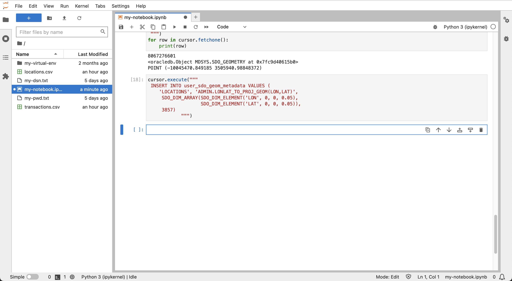

# 準備資料

## 簡介

在此實驗室中，虛擬財務交易資料會載入您的 Autonomous Database 並設定為空間和時間性 (暫時性) 分析。

預估實驗室時間：10 分鐘

### 目標

*   將財務交易資料載入 Autonomous Database
*   設定時間點分析的資料

### 先決條件

*   完成實驗室 4：從 Python 連線至 Autonomous Database

## 作業 1：上傳資料檔

1.  使用下列連結下載資料檔：

*   [locations.csv](./data/locations.csv)
*   [transactions.csv](./data/transactions.csv)

2.  按一下**上傳**圖示以載入資料檔。 
    
3.  在左側面板中，按兩下 locations.csv 與 transactions.csv 以在新頁籤中預覽資料檔。
    
    
    

請注意，locations.csv 每一 ATM 位置都有一個資料列，而交易每筆財務交易有一個資料列。然後關閉含有資料預覽的頁標，並返回您的記事本。

## 作業 2：建立及載入表格

1.  在記事本的下一個儲存格中，貼上下列陳述式，然後按一下**執行**按鈕。這會建立地點資料的表格。
    
        <copy>
        # Create table for locations data
        cursor.execute("""
         CREATE TABLE locations (
                   location_id INTEGER,
                   owner VARCHAR2(100),  
                   lon NUMBER,
                   lat NUMBER)""")
        </copy>
        
    
    
    
2.  執行下列項目以載入地點資料。
    
        <copy>
        # Load the locations data
        import csv
        BATCH_SIZE = 1000
        with connection.cursor() as cursor:
            with open('locations.csv', 'r') as csv_file:
                csv_reader = csv.reader(csv_file, delimiter=',')
                #skip header
                next(csv_reader)
                #load data
                sql = "INSERT INTO locations VALUES (:1, :2, :3, :4)"
                data = []
                for line in csv_reader:
                    data.append((line[0], line[1], line[2], line[3]))
                    if len(data) % BATCH_SIZE == 0:
                        cursor.executemany(sql, data)
                        data = []
                if data:
                    cursor.executemany(sql, data)
                connection.commit()
        </copy>
        
    
    
    
3.  執行下列作業以預覽地點資料，其中包含每個 ATM 位置的每個資料列，包括座標與唯一地點 ID。
    
        <copy>
        # Preview locations data
        cursor = connection.cursor()
        cursor.execute("SELECT * FROM locations")
        for row in cursor.fetchmany(size=10):
            print(row)
        </copy>
        
    
    
    
4.  在下一個儲存格中，貼上下列陳述式，然後按一下 \[ **執行** \] 按鈕。這會建立異動資料的表格。
    
        <copy>
        # Create table for transactions data
        cursor.execute("""
           CREATE TABLE transactions (
                          trans_id INTEGER,
                          location_id INTEGER,
                          trans_date DATE,
                          cust_id INTEGER)""")
        </copy>
        
    
    
    
5.  執行下列項目以載入異動資料。
    
        <copy>
        # Load the transactions data
        BATCH_SIZE = 1000
        with connection.cursor() as cursor:
            with open('transactions.csv', 'r') as csv_file:
                csv_reader = csv.reader(csv_file, delimiter=',')
                #skip header
                next(csv_reader)
                #load data
                sql = "INSERT INTO transactions VALUES (:1, :2, TO_DATE(:3,'YYYY-MM-DD:HH24:MI:SS'), :4)"
                data = []
                for line in csv_reader:
                    data.append((line[0], line[1], line[2], line[3]))
                    if len(data) % BATCH_SIZE == 0:
                        cursor.executemany(sql, data)
                        data = []
                if data:
                    cursor.executemany(sql, data)
                connection.commit()
        </copy>
        
    
    
    
6.  執行下列動作以預覽交易資料，其中包含每個交易的一列，包括資料與地點 ID。
    
        <copy>
        # Preview transactions data
        cursor = connection.cursor()
        cursor.execute("SELECT * FROM transactions")
        for row in cursor.fetchmany(size=10):
            print(row)
        </copy>
        
    
    
    
7.  執行下列項目以列出不同的客戶 ID。
    
        <copy>
        # Customer ID's
        cursor = connection.cursor()
        cursor.execute("SELECT DISTINCT cust_id FROM transactions ORDER BY cust_id")
        for row in cursor.fetchall():
            print(row[0])
        </copy>
        
    
    
    

## 作業 3：新增 Epoch 日期

時間計算是此研討會的主要元件，最適合以日期與時間的整數表示。此整數表示法通常稱為 Epoch 時間或更明確的 UNIX 時間。在這項任務中，您可以為所有交易新增 Epoch 時間。

1.  執行下列項目以新增並植入 Epoch 日期的資料欄。
    
        <copy>
        # add column for epoch date
        cursor.execute("ALTER TABLE transactions ADD (trans_epoch_date integer)")
        </copy>
        
    
        <copy>
        # add column for epoch date
        cursor.execute("""UPDATE transactions
                          SET trans_epoch_date = (trans_date - date'1970-01-01') * 86400""")
        connection.commit()
        </copy>
        
    
    
    
2.  執行下列項目以再次預覽交易資料。觀察已新增的事件日期資料欄。
    
        <copy>
        # Preview transactions data
        cursor.execute("SELECT * FROM transactions")
        for row in cursor.fetchmany(size=10):
            print(row)
        </copy>
        
    
    
    

## 作業 4：設定空間作業的資料

空間計算是本研討會的額外關鍵組成部分。在這項任務中，您將設定位置資料以使用 Autonomous Database 的空間功能。位置表格包括經度 / 緯度座標。其中一個選項是使用原生空間資料類型來建立和填入新資料欄。雖然這種做法非常正常，但有另一個選項利用主流的 Oracle Database 功能 (稱為「函數型索引」)。此方法允許建立新空間資料欄相關的所有功能，但不需要建立資料欄。而是建立一個資料庫函數，將座標轉換為空間資料元素，然後在該函數上建立索引。建立函數與索引之後，所有空間作業的行為就會如同已建立新的空間資料欄一樣。雖然這對於本研討會中的小型資料量並不重要，但對於大型系統 (新增資料欄的負荷相當重要) 而言，這種方法非常有利。

1.  執行下列項目以建立函數，將經度 / 緯度座標轉換為 Oracle 的原生空間資料類型 (亦即 SDO\_GEOMETRY，稱為 "geometry") . 函數不僅會將座標轉換為原生空間類型，還會將座標從經度 / 緯度轉換成稱為「世界傭兵」的座標系統。這是後續實驗室中使用的 Python 程式庫所預期的座標系統，因此可以在此函數中執行此轉換。
    
        <copy>
        # Create function to return lon/lat coordinates as a geometry.
        cursor.execute("""
         CREATE OR REPLACE FUNCTION lonlat_to_proj_geom (longitude IN NUMBER, latitude IN NUMBER)
         RETURN SDO_GEOMETRY DETERMINISTIC IS
         BEGIN
           IF latitude IS NULL OR longitude IS NULL
           OR latitude NOT BETWEEN -90 AND 90
           OR longitude NOT BETWEEN -180 AND 180
           THEN
             RETURN NULL;
           ELSE
              RETURN sdo_cs.transform(
                SDO_GEOMETRY(2001, 4326,
                             sdo_point_type(longitude, latitude, NULL),NULL, NULL),
                3857);
           END IF;
        END;""")
        </copy>
        
    
    
    
2.  查詢轉換為字串表示的幾何和幾何會涉及「大型物件」或「LOB」。將下列設定套用至 python-oracledb，讓 LOB 直接擷取，而不是擷取 LOB 定位器，然後在第二個往返擷取 LOB 內容。
    
        <copy>
        # return LOBs directly as strings or bytes
        oracledb.defaults.fetch_lobs = False  
        </copy>
        
    
    
    
3.  執行以下步驟來測試函數。
    
        <copy>
        # test the function
        cursor.execute("""
         with x as (
            SELECT location_id, lonlat_to_proj_geom(lon,lat) as geom FROM locations)
         SELECT location_id, geom, (geom).get_wkt()
         FROM x
         """)
        for row in cursor.fetchone():
            print(row)
        </copy>
        
    
    
    
4.  空間查詢倚賴空間索引，可達到最佳效能。只能在具有統一維度 (即 2D 或 3D) 和座標系統的資料上建立空間索引。建立空間索引之前，必須插入一列描述資料，以描述要編製索引之幾何圖形的這些特性。這包括表格名稱、幾何資料欄名稱 (或此例中是傳回幾何圖形的函數)、標註性以及座標系統程式碼。建立空間索引時，會先驗證資料以符合描述資料。資料符合描述資料時，空間索引只會順利完成。執行以下步驟，為位置幾何圖形建立空間中繼資料。
    
        <copy>
        cursor.execute("""
         INSERT INTO user_sdo_geom_metadata VALUES (
            'LOCATIONS', 'ADMIN.LONLAT_TO_PROJ_GEOM(LON,LAT)',
             SDO_DIM_ARRAY(SDO_DIM_ELEMENT('LON', 0, 0, 0.05),
                           SDO_DIM_ELEMENT('LAT', 0, 0, 0.05)),
             3857)
                    """)
        </copy>
        
    
    
    
5.  執行以下步驟，為位置幾何圖形建立空間索引。
    
        <copy>
        cursor.execute("""
         CREATE INDEX locations_sidx
         ON locations(LONLAT_TO_PROJ_GEOM(LON,LAT))
         INDEXTYPE IS mdsys.spatial_index_v2
                    """)
        </copy>
        
    
    
    
6.  若要驗證空間索引，請執行下列空間查詢範例。此查詢會將 5 個最接近的項目從**位置**表格返回經度、緯度座標，以及距離。這稱為「最接近的鄰居」查詢，並使用使用空間索引的 **sdo\_nn ()** 運算子。如需有關最近相鄰查詢的詳細資訊，請參閱這份[文件](https://docs.oracle.com/en/database/oracle/oracle-database/19/spatl/spatial-operators-reference.html#GUID-41E6B1FA-1A03-480B-996F-830E8566661D)。
    
        <copy>
        cursor.execute("""
         SELECT location_id, round(sdo_nn_distance(1), 2) FROM locations
         WHERE sdo_nn(
           LONLAT_TO_PROJ_GEOM(LON,LAT),
           LONLAT_TO_PROJ_GEOM( -97.6, 30.3),
           'sdo_num_res=5 unit=mile', 1) = 'TRUE' """)
        for row in cursor.fetchmany():
            print(row)  
        </copy>
        
    
    
    

您現在可以**進入下一個實驗室**。

## 進一步瞭解

*   如需 UNIX 時間的詳細資訊，請參閱 [https://en.wikipedia.org/wiki/Unix\_time](https://en.wikipedia.org/wiki/Unix_time)
*   如需函數式空間索引的詳細資訊，請參閱[文件](https://docs.oracle.com/en/database/oracle/oracle-database/19/spatl/extending-spatial-indexing.html#GUID-CFB6B6DB-4B97-43D1-86A1-21C1BA853089)

## 確認

*   **作者** - Oracle 資料庫產品管理 David Lapp
*   **貢獻者** - Rahul Tasker，Denise Myrick，Ramu Gutierrez
*   **上次更新者 / 日期** - David Lapp，2023 年 8 月