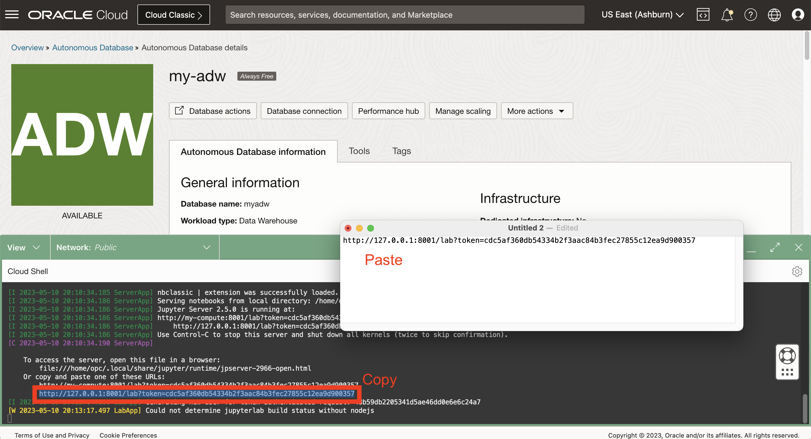

# Starten Sie JupyterLab

## Einführung

Notizbücher sind interaktive Dokumente für Code, beschreibenden Text und Visualisierungen. In diesem Workshop verwenden Sie Open Source JupyterLab, das eine webbasierte Notizbuchumgebung mit vielen benutzerfreundlichen Funktionen wie Dateiupload bereitstellt.

Geschätzte Laborzeit: 5 Minuten

Sehen Sie sich das Video unten an, um einen schnellen Durchgang des Labors zu erhalten. [Übung 3](videohub:1_p5fff23s)

### Ziele

*   Starten Sie JupyterLab
*   Zugriff auf JupyterLab prüfen
*   Option auswählen, um die verbleibende praktische Übung durchzuführen

### Voraussetzungen

*   Abschluss der Übung 2: Autonomous Database erstellen

## Aufgabe 1: JupyterLab starten

1.  Erweitern Sie Cloud Shell. 
    
2.  Sie sollten weiterhin mit SSH mit Ihrer Compute-Instanz verbunden sein. Andernfalls geben Sie den folgenden Befehl ein, um eine Verbindung zur Compute-Instanz herzustellen.
    

\`\` ssh -i ~/.ssh/my-ssh-key opc@\[IP-Adresse\] \`\` \`\` ssh -i ~/.ssh/ocw23-rsa opc@\[IP-Adresse\] \`\`\`

     
    

3.  Ihre Compute-Instanz verfügt über eine virtuelle Umgebung mit geladenen Python-Librarys. Aktivieren Sie die virtuelle Umgebung mit dem folgenden Befehl.
    
        <copy>
         source my-virtual-env/bin/activate
        </copy>
        
    
    
    
4.  Geben Sie den folgenden Befehl ein, um JupyterLab zu starten.
    
        <copy>
         jupyter-lab --ip=0.0.0.0 --port=8001 --no-browser
        </copy>
        
    
    
    
    Der Startprozess ist abgeschlossen, wenn "So greifen Sie auf den Server zu ..." gefolgt von einem Dateipfad und einer URL angezeigt wird.
    

## Aufgabe 2: Zugriff auf JupyterLab prüfen

1.  Beachten Sie die URL JupyterLab einschließlich Authentifizierungstoken. Kopieren Sie diese URL, und fügen Sie sie in einen Texteditor ein. 
    
2.  Scrollen Sie in Cloud Shell nach oben zu Ihrem SSH-Befehl, und kopieren Sie Ihre Compute-IP-Adresse. Fügen Sie ihn dann in die URL in Ihrem Texteditor ein, und ersetzen Sie 127.0.0.1. 
    
3.  Neuen Browser-Tab öffnen Kopieren Sie dann die URL aus Ihrem Texteditor, und fügen Sie sie in die neue Registerkarte ein, und führen Sie sie aus. Dadurch wird JupyterLab geöffnet, in dem Sie in den folgenden Übungen Python-Notizbücher erstellen und ausführen. 
    

## Aufgabe 3: Jupyter-Notizbücher durchsuchen

Jupyter Notebook ist ein interaktives webbasiertes Tool, mit dem Sie Dokumente erstellen und freigeben können, die Livecode, Gleichungen, Visualisierungen und Text enthalten. Es wird häufig in der Data Science-Community für Prototyping und Datenanalyse verwendet.

In dieser Aufgabe werden die Grundlagen der Verwendung von Jupyter Notebook erläutert.

1.  Erstellen Sie ein neues Notizbuch.
    
    Wenn die Jupyter-Umgebung geladen wird, sollte eine Startertabelle geöffnet sein.
    
    
    
    Wenn das Starterfenster nicht angezeigt wird, wählen Sie oben links im Fenster "Datei" und dann "Neuer Starter".
    
    
    
    Wählen Sie im Starterfenster "Python 3", um ein neues Notizbuch mit der Python-Programmiersprache zu erstellen. Ein neues Notizbuch wird erstellt. Sie können damit beginnen, indem Sie Code in die Codezellen eingeben oder Markdown-Text in die Markdown-Zellen hinzufügen.
    
    
    
2.  Fügen Sie einen Markdown-Text hinzu.
    
    Klicken Sie auf die Codezelle und verwenden Sie die Dropdown-Liste "Zelltyp", um "Markdown" auszuwählen
    
    
    
    Fügen Sie Folgendes in die Zelle ein, und klicken Sie auf die Wiedergabeschaltfläche in der Symbolleiste, oder drücken Sie Shift+Enter, um die Zelle auszuführen.
    
        	<copy>
        	# My First Notebook
        	This is my first Jupyter notebook
        	</copy>
        
    
    
    
3.  Schreiben Sie einen Python-Code. Fügen Sie Folgendes in die nächste Zelle ein, und führen Sie es aus. Der Satz "Hallo, Welt!" sollte unter der Zelle erscheinen.
    
        	<copy>
        	print('Hello, World!')
        	</copy>
        
        
    
    
    
4.  Um ein Jupyter Notebook zu speichern, klicken Sie in der Symbolleiste auf das Symbol "Speichern", oder drücken Sie Ctrl+S (oder Cmd+S auf macOS). Das Notizbuch wird mit der Dateierweiterung .ipynb gespeichert.
    

## Aufgabe 4: Wählen Sie die Option, um den Rest dieser praktischen Übung durchzuführen.

Der Rest dieser praktischen Übung kann mit einer der folgenden Optionen durchgeführt werden:

**Option 1:** Befolgen Sie die Anweisungen zum Kopieren/Einfügen/Ausführen jedes Schritts in Ihr Notizbuch.

1.  Fahren Sie mit Übung 4 und anschließend mit nachfolgenden Übungen fort.

**Option 2:** Laden Sie ein vordefiniertes Notizbuch mit allen Schritten, und führen Sie jede Zelle aus.

1.  **Übung 4 zu Aufgabe 1** ausführen
    
2.  Führen Sie **Übung 5 zu Aufgabe 1** aus.
    
3.  Klicken Sie auf den folgenden Link, um das vordefinierte Notizbuch auf Ihren Laptop herunterzuladen: \* [prebuit-notebook.ipynb](./files/prebuilt-notebook.ipynb)
    
4.  Klicken Sie auf die Schaltfläche "Hochladen", und wählen Sie das vordefinierte Notizbuch aus.
    

     
    

5.  Doppelklicken Sie auf das vordefinierte Notizbuch, um es zu öffnen und jede Zelle auszuführen.

     
    

## Danksagungen

*   **Autor** - David Lapp, Database Product Management, Oracle
*   **Mitwirkende** - Rahul Tasker, Denise Myrick, Ramu Gutierrez
*   **Zuletzt aktualisiert am/um** - David Lapp, August 2023