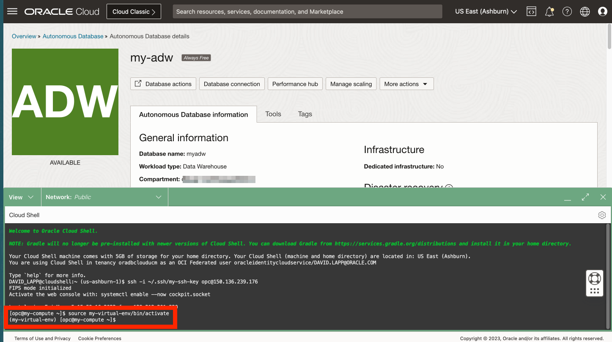
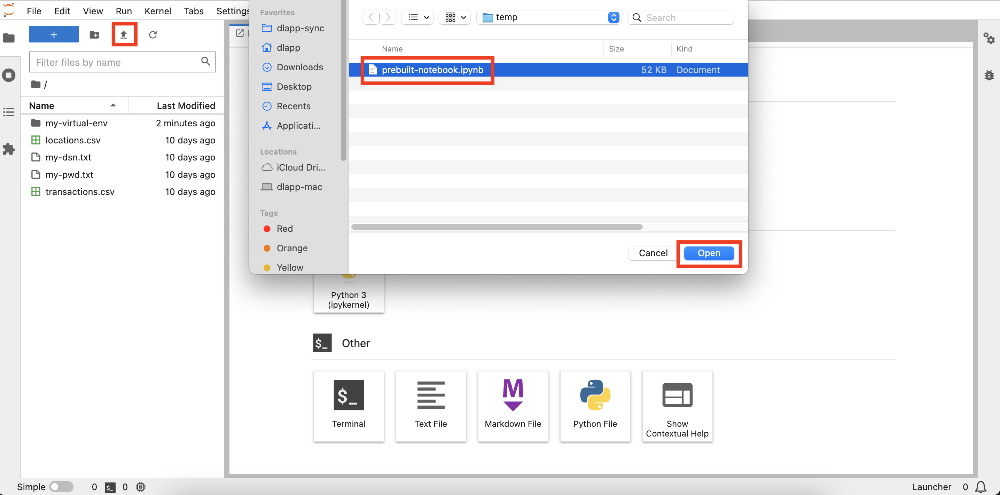

# Inicie JupyterLab

## Introducción

Los blocs de notas son documentos interactivos para código, texto descriptivo y visualizaciones. En este taller, utilizará el código abierto JupyterLab, que proporciona un entorno de bloc de notas basado en web con muchas funciones fáciles de utilizar, como la carga de archivos.

Tiempo de laboratorio estimado: 5 minutos

Vea el siguiente vídeo para una breve introducción al laboratorio. [Laboratorio 3](videohub:1_p5fff23s)

### Objetivos

*   Inicie JupyterLab
*   Verifique el acceso a JupyterLab
*   Seleccione la opción para realizar el resto del laboratorio práctico

### Requisitos

*   Finalización del laboratorio 2: Creación de Autonomous Database

## Tarea 1: Iniciar JupyterLab

1.  Amplíe Cloud Shell. 
    
2.  Debe seguir conectado con SSH a su instancia informática. Si no es así, introduzca el siguiente comando para conectarse a la instancia informática.
    

\`\` ssh -i ~/.ssh/my-ssh-key opc@\[IP address\] \`\` \`\` ssh -i ~/.ssh/ocw23-rsa opc@\[IP address\] \`\`

     
    

3.  Su instancia informática tiene un entorno virtual con bibliotecas Python cargadas. Active el entorno virtual con el siguiente comando.
    
        <copy>
         source my-virtual-env/bin/activate
        </copy>
        
    
    
    
4.  Introduzca el siguiente comando para iniciar JupyterLab.
    
        <copy>
         jupyter-lab --ip=0.0.0.0 --port=8001 --no-browser
        </copy>
        
    
    
    
    El proceso de inicio se completa cuando ve "Para acceder al servidor ..." seguido de una ruta de archivo y una URL.
    

## Tarea 2: Verificar el acceso a JupyterLab

1.  Observe la URL JupyterLab, incluido el token de autenticación. Copie esta URL y péguela en un editor de texto. 
    
2.  En Cloud Shell, desplácese hasta el comando SSH y copie la dirección IP de cálculo. A continuación, péguelo en la URL del editor de texto y reemplace 127.0.0.1 
    
3.  Abra un nuevo separador del explorador. A continuación, copie la URL del editor de texto y péguela en el nuevo separador y ejecútela. Esto abrirá JupyterLab, donde creará y ejecutará blocs de notas de Python en los siguientes laboratorios. 
    

## Tarea 3: Exploración de blocs de notas de Jupyter

Jupyter Notebook es una herramienta interactiva basada en la web que permite crear y compartir documentos que contienen código activo, ecuaciones, visualizaciones y texto. Es ampliamente utilizado en la comunidad de ciencia de datos para la creación de prototipos y el análisis de datos.

En esta tarea, analizaremos los conceptos básicos del uso de Jupyter Notebook.

1.  Cree un nuevo Notebook.
    
    Cuando se cargue el entorno de Jupyter, debería ver un separador del programa de ejecución abierto.
    
    
    
    Si no ve la ventana del programa de ejecución, seleccione el archivo en la parte superior izquierda de la ventana y seleccione 'Nuevo programa de ejecución'.
    
    
    
    En la ventana del programa de ejecución, seleccione "Python 3" para crear un nuevo bloc de notas con el lenguaje de programación Python. Se creará un nuevo bloc de notas y podrá empezar a trabajar en él introduciendo código en las celdas de código o agregando texto de anotación en las celdas de anotación.
    
    
    
2.  Agregue texto de rebaja.
    
    Haga clic en la celda de código y utilice el menú desplegable de tipo de celda para seleccionar 'Marcado'
    
    
    
    Pegue lo siguiente en la celda y haga clic en el botón de reproducción de la barra de herramientas o pulse Shift+Enter para ejecutar la celda.
    
        	<copy>
        	# My First Notebook
        	This is my first Jupyter notebook
        	</copy>
        
    
    
    
3.  Escribe código Python. Pegue lo siguiente en la siguiente celda y ejecútelo. La frase "¡Hola, mundo!" debería aparecer debajo de la celda.
    
        	<copy>
        	print('Hello, World!')
        	</copy>
        
        
    
    
    
4.  Para guardar un bloc de notas de Jupyter, haga clic en el icono "Guardar" de la barra de herramientas o pulse Ctrl+S (o Cmd+S en macOS). El bloc de notas se guardará con la extensión de archivo .ipynb.
    

## Tarea 4: Seleccione la opción para realizar el resto de este laboratorio práctico

El resto de este laboratorio práctico se puede realizar con una de las siguientes opciones:

**Opción 1:** siga las instrucciones para copiar, pegar o ejecutar cada paso en el bloc de notas.

1.  Vaya al laboratorio 4 y, a continuación, a los laboratorios posteriores.

**Opción 2:** cargue un bloc de notas incorporado con todos los pasos y ejecute cada celda.

1.  Realice el **laboratorio 4 - Tarea 1**
    
2.  Realice el **Laboratorio 5 - Tarea 1**.
    
3.  Haga clic en el siguiente enlace para descargar el portátil creado previamente: \* [prebuit-notebook.ipynb](./files/prebuilt-notebook.ipynb)
    
4.  Haga clic en el botón Upload y seleccione el bloc de notas predefinido.
    

     
    

5.  Haga doble clic en el bloc de notas creado previamente para abrirlo y ejecutar cada celda.

     
    

## Reconocimientos

*   **Autor**: David Lapp, Database Product Management, Oracle
*   **Contribuyentes**: Rahul Tasker, Denise Myrick, Ramu Gutiérrez
*   **Última actualización por/fecha**: David Lapp, agosto de 2023