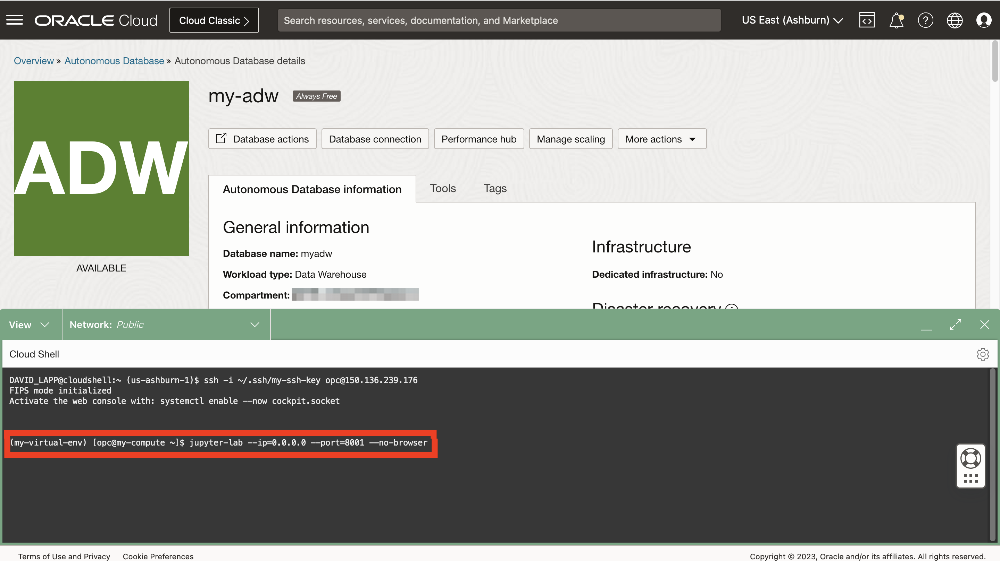

# Démarrez JupyterLab.

## Présentation

Les blocs-notes sont des documents interactifs pour le code, le texte descriptif et les visualisations. Dans cet atelier, vous allez utiliser la version open source JupyterLab qui fournit un environnement de bloc-notes Web avec de nombreuses fonctionnalités conviviales telles que le téléchargement de fichiers.

Temps de laboratoire estimé : 5 minutes

Regardez la vidéo ci-dessous pour une présentation rapide du laboratoire. [Laboratoire 3](videohub:1_p5fff23s)

### Objectifs

*   Démarrez JupyterLab.
*   Vérifier l'accès à JupyterLab
*   Sélectionner une option pour effectuer le reste des exercices pratiques

### Prérequis

*   Achèvement de l'atelier 2 : création d'Autonomous Database

## Tâche 1 : démarrer JupyterLab

1.  Développez Cloud Shell. 
    
2.  Vous devez toujours être connecté avec SSH à votre instance de calcul. Sinon, entrez la commande suivante pour vous connecter à votre instance de calcul.
    

\`\` ssh -i ~/.ssh/my-ssh-key opc@\[adresse IP\] \`\` \`\` ssh -i ~/.ssh/ocw23-rsa opc@\[adresse IP\] \`\`\`

     
    

3.  Votre instance de calcul dispose d'un environnement virtuel avec des bibliothèques Python chargées. Activez l'environnement virtuel à l'aide de la commande suivante.
    
        <copy>
         source my-virtual-env/bin/activate
        </copy>
        
    
    
    
4.  Entrez la commande suivante pour démarrer JupyterLab.
    
        <copy>
         jupyter-lab --ip=0.0.0.0 --port=8001 --no-browser
        </copy>
        
    
    
    
    Le processus de démarrage est terminé lorsque vous voyez "Pour accéder au serveur ..." suivi d'un chemin de fichier et d'une URL.
    

## Tâche 2 : vérifier l'accès à JupyterLab

1.  Observez l'URL JupyterLab, y compris le jeton d'authentification. Copiez cette URL et collez-la dans un éditeur de texte. 
    
2.  Dans Cloud Shell, faites défiler la page jusqu'à la commande SSH et copiez l'adresse IP de calcul. Collez-le ensuite dans l'URL de votre éditeur de texte, en remplaçant 127.0.0.1 
    
3.  Ouvrir un nouvel onglet du navigateur. Copiez ensuite l'URL à partir de votre éditeur de texte, collez-la dans le nouvel onglet et exécutez-la. Cette action ouvrira JupyterLab, dans lequel vous allez créer et exécuter des blocs-notes Python dans les exercices suivants. 
    

## Tâche 3 : Explorer les blocs-notes Jupyter

Jupyter Notebook est un outil Web interactif qui vous permet de créer et de partager des documents contenant du code en direct, des équations, des visualisations et du texte. Il est largement utilisé dans la communauté de la science des données pour le prototypage et l'analyse de données.

Dans cette tâche, nous passerons en revue les bases de l'utilisation de Jupyter Notebook.

1.  Créez un bloc-notes.
    
    Lorsque votre environnement Jupyter se charge, vous devriez voir un onglet de lancement ouvert.
    
    
    
    Si la fenêtre du lanceur ne s'affiche pas, sélectionnez le fichier en haut à gauche de la fenêtre et sélectionnez "Nouveau lanceur".
    
    
    
    Dans la fenêtre du lanceur, sélectionnez "Python 3" pour créer un nouveau bloc-notes à l'aide du langage de programmation Python. Un nouveau bloc-notes est créé et vous pouvez commencer à travailler dessus en entrant du code dans les cellules de code ou en ajoutant du texte de démarque dans les cellules de démarque.
    
    
    
2.  Ajoutez du texte de démarque.
    
    Cliquez sur la cellule de code et utilisez le menu déroulant Utiliser le type de cellule pour sélectionner "Markdown"
    
    
    
    Collez ce qui suit dans la cellule et cliquez sur le bouton de lecture dans la barre d'outils, ou appuyez sur Shift+Enter pour exécuter la cellule.
    
        	<copy>
        	# My First Notebook
        	This is my first Jupyter notebook
        	</copy>
        
    
    
    
3.  Écrivez du code Python. Collez ce qui suit dans la cellule suivante et exécutez-le. La phrase "Bonjour, Monde !" doit apparaître sous la cellule.
    
        	<copy>
        	print('Hello, World!')
        	</copy>
        
        
    
    
    
4.  To save a Jupyter Notebook, click on the "Save" icon on the toolbar, or press Ctrl+S (or Cmd+S on macOS). The notebook will be saved with the .ipynb file extension.
    

## Tâche 4 : sélectionnez une option pour effectuer le reste de cet atelier pratique.

Le reste de cet atelier pratique peut être effectué à l'aide de l'une des options suivantes :

**Option 1 :** suivez les instructions permettant de copier/coller/exécuter chaque étape dans votre bloc-notes.

1.  Passez au laboratoire 4, puis aux laboratoires suivants.

**Option 2 :** chargez un bloc-notes prédéfini avec toutes les étapes et exécutez chaque cellule.

1.  Exécuter l'**atelier 4 - Tâche 1**
    
2.  Effectuez l'**exercice 5 - Tâche 1**.
    
3.  Cliquez sur le lien suivant pour télécharger le bloc-notes prédéfini sur votre ordinateur portable : \* [prebuit-notebook.ipynb](./files/prebuilt-notebook.ipynb)
    
4.  Cliquez sur le bouton de téléchargement et sélectionnez le bloc-notes prédéfini.
    

     
    

5.  Double-cliquez sur le bloc-notes prédéfini pour l'ouvrir et exécuter chaque cellule.

     
    

## Accusés de réception

*   **Auteur** - David Lapp, Database Product Management, Oracle
*   **Contributeurs** - Rahul Tasker, Denise Myrick, Ramu Gutierrez
*   **Dernière mise à jour par/date** - David Lapp, août 2023