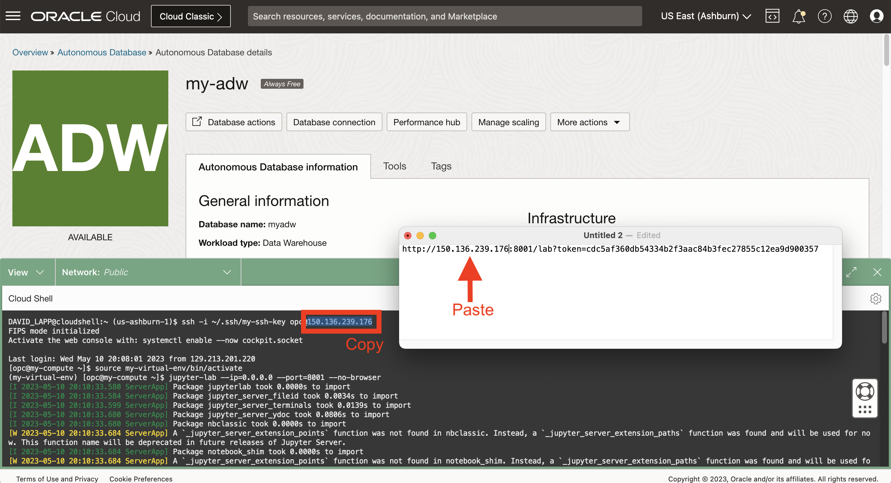
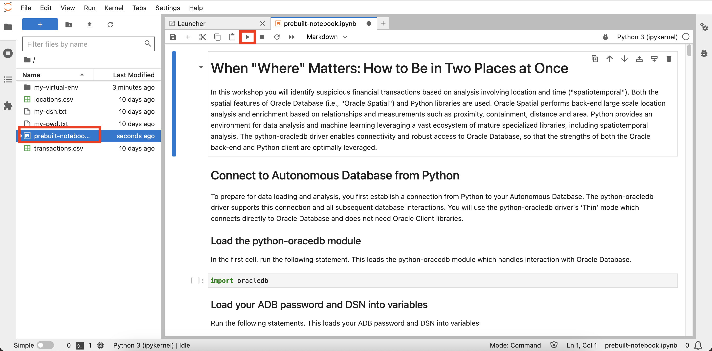

# JupyterLabを起動します。

## 概要

ノートブックは、コード、説明テキストおよびビジュアライゼーションの対話型ドキュメントです。このワークショップでは、オープン・ソースのJupyterLabを使用します。このオープン・ソースでは、Webベースのノートブック環境に、ファイルのアップロードなど、多くのユーザーフレンドリな機能を提供します。

推定ラボ時間: 5分

ラボのクイック・ウォークスルーについては、次のビデオをご覧ください。[ラボ3](videohub:1_p5fff23s)

### 目標

*   JupyterLabを起動します。
*   JupyterLabへのアクセスの検証
*   残りのハンズオン・ラボを実行するためのオプションを選択します

### 前提条件

*   演習2の完了: Autonomous Databaseの作成

## タスク1: JupyterLabの起動

1.  「Cloud Shell」を展開します。 
    
2.  SSHを使用してコンピュート・インスタンスに接続する必要があります。そうでない場合は、次のコマンドを入力してコンピュート・インスタンスに接続します。
    

\`\` ssh -i ~/.ssh/my-ssh-key opc@\[IPアドレス\] \`\`\` \`\`\` ssh -i ~/.ssh/ocw23-rsa opc@\[IPアドレス\] \`\`\`\`

     
    

3.  コンピュート・インスタンスには、Pythonライブラリがロードされた仮想環境があります。次のコマンドを使用して、仮想環境をアクティブ化します。
    
        <copy>
         source my-virtual-env/bin/activate
        </copy>
        
    
    
    
4.  次のコマンドを入力して、JupyterLabを開始します。
    
        <copy>
         jupyter-lab --ip=0.0.0.0 --port=8001 --no-browser
        </copy>
        
    
    
    
    起動プロセスは、「To access the server ...」に続いてファイル・パスとURLが表示されると完了します。
    

## タスク2: JupyterLabへのアクセスの検証

1.  認証トークンを含むJupyterLab URLを確認します。このURLをコピーして、テキスト・エディタに貼り付けます。 
    
2.  クラウド・シェルで、SSHコマンドまでスクロールし、コンピュートIPアドレスをコピーします。テキスト・エディタのURLに貼り付けて、127.0.0.1に置き換えます。 
    
3.  新しいタブを開きます次に、テキスト・エディタからURLをコピーし、新しいタブに貼り付けて実行します。これにより、次の演習でPythonノートブックを作成して実行するJupyterLabが開きます。 
    

## タスク3: Jupyterノートブックの確認

Jupyter Notebookは、ライブ・コード、方程式、ビジュアライゼーションおよびテキストを含むドキュメントを作成および共有できる対話型のWebベースのツールです。これは、プロトタイピングとデータ分析のためにデータ・サイエンス・コミュニティで広く使用されています。

このタスクでは、Jupyter Notebookの使用の基本について説明します。

1.  新しいノートブックを作成します。
    
    Jupyter環境がロードされると、ランチャ・タブが開きます。
    
    
    
    ランチャーウィンドウが表示されない場合は、ウィンドウの左上にあるファイルを選択し、「新規ランチャー」を選択します。
    
    
    
    ランチャーウィンドウから「Python 3」を選択し、Pythonプログラミング言語を使用して新しいノートブックを作成します。新しいノートブックが作成され、コード・セルにコードを入力するか、マークダウン・セルにマークダウン・テキストを追加することで、そのノートブックに対する作業を開始できます。
    
    
    
2.  マークダウン・テキストを追加します。
    
    コード・セルをクリックし、セル・タイプのドロップダウンを使用して「Markdown」を選択します。
    
    
    
    セルに次を貼り付けてツールバーの再生ボタンをクリックするか、Shift+Enterを押してセルを実行します。
    
        	<copy>
        	# My First Notebook
        	This is my first Jupyter notebook
        	</copy>
        
    
    
    
3.  Pythonコードを書く。次のセルに貼り付けて実行します。セルの下に「Hello、 World!」というフレーズが表示されます。
    
        	<copy>
        	print('Hello, World!')
        	</copy>
        
        
    
    
    
4.  Jupyter Notebookを保存するには、ツールバーの「保存」アイコンをクリックするか、Ctrl+S (またはmacOSのCmd+S)を押します。ノートブックは.ipynbファイル拡張子で保存されます。
    

## タスク4: このハンズオン・ラボの残りの部分を実行するオプションの選択

このハンズオン・ラボの残りの部分は、次のいずれかのオプションを使用して実行できます。

**オプション1:**手順に従って、各ステップをノートブックにコピー/貼付け/実行します。

1.  演習4に進み、後続の演習に進みます。

**オプション2:**すべてのステップを含む事前作成済のノートブックをロードし、各セルを実行します。

1.  **ラボ4 - タスク1**の実行
    
2.  **ラボ5 - タスク1**を実行します。
    
3.  次のリンクをクリックして、事前に作成されたノートブックをラップトップにダウンロードします。\* [prebuit-notebook.ipynb](./files/prebuilt-notebook.ipynb)
    
4.  アップロード・ボタンをクリックし、組込みノートブックを選択します。
    

     
    

5.  事前作成済のノートブックをダブルクリックして開き、各セルを実行します。

     
    

## 確認

*   **著者** - Oracle、データベース製品管理、David Lapp氏
*   **コントリビュータ** - Rahul Tasker、Denise Myrick、Ramu Gutierrez
*   **最終更新者/日付** - David Lapp、2023年8月