# Iniciar JupyterLab

## Introdução

Notebooks são documentos interativos para código, texto descritivo e visualizações. Neste workshop, você usa o código aberto JupyterLab, que fornece um ambiente de notebook baseado na Web com muitos recursos fáceis de usar, como upload de arquivos.

Tempo de Laboratório Estimado: 5 minutos

Assista ao vídeo abaixo para uma rápida apresentação do laboratório. [Laboratório 3](videohub:1_p5fff23s)

### Objetivos

*   Iniciar JupyterLab
*   Verifique o acesso a JupyterLab
*   Selecione a opção para executar o restante do laboratório prático

### Pré-requisitos

*   Conclusão do Laboratório 2: Criar o Autonomous Database

## Tarefa 1: Iniciar JupyterLab

1.  Expanda o Cloud Shell. 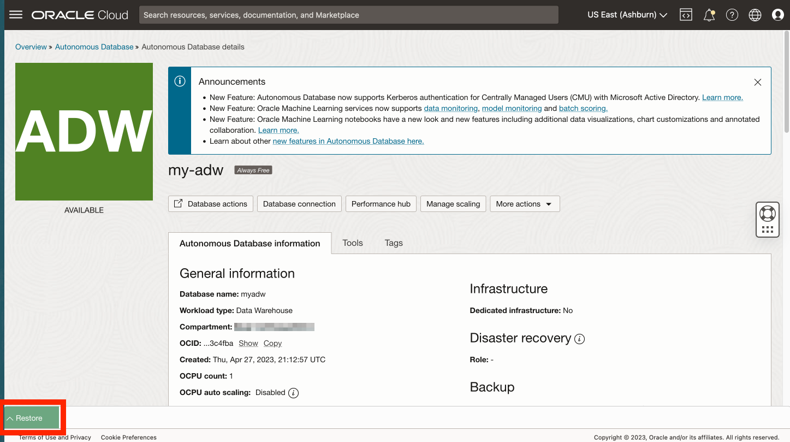
    
2.  Você ainda deverá estar conectado com SSH à sua instância de computação. Caso contrário, digite o comando a seguir para estabelecer conexão com sua instância de computação.
    

\`\`\` ssh -i ~/.ssh/my-ssh-key opc@\[Endereço IP\] \`\`\` \`\`\` ssh -i ~/.ssh/ocw23-rsa opc@\[Endereço IP\] \`\`\`

    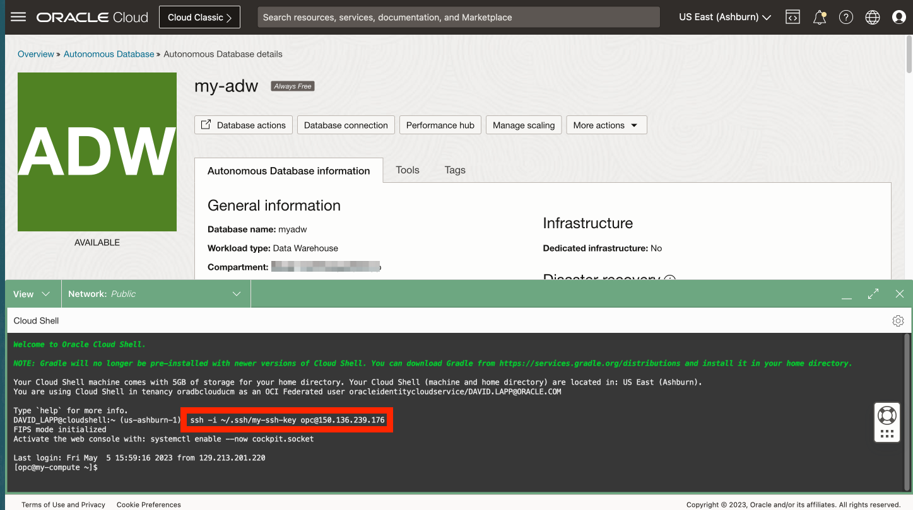 
    

3.  Sua instância de computação tem um ambiente virtual com bibliotecas Python carregadas. Ative o ambiente virtual com o comando a seguir.
    
        <copy>
         source my-virtual-env/bin/activate
        </copy>
        
    
    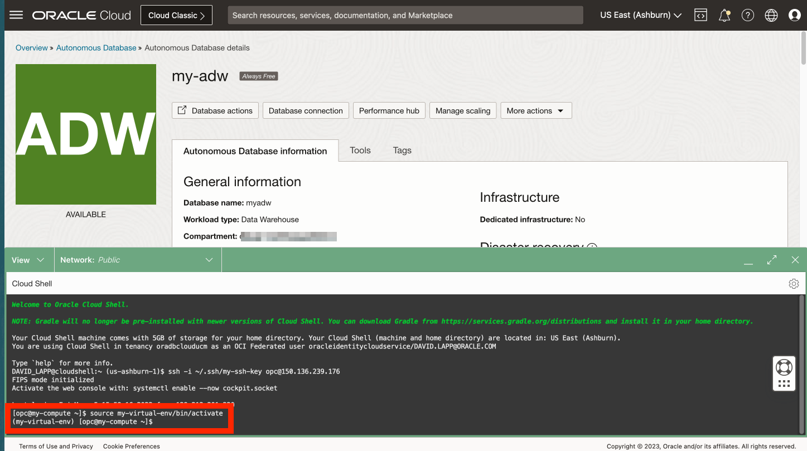
    
4.  Digite o comando a seguir para iniciar JupyterLab.
    
        <copy>
         jupyter-lab --ip=0.0.0.0 --port=8001 --no-browser
        </copy>
        
    
    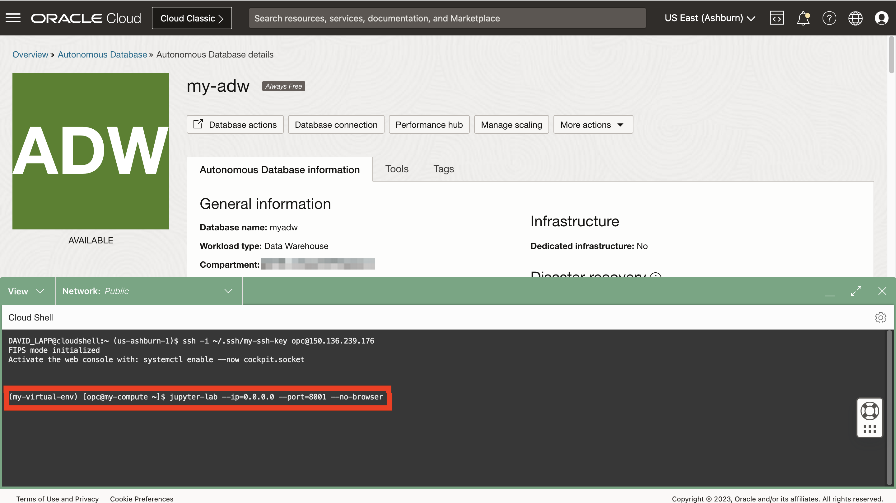
    
    O processo de inicialização é concluído quando você vê "Para acessar o servidor ...", seguido por um caminho de arquivo e URL.
    

## Tarefa 2: Verificar acesso a JupyterLab

1.  Observe o URL JupyterLab incluindo o token de autenticação. Copie este URL e cole em um editor de texto. 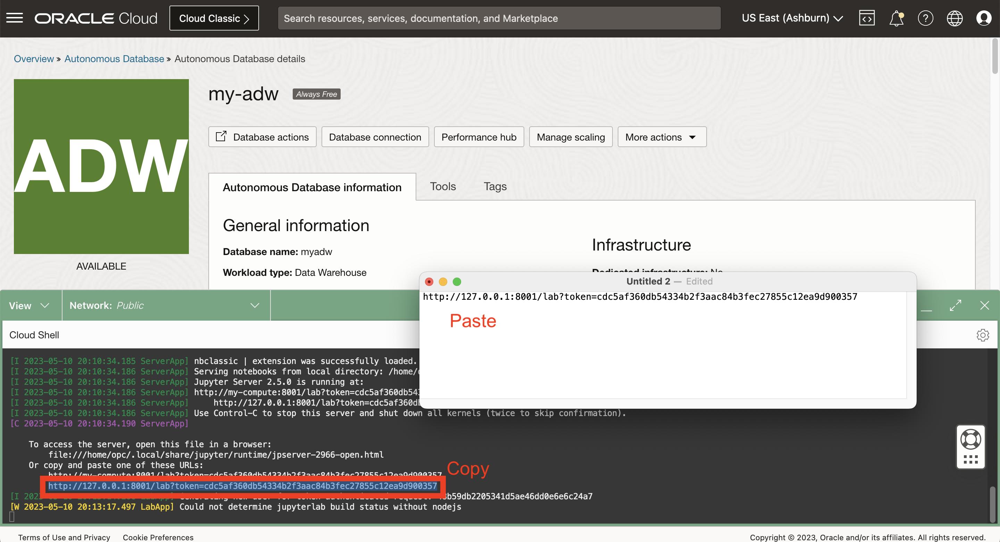
    
2.  No Cloud Shell, role até o comando SSH e copie seu endereço IP de computação. Em seguida, cole-o no URL do editor de texto, substituindo 127.0.0.1 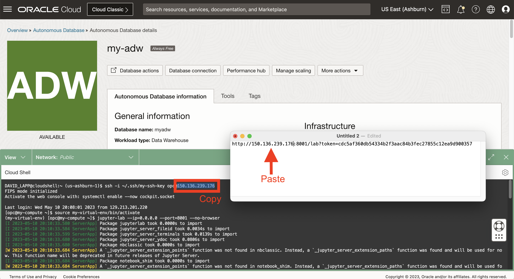
    
3.  Abrir uma nova aba do navegador. Em seguida, copie o URL do editor de texto, cole na nova guia e execute. Isso abrirá JupyterLab onde você criará e executará notebooks Python nos Laboratórios a seguir. 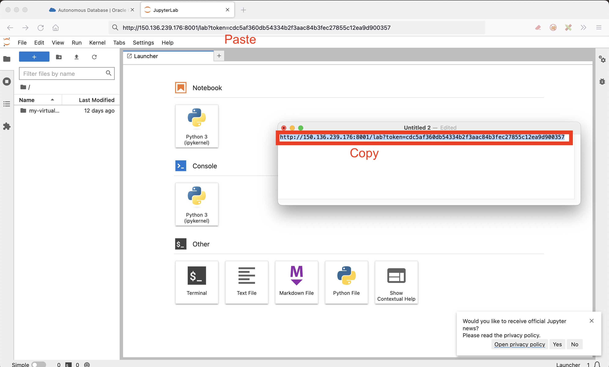
    

## Tarefa 3: Explorar Notebooks Jupyter

O Jupyter Notebook é uma ferramenta interativa baseada na Web que permite criar e compartilhar documentos que contêm código ao vivo, equações, visualizações e texto. É amplamente utilizado na comunidade de ciência de dados para prototipagem e análise de dados.

Nesta tarefa, analisaremos os conceitos básicos do uso do Jupyter Notebook.

1.  Crie um novo notebook.
    
    Quando seu ambiente Jupyter for carregado, você deverá ver uma guia do acionador aberta.
    
    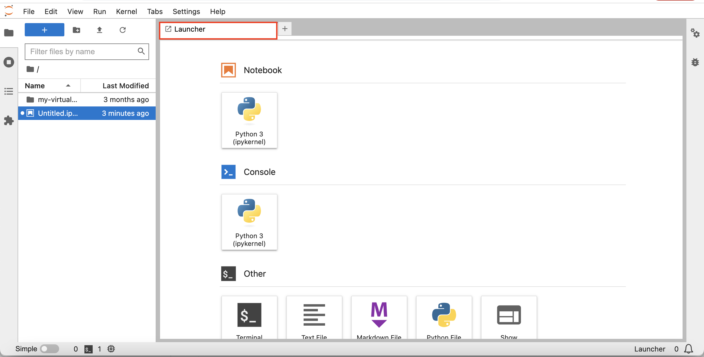
    
    Se você não vir a janela do acionador, selecione o arquivo no canto superior esquerdo da janela e selecione "Novo acionador".
    
    
    
    Na janela do acionador, selecione "Python 3" para criar um novo notebook usando a linguagem de programação Python. Um novo notebook será criado e você poderá começar a trabalhar nele inserindo código nas células de código ou adicionando texto de markdown nas células de markdown.
    
    
    
2.  Adicionar um texto de markdown.
    
    Clique na célula de código e use o menu suspenso use o tipo de célula para selecionar 'Markdown'
    
    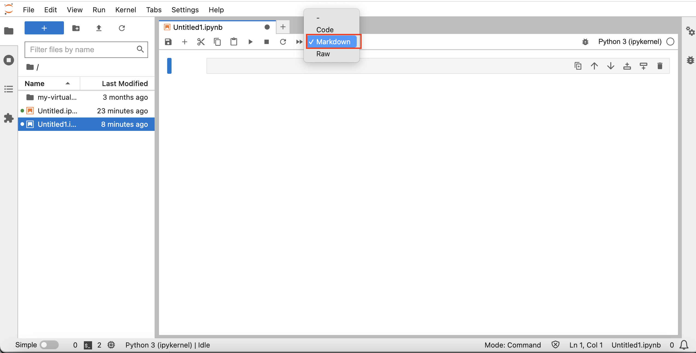
    
    Cole o seguinte na célula e clique no botão de reprodução na barra de ferramentas ou pressione Shift+Enter para executar a célula.
    
        	<copy>
        	# My First Notebook
        	This is my first Jupyter notebook
        	</copy>
        
    
    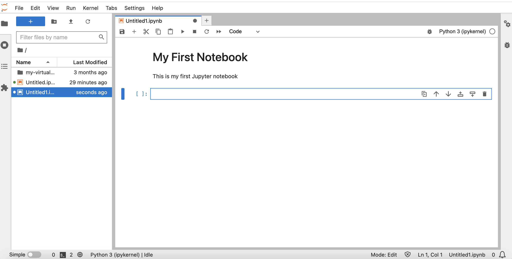
    
3.  Escreva um código Python. Cole o seguinte na próxima célula e execute-o. A frase "Olá, mundo!" deve aparecer abaixo da cela.
    
        	<copy>
        	print('Hello, World!')
        	</copy>
        
        
    
    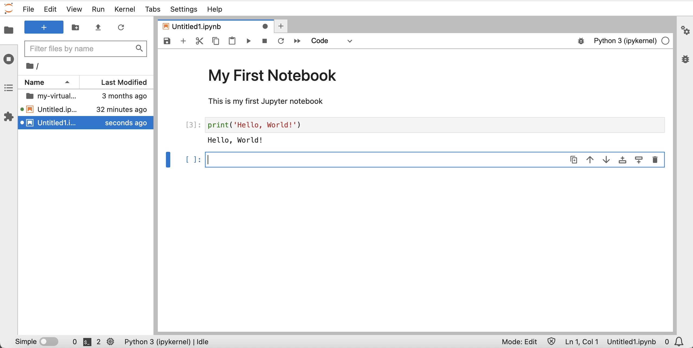
    
4.  Para salvar um Jupyter Notebook, clique no ícone "Salvar" na barra de ferramentas ou pressione Ctrl+S (ou Cmd+S em macOS). O notebook será salvo com a extensão de arquivo .ipynb.
    

## Tarefa 4: Selecionar opção para executar o restante deste laboratório prático

O restante desse laboratório prático pode ser executado usando uma das seguintes opções:

**Opção 1:** Siga as instruções para copiar/colar/executar cada etapa no notebook.

1.  Prossiga para o Laboratório 4 e, em seguida, para os laboratórios subsequentes.

**Opção 2:** Carregue um notebook pré-criado com todas as etapas e execute cada célula.

1.  Executar **Laboratório 4 - Tarefa 1**
    
2.  Execute o **Laboratório 5 - Tarefa 1**.
    
3.  Clique no seguinte link para fazer download do notebook pré-criado para seu laptop: \* [prebuit-notebook.ipynb](./files/prebuilt-notebook.ipynb)
    
4.  Clique no botão de upload e selecione o notebook pré-criado.
    

     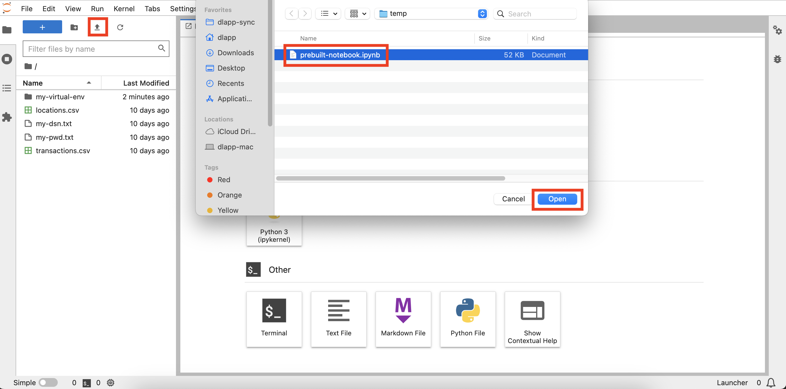
    

5.  Clique duas vezes no notebook pré-criado para abri-lo e executar cada célula.

     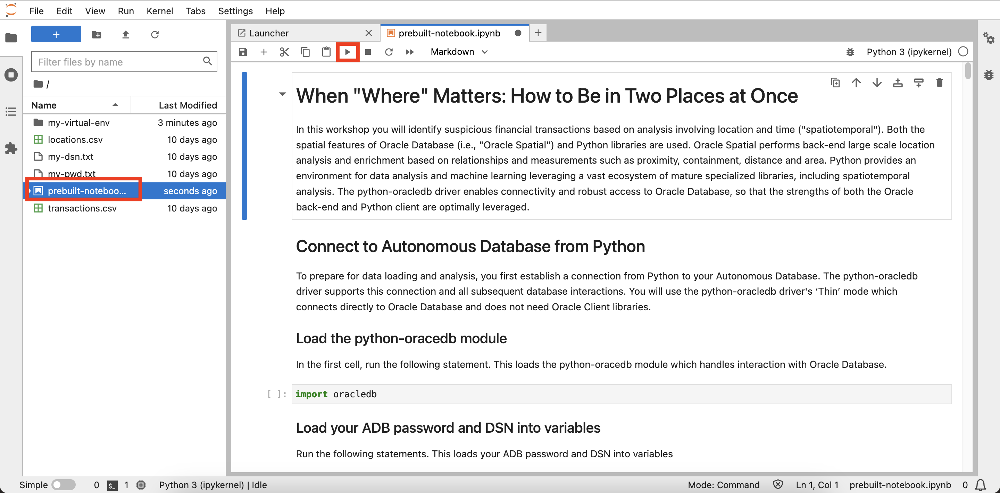
    

## Agradecimentos

*   **Autor** - David Lapp, Database Product Management, Oracle
*   **Colaboradores** - Rahul Tasker, Denise Myrick, Ramu Gutierrez
*   **Última Atualização em/Data** - David Lapp, agosto de 2023