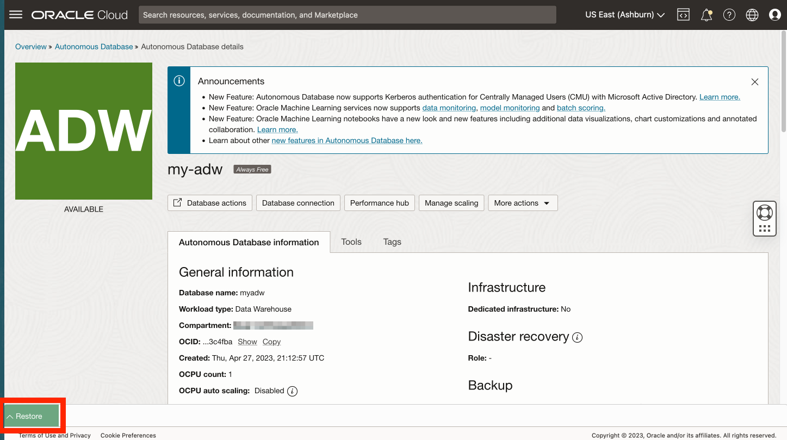
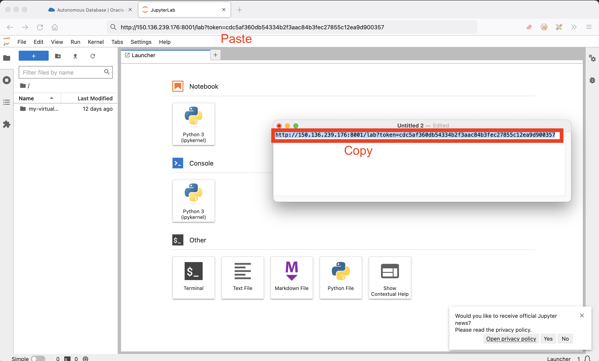

# 启动 JupyterLab

## 简介

笔记本是用于代码、说明性文本和可视化的交互式文档。在本研讨会中，您将使用开源 JupyterLab，它提供了一个基于 Web 的笔记本环境，其中包含许多用户友好的功能，例如文件上载。

估计的实验室时间：5 分钟

观看下面的视频，快速浏览实验室。[练习 3](videohub:1_p5fff23s)

### 目标

*   启动 JupyterLab
*   验证对 JupyterLab 的访问权限
*   选择用于执行剩余动手实验室的选项

### 先备条件

*   完成实验室 2：创建 Autonomous Database

## 任务 1：启动 JupyterLab

1.  展开 Cloud Shell。 
    
2.  您仍应使用 SSH 连接到计算实例。如果没有，请输入以下命令以连接到计算实例。
    

\`\`\` ssh -i ~/.ssh/my-ssh-key opc@\[IP address\] \`\`\`\` \`\`\` ssh -i ~/.ssh/ocw23-rsa opc@\[IP address\] \`\`\`

     
    

3.  您的计算实例具有加载了 Python 库的虚拟环境。使用以下命令激活虚拟环境。
    
        <copy>
         source my-virtual-env/bin/activate
        </copy>
        
    
    
    
4.  输入以下命令以启动 JupyterLab。
    
        <copy>
         jupyter-lab --ip=0.0.0.0 --port=8001 --no-browser
        </copy>
        
    
    
    
    当您看到“访问服务器 ...”后跟文件路径和 URL 时，启动过程已完成。
    

## 任务 2：验证对 JupyterLab 的访问权限

1.  观察 JupyterLab URL，包括验证令牌。复制此 URL 并粘贴到文本编辑器中。 
    
2.  在 Cloud Shell 中，向上滚动到 SSH 命令并复制计算 IP 地址。然后将其粘贴到文本编辑器中的 URL 中，替换 127.0.0.1 
    
3.  新建一个浏览器标签页。然后从文本编辑器中复制 URL 并粘贴到新选项卡并运行。这将打开 JupyterLab，您将在以下实验室中创建和运行 Python 笔记本。 
    

## 任务 3：浏览 Jupyter 笔记本

Jupyter Notebook 是一个基于 Web 的交互式工具，允许您创建和共享包含实时代码、方程式、可视化和文本的文档。它在数据科学界广泛用于原型设计和数据分析。

在本任务中，我们将介绍使用 Jupyter Notebook 的基本知识。

1.  创建新笔记本。
    
    当 Jupyter 环境加载时，您应该看到启动器选项卡已打开。
    
    
    
    如果未看到启动器窗口，请选择窗口左上角的文件，然后选择“新建启动器”。
    
    
    
    在启动器窗口中，选择 "Python 3" 以使用 Python 编程语言创建新笔记本。将创建一个新的笔记本，您可以通过在代码单元格中输入代码或在减价单元格中添加减价文本来开始处理它。
    
    
    
2.  添加一些减价文本。
    
    单击代码单元格并使用单元格类型下拉列表选择 'Markdown'
    
    
    
    将以下内容粘贴到单元格中并单击工具栏上的播放按钮，或按 Shift+Enter 运行单元格。
    
        	<copy>
        	# My First Notebook
        	This is my first Jupyter notebook
        	</copy>
        
    
    
    
3.  编写一些 Python 代码。将以下内容粘贴到下一个单元格并运行它。“Hello，World！（您好，世界！）”应出现在单元格下方。
    
        	<copy>
        	print('Hello, World!')
        	</copy>
        
        
    
    
    
4.  要保存 Jupyter Notebook，请单击工具栏上的“保存”图标，或按 Ctrl+S（或按 macOS 上的 Cmd+S）。笔记本将使用 .ipynb 文件扩展名进行保存。
    

## 任务 4：选择用于执行此上机操作实验室剩余部分的选项

此上机操作实验室的其余部分可以使用以下任一选项执行：

**选项 1：**按照说明将每个步骤复制/粘贴/运行到记事本中。

1.  转到实验室 4，然后转到后续实验室。

**选项 2：**加载包含所有步骤的预构建记事本并运行每个单元格。

1.  执行**练习 4 - 任务 1**
    
2.  执行**练习 5 - 任务 1** 。
    
3.  单击以下链接可将预构建的笔记本电脑下载到笔记本电脑：\* [prebuit-notebook.ipynb](./files/prebuilt-notebook.ipynb)
    
4.  单击上载按钮并选择预构建的记事本。
    

     
    

5.  双击预制笔记本以打开它并运行每个单元。

     
    

## 确认

*   **作者** - David Lapp，Oracle 数据库产品管理
*   **贡献者** - Rahul Tasker、Denise Myrick、Ramu Gutierrez
*   **上次更新者/日期** - David Lapp，2023 年 8 月