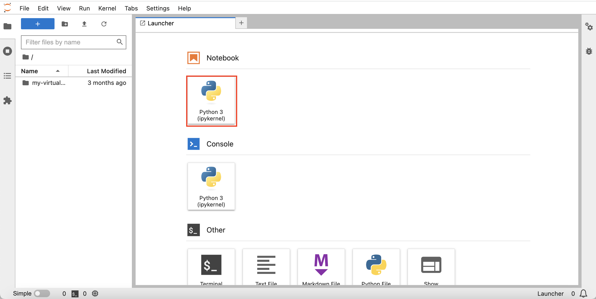

# 啟動 JupyterLab

## 簡介

筆記本是用於程式碼、描述性文字和視覺化的互動式文件。在此研討會中，您可以使用開源 JupyterLab，此開源環境內含許多容易操作的功能，例如檔案上傳。

預估實驗室時間：5 分鐘

請觀看下方影片，快速瞭解實驗室的逐步解說。[實驗室 3](videohub:1_p5fff23s)

### 目標

*   啟動 JupyterLab
*   驗證 JupyterLab 的存取權
*   選取執行剩餘實作實驗室的選項

### 先決條件

*   完成實驗室 2：建立 Autonomous Database

## 工作 1：啟動 JupyterLab

1.  展開 Cloud Shell。 
    
2.  您仍然應該將 SSH 連線到運算執行處理。如果不是，請輸入下列命令以連線至您的運算執行處理。
    

\`\`\` ssh -i ~/.ssh/my-ssh-key opc@\[IP address\] \`\`\` \`\`\` ssh -i ~/.ssh/ocw23-rsa opc@\[IP address\] \`\`\`\`

     
    

3.  您的運算執行處理有一個已載入 Python 函式庫的虛擬環境。使用下列命令啟用虛擬環境。
    
        <copy>
         source my-virtual-env/bin/activate
        </copy>
        
    
    
    
4.  輸入下列命令來啟動 JupyterLab。
    
        <copy>
         jupyter-lab --ip=0.0.0.0 --port=8001 --no-browser
        </copy>
        
    
    
    
    當您看到「要存取伺服器 ...」，後面接著檔案路徑和 URL 時，啟動程序已完成。
    

## 作業 2：驗證 JupyterLab 的存取

1.  注意含有認證記號的 JupyterLab URL。複製此 URL 並貼至文字編輯器。 
    
2.  在 Cloud Shell 中，捲動至您的 SSH 命令並複製您的運算 IP 位址。然後將其貼到文字編輯器中的 URL，並取代 127.0.0.1 
    
3.  開啟新瀏覽器分頁。然後從文字編輯器複製 URL，然後貼到新頁籤並執行。這會開啟 JupyterLab，您可以在下列實驗室中建立及執行 Python 筆記型電腦。 
    

## 工作 3：探索 Jupyter Notebooks

Jupyter Notebook 是互動式的網頁工具，可讓您建立並共用包含即時程式碼、方程式、視覺化和文字的文件。它被廣泛用於資料科學社群，以進行原型設計和資料分析。

在這項任務中，我們將逐步介紹如何使用 Jupyter Notebook。

1.  建立新筆記型電腦。
    
    當您的 Jupyter 環境載入時，您應該會看到開啟的啟動圖示頁籤。
    
    
    
    如果您沒有看到啟動圖示視窗，請選取視窗左上角的檔案，然後選取 \[New Launcher\] (新啟動圖示)。
    
    
    
    從啟動圖示視窗中，選取 "Python 3" 以使用 Python 程式語言建立新的記事本。將會建立新的記事本，您可以在程式碼儲存格中輸入程式碼，或在減價儲存格中新增減價文字，以開始使用它。
    
    
    
2.  新增一些減價文字。
    
    按一下代碼儲存格，然後使用儲存格類型下拉式清單來選取「減價」
    
    
    
    在儲存格中貼上下列內容，然後按一下工具列上的播放按鈕，或按 Shift+Enter 來執行儲存格。
    
        	<copy>
        	# My First Notebook
        	This is my first Jupyter notebook
        	</copy>
        
    
    
    
3.  撰寫一些 Python 程式碼。將下列項目貼到下一個儲存格並加以執行。詞組 'Hello, World!' 應出現在儲存格下方。
    
        	<copy>
        	print('Hello, World!')
        	</copy>
        
        
    
    
    
4.  若要儲存 Jupyter Notebook，請按一下工具列上的「儲存」圖示，或按 Ctrl+S (或 macOS 上的 Cmd+S)。此記事本將會與 .ipynb 副檔名一起儲存。
    

## 任務 4：選取執行本實機操作實驗室的其餘部分選項

本實作實驗室的其餘部分可以使用下列其中一個選項執行：

**選項 1：**遵循指示，將每個步驟複製 / 貼上 / 執行到記事本中。

1.  繼續前往實驗室 4，然後進行後續的實驗室。

**選項 2：**載入含有所有步驟的預先建置記事本，然後執行每個儲存格。

1.  執行**實驗室 4 - 作業 1**
    
2.  執行**實驗室 5 - 作業 1** 。
    
3.  按一下以下連結，將預先建置的筆記本下載至您的筆記型電腦：\* [prebuit-notebook.ipynb](./files/prebuilt-notebook.ipynb)
    
4.  按一下「上傳」按鈕，然後選取預建的記事本。
    

     
    

5.  按兩下預建的筆記本以開啟並執行每個儲存格。

     
    

## 確認

*   **作者** - Oracle 資料庫產品管理 David Lapp
*   **貢獻者** - Rahul Tasker，Denise Myrick，Ramu Gutierrez
*   **上次更新者 / 日期** - David Lapp，2023 年 8 月