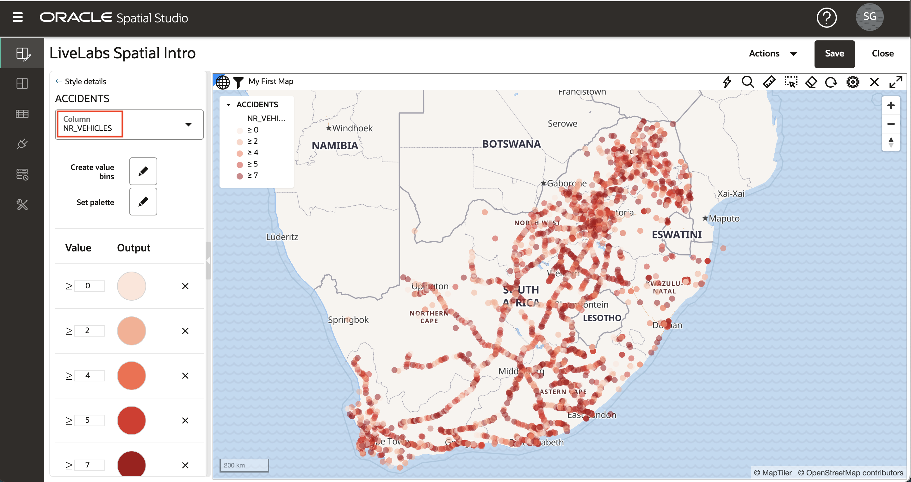
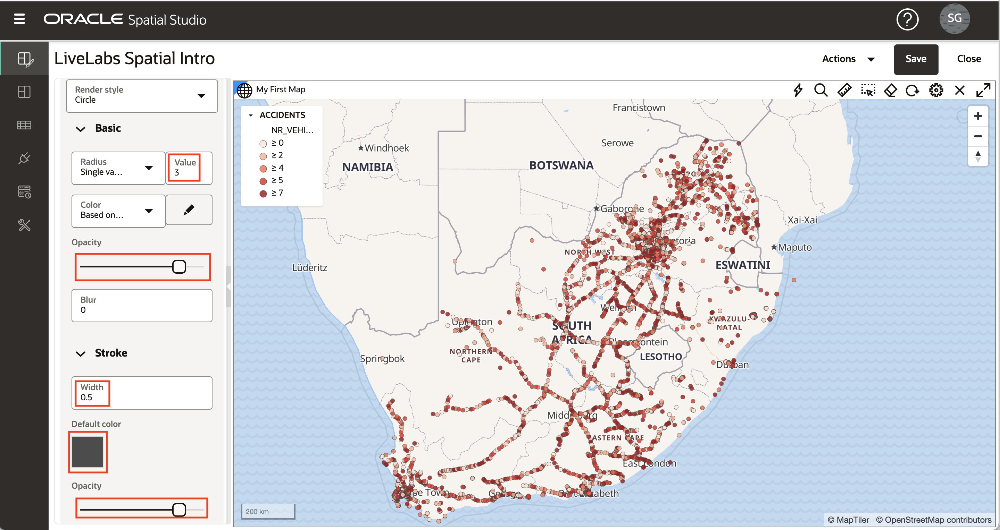
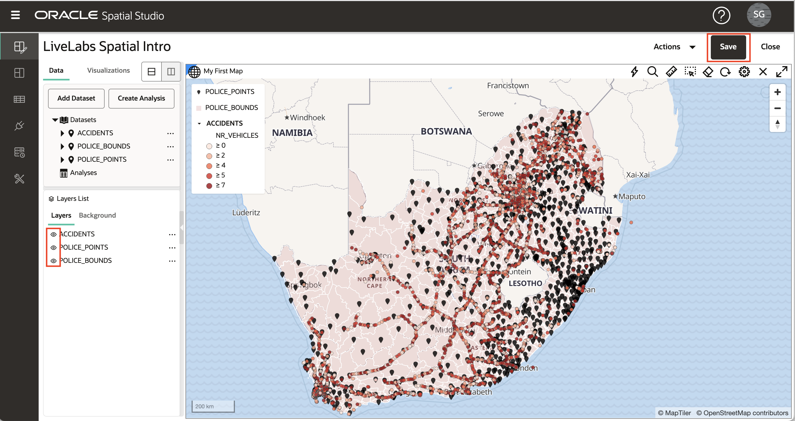

# Aplicar estilo de asignación

## Introducción

Spatial Studio le permite personalizar el "look and feel" y la interactividad de sus capas de mapa. El estilo de una capa de mapa incluye opciones como color, transparencia y, en el caso de los puntos, marcadores. El estilo también puede ser controlado automáticamente por valores de datos ("estilo basado en datos"), de modo que el color y/o el tamaño del marcador se basa en valores de datos. Por ejemplo, esto le permite representar regiones de ventas con colores basados en ingresos. La interactividad se refiere a lo que sucede cuando un usuario hace clic o se desplaza sobre un elemento en una capa de mapa. Esto incluye mostrar un consejo de herramienta y/o abrir una ventana emergente con valores de datos para el elemento. En este laboratorio, explorará algunas de estas funciones de estilo e interactividad.

Tiempo de laboratorio estimado: 30 minutos

### Objetivos

*   Comprensión de los estilos de representación
*   Descripción del estilo basado en datos
*   Aprende a usar esquemas de color
*   Aprender a configurar la interactividad de las capas de mapa

### Requisitos

*   Laboratorio 2 completado correctamente: Crear proyecto

## Tarea 1: Navegar al estilo

1.  En el menú del panel izquierdo, navegue hasta la página Projects. Abra el menú de acción de la introducción espacial LiveLabs y seleccione **Abrir**. 
    
2.  Para centrarse en la capa ACCIDENTS, apague las 2 capas de policía en el mapa haciendo clic en los controles de visibilidad (es decir, iconos de globo ocular azul). 
    
3.  Como hizo en la práctica anterior, abra el menú de acción para ACCIDENTS y seleccione **Settings** (Configuración).
    

## Tarea 2: Aplicar estilo de cluster

1.  Las capas de puntos, como ACCIDENTS, se pueden representar mediante varios estilos de presentación. Cada estilo de presentación tiene su propia configuración. Cambie el estilo de presentación de Circle (valor por defecto) a Cluster. 
    
2.  El mapa ahora muestra ACCIDENTES usando círculos para representar numerosos puntos agrupados en áreas. El tamaño del círculo del cluster se basa en el número de puntos agrupados en cada área. Puede experimentar con el color y el estilo de las etiquetas de texto que representan el número de puntos en cada cluster.  Observe que, al acercar (rotar la rueda del mouse), los clusters se desglosan en clusters más pequeños y viceversa a medida que se aleja. 
    

## Tarea 3: Aplicar estilo de mapa de calor

1.  Cambie el estilo de presentación del cluster a Heatmap. El mapa ahora presenta ACCIDENTES con colores continuos basados en la concentración de puntos. Los colores calientes representan la concentración de puntos, y los colores fríos representan la dispersión de puntos. Un parámetro clave del estilo de mapa de calor es Radio, que controla la distancia alrededor de cada punto para definir una concentración. El radio predeterminado es tan grande que el mapa de calor inicial solo muestra las concentraciones puntuales a lo largo de las carreteras, lo cual no es muy útil.  Para enfocar nuestro mapa de calor en concentraciones más localizadas, reduzca el radio del predeterminado a 10 y observe una vista más localizada de las concentraciones puntuales. 

## Tarea 4: Aplicar estilo basado en datos

1.  Cambie el estilo de representación de Heatmap a Circle. Al utilizar el estilo de representación Circle, tanto el radio como el color se pueden controlar mediante valores de datos. Tire hacia abajo del menú Color y seleccione "Basado en datos". 
    
2.  Ahora puede seleccionar la columna que desea utilizar para controlar el estilo. Seleccione la columna NR\_VEHICLES (es decir, el número de vehículos implicados en el accidente) y observe que los ACCIDENTES pasan a estar codificados por colores. Puede aceptar los otros valores por defecto y, a continuación, hacer clic en el enlace **Atrás** en la parte superior del panel de detalles Estilo. 
    
3.  Ahora que ha asignado colores basados en valores de datos, finalice el estilo definiendo el radio en 3 y Opacidad en 90%. Además, actualice los valores de Trazo (es decir, contorno): establezca Ancho en 0,5, Color en gris y Opacidad en 90%. Por supuesto, puede elegir sus propios valores para estos si lo prefiere. A continuación, haga clic en el enlace **Atrás** para volver a la lista Capas. 
    

## Tarea 5: Aplicar estilo de símbolo

1.  A continuación, utilizará la opción de estilo de punto restante, Símbolo, para la capa POLICE\_POINTS. Active la capa POLICE\_POINTS y desactive las otras 2 capas del mapa haciendo clic en los controles de visibilidad (es decir, iconos de globo ocular). Abra el menú de acción de POLICE\_POINTS y seleccione **Configuración**.
    
    Cambie Render Style a Symbol y, a continuación, haga clic en el cuadro de texto Image para abrir el cuadro de diálogo Symbol selection. Seleccione **marcador** y actualice la opacidad al 90% y el factor de tamaño a 0,6. Por supuesto, puede elegir sus propios valores para estos si lo prefiere. A continuación, haga clic en el enlace **Atrás** para volver a la lista Capas. 
    

## Tarea 6: Aplicación de la interactividad

1.  Haga clic en el icono de hamburguesa de la capa POLICE\_BOUNDS y seleccione **Configuración**. En el menú desplegable Configurar, seleccione el separador **Interacción**. El primer tipo de interactividad que configuramos para una capa es la capacidad de seleccionar un elemento (s). Las selecciones se utilizan para análisis, por ejemplo, cuando queremos identificar los elementos incluidos en una región seleccionada. De forma predeterminada, la opción seleccionable está activada. Haga clic en las regiones POLICE\_BOUNDS y observe la selección resaltada.
    
    
    
2.  A continuación, configure las pistas, es decir, una ventana emergente que se muestra al pasar el mouse sobre un elemento. De forma predeterminada, las pistas están desactivadas. Pase el cursor sobre una región POLICE\_BOUNDS y observe que no ocurre nada. A continuación, en el panel Configuración, active **Mostrar pista**, seleccione una columna de pista, pase el mouse sobre una región y observe la pista.
    
    
    
3.  Finalmente se configura la ventana de información, es decir, una ventana emergente que se muestra al hacer clic en un elemento. Por defecto, esta opción está desactivada. Haga clic en una región POLICE\_BOUNDS y no se mostrará ninguna ventana de información. A continuación, active la **ventana Mostrar información**, seleccione las columnas que desea mostrar, haga clic en una región POLICE\_BOUNDS y observe la ventana de información que se muestra.
    

## Tarea 7: Guardar cambios

1.  Haga clic en el enlace **Atrás** y, a continuación, haga clic en el botón **Guardar** para guardar nuestro proyecto con los cambios de estilo. 
    
2.  Vuelva a la página Project y observe que la vista en miniatura se actualiza con los cambios. 
    
3.  Haga clic en el icono de hamburguesa del proyecto y seleccione **Abrir** (o haga clic en la vista en miniatura del proyecto) para volver al proyecto.
    

Ahora puede [proceder al siguiente laboratorio](#next).

## Más información

*   \[Portal de productos de Spatial Studio\] (https://oracle.com/goto/spatialstudio)

## Reconocimientos

*   **Autor**: David Lapp, Database Product Management, Oracle
*   **Última actualización por/fecha**: Denise Myrick, Database Product Management, abril de 2023