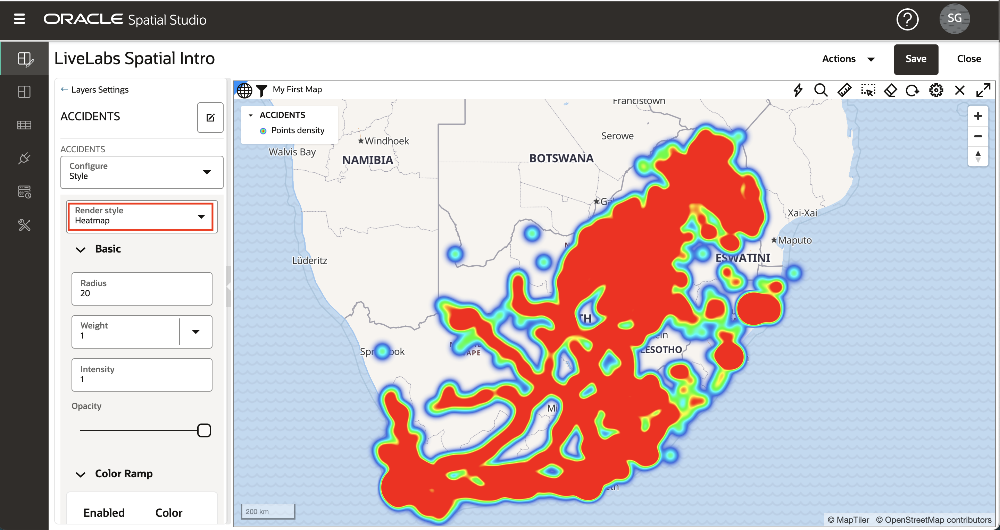
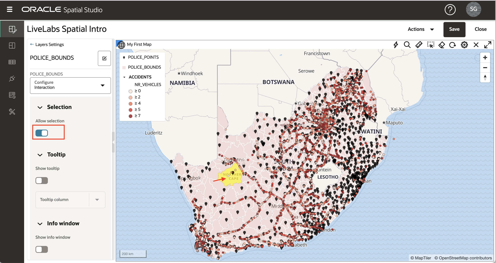

# Appliquer un style de carte

## Présentation

Spatial Studio vous permet de personnaliser l'aspect et l'interactivité de vos calques cartographiques. Le style d'un calque de carte inclut des options telles que la couleur, la transparence et, dans le cas de points, des marqueurs. Le style peut également être contrôlé automatiquement par des valeurs de données ("style axé sur les données"), de sorte que la couleur et / ou la taille du marqueur est basée sur des valeurs de données. Par exemple, cela vous permet d'afficher les régions de vente avec des couleurs basées sur le chiffre d'affaires. L'interactivité fait référence à ce qui se passe lorsqu'un utilisateur clique ou survole un élément d'une couche de carte. Cela inclut l'affichage d'une infobulle et/ou l'ouverture d'une fenêtre contextuelle avec des valeurs de données pour l'élément. Dans cet exercice, vous allez découvrir certaines de ces fonctions de style et d'interactivité.

Temps de laboratoire estimé : 30 minutes

### Objectifs

*   Compréhension des styles de rendu
*   Compréhension du style axé sur les données
*   Apprendre à utiliser les jeux de couleurs
*   Apprendre à configurer l'interactivité des couches de carte

### Prérequis

*   Atelier 2 terminé avec succès : Créer un projet

## Tâche 1 : accéder au style

1.  Dans le menu du panneau de gauche, accédez à la page Projects. Ouvrez le menu d'actions de LiveLabs Spatial Intro et sélectionnez **Ouvrir**. 
    
2.  Pour vous concentrer sur la couche ACCIDENTS, désactivez les 2 couches de police de la carte en cliquant sur les commandes de visibilité (c'est-à-dire les icônes bleues du globe oculaire). 
    
3.  Comme dans l'exercice précédent, ouvrez le menu d'actions ACCIDENTS et sélectionnez **Settings**.
    

## Tâche 2 : Appliquer le style de cluster

1.  Les calques de points, tels que ACCIDENTS, peuvent être rendus à l'aide de différents styles de rendu. Chaque style de rendu a ses propres paramètres. Remplacez le style de rendu Circle (valeur par défaut) par Cluster. 
    
2.  La carte affiche maintenant ACCIDENTS en utilisant des cercles pour représenter de nombreux points regroupés dans des zones. La taille du cercle de cluster est basée sur le nombre de points regroupés dans chaque zone. Vous pouvez expérimenter la couleur et le style des libellés de texte représentant le nombre de points dans chaque cluster.  Notez qu'au fur et à mesure que vous effectuez un zoom avant (rotation de la molette de la souris), les clusters explosent en petits clusters, et inversement au fur et à mesure que vous effectuez un zoom arrière. 
    

## Tâche 3 : Appliquer le style de carte d'activité

1.  Remplacez le style de rendu Cluster par Heatmap. La carte affiche désormais les ACCIDENTS avec des couleurs continues en fonction de la concentration des points. Les couleurs chaudes représentent la concentration des points et les couleurs froides représentent la dispersion des points. Un paramètre clé du style de carte thermique est Radius, qui contrôle la distance autour de chaque point pour définir une concentration. Le rayon par défaut est si grand que la carte thermique initiale ne montre que les concentrations de points le long des routes, ce qui n'est pas très utile.  Pour concentrer notre carte thermique sur des concentrations plus localisées, réduisez le rayon de la valeur par défaut à 10 et observez une vue plus localisée des concentrations de points. 

## Tâche 4 : Appliquer un style basé sur les données

1.  Remplacez le style de rendu Heatmap par Circle. Lorsque vous utilisez le style de rendu Cercle, le rayon et la couleur peuvent être contrôlés par des valeurs de données. Faites défiler le menu Color (Couleur) et sélectionnez "Based on data" (Basé sur les données). 
    
2.  Vous sélectionnez maintenant la colonne à utiliser pour contrôler le style. Sélectionnez la colonne NR\_VEHICLES (c'est-à-dire le nombre de véhicules impliqués dans l'accident) et observez que les ACCIDENTS sont codés en couleur. Vous pouvez accepter les autres valeurs par défaut, puis cliquer sur le lien **Précédent** en haut du panneau Détails du style. 
    
3.  Maintenant que vous avez affecté des couleurs en fonction des valeurs de données, finalisez le style en définissant le rayon sur 3 et l'opacité sur 90 %. Mettez également à jour les valeurs de trait (c.-à-d. contour) : définissez Largeur sur 0,5, Couleur sur gris et Opacité sur 90 %. Vous pouvez bien sûr choisir vos propres valeurs pour ceux-ci si vous préférez. Cliquez ensuite sur le lien **Précédent** pour revenir à la liste des couches. 
    

## Tâche 5 : Appliquer un style de symbole

1.  Vous utiliserez ensuite l'option de style de point restante, Symbole, pour la couche POLICE\_POINTS. Activez le calque POLICE\_POINTS et désactivez les 2 autres calques de la carte en cliquant sur les contrôles de visibilité (c'est-à-dire les icônes de globe oculaire). Ouvrez le menu d'action pour POLICE\_POINTS et sélectionnez **Paramètres**.
    
    Définissez le style de rendu sur Symbole, puis cliquez dans la zone de texte Image pour ouvrir la boîte de dialogue de sélection Symbole. Sélectionnez **marqueur** et mettez à jour l'opacité à 90 % et le facteur de taille à 0,6. Vous pouvez bien sûr choisir vos propres valeurs pour ceux-ci si vous préférez. Cliquez ensuite sur le lien **Précédent** pour revenir à la liste des couches. 
    

## Tâche 6 : Appliquer l'interactivité

1.  Cliquez sur l'icône de menu latéral pour la couche POLICE\_BOUNDS et sélectionnez **Paramètres**. Dans le menu déroulant Configurer, sélectionnez l'onglet **Interaction**. Le premier type d'interactivité que nous configurons pour un calque est la possibilité de sélectionner un ou plusieurs éléments. Les sélections sont utilisées pour les analyses, par exemple pour identifier les éléments contenus dans une région sélectionnée. Par défaut, l'option sélectionnable est activée. Cliquez dans les régions POLICE\_BOUNDS et observez la sélection mise en surbrillance.
    
    
    
2.  Configurez ensuite les infobulles, c'est-à-dire une fenêtre contextuelle qui s'affiche lorsque vous passez le curseur de la souris sur un élément. Par défaut, les info-bulles sont désactivées. Positionnez le pointeur de la souris sur une région POLICE\_BOUNDS et notez que rien ne se passe. Dans le panneau Paramètres, activez ensuite **Afficher l'info-bulle**, sélectionnez une colonne d'info-bulle, placez le pointeur de la souris sur une région et observez l'info-bulle.
    
    
    
3.  Enfin, vous configurez la fenêtre d'informations, c'est-à-dire une fenêtre contextuelle qui s'affiche lorsque vous cliquez sur un élément. Par défaut, cette option est désactivée. Cliquez dans une région POLICE\_BOUNDS et aucune fenêtre d'informations n'est affichée. Activez ensuite **Afficher la fenêtre d'informations**, sélectionnez les colonnes à afficher, cliquez dans les régions POLICE\_BOUNDS et observez la fenêtre d'informations affichée.
    

## Tâche 7 : enregistrer les modifications

1.  Cliquez sur le lien **Précédent**, puis sur le bouton **Enregistrer** pour enregistrer notre projet avec les modifications de style. 
    
2.  Revenez à la page Projet et observez que la miniature est mise à jour avec les modifications. 
    
3.  Cliquez sur l'icône de menu latéral du projet et sélectionnez **Ouvrir** (ou cliquez sur la miniature du projet) pour revenir au projet.
    

Vous pouvez maintenant [passer à l'exercice suivant](#next).

## En savoir plus

*   \[Portail produit Spatial Studio\] (https://oracle.com/goto/spatialstudio)

## Accusés de réception

*   **Auteur** - David Lapp, Database Product Management, Oracle
*   **Dernière mise à jour par/date** - Denise Myrick, Database Product Management, avril 2023