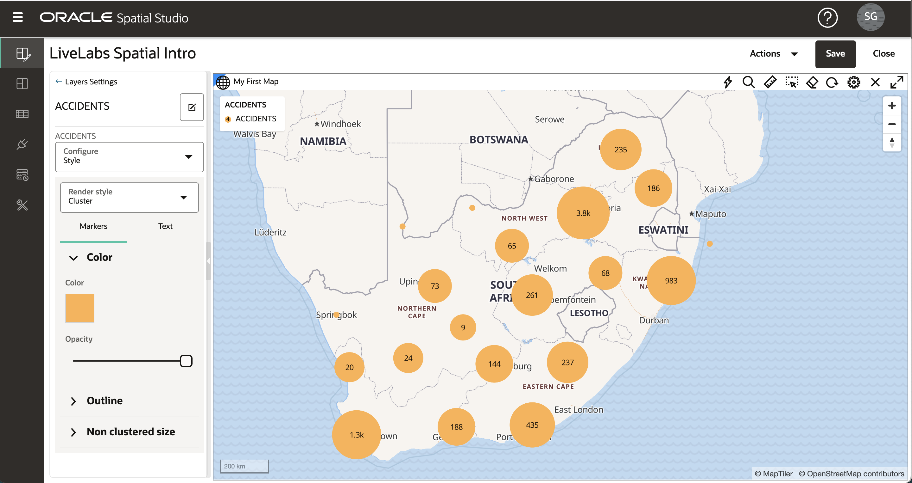
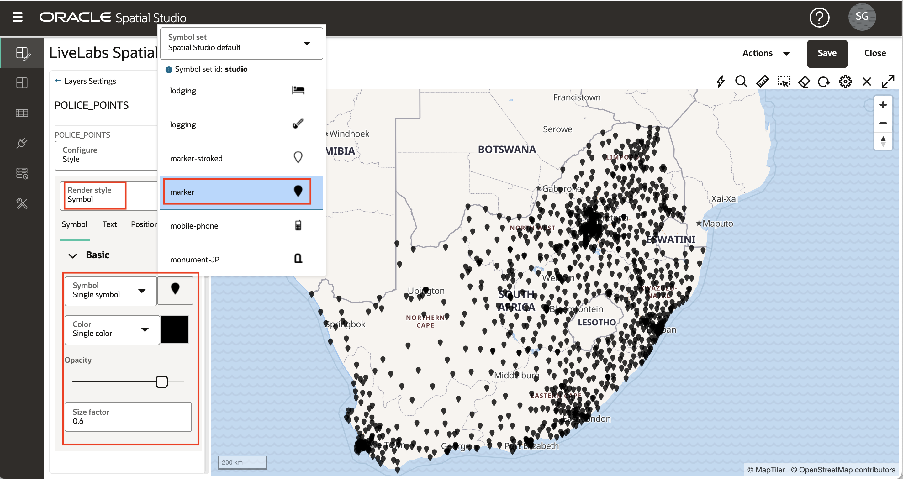

# マップ・スタイルの適用

## 概要

Spatial Studioでは、マップ・レイヤーのルック・アンド・フィールと対話性をカスタマイズできます。マップ・レイヤーのスタイル設定には、色、透明度、ポイントの場合はマーカーなどのオプションがあります。スタイリングは、データ値(データドリブン・スタイリング)によって自動的に制御され、色またはマーカー・サイズ(あるいはその両方)がデータ値に基づきます。たとえば、売上に基づいて販売地域を色で表示できます。対話性とは、ユーザーがマップ・レイヤーのアイテムをクリックまたはホバーした場合の動作を指します。これには、ツールチップの表示や、アイテムのデータ値を含むポップアップ・ウィンドウのオープンが含まれます。この演習では、これらのスタイリングおよび対話機能の一部を確認します。

推定ラボ時間: 30分

### 目標

*   レンダリング・スタイルの理解
*   データ駆動型スタイルの理解
*   カラースキームの使い方
*   マップ・レイヤーの対話性を構成する方法を学習します

### 前提条件

*   演習2: プロジェクトの作成が正常に完了

## タスク1: スタイリングへのナビゲート

1.  左パネルのメニューから、「プロジェクト」ページに移動します。LiveLabs Spatial Introのアクション・メニューを開き、**「開く」**を選択します。 
    
2.  ACCIDENTSレイヤーに焦点を当てるには、可視性コントロール(青い眼球アイコン)をクリックして、マップ内の2つの警察レイヤーをオフにします。 
    
3.  前の演習で行ったように、ACCIDENTSのアクション・メニューを開き、**「設定」**を選択します。
    

## タスク2: クラスタ・スタイルの適用

1.  ACCIDENTSなどのポイント・レイヤーは、様々なレンダリング・スタイルを使用してレンダリングできます。各レンダリング スタイルには独自の設定があります。レンダリング スタイルをCircle (デフォルト)からClusterに変更します。 
    
2.  マップには、円を使用して、エリアでクラスタ化された多数のポイントを表すACCIDENTSが表示されるようになりました。クラスタの円のサイズは、各領域でクラスタ化された点数に基づきます。各クラスタのポイント数を表すテキスト・ラベルの色とスタイルを試すことができます。ズーム・イン(マウス・ホイールを回転)すると、クラスタが小さいクラスタに展開され、その逆もズーム・アウトされることを確認します。 
    

## タスク3: ヒートマップ・スタイルの適用

1.  「レンダリング・スタイル」を「クラスタ」から「ヒートマップ」に変更します。このマップでは、ポイントの濃度に基づいて連続した色でACCIDENTSがレンダリングされるようになりました。ホットカラーはポイントの濃度を表し、クールカラーはポイントのスパーシティを表します。ヒートマップ・スタイルのキー・パラメータは「半径」で、濃度を定義するために各点の周りの距離を制御します。デフォルトの半径は非常に大きいため、初期ヒートマップでは道路に沿った点濃度のみが表示されますが、これはあまり役に立ちません。 ヒートマップをより局所的な濃度に集中するには、半径をデフォルトから10に減らし、点濃度のより局所的なビューを確認します。 

## タスク4: データドリブン・スタイルの適用

1.  \[レンダリング スタイル\]を\[ヒートマップ\]から\[円\]に変更します。Circleレンダリング スタイルを使用する場合、半径と色の両方をデータ値で制御できます。「色」メニューをプルダウンし、「データに基づく」を選択します。 
    
2.  ここで、スタイル設定の制御に使用する列を選択します。NR\_VEHICLES列(事故に関与する車両の数)を選択し、ACCIDENTSが色分けされることを確認します。他のデフォルト値を受け入れ、スタイルの詳細パネルの上部にある**「戻る」**リンクをクリックします。 
    
3.  データ値に基づいて色を割り当てたので、「半径」を3に、「不透明度」を90%に設定してスタイルを確定します。また、「ストローク」(アウトライン)の値を更新します。「幅」を0.5、「色」を灰色、「不透明度」を90%に設定します。必要に応じて、これらの値に独自の値を選択できます。次に、**「戻る」**リンクをクリックしてレイヤー・リストに戻ります。 
    

## タスク5: 記号スタイルの適用

1.  次に、POLICE\_POINTSレイヤーの残りの点スタイル・オプション「記号」を使用します。POLICE\_POINTSレイヤーをオンにし、可視性コントロール(眼球アイコン)をクリックしてマップ内の他の2つのレイヤーをオフにします。POLICE\_POINTSのアクション・メニューを開き、**「設定」**を選択します。
    
    \[レンダリング スタイル\]を\[シンボル\]に変更し、\[イメージ\]テキスト ボックス内をクリックして、\[シンボル選択\]ダイアログ ボックスを開きます。**「マーカー」**を選択し、「不透明度」を90%、サイズ係数を0.6に更新します。必要に応じて、これらの値に独自の値を選択できます。次に、**「戻る」**リンクをクリックしてレイヤー・リストに戻ります。 
    

## タスク6: 対話性の適用

1.  レイヤーPOLICE\_BOUNDSのハンバーガー・アイコンをクリックし、**「設定」**を選択します。「構成」プルダウン・メニューで、**「相互作用」**タブを選択します。レイヤーに対して構成する最初のタイプの対話性は、アイテムを選択する機能です。選択は、分析に使用されます。たとえば、選択したリージョン内に含まれる項目を識別します。デフォルトでは、選択可能なオプションはオンになっています。POLICE\_BOUNDSリージョン内をクリックし、強調表示された選択を確認します。
    
    
    
2.  次に、ツールチップ(アイテムにカーソルを置くと表示されるポップアップ)を構成します。デフォルトでは、ツールチップは無効になっています。POLICE\_BOUNDSリージョンにマウス・ポインタを重ねると、何も起こらないことがわかります。次に、「設定」パネルで**「ツールチップの表示」**を有効にし、ツールチップ列を選択して、マウスをリージョンの上に置き、ツールチップを確認します。
    
    
    
3.  最後に、情報ウィンドウ(アイテムをクリックしたときに表示されるポップアップ)を構成します。デフォルトでは、このオプションはオフです。POLICE\_BOUNDSリージョン内をクリックし、情報ウィンドウが表示されないことを確認します。次に、**「情報ウィンドウの表示」**をオンにし、表示する列を選択し、POLICE\_BOUNDSリージョン内をクリックして、表示される情報ウィンドウを確認します。
    

## タスク7: 変更の保存

1.  **「戻る」**リンクをクリックし、**「保存」**ボタンをクリックして、スタイルの変更とともにプロジェクトを保存します。 
    
2.  「プロジェクト」ページに戻り、サムネイルが変更で更新されていることを確認します。 
    
3.  プロジェクトのハンバーガー・アイコンをクリックし、**「開く」**(またはプロジェクトのサムネイルをクリック)を選択してプロジェクトに戻ります。
    

[次の演習に進む](#next)ことができます。

## さらに学ぶ

*   \[Spatial Studio製品ポータル\] (https://oracle.com/goto/spatialstudio)

## 謝辞

*   **著者** - Oracle、データベース製品管理、David Lapp氏
*   **最終更新者/日付** - Denise Myrick、Database Product Management、2023年4月