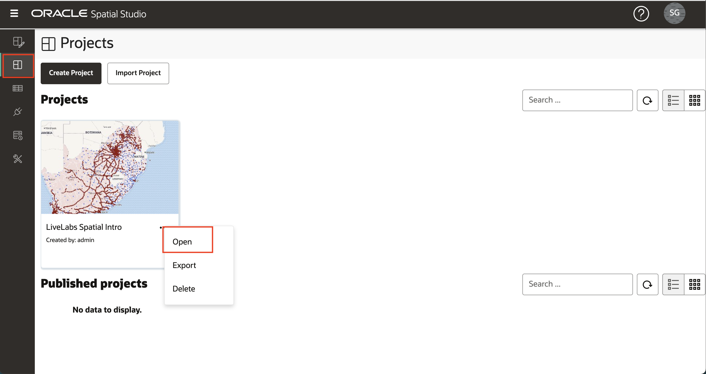
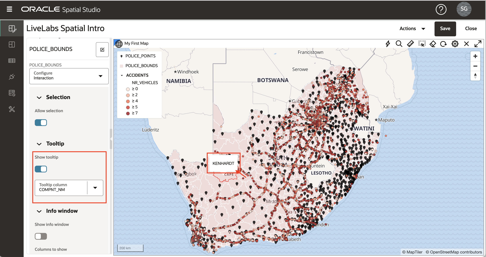

# 맵 스타일 적용

## 소개

Spatial Studio를 사용하면 맵 레이어의 "모양과 느낌"과 상호 작용을 사용자 정의할 수 있습니다. 맵 레이어 스타일 지정에는 색상, 투명도 및 점의 경우 마커와 같은 옵션이 포함됩니다. 스타일 지정은 데이터 값("데이터 기반 스타일 지정")에 의해 자동으로 제어되므로 색상 및/또는 마커 크기가 데이터 값을 기반으로 합니다. 예를 들어 매출을 기준으로 영업 지역을 색상으로 렌더링할 수 있습니다. 대화형 작업은 사용자가 맵 레이어의 항목을 클릭하거나 가리킬 때 발생하는 작업을 나타냅니다. 여기에는 도구 설명을 표시하거나 항목에 대한 데이터 값이 포함된 팝업 창을 여는 작업이 포함됩니다. 이 실습에서는 이러한 스타일 및 상호 작용 기능 중 일부를 살펴봅니다.

예상 실험 시간: 30분

### 목표

*   렌더링 스타일 이해
*   데이터 중심 스타일 지정 이해
*   색 구성표 사용 방법 알아보기
*   맵 층의 상호 작용 구성 방법 알아보기

### 필요 조건

*   실습 2: 프로젝트 생성을 성공적으로 완료했습니다.

## 작업 1: 스타일 지정으로 이동

1.  왼쪽 패널 메뉴에서 프로젝트 페이지로 이동합니다. LiveLabs 공간 소개에 대한 작업 메뉴를 열고 **열기**를 선택합니다. 
    
2.  ACCIDENTS 레이어에 초점을 맞추려면 가시성 컨트롤(즉, 파란색 안구 아이콘)을 클릭하여 지도에서 두 개의 경찰 레이어를 끕니다. 
    
3.  이전 연습에서와 마찬가지로 ACCIDENTS의 작업 메뉴를 열고 **설정**을 선택합니다.
    

## 작업 2: 클러스터 스타일 적용

1.  ACCIDENTS와 같은 점 도면층은 다양한 렌더 스타일을 사용하여 렌더링할 수 있습니다. 각 렌더 스타일에는 고유한 설정이 있습니다. 렌더 스타일을 원(기본값)에서 클러스터로 변경합니다. 
    
2.  이제 맵에 원을 사용하여 ACCIDENTS가 표시되어 영역에 클러스터화된 여러 점을 나타냅니다. 클러스터 원 크기는 각 영역에서 클러스터화된 점 수를 기준으로 합니다. 각 클러스터의 점 수를 나타내는 텍스트 레이블의 색상과 스타일을 실험할 수 있습니다.  확대할 때(마우스 휠 회전) 클러스터가 더 작은 클러스터로 폭발하고 축소할 때 그 반대의 경우도 마찬가지입니다. 
    

## 작업 3: 히트맵 스타일 적용

1.  렌더 스타일을 클러스터에서 히트맵으로 변경합니다. 이제 맵은 점의 농도에 따라 연속 색상으로 ACCIDENTS를 렌더링합니다. 핫 색상은 점의 농도를 나타내고 쿨 색상은 점의 희소성을 나타냅니다. 히트맵 스타일의 주요 매개변수는 농도를 정의하기 위해 각 점 주위의 거리를 제어하는 반지름입니다. 기본 반지름이 너무 커서 초기 히트맵이 도로를 따라 점 농도를 표시하기만 하면 매우 유용하지 않습니다.  히트맵을 보다 지역화된 농도에 집중하려면 기본값에서 10으로 반지름을 줄이고 점 농도의 지역화된 뷰를 관찰합니다. 

## 작업 4: 데이터 중심 스타일 적용

1.  렌더 스타일을 히트맵에서 원으로 변경합니다. 원 렌더 스타일을 사용할 때 반지름과 색상은 모두 데이터 값으로 제어할 수 있습니다. Color 메뉴를 풀다운하고 "Based on data"를 선택합니다. 
    
2.  이제 스타일 지정을 제어하는 데 사용할 열을 선택합니다. NR\_VEHICLES 열(즉, 사고와 관련된 차량 수)을 선택하고 ACCIDENTS가 색상으로 구분되는지 확인합니다. 다른 기본값을 적용한 다음 \[스타일 세부정보\] 패널 상단에 있는 **뒤로** 링크를 누를 수 있습니다. 
    
3.  이제 데이터 값을 기준으로 색상을 지정했으므로 반지름을 3으로, 불투명도를 90%로 설정하여 스타일을 완성합니다. 또한 획(즉, 윤곽선) 값을 업데이트합니다. Width를 0.5, Color를 회색, Opacity를 90%로 설정합니다. 물론 원하는 경우 이러한 값을 선택할 수 있습니다. 그런 다음 **뒤로** 링크를 눌러 \[레이어 목록\]으로 돌아갑니다. 
    

## 작업 5: 기호 스타일 적용

1.  다음으로 POLICE\_POINTS 레이어에 대해 나머지 점 스타일 옵션인 기호를 사용합니다. 가시성 컨트롤(즉, 아이볼 아이콘)을 눌러 POLICE\_POINTS 레이어를 켜고 맵의 다른 두 레이어를 끕니다. POLICE\_POINTS의 작업 메뉴를 열고 **설정**을 선택합니다.
    
    렌더 스타일을 기호로 변경한 다음 이미지 텍스트 상자 내부를 클릭하여 기호 선택 대화상자를 엽니다. **표시자**를 선택하고 불투명도를 90%로, 크기 계수를 0.6으로 업데이트합니다. 물론 원하는 경우 이러한 값을 선택할 수 있습니다. 그런 다음 **뒤로** 링크를 눌러 \[레이어 목록\]으로 돌아갑니다. 
    

## 작업 6: 상호 작용 적용

1.  POLICE\_BOUNDS 계층에 대한 햄버거 아이콘을 누르고 **설정**을 선택합니다. 구성 풀다운 메뉴에서 **상호 작용** 탭을 선택합니다. 레이어에 대해 구성하는 첫 번째 대화형 유형은 항목을 선택하는 기능입니다. 선택 항목은 분석에 사용됩니다(예: 선택한 영역에 포함된 항목을 식별하려는 경우). 기본적으로 선택 가능한 옵션은 on입니다. POLICE\_BOUNDS 영역 내부를 누르고 강조 표시된 선택 사항을 확인합니다.
    
    
    
2.  다음으로 툴팁, 즉 항목을 가리킬 때 표시되는 팝업을 구성합니다. 기본적으로 툴팁은 사용 안함으로 설정됩니다. POLICE\_BOUNDS 영역에 마우스를 갖다 대면 아무 일도 발생하지 않습니다. 그런 다음 \[설정\] 패널에서 **도구 설명 표시**를 사용으로 설정하고, 도구 설명 열을 선택하고, 영역 위로 마우스를 가져가서 도구 설명을 확인합니다.
    
    
    
3.  마지막으로 정보 창을 구성합니다. 즉, 항목을 누르면 팝업이 표시됩니다. 기본적으로 이 옵션은 해제되어 있습니다. POLICE\_BOUNDS 영역을 누르고 표시되는 정보 창이 없는지 확인합니다. 그런 다음 **정보 창 표시**를 설정하고 표시할 열을 선택한 다음 POLICE\_BOUNDS 영역 내부를 누르고 표시되는 정보 창을 확인합니다.
    

## 작업 7: 변경사항 저장

1.  **뒤로** 링크를 누른 다음 **저장** 단추를 눌러 스타일을 변경하여 프로젝트를 저장합니다. 
    
2.  Project 페이지로 돌아가서 작은 그림이 변경 사항으로 갱신되는지 확인합니다. 
    
3.  프로젝트에 대한 햄버거 아이콘을 누르고 **열기**(또는 프로젝트 축소판)를 선택하여 프로젝트로 돌아갑니다.
    

이제 [다음 실습을 진행하십시오](#next).

## 자세히 알아보기

*   \[Spatial Studio 제품 포털\] (https://oracle.com/goto/spatialstudio)

## 확인

*   **작성자** - David Lapp, Oracle 데이터베이스 제품 관리
*   **최종 업데이트 기한/일자** - Denise Myrick, 데이터베이스 제품 관리, 2023년 4월