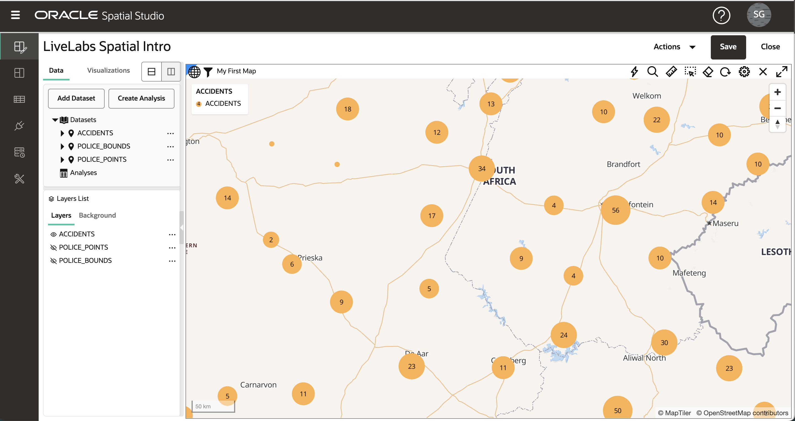

# Aplicar Estilo de Mapa

## Introdução

O Spatial Studio permite que você personalize a "aparência" e a interatividade de suas camadas de mapas. O estilo de uma camada de mapa inclui opções como cor, transparência e, no caso de pontos, marcadores. O estilo também pode ser controlado automaticamente por valores de dados ("estilização orientada por dados"), de modo que a cor e/ou o tamanho do marcador sejam baseados em valores de dados. Por exemplo, isso permite renderizar regiões de vendas com cores com base na receita. Interatividade refere-se ao que acontece quando um usuário clica ou passa o mouse sobre um item em uma camada de mapa. Isso inclui exibir uma dica de ferramenta e/ou abrir uma janela pop-up com valores de dados para o item. Neste laboratório, você explora alguns desses recursos de estilo e interatividade.

Tempo de Laboratório Estimado: 30 minutos

### Objetivos

*   Compreensão dos estilos de renderização
*   Compreensão do estilo orientado por dados
*   Saiba como usar esquemas de cores
*   Saiba como configurar a interatividade das camadas de mapas

### Pré-requisitos

*   Laboratório 2 concluído com sucesso: Criar Projeto

## Tarefa 1: Navegar até o estilo

1.  No menu do painel esquerdo, navegue até a página Projects. Abra o menu de ação para LiveLabs Introdução Espacial e selecione **Abrir**. 
    
2.  Para se concentrar na camada ACCIDENTS, desative as 2 camadas policiais no mapa clicando nos controles de visibilidade (ou seja, ícones de globo ocular azul). 
    
3.  Como você fez no laboratório anterior, abra o menu de ação para ACCIDENTS e selecione **Configurações**.
    

## Tarefa 2: Aplicar estilo de cluster

1.  As camadas de pontos, como ACCIDENTS, podem ser renderizadas usando vários estilos de renderização. Cada estilo de renderização tem suas próprias configurações. Altere o estilo de renderização de Círculo (o padrão) para Cluster. 
    
2.  O mapa agora exibe ACIDENTES usando círculos para representar vários pontos agrupados em áreas. O tamanho do círculo do cluster é baseado no número de pontos agrupados em cada área. Você pode experimentar a cor e o estilo dos rótulos de texto que representam o número de pontos em cada cluster.  Observe que, à medida que você amplia (roda do mouse) os clusters explodem em clusters menores e vice-versa à medida que você diminui o zoom. 
    

## Tarefa 3: Aplicar estilo de heatmap

1.  Altere o Estilo de Renderização de Cluster para Heatmap. O mapa agora torna ACCIDENTS com cores contínuas com base na concentração de pontos. As cores quentes representam a concentração de pontos, e as cores frias representam a escassez de pontos. Um parâmetro chave do estilo Heatmap é Radius, que controla a distância em torno de cada ponto para definir uma concentração. O raio padrão é tão grande que o mapa de calor inicial mostra apenas concentrações de pontos ao longo das estradas, o que não é muito útil.  Para concentrar nosso mapa de calor em concentrações mais localizadas, reduza o raio do padrão para 10 e observe uma visão mais localizada das concentrações de pontos. 

## Tarefa 4: Aplicar estilo orientado por dados

1.  Altere o estilo de renderização do mapa de calor para o círculo. Ao usar o estilo de renderização Circle, tanto o raio quanto a cor podem ser controlados por valores de dados. Acesse o menu Cor e selecione "Baseado em dados". 
    
2.  Agora você seleciona a coluna a ser usada para controlar o estilo. Selecione a coluna NR\_VEHICLES (ou seja, o número de veículos envolvidos no acidente) e observe que os ACIDENTES se tornam codificados por cores. Você pode aceitar os outros valores padrão e clicar no link **Voltar** na parte superior do painel de detalhes Estilo. 
    
3.  Agora que você atribuiu cores com base nos valores de dados, finalize o estilo definindo o Raio como 3 e a Opacidade como 90%. Além disso, atualize os valores de AVC (ou seja, contorno): defina Largura como 0,5, Cor como cinza e Opacidade como 90%. É claro que você pode escolher seus próprios valores para eles, se preferir. Em seguida, clique no link **Voltar** para retornar à Lista de Camadas. 
    

## Tarefa 5: Aplicar estilo de símbolo

1.  Em seguida, você usará a opção de estilo de ponto restante, Símbolo, para a camada POLICE\_POINTS. Ative a camada POLICE\_POINTS e desative as outras 2 camadas no mapa clicando nos controles de visibilidade (ou seja, ícones de globo ocular). Abra o menu de ação para POLICE\_POINTS e selecione **Definições**.
    
    Altere o Estilo de Renderização para Símbolo e clique dentro da caixa de texto Imagem para abrir a caixa de diálogo de seleção Símbolo. Selecione **marcador** e atualize a Opacidade para 90% e o fator Tamanho para 0,6. É claro que você pode escolher seus próprios valores para eles, se preferir. Em seguida, clique no link **Voltar** para retornar à Lista de Camadas. 
    

## Tarefa 6: Aplicar interatividade

1.  Clique no ícone de hambúrguer da camada POLICE\_BOUNDS e selecione **Definições**. No menu suspenso Configurar, selecione a guia **Interação**. O primeiro tipo de interatividade que configuramos para uma camada é a capacidade de selecionar um item (s). As seleções são usadas para análises, por exemplo, onde queremos identificar os itens contidos em uma região selecionada. Por padrão, a opção selecionável está ativada. Clique dentro das regiões POLICE\_BOUNDS e observe a seleção destacada.
    
    
    
2.  Em seguida, você configura dicas de ferramentas, ou seja, um pop-up exibido ao passar o mouse sobre um item. Por padrão, as dicas de ferramenta estão desativadas. Passe o mouse sobre uma região POLICE\_BOUNDS e observe que nada acontece. Em seguida, no painel Definições, ative **Mostrar dica de ferramenta**, selecione uma coluna de dica de ferramenta, passe o mouse sobre uma região e observe a dica de ferramenta.
    
    
    
3.  Finalmente, você configura a Janela de Informações, ou seja, um pop-up exibido ao clicar em um item. Por padrão, esta opção está desativada. Clique em uma região POLICE\_BOUNDS e observe que nenhuma janela de informações é exibida. Em seguida, ative **Mostrar janela de informações**, selecione a(s) coluna(s) a ser(em) mostrada(s), clique dentro de uma região POLICE\_BOUNDS e observe a janela de informações exibida.
    

## Tarefa 7: Salvar alterações

1.  Clique no link **Voltar** e, em seguida, clique no botão **Salvar** para salvar nosso projeto com as alterações de estilo. 
    
2.  Retorne à página Projeto e observe que a miniatura foi atualizada com alterações. 
    
3.  Clique no ícone de hambúrguer do projeto e selecione **Abrir** (ou clique na miniatura do projeto) para retornar ao projeto.
    

Agora você pode [prosseguir para o próximo laboratório](#next).

## Saiba Mais

*   \[Portal de produtos do Spatial Studio\] (https://oracle.com/goto/spatialstudio)

## Agradecimentos

*   **Autor** - David Lapp, Database Product Management, Oracle
*   **Última Atualização em/Data** - Denise Myrick, Database Product Management, abril de 2023