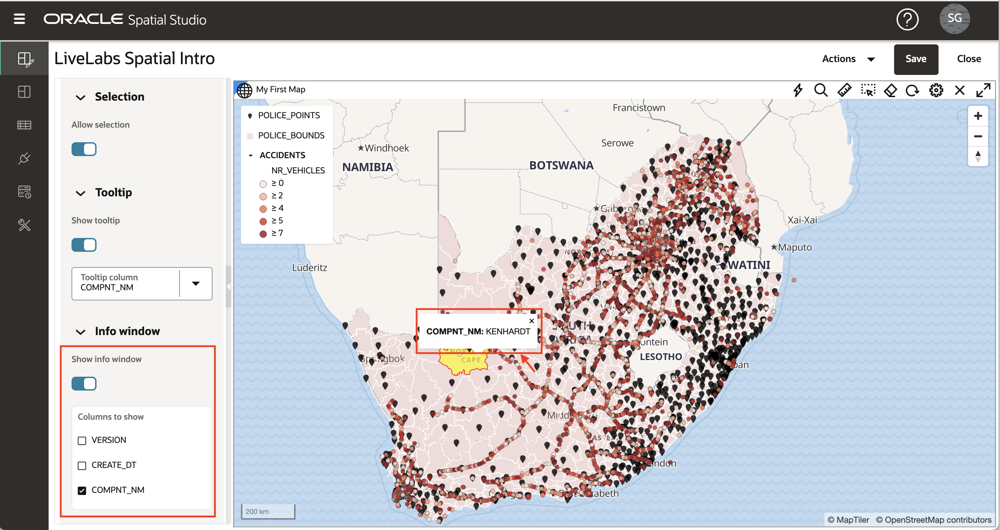

# 应用地图样式

## 简介

Spatial Studio 允许您自定义地图层的“外观和感觉”和交互性。对地图层进行样式设置包括颜色、透明度等选项，如果是点，则包括标记。样式也可以由数据值（数据驱动的样式）自动控制，因此颜色和/或标记大小基于数据值。例如，这允许您根据收入使用颜色呈现销售区域。交互性是指用户单击或将鼠标悬停在地图层中的项上时发生的情况。这包括显示工具提示和/或打开包含项数据值的弹出窗口。在此实验室中，您将了解其中一些样式和交互功能。

估计的实验室时间：30 分钟

### 目标

*   了解渲染样式
*   了解数据驱动的样式
*   了解如何使用配色方案
*   了解如何配置地图层的交互性

### 先备条件

*   成功完成实验室 2：创建项目

## 任务 1：定位至样式

1.  从左侧面板菜单中，导航到 "Projects"（项目）页面。打开 LiveLabs Spatial Intro 的操作菜单，然后选择**打开**。 
    
2.  要关注 ACCIDENTS 层，请通过单击可见性控件（即蓝眼球图标）关闭地图中的 2 个警察层。 
    
3.  与上一个练习一样，打开 ACCIDENTS 的操作菜单并选择**设置**。
    

## 任务 2：应用集群样式

1.  指针层（如 ACCIDENTS）可以使用各种呈现样式呈现。每个渲染样式都有自己的设置。将呈现样式从“圆形”（默认值）更改为“簇”。 
    
2.  该地图现在使用圆圈显示 ACCIDENTS，以表示聚集在区域的多个点。聚类圆圈大小基于每个区域中聚集的点数。您可以试验表示每个集群中点数的文本标签的颜色和样式。 请注意，当您放大（旋转鼠标滚轮）时，集群会爆炸成较小的集群，反之亦然。 
    

## 任务 3：应用热图样式

1.  将呈现样式从群集更改为热图。地图现在呈现 ACCIDENTS 与基于点的浓度连续颜色。热色表示点的浓度，冷色表示点的稀疏性。热图样式的一个关键参数是半径，它控制每个点周围的距离以定义浓度。默认半径如此之大，以至于初始热图仅显示沿道路的点浓度，这并不是非常有用。 要将热图集中于更多本地化浓度，请将半径从默认值减少到 10，并观察点浓度的本地化视图。 

## 任务 4：应用数据驱动的样式

1.  将渲染样式从热图更改为圆形。使用圆形渲染样式时，半径和颜色都可以由数据值控制。下拉“颜色”菜单并选择“基于数据”。 
    
2.  现在，您可以选择要用于控制样式的列。选择列 NR\_VEHICLES（即事故中涉及的车辆数量），并观察 ACCIDENTS 变为彩色编码。您可以接受其他默认值，然后单击样式详细信息面板顶部的**上一步**链接。 
    
3.  现在，您已根据数据值分配了颜色，通过将“半径”设置为 3，将“不透明度”设置为 90% 来完成样式。此外，更新笔划（即轮廓）值：将“宽度”设置为 0.5，“颜色”设置为灰色 ,“不透明度”设置为 90%。当然 , 如果您愿意 , 您可以选择自己的值。然后单击 **Back( 返回 )** 链接返回到 "Layers List”（层列表）。 
    

## 任务 5：应用符号样式

1.  接下来，将剩余的点样式选项 "Symbol" 用于 POLICE\_POINTS 层。打开 POLICE\_POINTS 层，然后通过单击可见性控件（即眼球图标）关闭地图中的其他 2 层。打开 POLICE\_POINTS 的操作菜单并选择**设置**。
    
    将“渲染样式”更改为“符号”，然后在“图像”文本框内单击以打开“符号选择”对话框。选择**标记**并将不透明度更新为 90%, 将大小系数更新为 0.6。当然 , 如果您愿意 , 您可以选择自己的值。然后单击 **Back( 返回 )** 链接返回到 "Layers List”（层列表）。 
    

## 任务 6：应用交互性

1.  单击层 POLICE\_BOUNDS 的汉堡图标，然后选择**设置**。在“配置”下拉菜单中，选择**交互**选项卡。我们为层配置的第一个交互类型是能够选择项目。选择用于分析，例如，我们要在其中标识选定区域中包含的项。默认情况下，可选选项处于打开状态。在 POLICE\_BOUNDS 区域内单击并观察突出显示的选择。
    
    
    
2.  接下来，配置工具提示，即悬停在某个项目上时显示的弹出窗口。默认情况下，工具提示处于禁用状态。将鼠标悬停在 POLICE\_BOUNDS 区域上，观察不会发生任何情况。然后在 "Settings"（设置）面板中启用 **Show tooltip（显示工具提示）**，选择一个工具提示列，将鼠标悬停在某个区域上，然后观察工具提示。
    
    
    
3.  最后，配置信息窗口，即单击项时显示的弹出窗口。默认情况下，此选项处于关闭状态。单击 POLICE\_BOUNDS 区域，观察未显示任何信息窗口。然后打开**显示信息窗口**，选择要显示的列，在 POLICE\_BOUNDS 区域内单击并观察显示的信息窗口。
    

## 任务 7：保存更改

1.  单击 **Back（返回）**链接，然后单击 **Save（保存）**按钮以使用样式更改保存我们的项目。 
    
2.  返回到“Project（项目）”页面，并观察缩略图随更改而更新。 
    
3.  单击项目的汉堡图标，然后选择**打开**（或单击项目缩略图）以返回到项目。
    

现在，您可以[进入下一个练习](#next)。

## 了解详细信息

*   ［Spatial Studio 产品门户］ (https://oracle.com/goto/spatialstudio)

## 确认

*   **作者** - David Lapp，Oracle 数据库产品管理
*   **上次更新者/日期** - Denise Myrick，数据库产品管理，2023 年 4 月