# 套用地圖樣式

## 簡介

Spatial Studio 可讓您自訂地圖圖層的「外觀與感覺」和互動性。對映圖層進行樣式包含顏色、透明度等選項，如果是點，則為標記。樣式設定也可以由資料值 (資料導向樣式) 自動控制，讓顏色和 (或) 標記大小根據資料值。例如，這可讓您依據收益以顏色呈現銷售地區。互動性指的是使用者按一下或將游標停留在地圖圖層中的項目時所發生的情況。這包括顯示工具提示和 (或) 開啟含有項目資料值的快顯視窗。在這個實驗室中，您將探索一些樣式與互動功能。

預估實驗室時間：30 分鐘

### 目標

*   瞭解呈現樣式
*   瞭解資料導向樣式
*   了解如何使用顏色機制
*   瞭解如何設定地圖層的互動性

### 先決條件

*   已順利完成實驗室 2：建立專案

## 工作 1：導覽至樣式

1.  從左側面板功能表，瀏覽至「專案 (Projects)」頁面。開啟 LiveLabs 空間簡介的動作功能表，然後選取**開啟**。 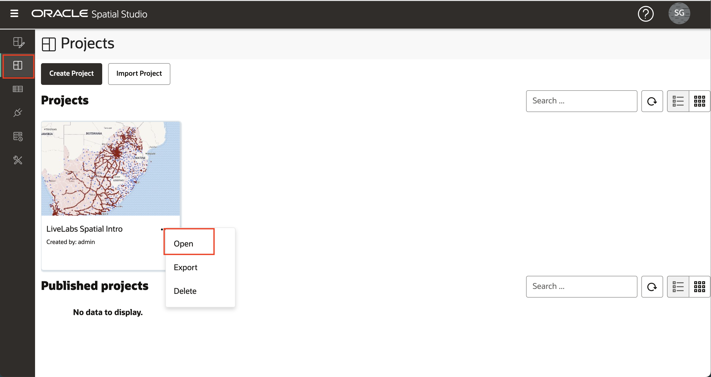
    
2.  若要聚焦於 ACCIDENTS 層，請按一下可見性控制項 (即藍色眼球圖示)，關閉地圖中的 2 個警察層。 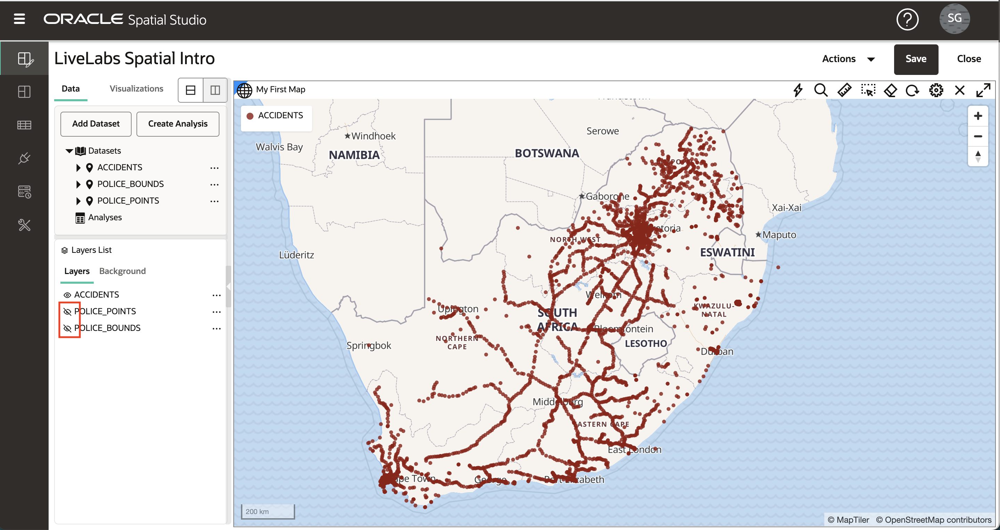
    
3.  如同前一個實驗室中所做的，開啟 ACCIDENTS 的動作功能表並選取**設定值**。
    

## 作業 2：套用叢集樣式

1.  點圖層 (例如 ACCIDENTS) 可以使用各種彩現樣式進行彩現。每個彩現樣式都有自己的設定。將轉換樣式從圓 (預設值) 變更為叢集。 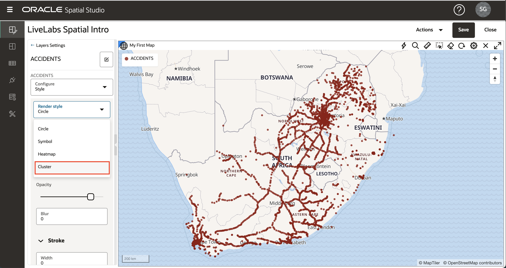
    
2.  地圖現在會顯示 ACCIDENTS，其中使用圓圈代表在區域中叢集化的多個點。叢集圓形大小是根據每個區域中叢集的點數而定。您可以實驗代表每個叢集點數的顏色和文字標籤樣式。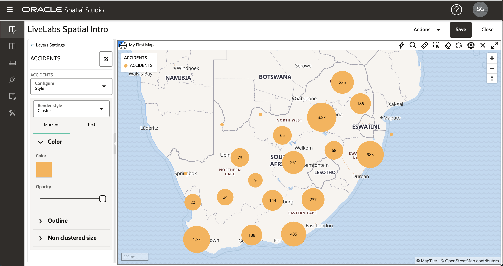 注意，當您放大 (旋轉滑鼠滾輪) 時，叢集會展開為較小的叢集，反之亦然。 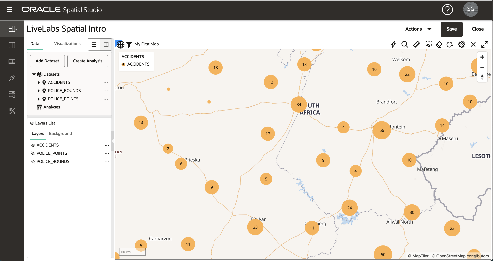
    

## 工作 3：套用熱力圖樣式

1.  將「轉譯樣式」從「叢集」變更為「熱力圖」。地圖現在會根據點的濃度，以連續的顏色來轉譯 ACCIDENTS。熱顏色代表點的濃度，而冷色代表點的稀疏性。熱力圖型式的主要參數是「半徑」，此參數可控制每個點周圍的距離以定義濃度。預設的「半徑」非常大，初始熱力圖只顯示沿道路的點濃度，這並不是非常有幫助。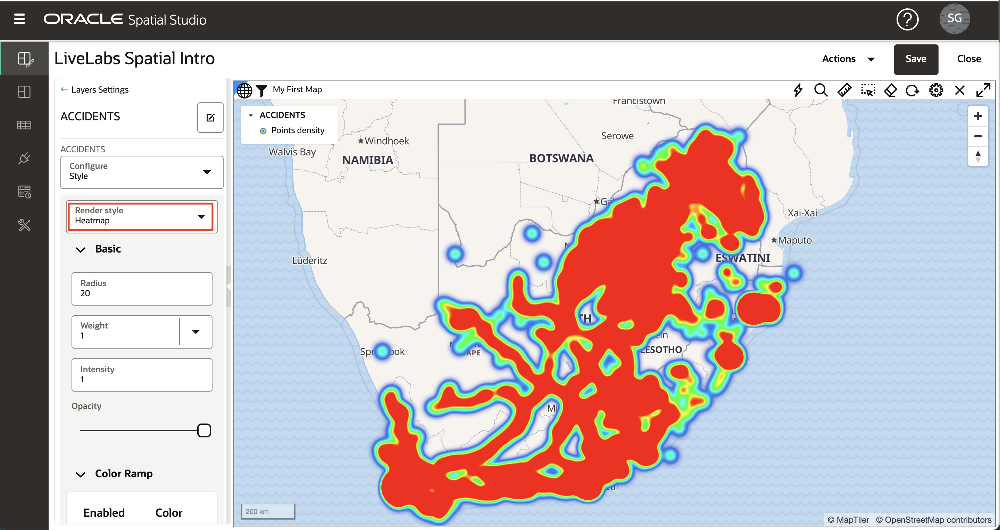 若要將「熱力圖」焦點集中在更區域化的集中，請將「半徑」從預設值減至 10，然後觀察更區域化的點濃度檢視。 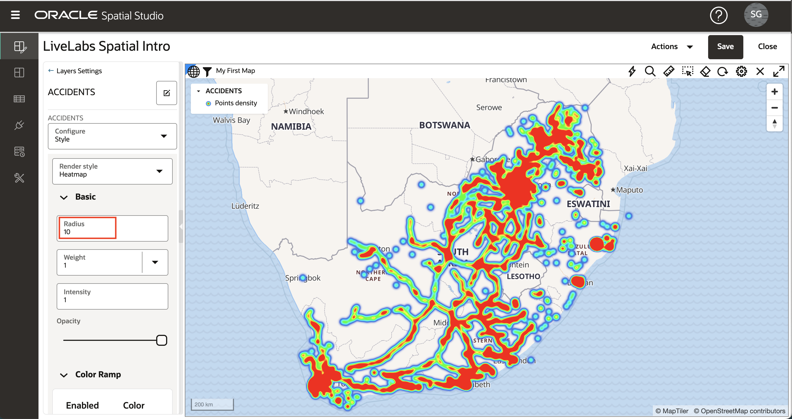

## 工作 4：套用資料導向樣式

1.  將「彩現樣式」從「熱力圖」變更為「圓」。使用「圓」彩現型式時，半徑和顏色均可由資料值控制。下拉「顏色」功能表，然後選取「根據資料」。 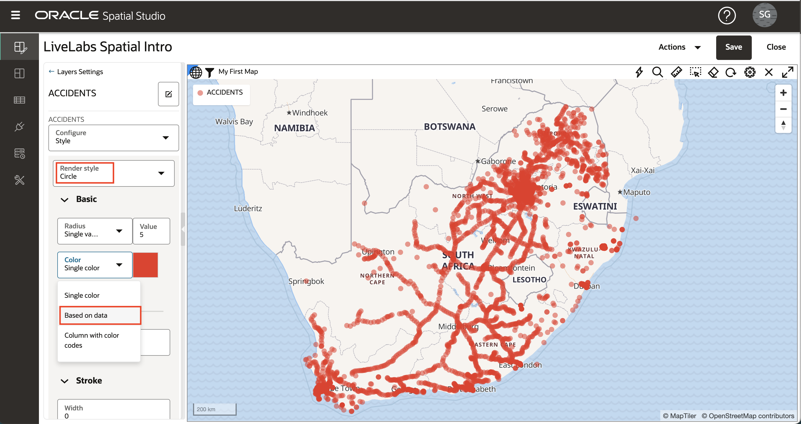
    
2.  您現在選取要用來控制樣式的資料欄。選取資料欄 NR\_VEHICLES (即意外事故涉及的車輛數) 並觀察 ACCIDENTS 會變成顏色編碼。您可以接受其他預設值，然後按一下「樣式詳細資訊」面板上方的**上一步**連結。 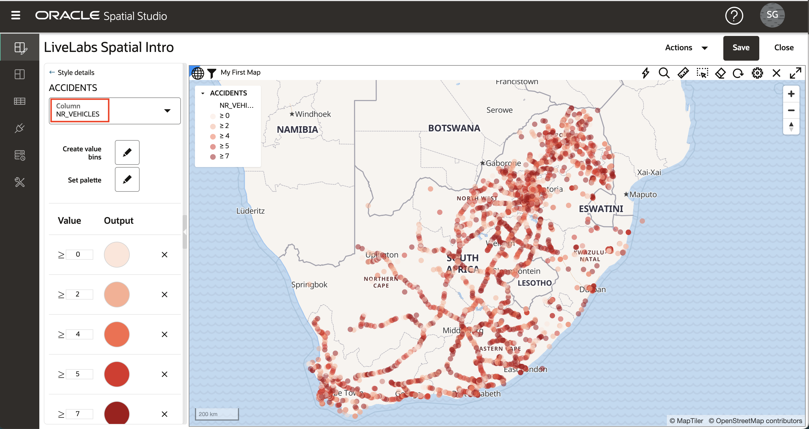
    
3.  現在您已根據資料值指派顏色，請將「半徑」設定為 3，並將「不透明度」設定為 90% 以完成樣式。此外，請更新「筆觸」(即大綱) 值：將「寬度」設為 0.5、「顏色」設為灰色，並將「不透明度」更新為 90%。您可以依個人喜好選擇自己的值。然後按一下**上一步**連結，以返回「圖層清單」。 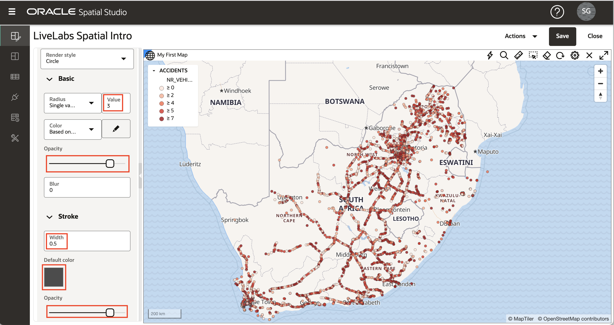
    

## 工作 5：套用符號樣式

1.  接下來將使用其餘的點樣式選項「符號」作為 POLICE\_POINTS 層。開啟 POLICE\_POINTS 層，然後按一下可見性控制項 (即眼球圖示) 來關閉地圖中的其他 2 層。開啟 POLICE\_POINTS 的動作功能表，然後選取**設定**。
    
    將「轉譯樣式」變更為「符號」，然後在「影像」文字方塊內按一下，以開啟「符號」選取對話方塊。選取**標記**，並將「不透明度」更新為 90%，並將「大小」係數更新為 0.6。您可以依個人喜好選擇自己的值。然後按一下**上一步**連結，以返回「圖層清單」。 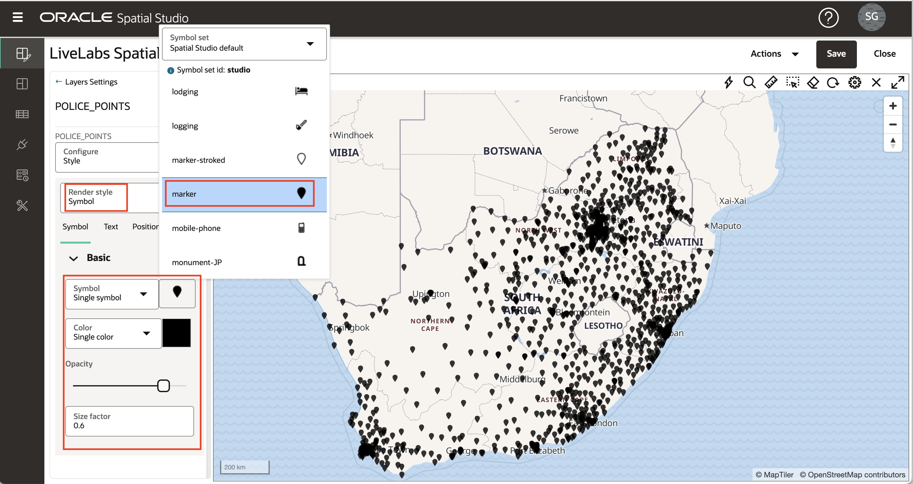
    

## 作業 6：套用互動性

1.  按一下第 POLICE\_BOUNDS 層漢堡圖示，然後選取**設定值**。在「設定」下拉式功能表中，選取**互動**頁籤。我們為圖層設定的第一個互動性類型是選取項目的能力。選取項目用於分析，例如，我們想要識別所選取區域內的項目。依預設，可選取的選項為開啟。在 POLICE\_BOUNDS 區域內按一下，並觀察反白選取的項目。
    
    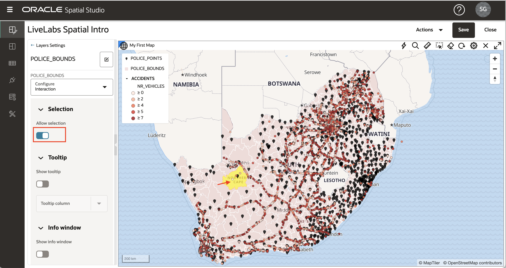
    
2.  接下來設定工具提示，即當游標停留在項目上時顯示的蹦現視窗。預設會停用工具提示。將滑鼠游標停駐在 POLICE\_BOUNDS 區域上，不會發生任何事情。接著，在「設定值」面板中啟用**顯示工具提示**，選取工具提示資料欄，將滑鼠游標停留在某個區域上方，然後觀察工具提示。
    
    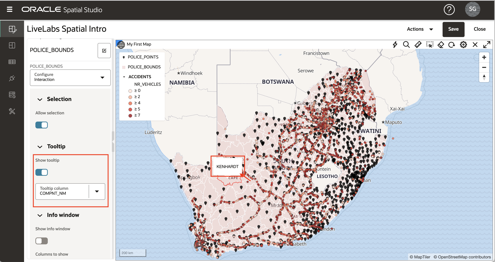
    
3.  最後，設定「資訊視窗」，即按一下項目時顯示的快顯視窗。此選項預設為關閉。按一下 POLICE\_BOUNDS 區域，並觀察不會顯示任何資訊視窗。然後開啟**顯示資訊視窗**，選取要顯示的欄，按一下 POLICE\_BOUNDS 區域內並觀察顯示的資訊視窗。
    

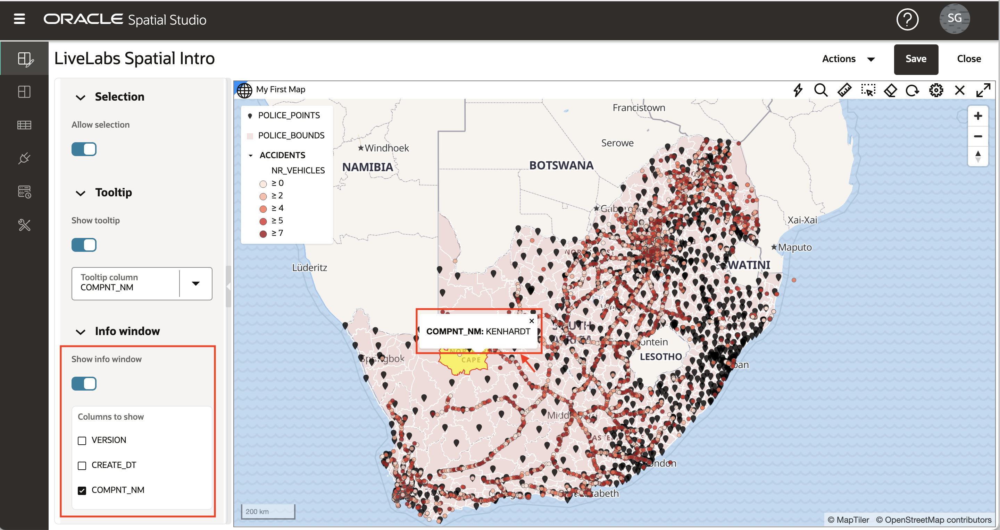

## 作業 7：儲存變更

1.  按一下**上一步**連結，然後按一下**儲存**按鈕，即可使用樣式變更來儲存專案。 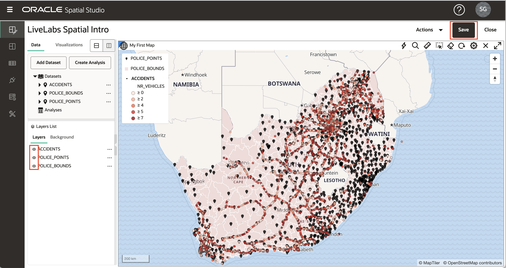
    
2.  返回「專案 (Project)」頁面，然後觀察縮圖已更新為變更。 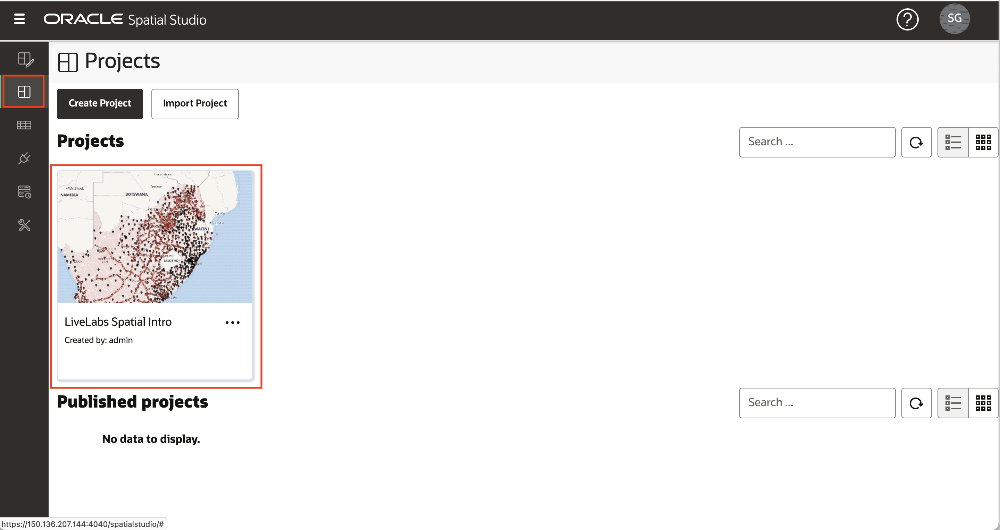
    
3.  按一下專案的漢堡圖示，然後選取**開啟** (或按一下專案縮圖) 以返回專案。
    

您現在可以[進入下一個實驗室](#next)。

## 進一步瞭解

*   \[Spatial Studio 產品入口網站 \] (https://oracle.com/goto/spatialstudio)

## 確認

*   **作者** - Oracle 資料庫產品管理 David Lapp
*   **上次更新者 / 日期** - Denise Myrick，Database Product Management，2023 年 4 月