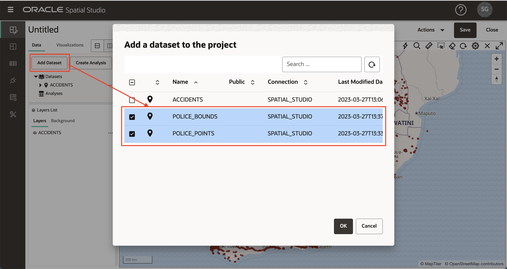
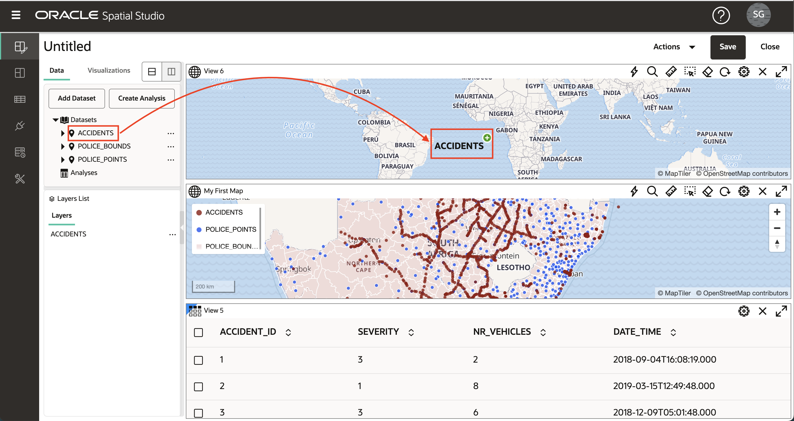

# Projekt erstellen

## Einführung

In Spatial Studio können Sie Ihre Daten in einem Projekt visualisieren und analysieren. Projekte können gespeichert werden, damit Sie die Arbeit fortsetzen können, und sie können veröffentlicht werden, damit Sie Ihre Ergebnisse mit anderen teilen können. In dieser Übung erstellen und speichern Sie Ihr erstes Projekt.

Geschätzte Laborzeit: 30 Minuten

### Ziele

*   Erfahren Sie, wie Sie ein Projekt erstellen und speichern
*   So fügen Sie einem Projekt Datensets hinzu
*   Erfahren Sie, wie Sie Datensets visualisieren können

### Voraussetzungen

*   Übung 1: Räumliche Daten laden erfolgreich abgeschlossen

## Aufgabe 1: Projekt erstellen

1.  Navigieren Sie im linken Menübereich zur Seite "Projekte", und klicken Sie auf **Projekt erstellen**. 
    
2.  Klicken Sie auf die Schaltfläche **Datensatz hinzufügen**, und wählen Sie **Datensatz hinzufügen** aus. 
    
3.  Wählen Sie "Unfälle" aus, und klicken Sie auf **OK**. 
    
4.  Ziehen Sie das ACCIDENTS-Dataset per Drag-and-Drop auf die Karte. Dadurch wird ein Kartenlayer erstellt.
    
    **Hinweis:** Um sich in der Karte zu bewegen, können Sie mit dem Mausrad vergrößern oder verkleinern und zum Verschieben klicken und ziehen. 
    
5.  Sie können optional Karteneinstellungen konfigurieren, einschließlich Label, Navigationssteuerungswidget, Skalierungsleiste und Legende. Klicken Sie auf das Zahnradsymbol, um auf die Karteneinstellungen zuzugreifen. Wählen Sie Optionen aus, und klicken Sie auf **OK**, um die Auswahl zu aktivieren.  Sie können diese Änderungen beibehalten oder zu "Einstellungen" zurückkehren und die Optionen deaktivieren.
    
6.  Klicken Sie im Bereich "Ebenenliste" auf das Hamburger-Symbol für Unfälle, und wählen Sie "Einstellungen". 
    
7.  Von hier aus steuern Sie die Ebenenanzeige und Interaktivitätseinstellungen. Sie werden mit diesen Funktionen in einem späteren Abschnitt experimentieren. Aktualisieren Sie im Moment nur Radius (Größe), Farbe und Deckkraft des Layers, und klicken Sie dann auf den Link **Zurück**. 
    

## Aufgabe 2: Datasets hinzufügen

1.  Als Nächstes fügen Sie dem Projekt Ihre 2 Polizeidatensätze hinzu. Klicken Sie oben im Bereich "Datenelemente" auf die Schaltfläche **Dataset hinzufügen**, wählen Sie **Dataset hinzufügen** aus, wählen Sie in der Umschalttaste beide Polizeidatensätze aus, und klicken Sie auf **OK**. 
    
2.  Ziehen Sie wie zuvor bei ACCIDENTS das Dataset POLICE\_POINTS per Drag-and-Drop aus dem Bereich "Datenelemente" in das Aktionsmenü des Layers POLICE\_POINT, und wählen Sie "Einstellungen". Radius, Farbe, Deckkraft aktualisieren. Klicken Sie dann oben im Ebenenbereich auf den Link **Zurück**. 
    
3.  Wenn Ebenen zur Karte hinzugefügt werden, werden sie auf den vorhandenen Ebenen gerendert. Daher stehen POLICE\_POINTS derzeit auf ACCIDENTS. Um die Layer so neu anzuordnen, dass sich POLICE\_POINTS unter ACCIDENTS befindet, bewegen Sie den Mauszeiger über POLICE\_POINTS in der Liste der Layer, klicken und halten (der Cursor wird in Fadenkreuz geändert), und ziehen Sie ihn unter ACCIDENTS. 
    
4.  Ziehen Sie das Dataset POLICE\_BOUNDS per Drag-and-Drop auf die Karte. Wie bei POLICE\_POINTS ordnen Sie die Layer neu an, sodass POLICE\_BOUNDS unten steht (d.h. unter den anderen Layern gerendert). Sie haben jetzt Ihre 3 Datensätze als Kartenschichten in unserem Projekt hinzugefügt.
    

**Hinweis:** Einzelne Ebenen können durch Klicken auf das Augapfelsymbol neben dem Ebenennamen deaktiviert bzw. aktiviert werden.

5.  Klicken Sie auf das Hamburger-Menü der Ebene POLICE\_BOUNDS, und wählen Sie "Einstellungen" aus. Farbe und Deckkraft für Füllung und Gliederung aktualisieren. Beachten Sie, dass die Verwendung eines weißen Umrisses den unübersichtlichen Effekt eines dunkleren Umrisses reduziert. 

Klicken Sie oben im Bereich "Ebeneneinstellungen" auf den Link **Zurück**, um zur Ebenenliste zurückzukehren.

## Aufgabe 3: Visualisierungen hinzufügen

1.  Mit Spatial Studio können Sie Ihre Datasets als Karten und Tabellen anzeigen. Um Visualisierungen hinzuzufügen, klicken Sie links auf die Registerkarte **Visualisierungen**, und ziehen Sie die **Tabelle** per Drag-and-Drop an den Rand der vorhandenen Kartenansicht. Wenn die Tabelle abgelegt werden kann, wird ein grauer Balken angezeigt.

2.  Ziehen Sie die **Karte** per Drag-and-Drop über die vorhandene Karte. Der graue Balken wird angezeigt, wenn Sie mit der Maus auf den Rand der vorhandenen Karte zeigen und in der neuen Karte ablegen können.

3.  Klicken Sie oben links auf die Schaltfläche **Datensets**, und ziehen Sie ACCIDENTS per Drag-and-Drop in die Tabelle.

4.  Ziehen Sie ACCIDENTS per Drag-and-Drop in die neue Karte.

5.  Um das Datenelementfenster auszublenden und mehr Bildschirmimmobilien bereitzustellen, zeigen Sie mit der Maus auf den rechten Rand, und klicken Sie auf den grauen Pfeil.

6.  Um den Bereich "Datenelemente" zu erweitern, zeigen Sie mit der Maus auf den linken Rand, und klicken Sie auf den grauen Pfeil.

7.  Sie löschen eine Visualisierung, indem Sie oben rechts auf das Symbol **X** klicken. Wir werden nur unsere erste Karte in diesem Workshop verwenden, also löschen Sie die neue Tabelle und Karte, die Sie gerade erstellt haben.

## Aufgabe 4: Projekt speichern

1.  Klicken Sie oben rechts auf die Schaltfläche **Speichern**, um das Projekt zu speichern und einen Namen anzugeben. Beispiel: **LiveLabs Spatial Intro**. 
    
2.  Navigieren Sie von der linken Navigationsleiste zur Seite "Projekte", und beobachten Sie, wie Ihr Projekt jetzt aufgelistet ist. 
    

Sie können jetzt [mit der nächsten Übung fortfahren](#next).

## Weitere Informationen

*   \[Produktportal für Spatial Studio\] (https://oracle.com/goto/spatialstudio)

## Danksagungen

*   **Autor** - David Lapp, Database Product Management, Oracle
*   **Zuletzt aktualisiert am/um** - Denise Myrick, Database Product Management, April 2023