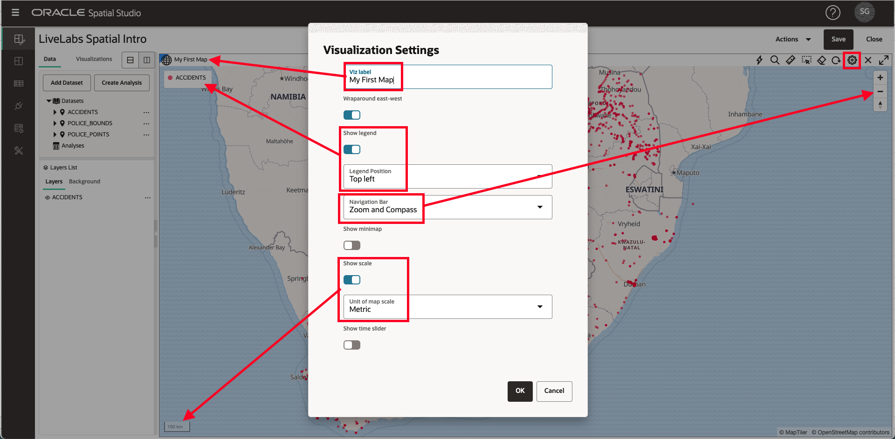
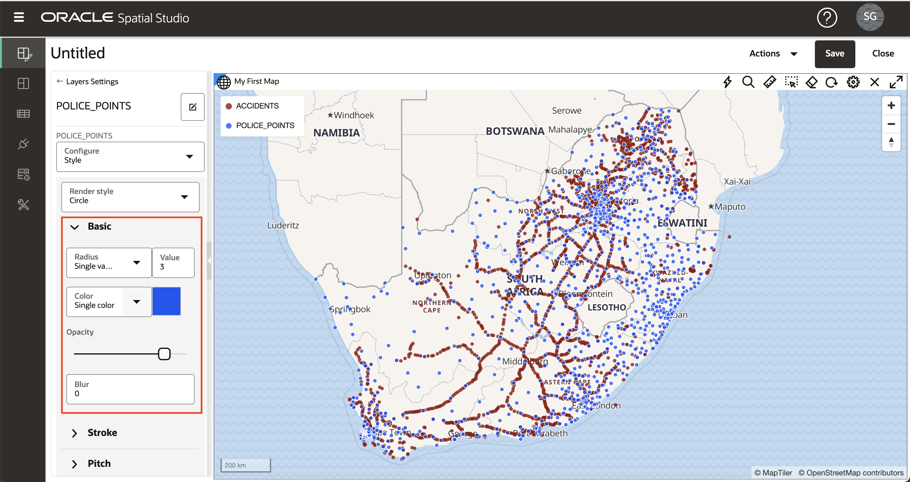
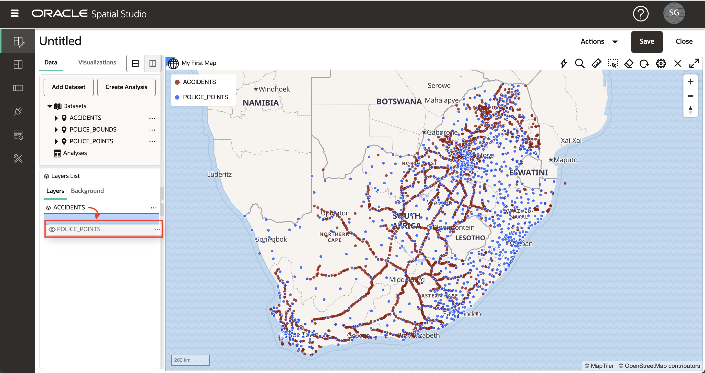

# Créer un projet

## Présentation

Dans Spatial Studio, un projet est l'endroit où vous visualisez et analysez vos données. Les projets peuvent être enregistrés afin que vous puissiez reprendre le travail et publiés afin que vous puissiez partager vos résultats avec d'autres personnes. Dans cet exercice, vous allez créer et enregistrer votre premier projet.

Temps de laboratoire estimé : 30 minutes

### Objectifs

*   Apprendre à créer et enregistrer un projet
*   Découvrez comment ajouter des ensembles de données à un projet
*   Découvrez comment visualiser des ensembles de données

### Prérequis

*   Succès de l'atelier 1 : Charger des données spatiales

## Tâche 1 : Créer un projet

1.  Dans le menu du panneau de gauche, accédez à la page Projets et cliquez sur **Créer un projet**. 
    
2.  Cliquez sur le bouton **Add Dataset** et sélectionnez **Add Dataset**. 
    
3.  Sélectionnez Accidents et cliquez sur **OK**. 
    
4.  Glissez-déplacez l'ensemble de données ACCIDENTS sur la carte. Cela crée une couche de carte.
    
    **Remarque :** pour vous déplacer dans la carte, vous pouvez utiliser la molette de la souris pour effectuer un zoom avant/arrière, puis cliquer et faire glisser le curseur pour effectuer un panoramique. 
    
5.  Vous pouvez éventuellement configurer des paramètres de carte, notamment un libellé, un widget de contrôle de navigation, une barre d'échelle et une légende. Cliquez sur l'icône d'engrenage pour accéder aux paramètres de la carte. Sélectionnez des options et cliquez sur **OK** pour activer les sélections.  Vous pouvez conserver ces modifications ou revenir aux paramètres et désactiver les options.
    
6.  Dans le panneau Liste des couches, cliquez sur l'icône de menu latéral Accidents et sélectionnez Paramètres. 
    
7.  De là, vous contrôlez l'affichage du calque et les paramètres d'interactivité. Vous expérimenterez ces fonctionnalités dans une section ultérieure. Pour le moment, mettez à jour le rayon (taille), la couleur et l'opacité du calque, puis cliquez sur le lien **Précédent**. 
    

## Tâche 2 : ajouter des jeux de données

1.  Ensuite, vous ajoutez vos 2 jeux de données de police au projet. Cliquez sur le bouton **Ajouter un ensemble de données** en haut du panneau Eléments de données, sélectionnez **Ajouter un ensemble de données**, utilisez la saisie par équipe pour sélectionner les deux ensembles de données de police et cliquez sur **OK**. 
    
2.  Comme précédemment avec ACCIDENTS, faites glisser l'ensemble de données POLICE\_POINTS du panneau Eléments de données vers le menu d'actions de la couche POLICE\_POINT et sélectionnez Paramètres. Mettre à jour le rayon, la couleur, l'opacité. Cliquez ensuite sur le lien **Précédent** en haut du panneau Couches. 
    
3.  Lorsque des couches sont ajoutées à la carte, elles sont affichées au-dessus des couches existantes. Par conséquent, POLICE\_POINTS est actuellement en tête des ACCIDENTS. Pour réorganiser les couches de sorte que POLICE\_POINTS se trouve sous ACCIDENTS, placez le pointeur de la souris sur POLICE\_POINTS dans la liste des couches, cliquez et maintenez le bouton enfoncé (vous verrez le curseur passer en pointillés), puis faites glisser sous ACCIDENTS. 
    
4.  Glissez-déplacez l'ensemble de données POLICE\_BOUNDS sur la carte. Comme pour POLICE\_POINTS, réorganisez les couches de sorte que POLICE\_BOUNDS soit en bas (c'est-à-dire rendu sous les autres couches). Vous avez maintenant vos 3 jeux de données ajoutés en tant que couches de carte dans notre projet.
    

**Remarque :** vous pouvez désactiver/activer des calques individuels en cliquant sur l'icône représentant un globe oculaire en regard du nom du calque.

5.  Cliquez sur le menu hamburger de la couche POLICE\_BOUNDS et sélectionnez Paramètres. Mettre à jour la couleur et l'opacité pour le remplissage et le contour. Notez que l'utilisation d'un contour blanc réduit l'encombrement d'un contour plus foncé. 

Cliquez sur le lien **Précédent** en haut du panneau Paramètres de couche pour revenir à la liste des couches.

## Tâche 3 : ajouter des visualisations

1.  Spatial Studio vous permet d'afficher vos jeux de données sous forme de cartes et de tableaux. Pour ajouter des visualisations, cliquez sur l'onglet **Visualisations** à gauche, puis glissez-déplacez **Table** vers la bordure de la vue de carte existante. Une barre grise apparaît lorsque le tableau peut être déposé.

2.  Glissez-déplacez **Mappe** au-dessus de la carte existante. La barre grise apparaît lorsque vous survolez le bord de la carte existante et que vous pouvez la déposer dans la nouvelle carte.

3.  Cliquez sur le bouton **Ensembles de données** en haut à gauche, puis faites glisser les ACCIDENTS dans la table.

4.  Glissez-déplacez ACCIDENTS dans la nouvelle carte.

5.  Pour réduire le panneau Eléments de données et fournir davantage de biens immobiliers à l'écran, survolez le bord droit et cliquez sur la flèche grise.

6.  Pour développer le panneau Eléments de données, positionnez le pointeur de la souris sur le bord gauche et cliquez sur la flèche grise.

7.  Pour supprimer une visualisation, cliquez sur l'icône **X** en haut à droite. Nous n'utiliserons que notre carte initiale dans cet atelier. Supprimez donc la nouvelle table et la carte que vous venez de créer.

## Tâche 4 : enregistrer le projet

1.  Cliquez sur le bouton **Enregistrer** en haut à droite pour enregistrer le projet et fournir un nom, par exemple **LiveLabs Spatial Intro**. 
    
2.  Accédez à la page Projets à partir de la barre de navigation de gauche et observez que votre projet est maintenant répertorié. 
    

Vous pouvez maintenant [passer à l'exercice suivant](#next).

## En savoir plus

*   \[Portail produit Spatial Studio\] (https://oracle.com/goto/spatialstudio)

## Accusés de réception

*   **Auteur** - David Lapp, Database Product Management, Oracle
*   **Dernière mise à jour par/date** - Denise Myrick, Database Product Management, avril 2023