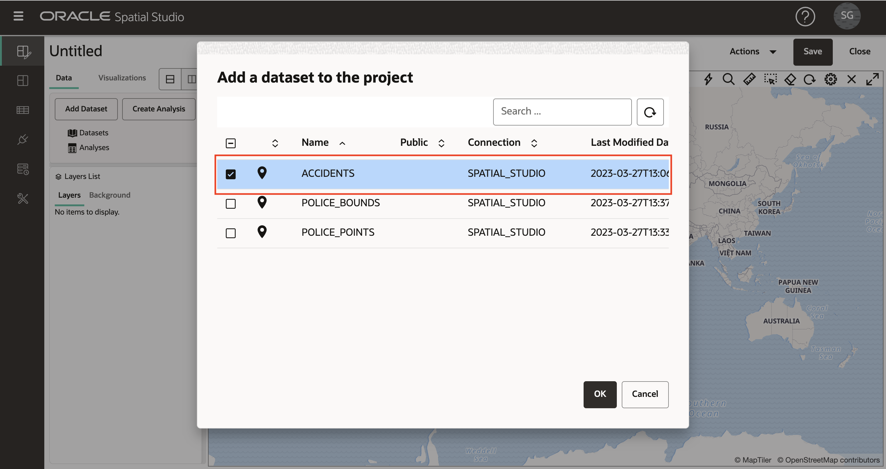
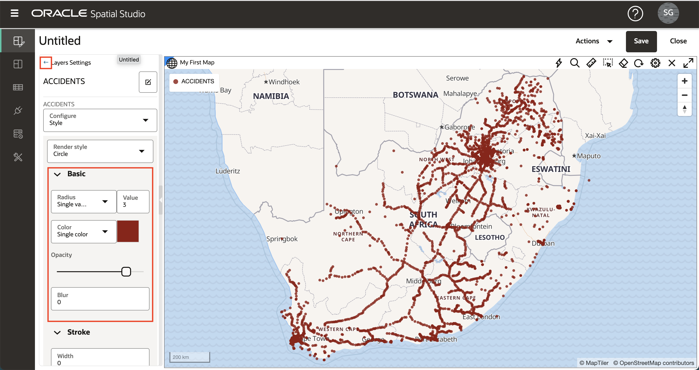
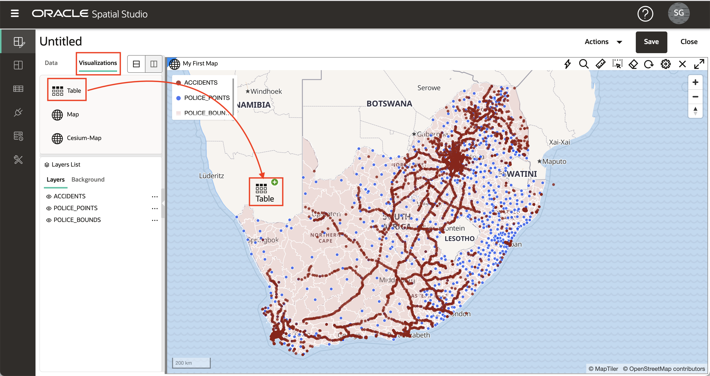
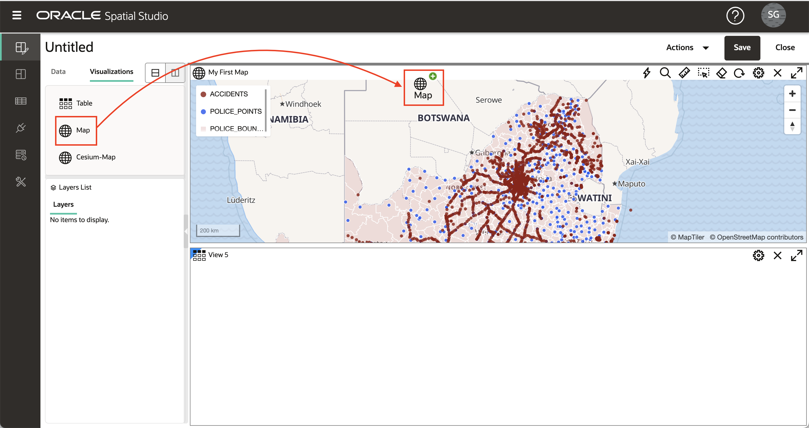

# プロジェクトの作成

## 概要

Spatial Studioでは、データをビジュアル化および分析するプロジェクトです。プロジェクトは、作業を再開できるように保存され、他のユーザーと結果を共有できるように公開できます。この演習では、最初のプロジェクトを作成して保存します。

推定ラボ時間: 30分

### 目標

*   プロジェクトを作成して保存する方法
*   プロジェクトにデータセットを追加する方法を学習します
*   データセットを視覚化する方法を学びます

### 前提条件

*   演習1: 空間データのロードが正常に完了していること

## タスク1: プロジェクトの作成

1.  左側のパネル・メニューから、「プロジェクト」ページに移動し、**「プロジェクトの作成」**をクリックします。 
    
2.  **「Add Dataset」**ボタンをクリックし、**「Add Dataset」**を選択します。 
    
3.  「事故」を選択し、**「OK」**をクリックします。 
    
4.  ACCIDENTSデータセットをマップにドラッグ・アンド・ドロップします。これにより、マップ・レイヤーが作成されます。
    
    **ノート:**マップ内を移動するには、マウス・ホイールを使用してズーム・イン/ズーム・アウトし、クリックしてドラッグしてパンできます。
    
5.  オプションで、ラベル、ナビゲーション・コントロール・ウィジェット、スケール・バー、凡例などのマップ設定を構成できます。マップ設定にアクセスするには、歯車アイコンをクリックします。オプションを選択し、**「OK」**をクリックして選択を有効にします。これらの変更を保持するか、「設定」に戻り、オプションをオフに戻すことができます。
    
6.  「レイヤー・リスト」パネルで、「事故」のハンバーガー・アイコンをクリックし、「設定」を選択します。 
    
7.  ここから、レイヤーの表示と対話性の設定を制御します。これらの機能については、後のセクションで試します。ここでは、レイヤーの半径(サイズ)、色および不透明度を更新して、**「戻る」**リンクをクリックします。 
    

## タスク2: データセットの追加

1.  次に、2つの警察データセットをプロジェクトに追加します。「データ要素」パネルの上部にある**「データセットの追加」**ボタンをクリックし、**「データセットの追加」**を選択し、shift-enterを使用して両方のpoliceデータセットを選択し、**「OK」**をクリックします。 
    
2.  以前にACCIDENTSで行ったように、「データ要素」パネルからPOLICE\_POINTSデータセットを上にドラッグ・アンド・ドロップし、POLICE\_POINTレイヤーのアクション・メニューをクリックして「設定」を選択します。半径、色、不透明度を更新します。次に、「レイヤー」パネルの上部にある「**戻る**」リンクをクリックします。 
    
3.  レイヤーがマップに追加されると、既存のレイヤーの上にレンダリングされます。したがって、POLICE\_POINTSは現在ACCIDENTSの最上位にあります。POLICE\_POINTSがACCIDENTSの下にあるようにレイヤーを並べ替えるには、レイヤー・リスト内のPOLICE\_POINTSにマウスを移動し、クリック・アンド・ホールド(カーソルがクロスヘアに変更されます)して、「ACCIDENTS」の下にドラッグします。 
    
4.  POLICE\_BOUNDSデータセットをマップにドラッグ・アンド・ドロップします。POLICE\_POINTSで行ったように、POLICE\_BOUNDSが下部(つまり、他のレイヤーの下にレンダリング)になるようにレイヤーの順序を変更します。これで、3つのデータセットがマップ・レイヤーとしてプロジェクトに追加されました。
    

**ノート:**レイヤー名の横にあるアイボール・アイコンをクリックして、個々のレイヤーをオフまたはオンにできます。

5.  POLICE\_BOUNDSレイヤーのハンバーガー・メニューをクリックし、「設定」を選択します。塗りつぶしとアウトラインの\[色\]と\[不透明度\]を更新します。白いアウトラインを使用すると、暗いアウトラインの乱雑な影響が軽減されることを確認します。 

「レイヤー設定」パネルの上部にある**「戻る」**リンクをクリックして、レイヤー・リストに戻ります。

## タスク3: ビジュアライゼーションの追加

1.  Spatial Studioでは、データセットをマップおよび表として表示できます。ビジュアライゼーションを追加するには、左側の**「ビジュアライゼーション」**タブをクリックし、**「表」**を既存のマップ・ビューの端にドラッグ・アンド・ドロップします。表を削除すると、灰色のバーが表示されます。

2.  既存のマップの上にある**「マップ」**をドラッグ・アンド・ドロップします。既存のマップの端にカーソルを置くと、グレーのバーが表示され、新しいマップにドロップできます。

3.  左上の**「データセット」**ボタンをクリックし、ACCIDENTSを表にドラッグ・アンド・ドロップします。

4.  ACCIDENTSを新しいマップにドラッグ・アンド・ドロップします。

5.  「データ要素」パネルを縮小し、画面領域を増やすには、右端にカーソルを置き、灰色の矢印をクリックします。

6.  「データ要素」パネルを展開するには、左端にカーソルを置き、灰色の矢印をクリックします。

7.  ビジュアライゼーションを削除するには、右上の**「X」**アイコンをクリックします。このワークショップでは初期マップのみを使用するため、作成した新しい表とマップを削除します。

## タスク4: プロジェクトの保存

1.  右上の**「保存」**ボタンをクリックしてプロジェクトを保存し、**LiveLabs Spatial Intro**などの名前を指定します。 
    
2.  左側のナビゲーション・バーから「プロジェクト」ページにナビゲートし、「プロジェクト」がリストされていることを確認します。 
    

[次の演習に進む](#next)ことができます。

## さらに学ぶ

*   \[Spatial Studio製品ポータル\] (https://oracle.com/goto/spatialstudio)

## 確認

*   **著者** - Oracle、データベース製品管理、David Lapp氏
*   **最終更新者/日付** - Denise Myrick、Database Product Management、2023年4月