# 프로젝트 생성

## 소개

Spatial Studio에서 프로젝트는 데이터를 시각화하고 분석하는 곳입니다. 프로젝트를 저장하여 작업을 재개할 수 있으며 다른 사용자와 결과를 공유할 수 있도록 게시할 수 있습니다. 이 연습에서는 첫번째 프로젝트를 생성하고 저장합니다.

예상 실험 시간: 30분

### 목표

*   프로젝트를 생성하고 저장하는 방법 학습
*   프로젝트에 데이터 집합을 추가하는 방법 알아보기
*   데이터세트를 시각화하는 방법 알아보기

### 필요 조건

*   실습 1: 공간 데이터 로드가 성공적으로 완료되었습니다.

## 태스크 1: 프로젝트 생성

1.  왼쪽 패널 메뉴에서 프로젝트 페이지로 이동하고 **프로젝트 생성**을 누릅니다. 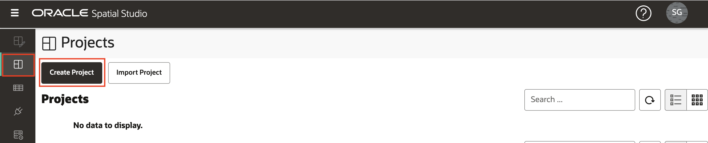
    
2.  **데이터 집합 추가** 단추를 누르고 **데이터 집합 추가**를 선택합니다. 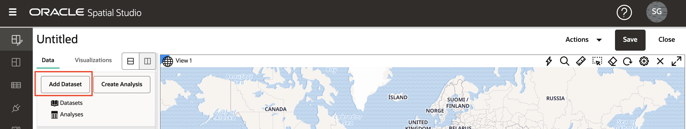
    
3.  사고를 선택하고 **확인**을 누릅니다. 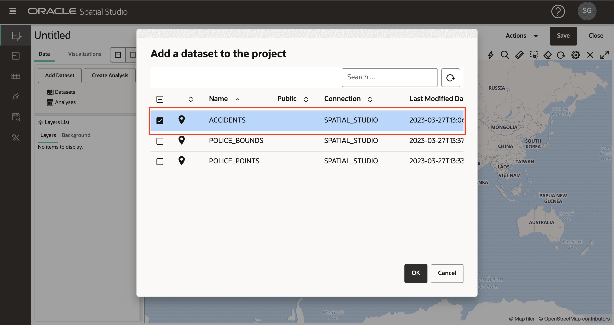
    
4.  ACCIDENTS 데이터 세트를 맵에 끌어 놓습니다. 그러면 지도 도면층이 작성됩니다.
    
    **주:** 맵 주위를 이동하려면 마우스 휠을 사용하여 확대/축소하고 누른 채 끌어서 이동할 수 있습니다. 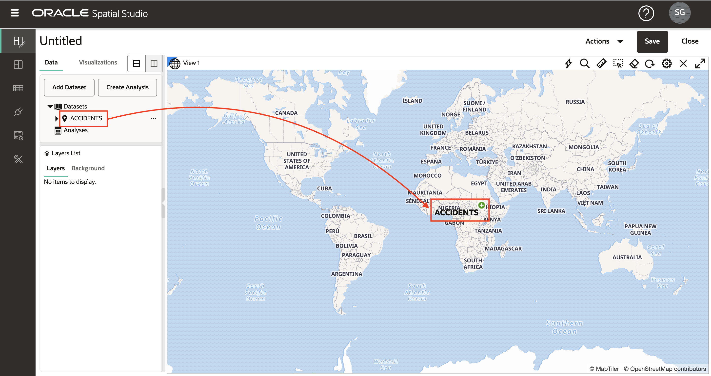
    
5.  선택적으로 레이블, 탐색 컨트롤 위젯, 축척 막대 및 범례를 비롯한 맵 설정을 구성할 수 있습니다. 기어 아이콘을 클릭하여 맵 설정에 액세스합니다. 옵션을 선택하고 **확인**을 눌러 선택을 사용으로 설정합니다. 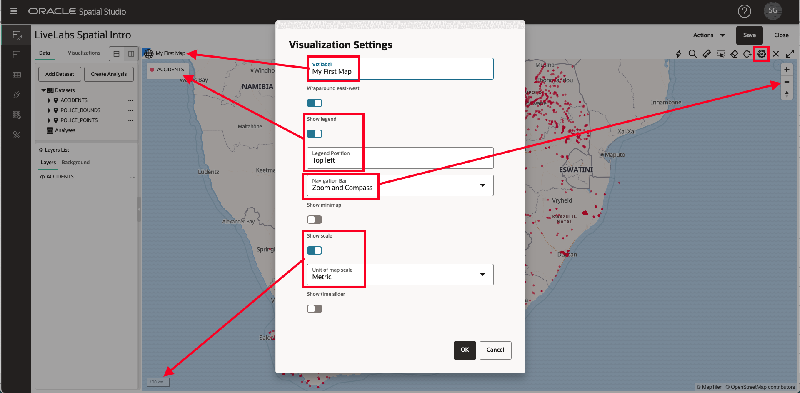 해당 변경사항을 유지하거나 설정으로 돌아가서 옵션을 다시 해제할 수 있습니다.
    
6.  레이어 리스트 패널에서 사고에 대한 햄버거 아이콘을 클릭하고 설정을 선택합니다. 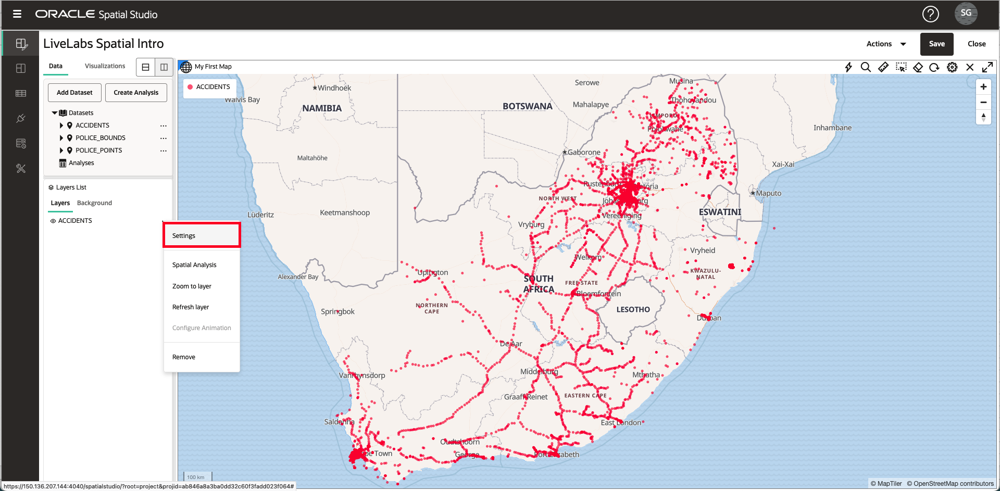
    
7.  여기서 도면층 화면표시 및 상호 작용 설정을 조정합니다. 다음 섹션에서 이러한 기능을 사용해 봅니다. 지금은 레이어의 반지름(크기), 색상 및 불투명도를 업데이트한 다음 **뒤로** 링크를 누릅니다. 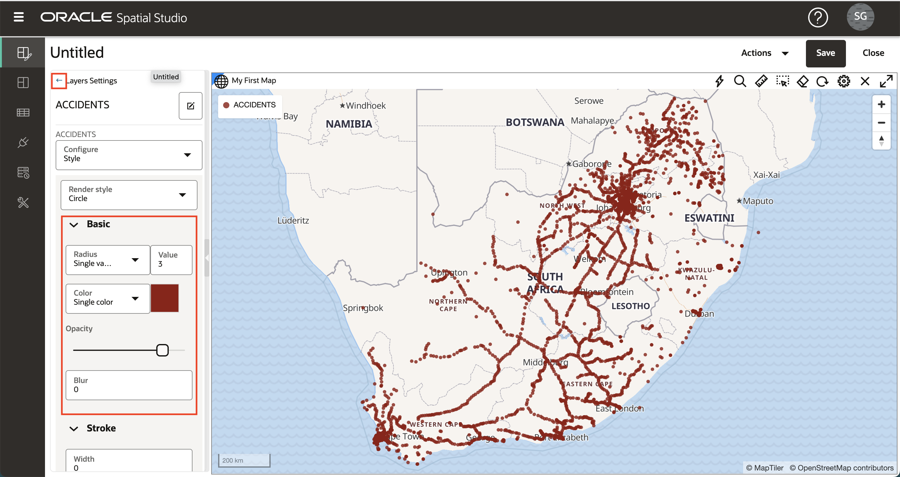
    

## 작업 2: 데이터 세트 추가

1.  다음으로 2개의 경찰 데이터 세트를 프로젝트에 추가합니다. \[데이터 요소\] 패널의 맨 위에 있는 **데이터 집합 추가** 단추를 누르고 **데이터 집합 추가**를 선택한 다음 shift-enter를 사용하여 두 데이터 집합을 모두 선택하고 **확인**을 누릅니다. 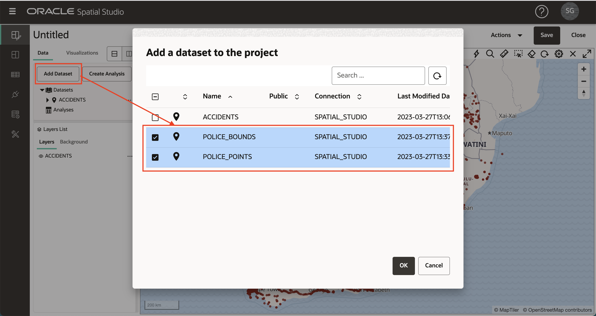
    
2.  이전에 ACCIDENTS에서 수행한 것처럼 \[데이터 요소\] 패널에서 POLICE\_POINTS 데이터 집합을 끌어 놓은 다음 POLICE\_POINT 레이어의 작업 메뉴를 누르고 \[설정\]을 선택합니다. 반지름, 색상, 불투명도를 업데이트합니다. 그런 다음 \[레이어\] 패널의 맨 위에 있는 **뒤로** 링크를 누릅니다. 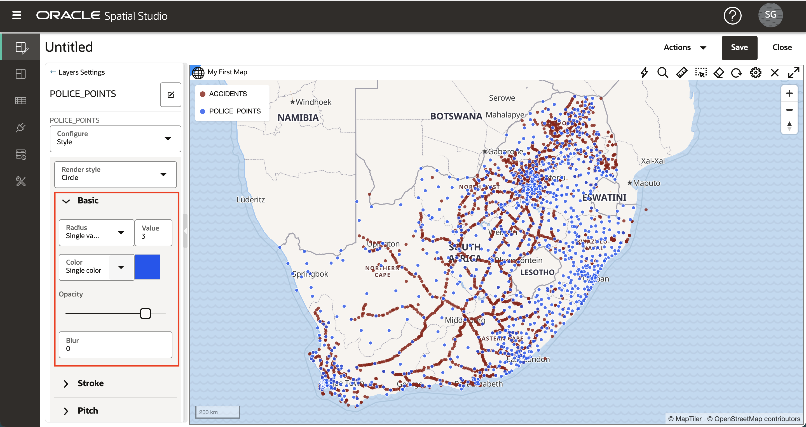
    
3.  레이어가 맵에 추가되면 기존 레이어 위에 렌더링됩니다. 따라서 POLICE\_POINTS는 현재 ACCIDENTS 위에 있습니다. POLICE\_POINTS가 ACCIDENTS 아래에 있도록 도면층의 순서를 재지정하려면 도면층 리스트에서 마우스를 POLICE\_POINTS 위로 이동하고 마우스를 누른 상태에서(커서가 십자선으로 변경되어 보임) ACCIDENTS 아래로 끕니다. 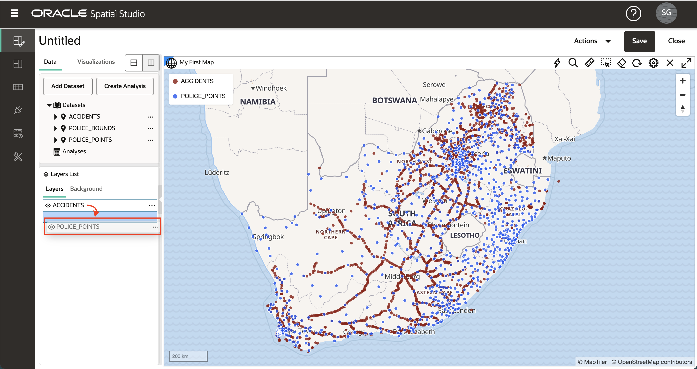
    
4.  POLICE\_BOUNDS 데이터 집합을 맵에 끌어 놓습니다. POLICE\_POINTS와 마찬가지로 POLICE\_BOUNDS가 맨 아래에 있도록(즉, 다른 층 아래에 렌더링됨) 층의 순서를 재지정합니다. 이제 3개의 데이터 집합이 프로젝트에 맵 층으로 추가되었습니다.
    

**주:** 층 이름 옆에 있는 안구 아이콘을 눌러 개별 층을 해제/설정할 수 있습니다.

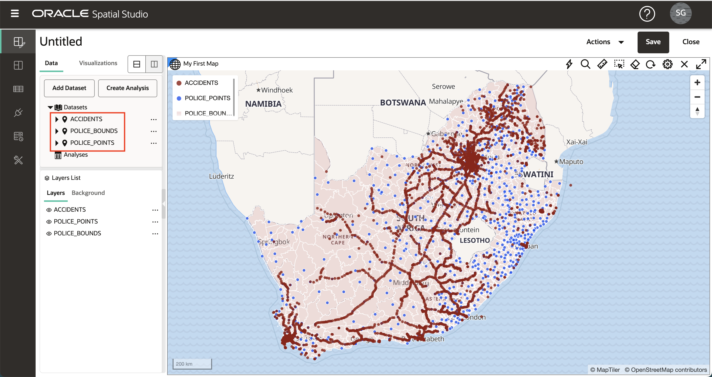

5.  POLICE\_BOUNDS 레이어의 햄버거 메뉴를 클릭하고 설정을 선택합니다. 채우기 및 윤곽선의 색상 및 불투명도를 업데이트합니다. 흰색 윤곽선을 사용하면 더 어두운 윤곽선의 혼란스러운 효과가 감소합니다. 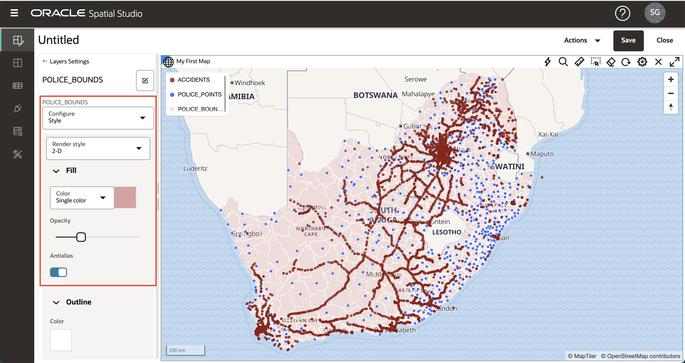

\[레이어 설정\] 패널의 맨 위에 있는 **뒤로** 링크를 눌러 \[레이어 목록\]으로 돌아갑니다.

## 작업 3: 시각화 추가

1.  Spatial Studio를 사용하면 데이터 집합을 맵 및 테이블로 표시할 수 있습니다. 시각화를 추가하려면 왼쪽의 **시각화** 탭을 누른 다음 **테이블**을 기존 맵 뷰의 가장자리로 끌어 놓습니다. 테이블을 삭제할 수 있으면 회색 막대가 나타납니다.

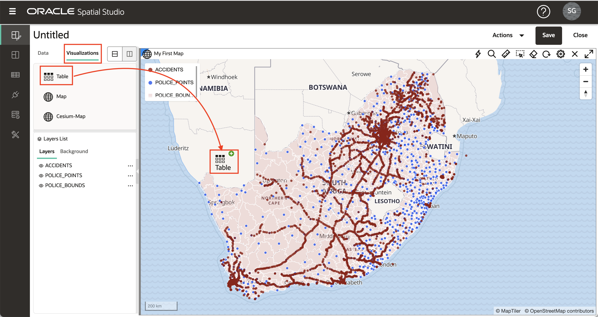

2.  **맵**을 기존 맵 위로 끌어 놓습니다. 회색 막대는 기존 맵의 가장자리를 가리키고 새 맵에 놓을 때 나타납니다.

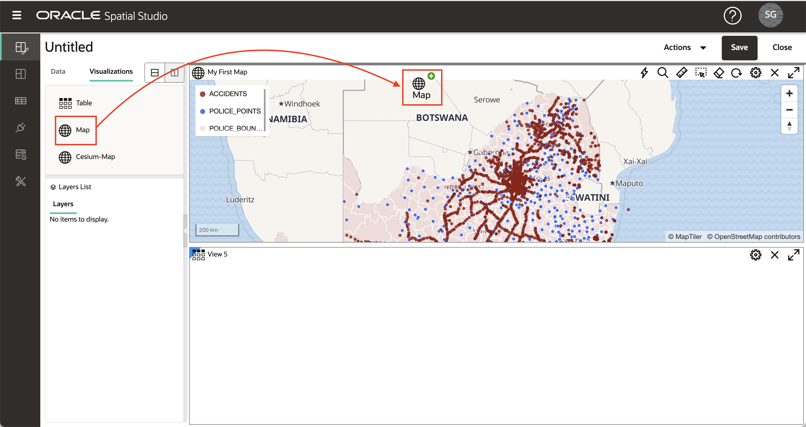

3.  왼쪽 위에 있는 **데이터 세트** 버튼을 누른 다음 ACCIDENTS를 테이블로 끌어 놓습니다.

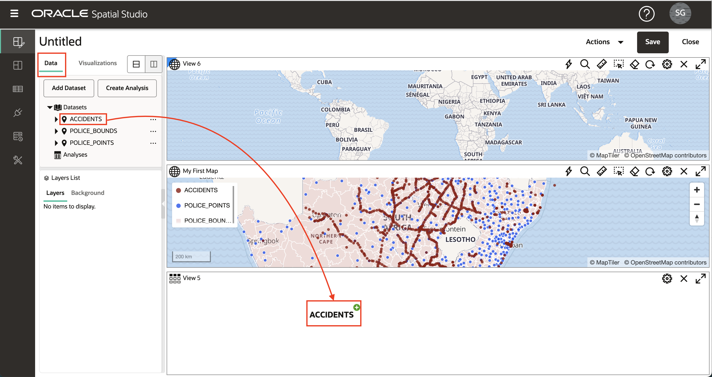

4.  ACCIDENTS를 새 맵으로 끌어 놓습니다.

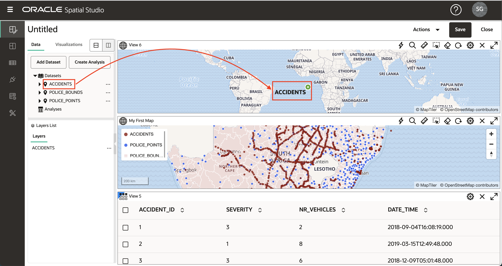

5.  데이터 요소 패널을 축소하고 더 많은 화면 부동산을 제공하려면 오른쪽 가장자리를 가리키고 회색 화살표를 클릭합니다.

![[데이터 요소] 패널 축소](images/add-viz-5.png)

6.  \[데이터 요소\] 패널을 확장하려면 왼쪽 가장자리를 가리키고 회색 화살표를 클릭합니다.

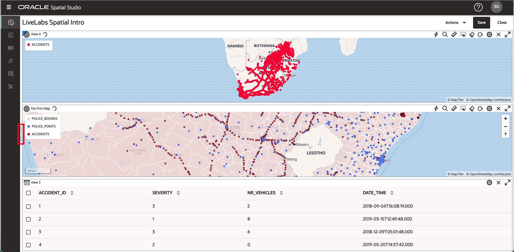

7.  오른쪽 위에 있는 **X** 아이콘을 눌러 시각화를 삭제합니다. 이 워크샵에서는 초기 맵만 사용하므로 방금 생성한 새 테이블과 맵을 삭제합니다.

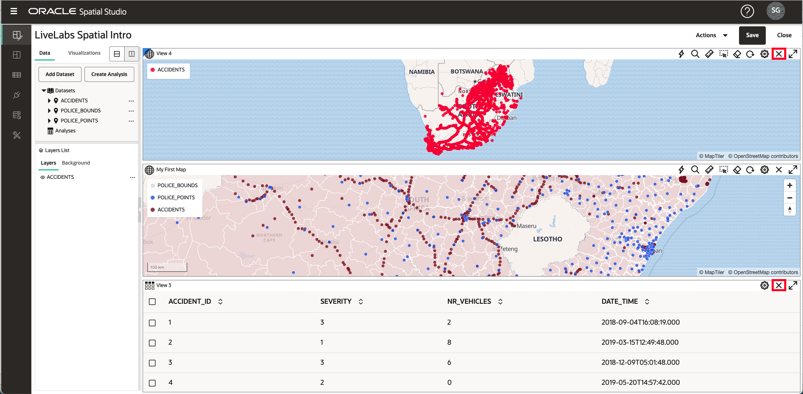

## 태스크 4: 프로젝트 저장

1.  오른쪽 위에 있는 **저장** 단추를 눌러 프로젝트를 저장하고 이름을 제공합니다(예: **LiveLabs 공간 소개**). 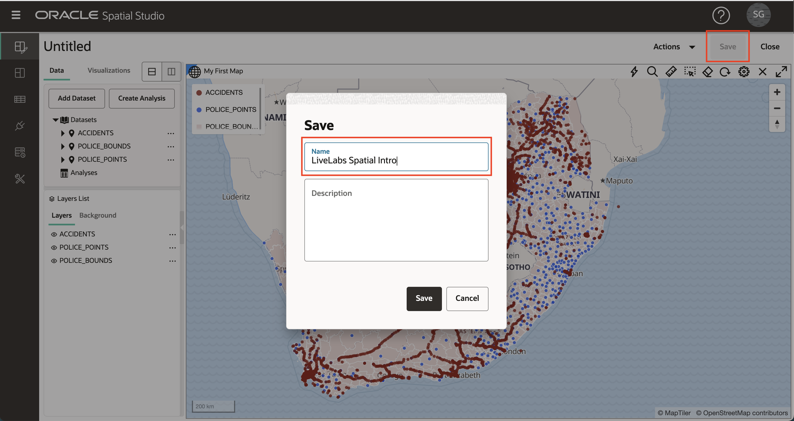
    
2.  왼쪽 탐색 모음에서 Projects 페이지로 이동하고 이제 프로젝트가 나열되는지 확인합니다. 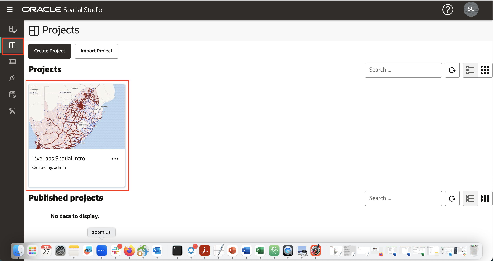
    

이제 [다음 실습을 진행하십시오](#next).

## 자세히 알아보기

*   \[Spatial Studio 제품 포털\] (https://oracle.com/goto/spatialstudio)

## 확인

*   **작성자** - David Lapp, Oracle 데이터베이스 제품 관리
*   **최종 업데이트 기한/일자** - Denise Myrick, 데이터베이스 제품 관리, 2023년 4월