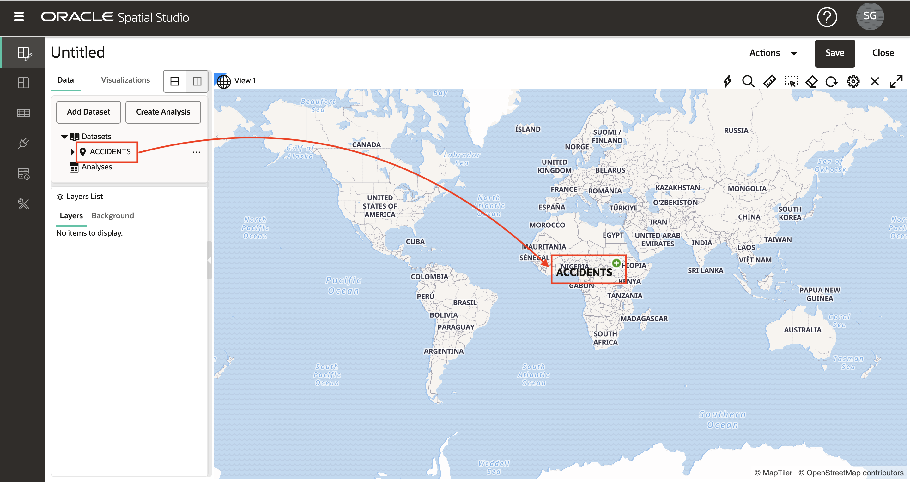
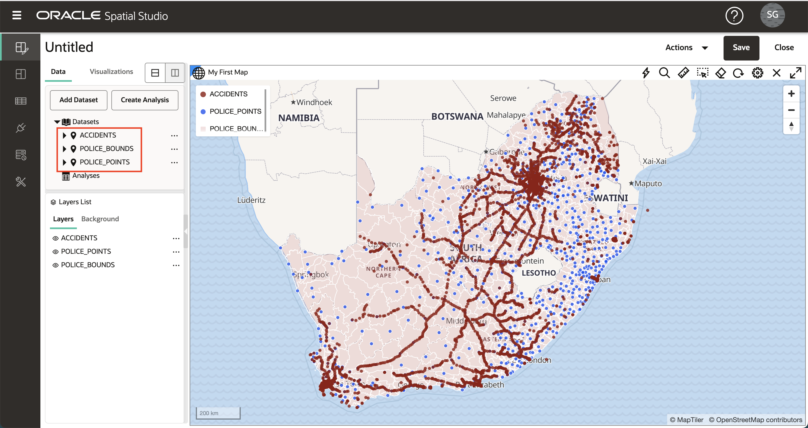
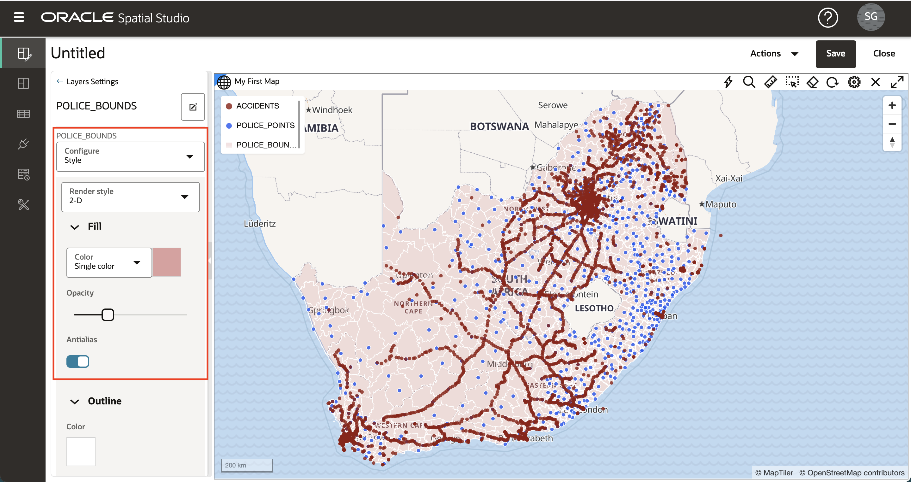
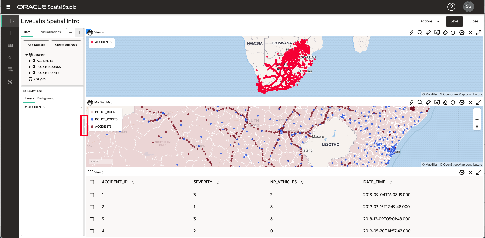

# Criar Projeto

## Introdução

No Spatial Studio, um Projeto é onde você visualiza e analisa seus dados. Os projetos podem ser salvos para que você possa retomar o trabalho e podem ser publicados para que você possa compartilhar seus resultados com outras pessoas. Neste laboratório, você cria e salva seu primeiro Projeto.

Tempo de Laboratório Estimado: 30 minutos

### Objetivos

*   Saiba como criar e salvar um Projeto
*   Saiba como adicionar Conjuntos de Dados a um Projeto
*   Saiba como visualizar conjuntos de dados

### Pré-requisitos

*   Laboratório 1 concluído com sucesso: Carregar Dados Espaciais

## Tarefa 1: Criar Projeto

1.  No menu do painel esquerdo, navegue até a página Projetos e clique em **Criar Projeto**. 
    
2.  Clique no botão **Add Dataset** e selecione **Add Dataset**. 
    
3.  Selecione Acidentes e clique em **OK**. 
    
4.  Arraste e solte o Conjunto de Dados ACCIDENTS no mapa. Isso cria uma Camada de mapa.
    
    **Observação:** para se mover no mapa, você pode usar a roda do mouse para ampliar/reduzir e clicar e arrastar para panorâmica. 
    
5.  Opcionalmente, você pode definir configurações de mapa, incluindo um rótulo, widget de controle de navegação, barra de escala e legenda. Clique no ícone de engrenagem para acessar as Configurações do mapa. Selecione as opções e clique em **OK** para ativar as seleções.  Você pode manter essas alterações ou retornar às Configurações e desativar as opções.
    
6.  No painel Lista de camadas, clique no ícone de hambúrguer para Acidentes e selecione Configurações. 
    
7.  A partir daqui, você controla a exibição da camada e as configurações de interatividade. Você experimentará esses recursos em uma seção posterior. No momento, basta atualizar o Raio (tamanho), a Cor e a Opacidade da camada e clicar no link **Voltar**. 
    

## Tarefa 2: Adicionar Conjuntos de Dados

1.  Em seguida, você adiciona seus 2 conjuntos de dados policiais ao projeto. Clique no botão **Adicionar Conjunto de Dados** na parte superior do painel Elementos de Dados, selecione **Adicionar Conjunto de Dados**, use shift-enter para selecionar os Conjuntos de Dados policiais e clique em **OK**. 
    
2.  Como você fez anteriormente com ACCIDENTS, arraste e solte o Conjunto de Dados POLICE\_POINTS do painel Elementos de Dados para o painel, clique no menu de ação da camada POLICE\_POINT e selecione Configurações. Atualizar raio, cor, opacidade. Em seguida, clique no link **Voltar** na parte superior do painel Camadas. 
    
3.  À medida que as Camadas são adicionadas ao mapa, elas são renderizadas em cima das Camadas existentes. Portanto, POLICE\_POINTS está atualmente no topo dos ACIDENTES. Para reordenar as camadas de forma que POLICE\_POINTS esteja abaixo de ACCIDENTS, mova o mouse sobre POLICE\_POINTS na lista da Camada, clique e segure (você verá o cursor mudar para mira) e arraste para ACCIDENTS. 
    
4.  Arraste e solte o Conjunto de Dados POLICE\_BOUNDS no mapa. Como você fez com POLICE\_POINTS, reordene as camadas para que POLICE\_BOUNDS esteja na parte inferior (ou seja, renderizado abaixo das outras camadas). Agora você tem seus 3 conjuntos de dados adicionados como camadas de mapa em nosso projeto.
    

**Observação:** as camadas individuais podem ser desativadas/ativadas clicando no ícone do globo ocular ao lado do nome da camada.

5.  Clique no menu de hambúrguer da camada POLICE\_BOUNDS e selecione Definições. Atualizar Cor e Opacidade para Preenchimento e Estrutura de Tópicos. Observe que usar um contorno branco reduz o efeito desordenado de um contorno mais escuro. 

Clique no link **Voltar** na parte superior do painel Configurações de Camada para retornar à Lista de Camadas.

## Tarefa 3: Adicionar Visualizações

1.  O Spatial Studio permite que você exiba seus Conjuntos de Dados como mapas e tabelas. Para adicionar visualizações, clique na guia **Visualizações** à esquerda e arraste e solte a **Tabela** na borda da exibição de mapa existente. Você verá uma barra cinza quando a tabela puder ser eliminada.

2.  Arraste e solte o **Mapa** acima do mapa existente. A barra cinza aparecerá quando você estiver pairando na borda do mapa existente e puder soltar no novo mapa.

3.  Clique no botão **Conjuntos de Dados** no canto superior esquerdo e arraste e solte ACIDENTES na tabela.

4.  Arraste e solte ACCIDENTS no novo mapa.

5.  Para contrair o painel Elementos de dados e fornecer mais espaço na tela, passe o mouse sobre a borda direita e clique na seta cinza.

6.  Para expandir o painel Elementos de dados, passe o mouse sobre a borda esquerda e clique na seta cinza.

7.  Você exclui uma visualização clicando no ícone **X** no canto superior direito. Usaremos apenas nosso mapa inicial neste workshop, portanto, exclua a nova tabela e o mapa que você acabou de criar.

## Tarefa 4: Salvar Projeto

1.  Clique no botão **Salvar** no canto superior direito para salvar o Projeto e fornecer um nome, por exemplo, **LiveLabs Introdução Espacial**. 
    
2.  Navegue até a página Projetos na barra de navegação esquerda e observe que seu Projeto agora está listado. 
    

Agora você pode [prosseguir para o próximo laboratório](#next).

## Saiba Mais

*   \[Portal de produtos do Spatial Studio\] (https://oracle.com/goto/spatialstudio)

## Agradecimentos

*   **Autor** - David Lapp, Database Product Management, Oracle
*   **Última Atualização em/Data** - Denise Myrick, Database Product Management, abril de 2023