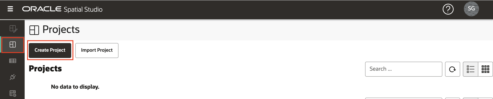
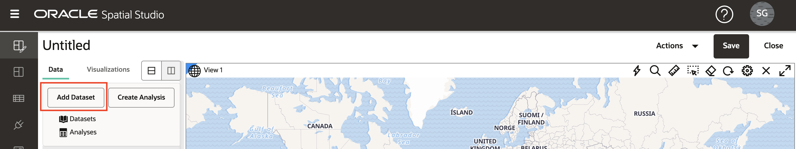
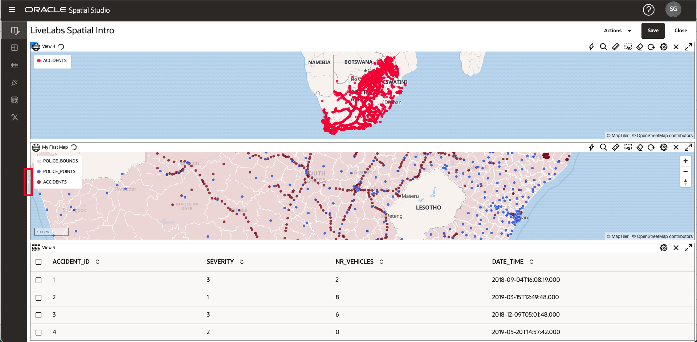

# 创建项目

## 简介

在 Spatial Studio 中，项目是可视化和分析数据的地方。项目可以保存，以便您可以恢复工作，并且可以发布这些项目，以便您可以与其他人共享结果。在此练习中，您将创建并保存第一个项目。

估计的实验室时间：30 分钟

### 目标

*   了解如何创建和保存项目
*   了解如何向项目添加数据集
*   了解如何可视化数据集

### 先备条件

*   成功完成实验室 1：加载空间数据

## 任务 1：创建项目

1.  从左侧面板菜单中，导航到“项目”页，然后单击**创建项目**。 
    
2.  单击 **Add Dataset** 按钮并选择 **Add Dataset** 。 
    
3.  选择“意外事故”并单击**确定**。 
    
4.  将 ACCIDENTS 数据集拖放到地图上。这将创建一个地图层。
    
    **注：**要在地图中四处移动，您可以使用鼠标滚轮放大/缩小，然后单击并拖动以平移。
    
5.  您可以根据需要配置地图设置，包括标签、导航控件小部件、比例栏和图例。单击齿轮图标可访问地图设置。选择选项并单击**确定**以启用选择。 您可以保留这些更改或返回“设置”并关闭选项。
    
6.  在“图层列表”面板中，单击“意外事件”的汉堡图标，然后选择“设置”。 
    
7.  在此处，您可以控制层显示和交互设置。您将在后面的部分中试验这些功能。目前，只需更新层的半径（大小）、颜色和不透明度，然后单击**返回**链接。 
    

## 任务 2：添加数据集

1.  接下来，向项目添加 2 个警察数据集。单击“数据元素”面板顶部的**添加数据集**按钮，选择**添加数据集**，使用 shift-enter 选择两个警察数据集，然后单击**确定**。 
    
2.  与之前使用 ACCIDENTS 时一样，将 POLICE\_POINTS 数据集从“数据元素”面板拖放到该面板上 , 单击 POLICE\_POINT 层的操作菜单并选择“设置”。更新半径、颜色、不透明度。然后单击 "Layers”（层）面板顶部的 **Back（返回）**链接。 
    
3.  当图层添加到地图中时，它们在现有图层之上呈现。因此，POLICE\_POINTS 当前位于 ACCIDENTS 的顶部。要对图层重新排序，使 POLICE\_POINTS 位于 ACCIDENTS 下方，请将鼠标移到图层列表中的 POLICE\_POINTS 上方，单击并按住（您将看到光标更改为交叉毛），然后拖到 ACCIDENTS 下。 
    
4.  将 POLICE\_BOUNDS 数据集拖放到地图上。与 POLICE\_POINTS 一样，对层重新排序，以便 POLICE\_BOUNDS 位于底部（即在其他层下呈现）。您现在已将 3 个数据集添加为项目中的地图层。
    

**注：**通过单击层名称旁边的眼球图标，可以关闭/打开各个层。

5.  单击 POLICE\_BOUNDS 层的汉堡菜单并选择“Settings（设置）”。更新填充和大纲的颜色和不透明度。请注意，使用白色大纲可以减少较暗大纲的杂乱效果。 

单击 "Layer Settings" 面板顶部的 **Back** 链接以返回到 "Layers List"。

## 任务 3：添加可视化

1.  Spatial Studio 允许您将数据集显示为映射和表。要添加可视化，请单击左侧的**可视化**选项卡，然后将**表**拖放到现有地图视图的边缘。表可以删除时，将显示一个灰色条形。

2.  将**映射**拖放到现有映射上方。当您将鼠标悬停在现有地图的边缘时，灰色条会出现，并且可能会落入新地图中。

3.  单击左上角的 **Datasets（数据集）**按钮，然后将 ACCIDENTS 拖放到表中。

4.  将 ACCIDENTS 拖放到新地图中。

5.  要折叠“数据元素”面板并提供更多屏幕房地产，请将鼠标悬停在右边缘并单击灰色箭头。

6.  要展开“Data Elements（数据元素）”面板，请将鼠标悬停在左边缘，然后单击灰色箭头。

7.  通过单击右上方的 **X** 图标删除可视化。我们将在本研习会中仅使用初始映射，因此请删除新表并绘制您刚才创建的映射。

## 任务 4：保存项目

1.  单击右上角的**保存**按钮以保存项目并提供名称，例如 **LiveLabs Spatial Intro** 。 
    
2.  从左侧导航栏导航到“项目”页面，并观察您的项目现在已列出。 
    

现在，您可以[进入下一个练习](#next)。

## 了解详细信息

*   ［Spatial Studio 产品门户］ (https://oracle.com/goto/spatialstudio)

## 确认

*   **作者** - David Lapp，Oracle 数据库产品管理
*   **上次更新者/日期** - Denise Myrick，数据库产品管理，2023 年 4 月