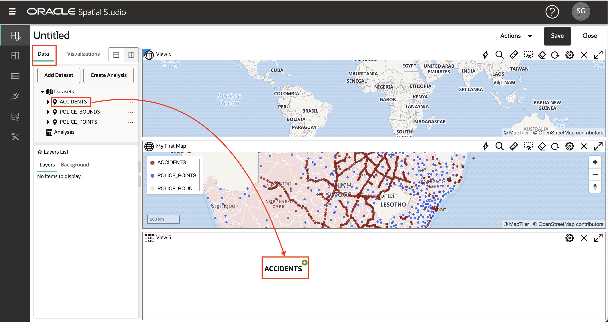
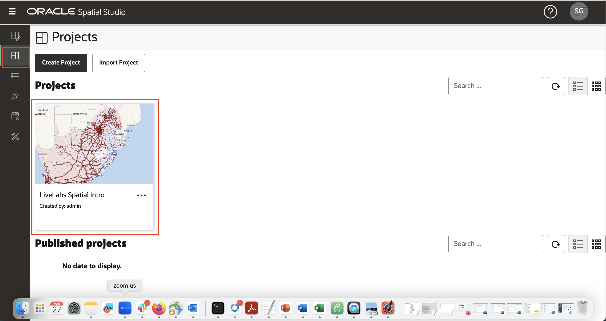

# 建立專案

## 簡介

在 Spatial Studio 中，您可以將資料視覺化並進行分析。您可以儲存專案以便繼續工作，而且可以發布專案，以便與其他人共用您的結果。在此實驗室中，您可以建立並儲存第一個專案。

預估實驗室時間：30 分鐘

### 目標

*   瞭解如何建立及儲存專案
*   瞭解如何將資料集新增至專案
*   瞭解如何將資料集視覺化

### 先決條件

*   已順利完成實驗室 1：載入空間資料

## 作業 1：建立專案

1.  從左側面板功能表，瀏覽至「專案 (Projects)」頁面，然後按一下**建立專案 (Create Project)** 。 
    
2.  按一下**新增資料集**按鈕，然後選取**新增資料集**。 
    
3.  選取「事故」並按一下**確定**。 
    
4.  將 ACCIDENTS 資料集拖放至對應。這會建立地圖圖層。
    
    **備註：**若要在地圖中四處移動，您可以使用滑鼠滾輪放大 / 縮小，然後按一下並拖曳以移動。
    
5.  您可以選擇性地設定地圖設定值，包括標籤、導覽控制小工具、刻度列和圖例。按一下齒輪圖示即可存取地圖設定值。選取選項並按一下**確定**以啟用選項。 您可以保留這些變更或返回「設定值」，然後關閉選項。
    
6.  在「圖層清單」面板中，按一下「意外事故」的漢堡圖示，然後選取「設定」。 
    
7.  您可以在此處控制圖層顯示與互動設定。您將會在稍後的區段中嘗試這些功能。此刻，只要更新層的「半徑 (大小)」、「顏色」和「不透明度」，然後按一下**上一步 (Back)** 連結。 
    

## 作業 2：新增資料集

1.  接下來，請將您的 2 個警察資料集新增至專案。按一下「資料元素」面板上方的**新增資料集**按鈕，選取**新增資料集**，使用 Shift-enter 同時選取警察資料集，然後按一下**確定**。 
    
2.  先前使用 ACCIDENTS 時，將 POLICE\_POINTS 資料集從「資料元素」面板拖放至上方，按一下 POLICE\_POINT 層動作功能表並選取「設定值」。更新半徑、顏色、不透明度。然後按一下「圖層」面板上方的**上一步**連結。 
    
3.  當「圖層」新增至地圖時，它們會轉譯在現有「圖層」上方。因此，POLICE\_POINTS 目前位於 ACCIDENTS 之上。若要重新排序層級，使 POLICE\_POINTS 位於 ACCIDENTS 之下，請將滑鼠移至「圖層」清單中的 POLICE\_POINTS 上，按一下並按住 (您將會看到游標變更為十字準星)，然後在 ACCIDENTS 下拖曳。 
    
4.  將 POLICE\_BOUNDS 資料集拖放至地圖。和 POLICE\_POINTS 一樣，請重新排列圖層，讓 POLICE\_BOUNDS 位於底部 (即其他圖層下方呈現)。您現在已將 3 個資料集新增為專案中的對應圖層。
    

**備註：**按一下圖層名稱旁邊的眼球圖示，即可關閉 / 開啟個別圖層。

5.  按一下 POLICE\_BOUNDS 層的漢堡功能表，然後選取「設定值」。更新填滿與大綱的顏色與不透明度。請注意，使用白色外框可減少變暗外框的雜亂效果。 

按一下「圖層設定」面板上方的**上一步**連結，以返回「圖層清單」。

## 作業 3：新增視覺化

1.  Spatial Studio 可讓您將資料集顯示為地圖和表格。若要新增視覺化，請按一下左側的**視覺化**頁籤，然後將**表格**拖放至現有地圖檢視的邊緣。當表格可以放入時，您會看到灰色長條。

2.  將 **Map** 拖放至現有地圖上方。當您將游標停留在現有地圖的邊緣時，會出現灰色的長條，並可在新地圖中放置。

3.  按一下左上方的**資料集**按鈕，然後將 ACCIDENTS 拖放至表格中。

4.  將 ACCIDENTS 拖放至新對應。

5.  若要收合「資料元素」面板並提供更多螢幕不動產，請將游標停留在右邊，然後按一下灰色箭頭。

6.  若要展開「資料元素」面板，請將游標停留在左邊，然後按一下灰色箭頭。

7.  您可以按一下右上角的 **X** 圖示來刪除視覺化。我們將只在此研討會中使用我們的初始地圖，因此請刪除新表格並對應您剛才建立的地圖。

## 作業 4：儲存專案

1.  按一下右上方的**儲存**按鈕，以儲存專案並提供名稱，例如 **LiveLabs Spatial Intro** 。 
    
2.  從左側導覽列瀏覽至「專案 (Projects)」頁面，隨即會列出您的「專案 (Projects)」。 
    

您現在可以[進入下一個實驗室](#next)。

## 進一步瞭解

*   \[Spatial Studio 產品入口網站 \] (https://oracle.com/goto/spatialstudio)

## 確認

*   **作者** - Oracle 資料庫產品管理 David Lapp
*   **上次更新者 / 日期** - Denise Myrick，Database Product Management，2023 年 4 月