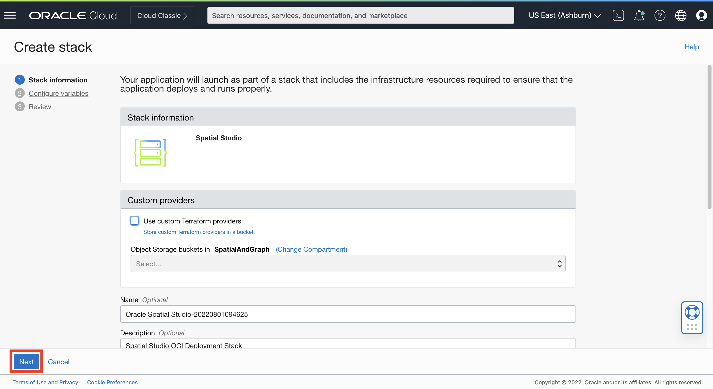
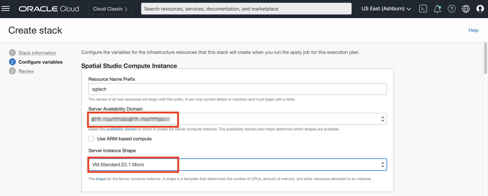
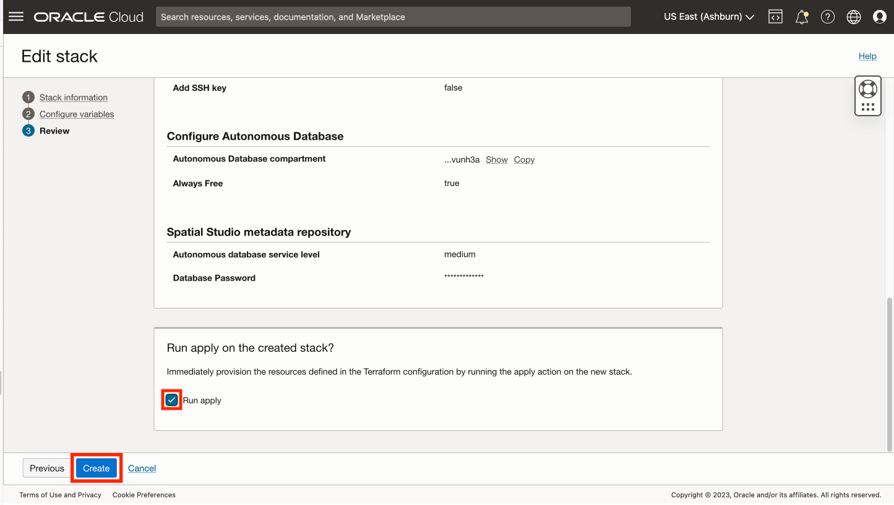

# Spatial Studio in Oracle Cloud bereitstellen

## Einführung

In dieser Übung stellen Sie Spatial Studio über den Cloud Marketplace mit Ressourcen vom Typ "Immer kostenlos" bereit. Der Cloud Marketplace übernimmt die Installation und Konfiguration von Spatial Studio und einer Autonomous Database. Die erstellte Spatial Studio-Instanz soll temporär für diesen Workshop verwendet werden.

Geschätzte Laborzeit: 15 Minuten

Sehen Sie sich das Video unten an, um einen schnellen Durchgang des Labors zu erhalten.

[Spatial Studio in Oracle Cloud bereitstellen](videohub:1_63orvw8q)

### Ziele

In dieser Übung führen Sie folgende Schritte aus:

*   Stellen Sie Spatial Studio über den Oracle Cloud Marketplace mit Ressourcen vom Typ "Immer kostenlos" bereit.

### Voraussetzungen

*   Oracle Cloud-Account
*   Sie sind Administrator für den Cloud-Account.

## Aufgabe 1: Verfügbarkeit der Compute-Ressource prüfen

Bevor Sie das Spatial Studio-Deployment starten, müssen Sie prüfen, ob die Availability-Domain eine Quota für die Compute-Ausprägung vom Typ "Immer kostenlos" aufweist.

1.  Navigieren Sie zu **Governance und Administration > Limits, Quota und Nutzung**.
    
    
    
2.  Im Menü "Geltungsbereich" werden Availability-Domains aufgeführt. Wählen Sie die erste Availability-Domain aus, geben Sie im Menü "Ressource" **Mikro** ein, und wählen Sie **Cores für Standard.E2.1. Micro-VM-Instanzen**.
    
    
    
3.  In der Ergebnisliste werden Servicelimit (Quota), Nutzung und Verfügbarkeit der ausgewählten Ausprägung in der ausgewählten Availability-Domain angezeigt. Im folgenden Beispiel ist keine Verfügbarkeit für die ausgewählte Availability-Domain vorhanden.
    
    
    
4.  Wenn die ausgewählte Availability-Domain keine Quota hat, wechseln Sie zur nächsten Availability-Domain, und geben Sie erneut **micro** im Menü "Ressource" ein, und wählen Sie **Cores für Standard.E2.1. Micro-VM-Instanzen**. In diesem Fall hat die zweite Availability-Domain eine Quota.
    
    
    

Beachten Sie, dass die Availability-Domain über eine Quota für Ihre Ziel-Compute-Ausprägung verfügt, da Sie sie bei der Installation von Spatial Studio im Cloud Marketplace auswählen müssen.

## Aufgabe 2: Spatial Studio über Cloud Marketplace installieren

1.  Klicken Sie oben links auf das Hamburger-Symbol, um das Hauptnavigationsmenü zu öffnen. Wählen Sie **Marketplace** aus, und klicken Sie auf **Alle Anwendungen**.
    
    
    
2.  Suchen Sie nach **räumlich**, und klicken Sie auf die **Oracle Spatial Studio**\-App.
    
    **Hinweis:** Stellen Sie sicher, dass Sie "Oracle Spatial Studio" und nicht "Oracle Spatial Studio for Roving Edge Infrastructure" auswählen.
    
    
    
3.  Wenn ein bevorzugtes Compartment vorhanden ist, wählen Sie es aus, andernfalls übernehmen Sie den Standardwert (Root). Akzeptieren Sie die Vertragsbedingungen, und klicken Sie auf **Stack starten**.
    
    
    
4.  Akzeptieren Sie die Standardwerte, und klicken Sie auf **Next**.
    
    
    
5.  Wählen Sie die Availability-Domain mit Quota aus, wie Sie in Aufgabe 1 angegeben haben. Wählen Sie die Ausprägung "Immer kostenlos" **VM.Standard.E2.1. Mikrobiologie**. Wenn Sie Cloud-Guthaben oder einen kostenpflichtigen Account haben, können Sie stattdessen eine kostenpflichtige Ausprägung auswählen.
    
    
    
    Scrollen Sie dann nach unten.
    
6.  Standardmäßig erlaubt Spatial Studio nur HTTPS-Zugriff, was eine zusätzliche Konfiguration für sicheren Zugriff erfordert. Für diesen Workshop stellen Sie eine temporäre Instanz bereit, die keine sensiblen Informationen enthält. Deaktivieren Sie daher **Nur HTTPS**, und lesen Sie den Hilfetext, um sicherzustellen, dass Sie die beabsichtigte Verwendung verstehen. Geben Sie für den Spatial Studio-Admin-Benutzernamen **admin** ein (in Kleinbuchstaben). Bei diesem Benutzernamen muss die Groß-/Kleinschreibung beachtet werden.
    
    
    
    Scrollen Sie dann nach unten.
    
7.  Geben Sie ein Kennwort für den Spatial Studio-Admin-Benutzer ein. Dies ist das Kennwort, das Sie bei der Anmeldung bei Spatial Studio verwenden.
    
    
    
    Scrollen Sie dann nach unten.
    
8.  Übernehmen Sie unter "Networking konfigurieren" die Standardeinstellungen für ein Netzwerk. Scrollen Sie dann nach unten.
    
9.  SSH-Schlüssel ermöglichen den Zugriff auf den Spatial Studio-Server zur Administration, wie das Neustarten der Instanz und das Prüfen von Logdateien. In diesem Fall ist Ihre Spatial Studio-Instanz temporär und für die Dauer dieses Workshops gedacht. Administration ist also nicht notwendig. Deaktivieren Sie daher die Option **SSH-Schlüssel hinzufügen**.
    

Scrollen Sie dann nach unten.

10.  Spatial Studio erfordert Zugriff auf eine Oracle Database. Aktivieren Sie das Kontrollkästchen "Immer kostenlos", und übernehmen Sie die anderen Standardwerte, damit Autonomous Database für Sie erstellt und konfiguriert wird. Wenn Sie Cloud-Guthaben oder einen kostenpflichtigen Account haben, können Sie dieses Kontrollkästchen deaktivieren und stattdessen eine kostenpflichtige Konfiguration auswählen.

Scrollen Sie dann nach unten.

11.  Wählen Sie für den Servicegrad der autonomen Datenbank die Option **Mittel** aus. Geben Sie dann ein Kennwort für den Datenbankbenutzer ein, der die Metadaten von Spatial Studio speichert. Dies wird bei der automatischen Konfiguration von Metadaten für Ihre Spatial Studio-Instanz verwendet. Sie müssen dieses Kennwort in diesem Workshop nicht erneut verwenden. Klicken Sie dann auf **Weiter**.

12.  Sie befinden sich jetzt im Schritt "Überprüfen" des Assistenten. Scrollen Sie nach unten, und stellen Sie sicher, dass **Run apply** aktiviert ist. Klicken Sie dann auf **Erstellen**.

13.  Warten Sie etwa 5 Minuten, bis sich der Status von "IN Bearbeitung" IN "Erfolgreich" ändert.

Warten Sie nach dem Status SUCCEEDED **weitere 5 Minuten**, bis die automatisierten Schritte nach der Installation abgeschlossen sind, bevor Sie fortfahren.

## Aufgabe 3: Bei Spatial Studio anmelden

1.  Klicken Sie auf die Registerkarte **Anwendungsinformationen** und dann auf den Link für **Spatial Studio-HTTP-URL**.
    
    
    
2.  Melden Sie sich mit dem Benutzernamen **admin** und dem Passwort an, das Sie in Schritt 7 oben eingegeben haben.
    
    
    
3.  Bewegen Sie nach der Anmeldung den Mauszeiger über die Symbole im Hauptnavigationsbereich auf der linken Seite, um QuickInfos mit den Seitennamen anzuzeigen.
    
    
    
4.  Sie können jederzeit auch auf das "Hamburger"-Symbol oben links klicken, um das Hauptnavigationsfenster ein- und auszublenden.
    
    
    

Sie sind jetzt angemeldet und können Spatial Studio jetzt verwenden.

Sie können jetzt **mit der nächsten Übung fortfahren**.

## Weitere Informationen

*   [Oracle Spatial-Produktseite](https://www.oracle.com/database/spatial)
*   [Erste Schritte mit Spatial Studio](https://www.oracle.com/database/technologies/spatial-studio/get-started.html)
*   [Dokumentation zu Spatial Studio](https://docs.oracle.com/en/database/oracle/spatial-studio)

## Danksagungen

*   **Autor** - David Lapp, Database Product Management, Oracle
*   **Mitwirkende** - Jesus Vizcarra
*   **Zuletzt aktualisiert am/um** - David Lapp, August 2023