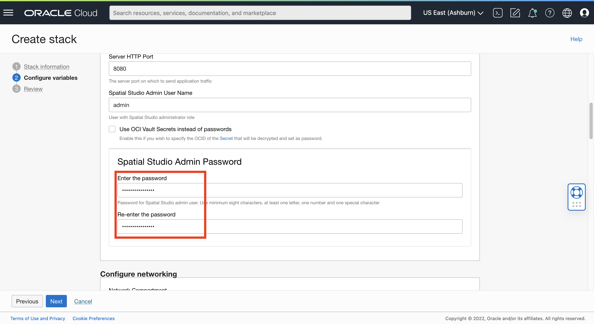

# Déploiement de Spatial Studio vers Oracle Cloud

## Présentation

Dans cet exercice, vous allez déployer Spatial Studio à partir de Cloud Marketplace à l'aide de ressources Always Free. Cloud Marketplace se charge de l'installation et de la configuration de Spatial Studio et d'une instance Autonomous Database. L'instance Spatial Studio créée est destinée à être temporaire lors de cet atelier.

Temps de laboratoire estimé : 15 minutes

Regardez la vidéo ci-dessous pour une présentation rapide du laboratoire.

[Déploiement de Spatial Studio vers Oracle Cloud](videohub:1_63orvw8q)

### Objectifs

Dans cet exercice, vous allez :

*   Déployez Spatial Studio à partir d'Oracle Cloud Marketplace à l'aide de ressources Toujours gratuit.

### Prérequis

*   Un compte Oracle Cloud
*   Vous êtes administrateur du compte cloud.

## Tâche 1 : vérifier la disponibilité de la ressource Compute

Avant de démarrer le déploiement de Spatial Studio, il est nécessaire de vérifier que le domaine de disponibilité dispose d'un quota pour la forme de calcul Toujours gratuit.

1.  Accédez à **Gouvernance et administration > Limites, quota et utilisation**.
    
    
    
2.  Le menu Scope répertorie les domaines de disponibilité. Sélectionnez le premier domaine de disponibilité, saisissez **micro** dans le menu Ressource et sélectionnez **Cores for Standard.E2.1. Instances de micro machine virtuelle**.
    
    
    
3.  La liste des résultats affiche la limite de service (quota), l'utilisation et la disponibilité de la forme sélectionnée dans le domaine de disponibilité sélectionné. Dans l'exemple ci-dessous, il n'existe aucune disponibilité pour le domaine de disponibilité sélectionné.
    
    
    
4.  Si le domaine de disponibilité sélectionné ne dispose pas de quota, passez au domaine de disponibilité suivant et entrez à nouveau **micro** dans le menu Ressource et sélectionnez **Coeurs pour Standard.E2.1. Instances de micro machine virtuelle**. Dans ce cas, le second domaine de disponibilité dispose d'un quota.
    
    
    

Notez que le domaine de disponibilité dispose d'un quota pour la forme de calcul cible, car vous devrez la sélectionner lors de l'installation de Spatial Studio à partir de Cloud Marketplace.

## Tâche 2 : installer Spatial Studio à partir de Cloud Marketplace

1.  Cliquez sur l'icône de menu en haut à gauche pour ouvrir le menu de navigation principal. Sélectionnez **Marketplace**, puis cliquez sur **Toutes les applications**.
    
    
    
2.  Recherchez **spatial**, puis cliquez sur l'application **Oracle Spatial Studio**.
    
    **Remarque :** veillez à sélectionner "Oracle Spatial Studio"et non"Oracle Spatial Studio for Roving Edge Infrastructure".
    
    
    
3.  Si vous disposez d'un compartiment préféré existant, sélectionnez-le, sinon conservez la valeur par défaut (racine). Acceptez les conditions générales et cliquez sur **Lancer la pile**.
    
    
    
4.  Acceptez les valeurs par défaut et cliquez sur **Suivant**.
    
    
    
5.  Sélectionnez le domaine de disponibilité disposant d'un quota, comme vous l'avez identifié dans la tâche 1. Sélectionnez la forme Toujours gratuit **VM.Standard.E2.1. Micro**. Si vous disposez de crédits cloud ou d'un compte payant, vous pouvez sélectionner une forme payante à la place.
    
    
    
    Ensuite, faites défiler vers le bas.
    
6.  Par défaut, Spatial Studio autorise uniquement l'accès HTTPS, ce qui nécessite une configuration supplémentaire pour un accès sécurisé. Pour cet atelier, vous déployez une instance temporaire qui n'inclura aucune information confidentielle. Par conséquent, désélectionnez **HTTPS uniquement** et lisez le texte d'aide pour vous assurer que vous comprenez l'utilisation prévue. Pour le nom utilisateur de l'administrateur Spatial Studio, entrez **admin** (en minuscules). Ce nom utilisateur fera la distinction entre les majuscules et les minuscules.
    
    
    
    Ensuite, faites défiler vers le bas.
    
7.  Entrez le mot de passe de l'administrateur Spatial Studio. Il s'agit du mot de passe que vous utiliserez lors de votre connexion à Spatial Studio.
    
    
    
    Ensuite, faites défiler vers le bas.
    
8.  Sous Configurer le réseau, conservez les valeurs par défaut pour qu'un réseau soit créé pour vous. Ensuite, faites défiler vers le bas.
    
9.  Les clés SSH permettent d'accéder au serveur Spatial Studio pour l'administration, par exemple pour redémarrer l'instance et vérifier les fichiers journaux. Dans ce cas, votre instance de Spatial Studio est temporaire, prévue pour la durée de cet atelier. L'administration n'est donc pas nécessaire. Par conséquent, **désactivez** l'option **Ajouter une clé SSH**.
    

Ensuite, faites défiler vers le bas.

10.  Spatial Studio requiert l'accès à une base de données Oracle Database. Cochez la case Always Free (Toujours gratuit) et acceptez les autres valeurs par défaut pour qu'une instance Autonomous Database soit créée et configurée pour vous. Si vous disposez de crédits cloud ou d'un compte payant, vous pouvez décocher cette case et sélectionner une configuration payante à la place.

Ensuite, faites défiler vers le bas.

11.  Pour le niveau de service de base de données autonome, sélectionnez **médium**. Entrez ensuite un mot de passe pour l'utilisateur de base de données qui stocke les métadonnées de Spatial Studio. Elle sera utilisée dans la configuration automatique des métadonnées pour votre instance Spatial Studio. Vous n'aurez plus besoin d'utiliser ce mot de passe dans cet atelier. Cliquez ensuite sur **Suivant**.

12.  Vous êtes maintenant à l'étape Vérification de l'assistant. Faites défiler l'affichage vers le bas et assurez-vous que la case **Exécuter l'application** est cochée. Cliquez ensuite sur **Créer**.

13.  Attendez environ 5 min pour que le statut passe de IN PROCESS à SUCCEEDED.

Une fois le statut SUCCEEDED, **attendez 5 minutes supplémentaires** pour que les étapes post-installation automatisées se terminent avant de continuer.

## Tâche 3 : Se connecter à Spatial Studio

1.  Cliquez sur l'onglet **Informations sur l'application**, puis sur le lien de l'**URL HTTP Spatial Studio**.
    
    
    
2.  Connectez-vous avec le nom d'utilisateur **admin** et le mot de passe que vous avez saisi à l'étape 7 ci-dessus.
    
    
    
3.  Une fois connecté, positionnez le pointeur de la souris sur les icônes dans le panneau de navigation principal à gauche pour voir les info-bulles avec les noms de page.
    
    
    
4.  A tout moment, vous pouvez également cliquer sur l'icône "hamburger" en haut à gauche pour développer et réduire le panneau de navigation principal.
    
    
    

Vous êtes maintenant connecté et prêt à utiliser Spatial Studio.

Vous pouvez maintenant **passer à l'exercice suivant**.

## En savoir plus

*   [Page produit Oracle Spatial](https://www.oracle.com/database/spatial)
*   [Lancez-vous avec Spatial Studio](https://www.oracle.com/database/technologies/spatial-studio/get-started.html)
*   [Documentation de Spatial Studio](https://docs.oracle.com/en/database/oracle/spatial-studio)

## Accusés de réception

*   **Auteur** - David Lapp, Database Product Management, Oracle
*   **Contributeurs** - Jesus Vizcarra
*   **Dernière mise à jour par/date** - David Lapp, août 2023