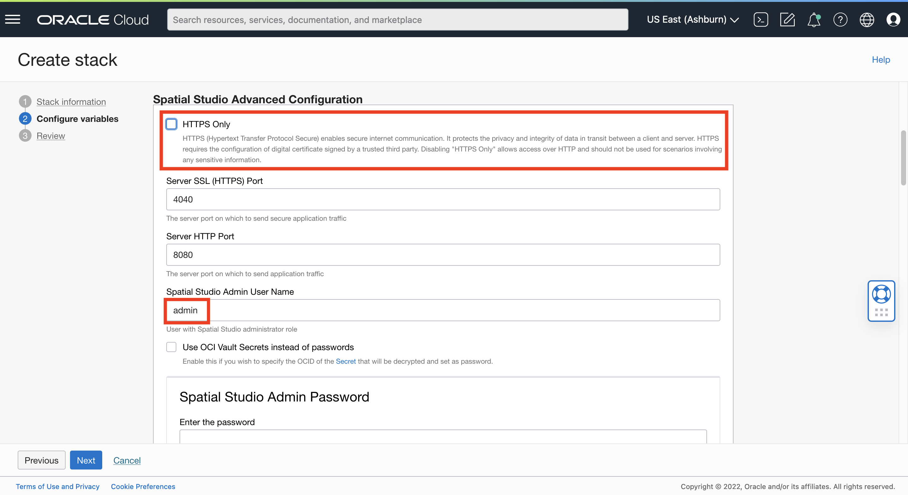

# Oracle Cloud에 Spatial Studio 배포

## 소개

이 실습에서는 상시 무료 리소스를 사용하여 Cloud Marketplace에서 Spatial Studio를 배포합니다. Cloud Marketplace는 Spatial Studio 및 Autonomous Database의 설치 및 구성을 처리합니다. 생성된 Spatial Studio 인스턴스는 이 워크샵 동안 사용할 수 있는 임시 인스턴스입니다.

예상 실험실 시간: 15분

실습 과정을 간단히 살펴보려면 아래 비디오를 시청하십시오.

[Oracle Cloud에 Spatial Studio 배포](videohub:1_63orvw8q)

### 목표

이 실습에서는 다음을 수행합니다.

*   항상 무료 리소스를 사용하여 Oracle Cloud Marketplace에서 Spatial Studio를 배포합니다.

### 필요 조건

*   Oracle Cloud 계정
*   귀하는 클라우드 계정의 관리자입니다.

## 작업 1: 컴퓨트 리소스의 가용성 확인

Spatial Studio 배포를 시작하기 전에 항상 무료 컴퓨트 구성에 대한 할당량이 있는 가용성 도메인을 확인해야 합니다.

1.  **거버넌스 및 관리 > 제한, 할당량 및 사용량**으로 이동합니다.
    
    
    
2.  The Scope menu lists availability domains. Select the first availability domain, type **micro** in the Resource menu, and select **Cores for Standard.E2.1.Micro VM Instances**.
    
    
    
3.  결과 목록에는 선택한 가용성 도메인에서 선택한 구성의 서비스 제한(쿼터), 사용량 및 가용성이 표시됩니다. 아래 예제에서는 선택한 가용성 도메인에 대한 가용성이 없습니다.
    
    
    
4.  If the selected availability domain does not have quota, change to the next availability domain and again enter **micro** in the Resource menu and select **Cores for Standard.E2.1.Micro VM Instances**. In this case, the second availability domain has quota.
    
    
    

Cloud Marketplace에서 Spatial Studio를 설치할 때 대상 컴퓨트 구성에 할당량이 있는 가용성 도메인을 선택해야 하므로 이를 선택해야 합니다.

## 작업 2: Cloud Marketplace에서 Spatial Studio 설치

1.  왼쪽 위에 있는 햄버거 아이콘을 눌러 주 탐색 메뉴를 엽니다. **마켓플레이스**를 선택한 다음 **모든 애플리케이션**을 누릅니다.
    
    
    
2.  **spatial**을 검색한 다음 **Oracle Spatial Studio** 앱을 누릅니다.
    
    **주:** "Oracle Spatial Studio for Roving Edge Infrastructure"가 아닌 "Oracle Spatial Studio"를 선택해야 합니다.
    
    
    
3.  기존 선호 구획이 있는 경우 선택한 후 기본값(루트)을 그대로 둡니다. 조항 및 조건에 동의하고 **스택 실행**을 누릅니다.
    
    
    
4.  기본값을 수락하고 **다음**을 누릅니다.
    
    
    
5.  작업 1에서 식별한 대로 할당량이 있는 가용성 도메인을 선택합니다. 항상 무료 구성 **VM.Standard.E2.1을 선택합니다. 마이크로**. 클라우드 크레딧 또는 유료 계정이 있는 경우 대신 유료 구성을 선택할 수 있습니다.
    
    
    
    그런 다음 아래로 이동합니다.
    
6.  기본적으로 Spatial Studio는 보안 액세스를 위해 추가 구성이 필요한 HTTPS 액세스만 허용합니다. 이 워크샵에서는 중요한 정보를 포함하지 않는 임시 instance를 배치합니다. 따라서 의도한 사용을 이해했는지 확인하려면 **HTTPS만**을 선택 취소하고 도움말 텍스트를 읽으십시오. Spatial Studio 관리자 사용자 이름에 **admin**(소문자)을 입력합니다. 이 사용자 이름은 대소문자를 구분합니다.
    
    
    
    그런 다음 아래로 이동합니다.
    
7.  Spatial Studio 관리자 사용자에 대한 비밀번호를 입력합니다. 이 비밀번호는 Spatial Studio에 로그인할 때 사용할 비밀번호입니다.
    
    
    
    그런 다음 아래로 이동합니다.
    
8.  Configure Networking(네트워킹 구성)에서 네트워크를 만들도록 기본값을 그대로 둡니다. 그런 다음 아래로 스크롤합니다.
    
9.  SSH 키를 사용하면 인스턴스 재시작 및 로그 파일 확인과 같은 관리를 위해 Spatial Studio 서버에 액세스할 수 있습니다. 이 경우 Spatial Studio 인스턴스는 이 워크샵 기간 동안 일시적입니다. 따라서 관리가 필요하지 않습니다. 따라서 **SSH 키 추가** 옵션을 **선택 해제**합니다.
    

그런 다음 아래로 이동합니다.

10.  Spatial Studio를 사용하려면 Oracle Database에 대한 액세스 권한이 필요합니다. Always Free 확인란을 선택하고 다른 기본값을 적용하여 Autonomous Database를 생성하고 구성합니다. 클라우드 크레딧 또는 유료 계정을 사용할 수 있는 경우 이 확인란의 선택을 취소하고 대신 유료 구성을 선택할 수 있습니다.

그런 다음 아래로 이동합니다.

11.  자율운영 데이터베이스 서비스 레벨의 경우 **medium**을 선택합니다. 그런 다음 Spatial Studio의 메타데이터를 저장하는 데이터베이스 사용자의 비밀번호를 입력합니다. Spatial Studio 인스턴스에 대한 메타데이터의 자동 구성에 사용됩니다. 이 워크샵에서는 이 암호를 다시 사용할 필요가 없습니다. 그런 다음 **다음**을 누릅니다.

12.  이제 마법사의 Review 단계를 진행합니다. 아래로 스크롤하여 **적용 실행**이 선택되어 있는지 확인합니다. 그런 다음 **생성**을 누릅니다.

13.  상태가 IN PROCESS에서 SUCCEEDED로 변경될 때까지 약 5분 정도 기다립니다.

상태가 SUCCEEDED이면 자동 설치 후 단계가 완료될 때까지 **5분 정도 기다려** 계속합니다.

## 작업 3: Spatial Studio에 로그인

1.  **애플리케이션 정보** 탭을 누른 다음 **Spatial Studio HTTP URL**에 대한 링크를 누릅니다.
    
    
    
2.  사용자 이름 **admin** 및 위의 7단계에서 입력한 암호로 로그인합니다.
    
    
    
3.  로그인한 후 왼쪽의 기본 탐색 패널에 있는 아이콘을 가리키면 페이지 이름이 포함된 도구 설명이 표시됩니다.
    
    
    
4.  언제든지 왼쪽 상단에 있는 "햄버거" 아이콘을 클릭하여 주 탐색 패널을 확장하고 축소할 수도 있습니다.
    
    
    

이제 로그인되어 Spatial Studio 사용을 시작할 준비가 되었습니다.

이제 **다음 실습을 진행하십시오**.

## 자세히 알아보기

*   [Oracle Spatial 제품 페이지](https://www.oracle.com/database/spatial)
*   [Spatial Studio 시작하기](https://www.oracle.com/database/technologies/spatial-studio/get-started.html)
*   [Spatial Studio 설명서](https://docs.oracle.com/en/database/oracle/spatial-studio)

## 확인

*   **작성자** - David Lapp, Oracle 데이터베이스 제품 관리
*   **기여자** - Jesus Vizcarra
*   **최종 업데이트 수행자/날짜** - David Lapp, 2023년 8월