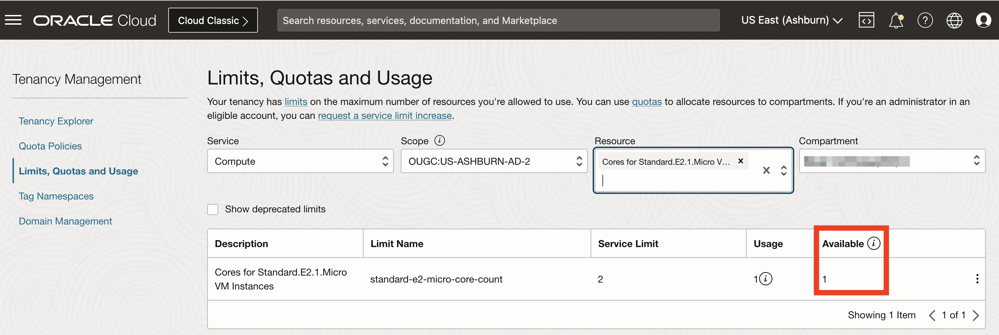
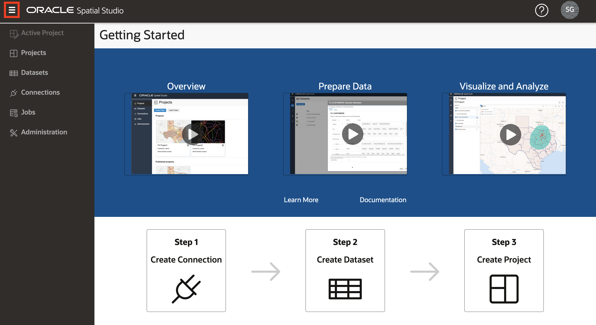

# Implantar o Spatial Studio para o Oracle Cloud

## Introdução

Neste laboratório, você implanta o Spatial Studio no Cloud Marketplace usando recursos Always Free. O Cloud Marketplace cuida da instalação e configuração do Spatial Studio e de um Autonomous Database. A instância do Spatial Studio criada deve ser temporária para uso durante este workshop.

Tempo de Laboratório Estimado: 15 minutos

Assista ao vídeo abaixo para uma rápida apresentação do laboratório.

[Implantar o Spatial Studio para o Oracle Cloud](videohub:1_63orvw8q)

### Objetivos

Neste laboratório, você vai:

*   Implante o Spatial Studio no Oracle Cloud Marketplace usando recursos Always Free.

### Pré-requisitos

*   Uma Conta no Oracle Cloud
*   Você é um Administrador da conta do Cloud.

## Tarefa 1: Verificar a disponibilidade do recurso de Computação

Antes de iniciar a implantação do Spatial Studio, é necessário verificar se o domínio de disponibilidade tem cota para a forma de computação Always Free.

1.  Navegue até **Governança e Administração > Limites, Cota e Uso**.
    
    
    
2.  O menu Escopo lista domínios de disponibilidade. Selecione o primeiro domínio de disponibilidade, digite **micro** no menu Recurso e selecione **Núcleos para Standard.E2.1. Micro Instâncias de VM**.
    
    
    
3.  A listagem de resultados mostra o limite de serviço (cota), o uso e a disponibilidade da forma selecionada no domínio de disponibilidade selecionado. No exemplo abaixo, não há disponibilidade para o domínio de disponibilidade selecionado.
    
    
    
4.  Se o domínio de disponibilidade selecionado não tiver cota, altere para o próximo domínio de disponibilidade e digite novamente **micro** no menu Recurso e selecione **Núcleos para Standard.E2.1. Micro Instâncias de VM**. Nesse caso, o segundo domínio de disponibilidade tem cota.
    
    
    

Observe que o domínio de disponibilidade tem cota para sua forma de computação de destino, pois você precisará selecioná-la ao instalar o Spatial Studio no Cloud Marketplace.

## Tarefa 2: Instalar o Spatial Studio no Cloud Marketplace

1.  Clique no ícone de hambúrguer no canto superior esquerdo para abrir o Menu de Navegação principal. Selecione **Marketplace** e clique em **Todos os Aplicativos**.
    
    
    
2.  Procure **espacial** e clique no aplicativo **Oracle Spatial Studio**.
    
    **Observação:** certifique-se de selecionar "Oracle Spatial Studio" e não "Oracle Spatial Studio for Roving Edge Infrastructure".
    
    
    
3.  Se você tiver um compartimento preferencial existente, selecione-o; caso contrário, deixe o padrão (raiz). Aceite os termos e condições e clique em **Iniciar Pilha**
    
    
    
4.  Aceite os padrões e clique em **Próximo**.
    
    
    
5.  Selecione o domínio de disponibilidade com cota, conforme identificado na Tarefa 1. Selecione a forma Always Free **VM.Standard.E2.1. Micro**. Se você tiver créditos de nuvem disponíveis ou uma conta paga, poderá selecionar uma forma paga.
    
    
    
    Em seguida, role para baixo.
    
6.  Por padrão, o Spatial Studio permite apenas acesso HTTPS, o que requer configuração adicional para acesso seguro. Neste workshop, você está implantando uma instância temporária que não incluirá informações confidenciais. Portanto, desmarque **Somente HTTPS** e leia o texto de ajuda para ter certeza de que entendeu o uso pretendido. Para o Nome de Usuário Admin do Spatial Studio, informe **admin** (letra minúscula). Esse nome de usuário fará distinção entre maiúsculas e minúsculas.
    
    
    
    Em seguida, role para baixo.
    
7.  Informe uma senha para o usuário administrador do Spatial Studio. Esta é a senha que você usará ao fazer log-in no Spatial Studio.
    
    
    
    Em seguida, role para baixo.
    
8.  Em Configurar rede, deixe os padrões para ter uma rede criada para você. Em seguida, role para baixo.
    
9.  As chaves SSH permitem o acesso ao servidor do Spatial Studio para administração, como reiniciar a instância e verificar arquivos de log. Nesse caso, sua instância do Spatial Studio é temporária, destinada à duração deste workshop. A administração não é necessária. Portanto, **desmarque** a opção **Adicionar chave SSH**.
    

Em seguida, role para baixo.

10.  O Spatial Studio requer acesso a um Oracle Database. Marque a caixa Always Free e aceite que os outros padrões tenham um Autonomous Database criado e configurado para você. Se você tiver créditos de nuvem disponíveis ou uma conta paga, desmarque essa caixa e selecione uma configuração paga.

Em seguida, role para baixo.

11.  Para nível de serviço de banco de dados Autônomo, selecione **médio**. Em seguida, digite uma senha para o usuário do banco de dados que armazena os metadados do Spatial Studio. Isso será usado na configuração automática de metadados para sua instância do Spatial Studio. Você não precisará usar essa senha novamente neste workshop. Em seguida, clique em **Próximo**.

12.  Agora você está na etapa Revisar do assistente. Role até a parte inferior e certifique-se de que a opção **Executar aplicação** esteja marcada. Em seguida, clique em **Criar**.

13.  Aguarde aproximadamente 5 minutos para que o status mude de EM PROCESSO para SUCEDIDO.

Depois que o status for SUCCEEDED, **aguarde mais 5 minutos** para concluir as etapas automatizadas de pós-instalação antes de continuar.

## Tarefa 3: Fazer login no Spatial Studio

1.  Clique na guia **Informações do Aplicativo** e, em seguida, clique no link do **URL HTTP do Spatial Studio**.
    
    
    
2.  Faça login com o nome de usuário **admin** e a senha informada na Etapa 7 acima.
    
    
    
3.  Uma vez conectado, passe o mouse sobre os ícones no painel de navegação principal à esquerda para ver dicas de ferramentas com os nomes das páginas.
    
    
    
4.  A qualquer momento, você também pode clicar no ícone "hambúrguer" no canto superior esquerdo para expandir e recolher o painel de navegação principal.
    
    
    

Agora você está conectado e pronto para começar a usar o Spatial Studio.

Agora você pode **prosseguir para o próximo laboratório**.

## Saiba mais

*   [Página do produto Oracle Spatial](https://www.oracle.com/database/spatial)
*   [Conceitos Básicos do Spatial Studio](https://www.oracle.com/database/technologies/spatial-studio/get-started.html)
*   [Documentação do Spatial Studio](https://docs.oracle.com/en/database/oracle/spatial-studio)

## Agradecimentos

*   **Autor** - David Lapp, Database Product Management, Oracle
*   **Colaboradores** - Jesus Vizcarra
*   **Última Atualização em/Data** - David Lapp, agosto de 2023