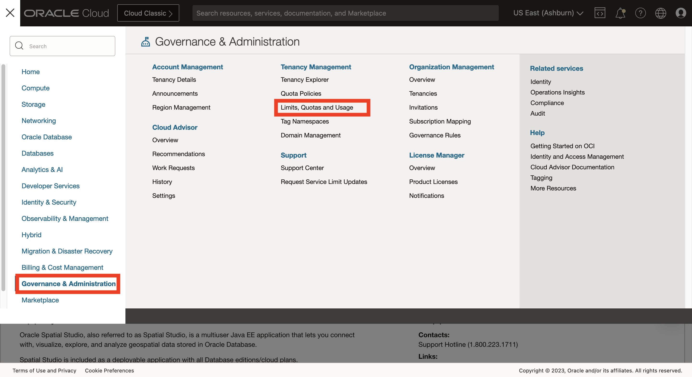
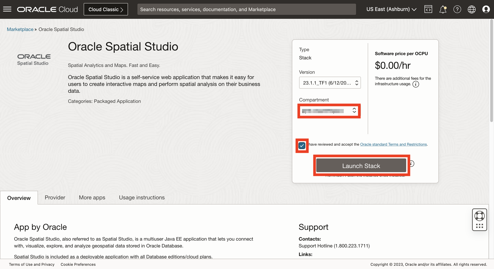

# 将 Spatial Studio 部署到 Oracle Cloud

## 简介

在此实验室中，您将使用“始终免费”资源从云市场部署 Spatial Studio。云市场负责安装和配置 Spatial Studio 和 Autonomous Database。创建的 Spatial Studio 实例是本课堂练习期间临时使用的实例。

估计的实验室时间：15 分钟

观看下面的视频，快速浏览实验室。

[将 Spatial Studio 部署到 Oracle Cloud](videohub:1_63orvw8q)

### 目标

在此实验室中，您将：

*   使用始终免费资源从 Oracle Cloud Marketplace 部署 Spatial Studio。

### 先备条件

*   Oracle Cloud 账户
*   您是 Cloud 账户的管理员。

## 任务 1：验证计算资源的可用性

在开始 Spatial Studio 部署之前，需要验证可用性域是否具有“始终免费”计算配置的限额。

1.  导航到**监管和管理 > 限额、限额和使用量**。
    
    
    
2.  "Scope"（范围）菜单列出了可用性域。选择第一个可用性域，在 "Resource"（资源）菜单中键入 **micro（微）**，然后选择 **Cores for Standard.E2.1。微 VM 实例**。
    
    
    
3.  结果列表显示了所选可用性域中所选配置的服务限制（配额）、使用情况和可用性。在下面的示例中，所选可用性域没有可用性。
    
    
    
4.  如果所选可用性域没有限额，请更改为下一个可用性域，然后在“资源”菜单中再次输入**微**，然后选择 **Cores for Standard.E2.1。微 VM 实例**。在这种情况下，第二个可用性域具有限额。
    
    
    

请注意，可用性域对目标计算配置具有限额，因为从云市场安装 Spatial Studio 时需要选择该可用性域。

## 任务 2：从云市场安装 Spatial Studio

1.  单击左上角的汉堡图标打开主导航菜单。选择**市场**，然后单击**所有应用程序**。
    
    
    
2.  搜索 **spatial** ，然后单击 **Oracle Spatial Studio** 应用程序。
    
    **注：**请确保选择 "Oracle Spatial Studio" 而不是 "Oracle Spatial Studio for Roving Edge Infrastructure"。
    
    
    
3.  如果您有现有的首选区间，请选择该区间，否则保留默认值（根）。接受条款和条件，然后单击**启动堆栈**
    
    
    
4.  接受默认值，然后单击**下一步**。
    
    
    
5.  选择具有限额的可用性域，如您在任务 1 中所标识的那样。选择“始终免费”配置 **VM.Standard.E2.1。微型**。如果您有可用的云储值或付费账户，您可以改为选择付费配置。
    
    
    
    然后向下滚动。
    
6.  默认情况下，Spatial Studio 仅允许 HTTPS 访问，这需要额外的配置才能进行安全访问。在本研讨会中，您将部署一个不包含任何敏感信息的临时实例。因此，取消选中 **HTTPS only** 并读取帮助文本以确保您理解预期用法。对于 Spatial Studio 管理员用户名，输入 **admin** （小写）。此用户名将区分大小写。
    
    
    
    然后向下滚动。
    
7.  输入 Spatial Studio 管理员用户的密码。这是登录 Spatial Studio 时将使用的密码。
    
    
    
    然后向下滚动。
    
8.  在 "Configure Networking"（配置网络）下，保留默认设置以为您创建网络。然后向下滚动。
    
9.  SSH 密钥允许访问 Spatial Studio 服务器以进行管理，例如重新启动实例和检查日志文件。在这种情况下，Spatial Studio 实例是临时实例，用于本研讨会期间。因此，不需要管理。因此，**取消选中****添加 SSH 密钥**选项。
    

然后向下滚动。

10.  Spatial Studio 需要访问 Oracle Database。勾选“Always Free（始终免费）”框，并接受其他默认值，即为您创建和配置 Autonomous Database。如果您有可用的云储值或付费账户，可以取消勾选此框并选择付费配置。

然后向下滚动。

11.  对于自治数据库服务级别，选择 **medium** 。然后为存储 Spatial Studio 元数据的数据库用户输入密码。这将在 Spatial Studio 实例的元数据自动配置中使用。在此研习会中，您无需再次使用此密码。然后单击**下一步**。

12.  您现在已进入向导的“复查”步骤。滚动到底部并确保选中**运行应用**。然后单击**创建**。

13.  请等待大约 5 分钟，使状态从“处理”更改为“成功”。

状态为 SUCCEEDED 后，**等待额外 5 分钟**以完成自动安装后步骤，然后再继续。

## 任务 3：登录到 Spatial Studio

1.  单击**应用程序信息**选项卡，然后单击 **Spatial Studio HTTP URL** 的链接。
    
    
    
2.  使用用户名 **admin** 和您在上面的步骤 7 中输入的密码登录。
    
    
    
3.  登录后，将鼠标悬停在左侧主导航面板中的图标上，以查看包含页面名称的工具提示。
    
    
    
4.  您还可以随时单击左上角的“汉堡”图标以展开和折叠主导航面板。
    
    
    

您现在已登录并准备开始使用 Spatial Studio。

现在，您可以**进入下一个练习**。

## 了解详细信息

*   [Oracle Spatial 产品页面](https://www.oracle.com/database/spatial)
*   [Spatial Studio 入门](https://www.oracle.com/database/technologies/spatial-studio/get-started.html)
*   [Spatial Studio 文档](https://docs.oracle.com/en/database/oracle/spatial-studio)

## 确认

*   **作者** - David Lapp，Oracle 数据库产品管理
*   **贡献者** - Jesus Vizcarra
*   **上次更新者/日期** - David Lapp，2023 年 8 月