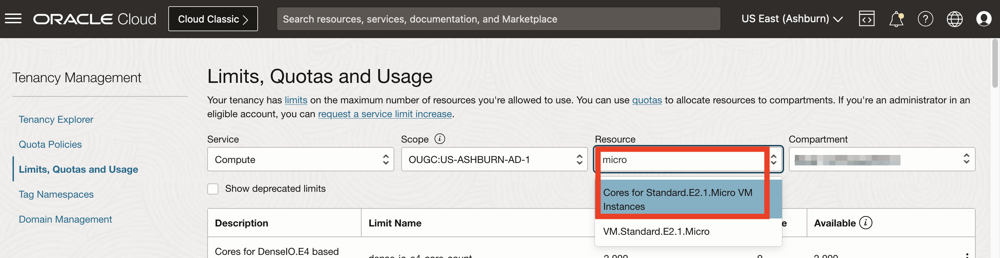
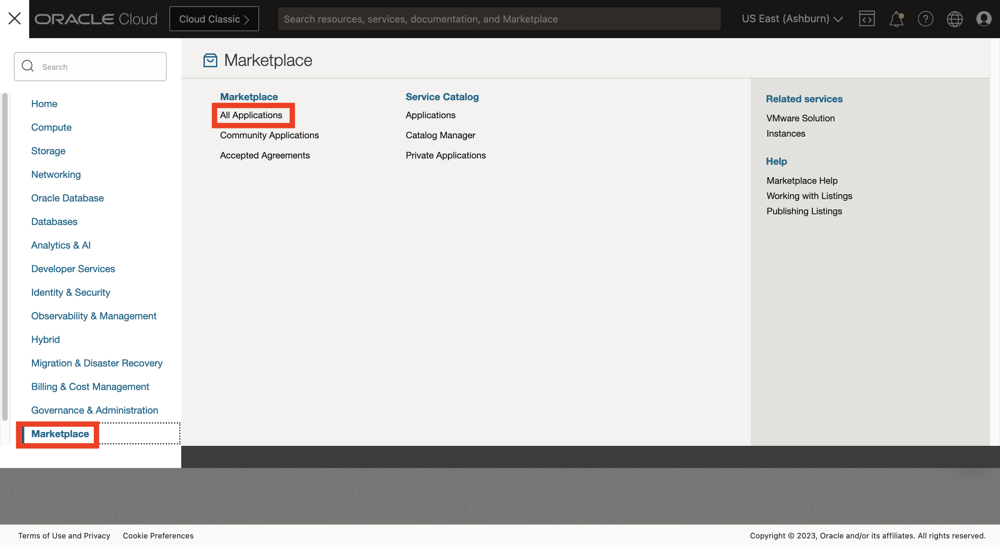
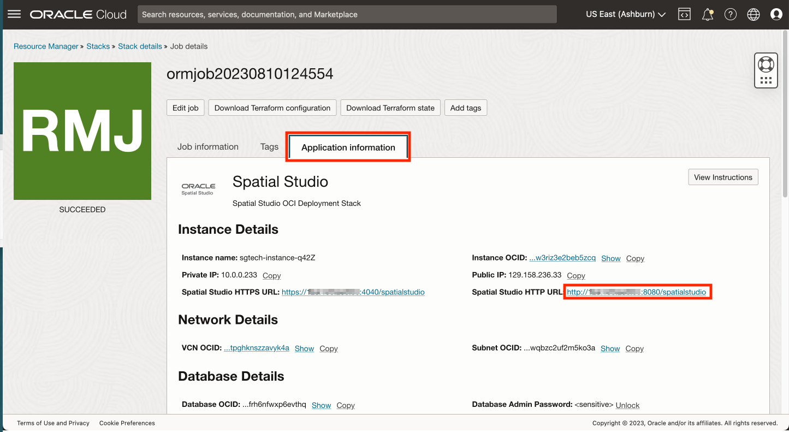

# 將 Spatial Studio 部署至 Oracle Cloud

## 簡介

在這個實驗室中，您會使用永遠免費資源，從 Cloud Marketplace 部署 Spatial Studio。Cloud Marketplace 負責安裝並設定 Spatial Studio 和 Autonomous Database。建立的 Spatial Studio 執行處理是此研習期間暫時使用的執行處理。

預估實驗室時間：15 分鐘

請觀看下方影片，快速瞭解實驗室的逐步解說。

[將 Spatial Studio 部署至 Oracle Cloud](videohub:1_63orvw8q)

### 目標

在此實驗室中，您將：

*   使用永遠免費資源從 Oracle Cloud Marketplace 部署 Spatial Studio。

### 先決條件

*   一個 Oracle Cloud 帳戶
*   您是雲端帳戶的管理員。

## 任務 1：確認運算資源的可用性

開始進行 Spatial Studio 部署之前，必須先確認可用性網域的永遠免費運算資源配置配額。

1.  瀏覽至**治理與管理 (Governance & Administration) > 限制、配額和使用狀況**。
    
    
    
2.  「範圍」功能表會列出可用性網域。選取第一個可用性網域，在「資源」功能表中輸入 **micro** ，然後選取 **Cores for Standard.E2.1。微型 VM 執行處理**。
    
    
    
3.  結果清單顯示所選可用性網域中所選資源配置的服務限制 (配額)、使用狀況以及可用性。下方範例中沒有所選可用性網域的可用性。
    
    
    
4.  如果選取的可用性網域沒有配額，請變更為下一個可用性網域，然後在「資源」功能表中輸入**微型**，然後選取 **Cores for Standard.E2.1。微型 VM 執行處理**。在此情況下，第二個可用性網域會有配額。
    
    
    

請特別注意目標運算資源配置有配額的可用性網域，因此從 Cloud Marketplace 安裝 Spatial Studio 時必須選取此資源配置。

## 作業 2：從 Cloud Marketplace 安裝 Spatial Studio

1.  按一下左上方的漢堡圖示以開啟主要「導覽功能表」。選取 **Marketplace** ，然後按一下**所有應用程式**。
    
    
    
2.  搜尋**空間**，然後按一下 **Oracle Spatial Studio** 應用程式。
    
    **注意：**請確定您選取 "Oracle Spatial Studio"，而非 "Oracle Spatial Studio for Roving Edge Infrastructure"。
    
    
    
3.  如果您有現有的偏好區間，請選取該區間，否則請保留預設值 (root) . 接受條款與條件，然後按一下**啟動堆疊**
    
    
    
4.  接受預設值，然後按一下**下一步**。
    
    
    
5.  選取具有配額的可用性網域，如「作業 1」中所識別。選取永遠免費資源配置 **VM.Standard.E2.1。微型**。如果您有可用的雲端點數或付費帳戶，您可以改為選取付費資源配置。
    
    
    
    然後向下捲動。
    
6.  依照預設，Spatial Studio 僅允許 HTTPS 存取，因此需要額外的配置才能進行安全存取。您正在為此研討會建置的暫時執行處理，不會包含任何機密資訊。因此，請取消勾選 **HTTPS** 並讀取說明文字，以確定您已瞭解預期的使用狀況。若為 Spatial Studio 管理員使用者名稱，請輸入 **admin** (小寫)。此使用者名稱會區分大小寫。
    
    
    
    然後向下捲動。
    
7.  輸入 Spatial Studio 管理員使用者的密碼。這是您在登入 Spatial Studio 時將使用的密碼。
    
    
    
    然後向下捲動。
    
8.  在 \[Configure Networking\] (設定網路) 底下，讓預設值為您建立網路。然後向下捲動。
    
9.  SSH 金鑰可以存取 Spatial Studio 伺服器來進行管理，例如重新啟動執行處理和檢查日誌檔。在此情況下，您的 Spatial Studio 實例是暫時的，代表此研習的持續時間。因此不需要管理。因此， **uncheck** \[ **Add SSH key** \] (取消勾選) 選項。
    

然後向下捲動。

10.  Spatial Studio 需要存取 Oracle Database。勾選「永遠免費」方塊並接受其他預設值，以便為您建立並設定 Autonomous Database。如果您有可用的雲端點數或付費帳戶，您可以取消勾選此方塊並改為選取付費組態。

然後向下捲動。

11.  若為自治式資料庫服務層次，請選取**中**。然後輸入儲存 Spatial Studio 描述資料的資料庫使用者密碼。這將用於自動設定您 Spatial Studio 執行處理的描述資料。您將不需要在此研討會中再次使用此密碼。然後按一下**下一步 (Next)** 。

12.  您現在正在精靈的「複查」步驟中。捲動到底部，並確定已勾選**執行套用**。然後按一下**建立 (Create)** 。

13.  等待大約 5 分鐘，使狀態從 IN PROCESS 變更為 SUCCEEDED。

狀態為 SUCCEEDED 之後，請先**等待 5 分鐘**自動後續安裝步驟完成，然後再繼續進行。

## 工作 3：登入 Spatial Studio

1.  按一下**應用程式資訊**頁籤，然後按一下 **Spatial Studio HTTP URL** 的連結。
    
    
    
2.  以使用者名稱 **admin** 和您在上述步驟 7 中輸入的密碼登入。
    
    
    
3.  登入之後，將游標停留在左側主要導覽面板的圖示上方，即可查看含有頁面名稱的工具提示。
    
    
    
4.  您隨時可以按一下左上方的「漢堡」圖示來展開與收合主要導覽面板。
    
    
    

您現在已登入，可以開始使用 Spatial Studio。

您現在可以**進入下一個實驗室**。

## 進一步瞭解

*   [Oracle Spatial 產品頁面](https://www.oracle.com/database/spatial)
*   [開始使用 Spatial Studio](https://www.oracle.com/database/technologies/spatial-studio/get-started.html)
*   [Spatial Studio 文件](https://docs.oracle.com/en/database/oracle/spatial-studio)

## 確認

*   **作者** - Oracle 資料庫產品管理 David Lapp
*   **貢獻者** - Jesus Vizcarra
*   **上次更新者 / 日期** - David Lapp，2023 年 8 月