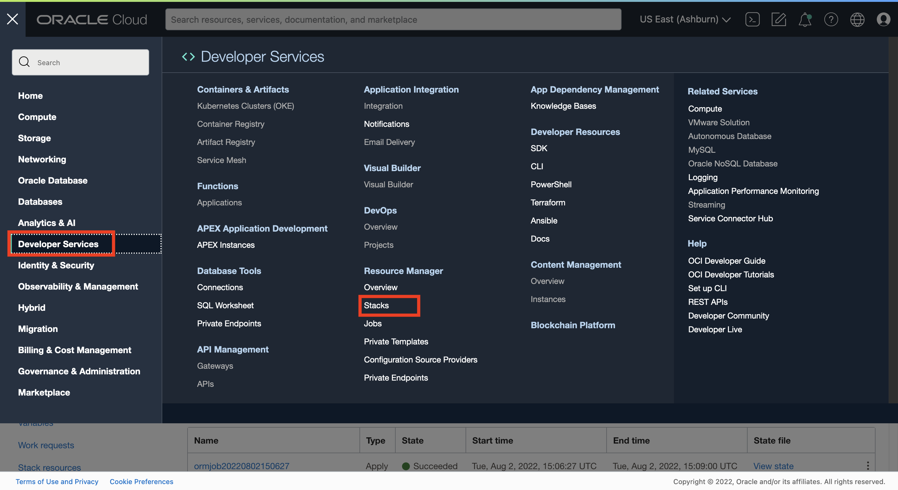
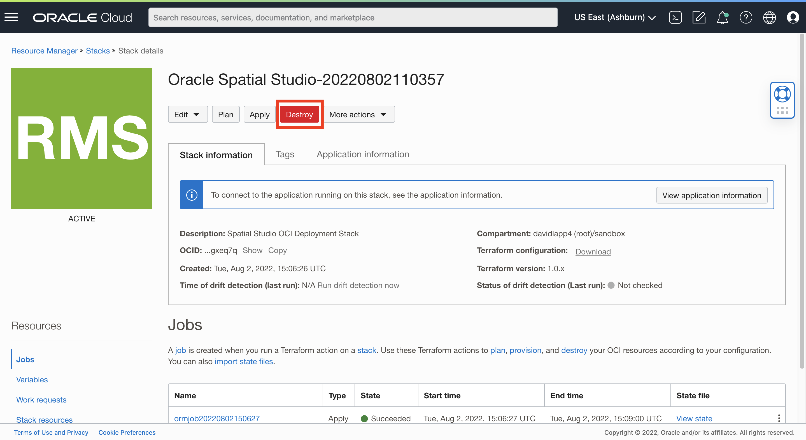
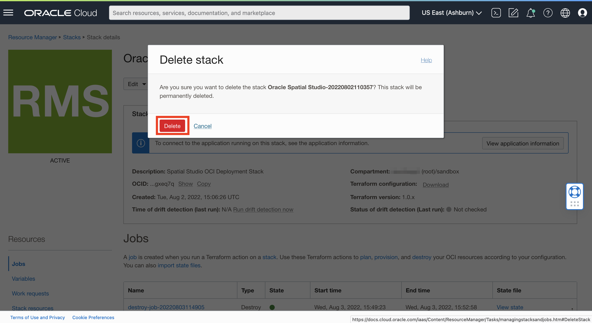

# 정리

## 소개

이 실습에서는 Cloud Marketplace를 사용하여 생성된 Spatial Studio 인스턴스의 배치를 해제합니다. Spatial Studio 배포의 일부로 생성된 모든 리소스를 Cloud Marketplace에서 영구적으로 삭제합니다.

예상 실험 시간: 5분

실습 과정을 간단히 살펴보려면 아래 비디오를 시청하십시오.

[정리 옵션 2: Spatial Studio 및 ADB 종료](videohub:1_1jnminp7)

### 목표

이 실습에서는 다음을 수행합니다.

*   Oracle Cloud Marketplace에서 생성된 Spatial Studio 및 관련 리소스의 배포를 취소합니다.

### 필요 조건

*   Cloud Marketplace에서 배포된 Spatial Studio

## 작업 1: 배치된 리소스 비우기

Spatial Studio 인스턴스를 만드는 데 사용되는 스택으로 이동합니다.

1.  **개발자 서비스 > 스택**으로 이동합니다.
    
    
    
2.  스택의 작업 메뉴에서 **스택 세부정보 보기**를 선택합니다.
    
    
    
3.  **삭제**를 누릅니다. 그러면 Spatial Studio Marketplace 배포에서 만든 리소스가 제거됩니다.
    
    
    
4.  **Destroy**를 다시 눌러 확인합니다.
    
    
    
5.  프로세스가 완료될 때까지 3-4분 정도 기다립니다. Jobs 섹션에서 상태를 살펴봅니다. 상태가 **성공**이면 실업이 완료되고 Spatial Studio Marketplace 배포에서 프로비저닝한 모든 리소스가 비워집니다.
    
    
    

## 작업 2: 스택 삭제(선택 사항)

스택은 배치 지침 세트입니다. Cloud Marketplace 마법사를 실행할 때 선택한 설정을 캡처합니다. 이제 스택을 실행할 때 생성된 리소스를 제거하여 Spatial Studio 인스턴스를 만들었으므로 스택 자체를 삭제할 수 있습니다. 스택을 삭제한 후 Spatial Studio를 다시 배포하려면 Cloud Marketplace에서 다시 시작해야 합니다. 스택을 그대로 유지하고 다시 실행하거나, SSH 키 추가와 같은 매개변수를 수정하여 장기 인스턴스를 만들 수 있습니다.

1.  스택의 **추가 작업** 메뉴에서 **스택 삭제**를 선택합니다.
    
    
    
2.  확인 메시지가 표시되면 **삭제**를 누릅니다.
    
    
    
3.  Cloud Marketplace 마법사에서 생성한 모든 아티팩트(리소스 및 스택 모두)가 사라졌습니다.
    

## 자세히 알아보기

*   [Oracle Spatial 제품 페이지](https://www.oracle.com/database/spatial)
*   [Spatial Studio 시작하기](https://www.oracle.com/database/technologies/spatial-studio/get-started.html)
*   [Spatial Studio 설명서](https://docs.oracle.com/en/database/oracle/spatial-studio)

## 확인

*   **작성자** - David Lapp, Oracle 데이터베이스 제품 관리
*   **기여자** - Jesus Vizcarra
*   **최종 업데이트 수행자/날짜** - David Lapp, 2023년 8월