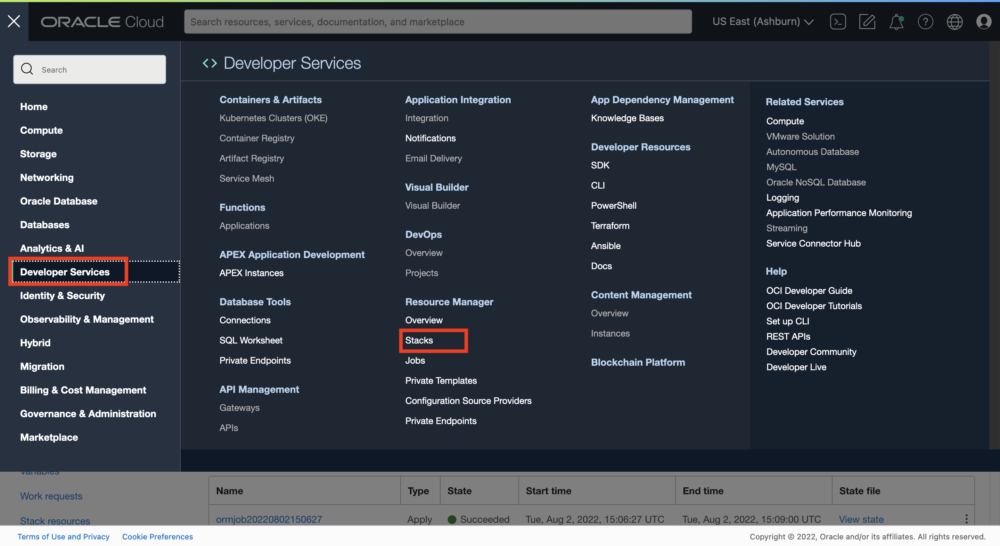
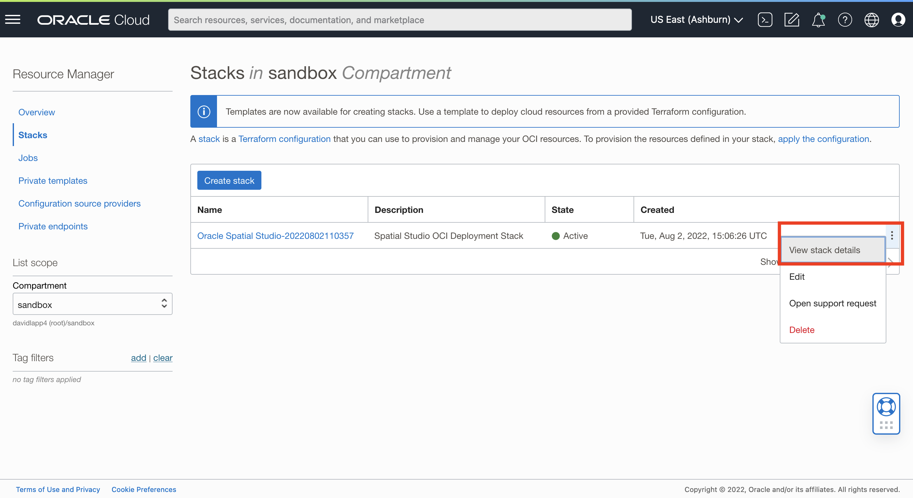
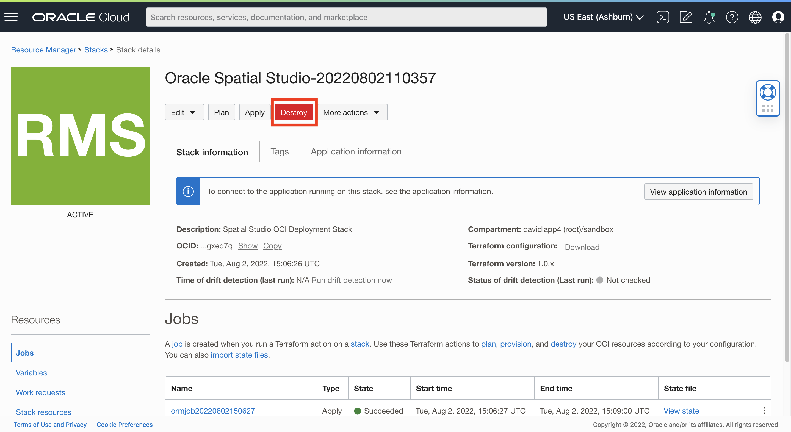
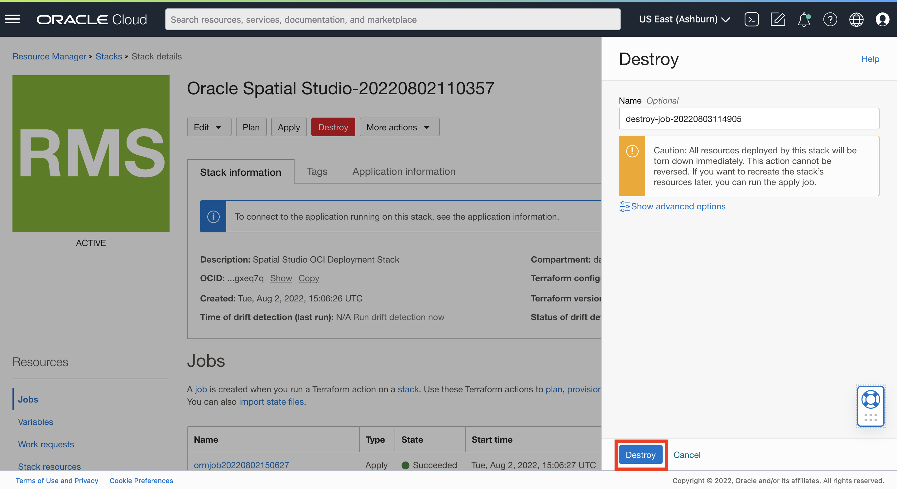
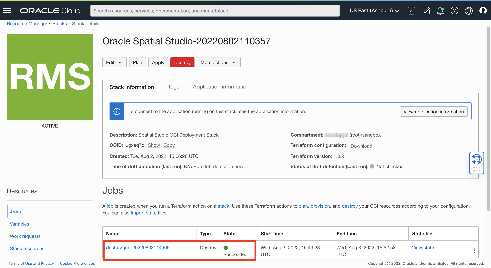
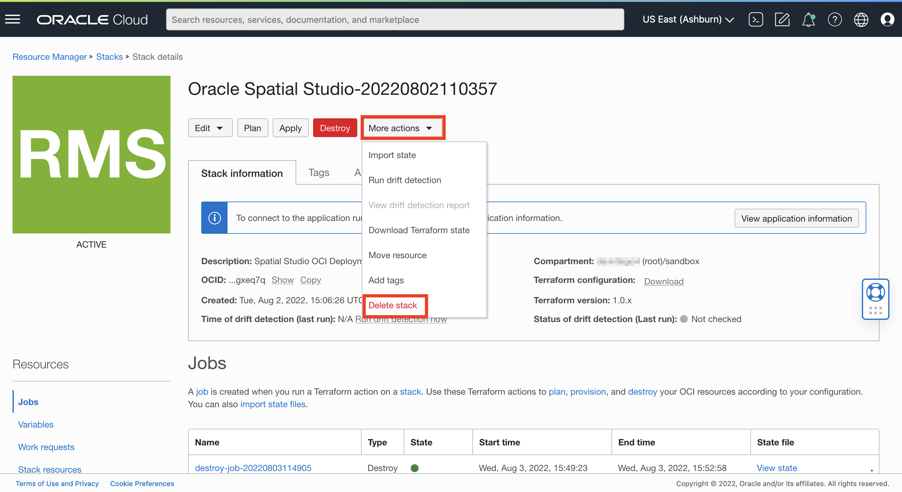
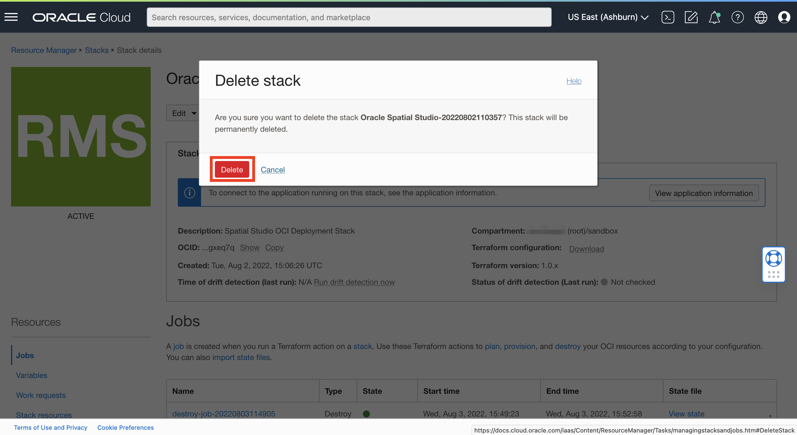

# Limpar

## Introdução

Neste laboratório, você cancela a implantação da instância do Spatial Studio criada usando o Cloud Marketplace. O expurga permanentemente todos os recursos criados como parte da implantação do Spatial Studio do Cloud Marketplace.

Tempo de Laboratório Estimado: 5 minutos

Assista ao vídeo abaixo para uma rápida apresentação do laboratório.

[Opção de limpeza 2: Encerrar Spatial Studio e ADB](videohub:1_1jnminp7)

### Objetivos

Neste laboratório, você vai:

*   Cancele a implantação do Spatial Studio e dos recursos relacionados criados no Oracle Cloud Marketplace.

### Pré-requisitos

*   Spatial Studio implantado no Cloud Marketplace

## Tarefa 1: Expurgar Recursos Implantados

Navegue até a pilha usada para criar sua instância do Spatial Studio.

1.  Navegue até **Developer Services > Stacks**.
    
    
    
2.  No menu de ação da sua pilha, selecione **Exibir detalhes da pilha**.
    
    
    
3.  Clique em **Destruir**. Isso limpará os recursos criados pela implantação do Spatial Studio Marketplace.
    
    
    
4.  Confirme clicando novamente em **Destruir**.
    
    
    
5.  Aguarde cerca de 3 a 4 minutos para que o processo seja concluído. Observe o status na seção Jobs. Quando o status é **Bem-sucedido**, o desemprego é concluído e todos os recursos provisionados pela implantação do Spatial Studio Marketplace são expurgados.
    
    
    

## Tarefa 2: Excluir a Pilha (Opcional)

A pilha é o conjunto de instruções para implantação. Ele captura as configurações selecionadas ao executar o assistente do Cloud Marketplace. Agora que você expurgou recursos criados ao executar a pilha para criar sua instância do Spatial Studio, poderá excluir a própria pilha. Depois de excluir a pilha, para implantar o Spatial Studio novamente, você precisará começar de novo com o Cloud Marketplace. Você também pode manter a pilha e executá-la novamente no estado em que se encontra ou editá-la para modificar parâmetros, como adicionar uma chave SSH para criar uma instância de longo prazo.

1.  No menu **Mais ação** da pilha, selecione **Excluir pilha**.
    
    
    
2.  Quando solicitado a confirmar, clique em **Excluir**
    
    
    
3.  Todos os artefatos criados pelo assistente do Cloud Marketplace, recursos e pilha, agora desapareceram.
    

## Saiba Mais

*   [Página do produto Oracle Spatial](https://www.oracle.com/database/spatial)
*   [Conceitos Básicos do Spatial Studio](https://www.oracle.com/database/technologies/spatial-studio/get-started.html)
*   [Documentação do Spatial Studio](https://docs.oracle.com/en/database/oracle/spatial-studio)

## Agradecimentos

*   **Autor** - David Lapp, Database Product Management, Oracle
*   **Colaboradores** - Jesus Vizcarra
*   **Última Atualização em/Data** - David Lapp, agosto de 2023