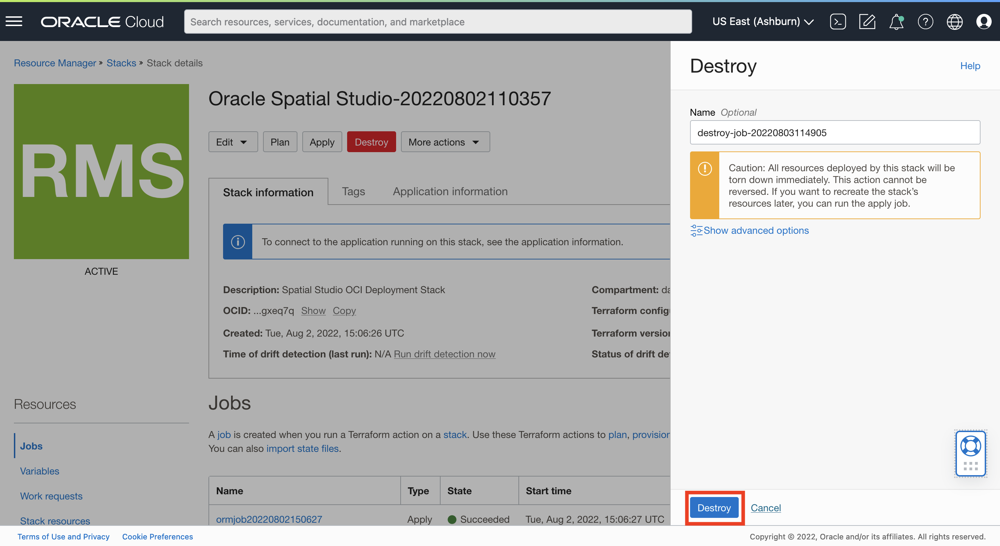
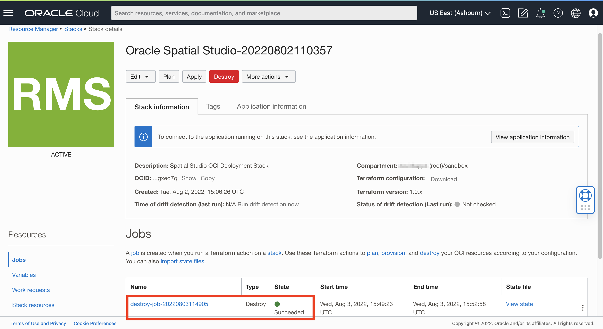

# 清除

## 简介

在此练习中，您将取消部署使用云市场创建的 Spatial Studio 实例。从云市场中永久清除在 Spatial Studio 部署过程中创建的所有资源。

估计的实验室时间：5 分钟

观看下面的视频，快速浏览实验室。

[清除选项 2：终止 Spatial Studio 和 ADB](videohub:1_1jnminp7)

### 目标

在此实验室中，您将：

*   取消部署 Spatial Studio 和从 Oracle Cloud Marketplace 创建的相关资源。

### 先备条件

*   从云市场部署 Spatial Studio

## 任务 1：清除部署的资源

导航到用于创建 Spatial Studio 实例的堆栈。

1.  导航到**开发人员服务 > 堆栈**。
    
    
    
2.  从堆栈的操作菜单中，选择**查看堆栈详细信息**。
    
    
    
3.  单击**销毁**。这将清除由 Spatial Studio Marketplace 部署创建的资源。
    
    
    
4.  通过再次单击**销毁**来确认。
    
    
    
5.  等待大约 3-4 分钟完成该过程。观察 "Jobs"（作业）部分中的状态。当状态为**成功**时，失业率已完成，Spatial Studio Marketplace 部署预配的所有资源都将被清除。
    
    
    

## 任务 2：删除堆栈（可选）

堆栈是部署的一组指令。它捕获您在运行云市场向导时选择的设置。现在，您已清除在运行堆栈以创建 Spatial Studio 实例时创建的资源，现在可以删除堆栈本身。删除堆栈后，为了再次部署 Spatial Studio，您需要从云市场重新开始。您还可以保留堆栈并按原样重新运行它，或者编辑它以修改参数，例如添加 SSH 密钥以创建长期实例。

1.  从堆栈的**更多操作**菜单中，选择**删除堆栈**。
    
    
    
2.  当提示确认时，单击**删除**
    
    
    
3.  云市场向导创建的所有构件（资源和堆栈）现在都已丢失。
    

## 了解详细信息

*   [Oracle Spatial 产品页面](https://www.oracle.com/database/spatial)
*   [Spatial Studio 入门](https://www.oracle.com/database/technologies/spatial-studio/get-started.html)
*   [Spatial Studio 文档](https://docs.oracle.com/en/database/oracle/spatial-studio)

## 确认

*   **作者** - David Lapp，Oracle 数据库产品管理
*   **贡献者** - Jesus Vizcarra
*   **上次更新者/日期** - David Lapp，2023 年 8 月