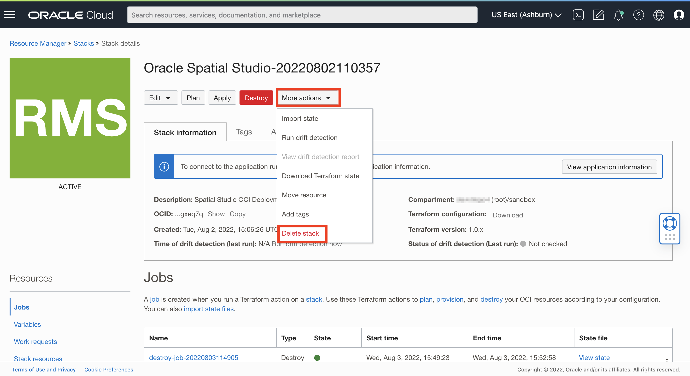

# 清除

## 簡介

在此實驗室中，您將取消部署使用 Cloud Marketplace 建立的 Spatial Studio 執行處理。永久清除從 Cloud Marketplace 永久清除 Spatial Studio 部署所建立的所有資源。

預估實驗室時間：5 分鐘

請觀看下方影片，快速瞭解實驗室的逐步解說。

[清除選項 2：終止 Spatial Studio 和 ADB](videohub:1_1jnminp7)

### 目標

在此實驗室中，您將：

*   取消部署 Spatial Studio 和從 Oracle Cloud Marketplace 建立的相關資源。

### 先決條件

*   從 Cloud Marketplace 部署的 Spatial Studio

## 作業 1：永久清除部署的資源

瀏覽至用來建立 Spatial Studio 執行處理的堆疊。

1.  瀏覽至**開發人員服務 (Developer Services) > 堆疊 (Stacks)** 。
    
    
    
2.  從堆疊的動作功能表中，選取**檢視堆疊詳細資訊**。
    
    
    
3.  按一下**毀棄 (Destroy)** 。這將會永久清除 Spatial Studio Marketplace 部署所建立的資源。
    
    
    
4.  再次按一下**毀棄**以確認。
    
    
    
5.  等待大約 3-4 分鐘的程序完成。觀察「職務」區段中的狀態。當狀態為**成功**時，即會完成失業，並清除 Spatial Studio Marketplace 部署所佈建的所有資源。
    
    
    

## 作業 2：刪除堆疊 (選擇性)

堆疊是部署的一組指示。它會擷取您在執行 Cloud Marketplace 精靈時所選取的設定值。現在您已永久清除執行堆疊以建立 Spatial Studio 執行處理時所建立的資源，您現在可以刪除堆疊本身。刪除堆疊之後，若要再次部署 Spatial Studio，您需要從 Cloud Marketplace 開始。您也可以保留堆疊並將其依原樣重新執行，或編輯堆疊以修改參數 (例如新增 SSH 金鑰以建立更長期的執行處理)。

1.  從堆疊的 \[ **更多動作** \] 功能表，選取 \[ **刪除堆疊** \]。
    
    
    
2.  提示確認時，請按一下**刪除**
    
    
    
3.  Cloud Marketplace 精靈建立的所有使用者自建物件 (包括資源和堆疊) 現在都已消失。
    

## 進一步瞭解

*   [Oracle Spatial 產品頁面](https://www.oracle.com/database/spatial)
*   [開始使用 Spatial Studio](https://www.oracle.com/database/technologies/spatial-studio/get-started.html)
*   [Spatial Studio 文件](https://docs.oracle.com/en/database/oracle/spatial-studio)

## 確認

*   **作者** - Oracle 資料庫產品管理 David Lapp
*   **貢獻者** - Jesus Vizcarra
*   **上次更新者 / 日期** - David Lapp，2023 年 8 月