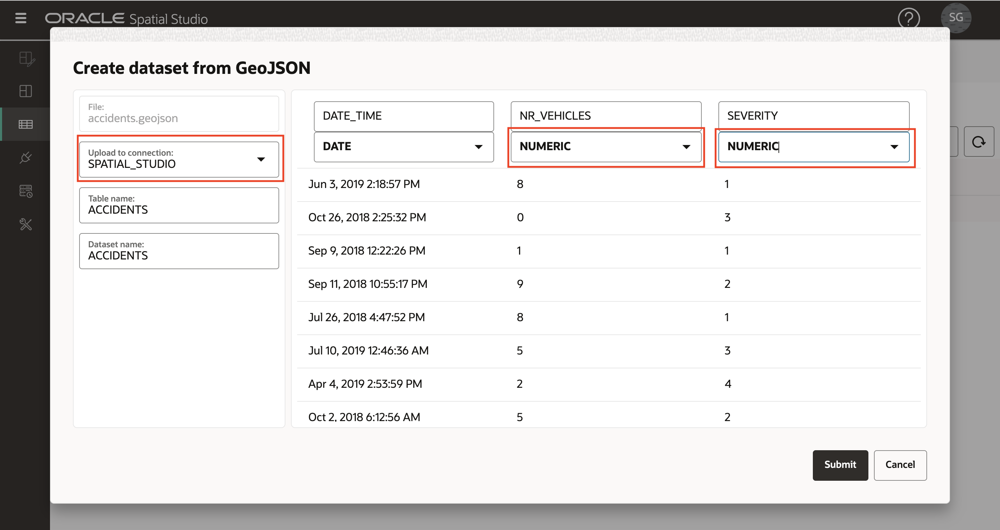

# Räumliche Daten laden

## Einführung

Spatial Studio arbeitet mit Daten, die in Oracle-Datenbanken gespeichert sind. In Spatial Studio arbeiten Sie mit "Datasets", d.h. Datenbanktabellen und Views, auf die über Datenbankverbindungen zugegriffen wird. Datasets sind Zeiger auf Datenbanktabellen und Views und können benutzerfreundliche Namen erhalten, die selbstbeschreibender sind als der Name der zugrunde liegenden Datenbanktabelle oder View.

Benutzer müssen häufig Daten aus verschiedenen Quellen einbeziehen. Um dies zu unterstützen, bietet Spatial Studio Funktionen zum Laden von Daten aus Standardformaten in Oracle Database. Dazu gehört das Laden der 2 gängigsten Formate für den Austausch räumlicher Daten: Shapefiles und GeoJSON-Dateien. In dieser Übung werden die Schritte zum Laden räumlicher Daten in diese Formate mit Spatial Studio beschrieben.

Zusätzlich zum Laden räumlicher Formate unterstützt Spatial Studio das Laden von Kalkulationstabellen. In diesem Fall ist eine zusätzliche Vorbereitung erforderlich, um Geometrien aus räumlichen Attributen wie Adressen ("Adressgeocoding") und Breiten-/Längengradkoordinaten ("Koordinatenindexierung") abzuleiten. Diese Fälle werden in diesem Labor nicht behandelt, sondern Gegenstand eines separaten Labors sein.

Geschätzte Laborzeit: 15 Minuten

### Ziele

*   Erfahren Sie, wie Sie räumliche Daten aus Shapefiles und GeoJSON laden
*   Erfahren Sie, wie Sie Schlüsselfelder für Datensets festlegen

### Voraussetzungen

*   Diese Übung erfordert Zugriff auf Spatial Studio und Oracle Database.
*   Um diese über den Oracle Cloud Marketplace bereitzustellen, navigieren Sie [hier](https://cloud.oracle.com/marketplace/application/71472162/overview) zum Eintrag (Sie werden aufgefordert, sich bei Ihrem Oracle Cloud-Account anzumelden) und befolgen Sie die Anweisungen [hier](https://blogs.oracle.com/database/post/oracle-spatial-studio-221-now-on-cloud-marketplace).
*   Es ist keine vorherige Erfahrung mit Oracle Spatial erforderlich.

## Aufgabe 1: Unfalldaten laden

Zunächst laden Sie eine Gruppe von Verkehrsunfalldaten aus einer GeoJSON-Datei. Die Daten sind fiktiv und wurden für zufällige Orte entlang der Straßen in Südafrika generiert.

1.  Laden Sie die Datei GeoJSON an einen geeigneten Speicherort herunter: [accidents.geojson](https://objectstorage.us-ashburn-1.oraclecloud.com/p/VEKec7t0mGwBkJX92Jn0nMptuXIlEpJ5XJA-A6C9PymRgY2LhKbjWqHeB5rVBbaV/n/c4u04/b/livelabsfiles/o/data-management-library-files/accidents.geojson).
    
2.  Navigieren Sie in Spatial Studio im linken Fensterbereichmenü zur Seite "Datasets", klicken Sie auf **Dataset erstellen**, und ziehen Sie accidents.geojson per Drag-and-Drop. Sie können auch auf den Uploadbereich klicken und zur Auswahl der Datei navigieren. 
    
3.  Eine Vorschau der GeoJSON-Daten wird angezeigt. Wählen Sie die Zielverbindung für diesen Upload aus. In diesem Workshop verwenden wir die Verbindung SPATIAL\_STUDIO (das Spatial Studio-Metadaten-Repository), aber in einem Produktionsszenario haben Sie andere Verbindungen für solche Geschäftsdaten, getrennt vom Metadaten-Repository. Legen Sie die Datentypen für NR\_VEHICLES und SEVERITY auf NUMERIC fest. Klicken Sie auf **Weiterleiten**, um den Upload zu starten. 
    
4.  Das hochgeladene ACCIDENTS-Dataset wird mit einem kleinen Warnsymbol aufgelistet, das angibt, dass ein Vorbereitungsschritt erforderlich ist. In diesem Fall müssen wir einen Dataset-Schlüssel hinzufügen. Obwohl dies für die grundlegende Kartierung nicht erforderlich ist, werden wir den Schlüssel jetzt hinzufügen, da wir ihn für Analysen in späteren Workshopabschnitten benötigen. Klicken Sie auf das Warnsymbol und dann auf den Link **Gehe zu Datensetspalten**. 
    
5.  Wenn unsere ACCIDENTS-Daten eine eindeutige ID-Spalte hatten, konnten wir sie als Schlüssel zuweisen. Aber diese fiktiven Daten haben keine solche Spalte, daher wird Spatial Studio eine erstellen. Klicken Sie auf **Schlüsselspalte erstellen**, setzen Sie den Namen auf ACCIDENT\_ID, und klicken Sie auf **Anwenden**.  Beobachten Sie das ACCIDENTS-Dataset, das jetzt ohne Warnungen aufgeführt wird. Dies bedeutet, dass es für Mapping- und räumliche Analysen vorbereitet ist. 
    

## Aufgabe 2: Daten der Polizeistation laden

Als nächstes laden Sie South African Police Service (SAPS) Stationen und Stationsgrenzen aus Shapefiles, die in einer einzigen ZIP-Datei gespeichert sind.

1.  Laden Sie die ZIP-Datei mit Shapefiles an einen geeigneten Speicherort herunter: [SAPS\_police.zip](https://objectstorage.us-ashburn-1.oraclecloud.com/p/VEKec7t0mGwBkJX92Jn0nMptuXIlEpJ5XJA-A6C9PymRgY2LhKbjWqHeB5rVBbaV/n/c4u04/b/livelabsfiles/o/data-management-library-files/SAPS_police.zip).
    
2.  Navigieren Sie zur Seite "Datasets", klicken Sie auf **Dataset erstellen**, und ziehen Sie SAPS\_police.zip per Drag-and-Drop. Spatial Studio extrahiert die Shapefiles aus der ZIP-Datei und verarbeitet sie einzeln. 
    
3.  Die erste Formdatei, die extrahiert wird, sind die Grenzen der Polizeistation, d.h. die geografischen Gebiete, die von Stationen überwacht werden. Wählen Sie die Zielverbindung aus, und setzen Sie die Tabellen- und Dataset-Namen auf POLICE\_BOUNDS. 
    
4.  Die zweite Formdatei, die extrahiert wird, sind Polizeistationen. Wählen Sie die Zielverbindung aus, und setzen Sie die Tabellen- und Dataset-Namen auf POLICE\_POINTS. 
    
5.  Die Datasets POLICE\_BOUNDS und POLICE\_POINTS werden jetzt mit Warnungen aufgelistet, da Schlüssel definiert werden müssen. Klicken Sie auf das Warnsymbol für POLICE\_BOUNDS und dann auf den Link **Gehe zu Datensetspalten**. 
    
6.  In diesem Fall ist eine eindeutige Spalte vorhanden, die als Schlüssel verwendet werden soll. Wählen Sie für die Spalte COMPNT\_NAME die Option **Als Schlüssel verwenden** aus, klicken Sie auf **Schlüssel validieren** und dann auf **Anwenden**. 
    
    Wiederholen Sie die Schritte 5 und 6, um den Schlüssel für Dataset POLICE\_POINTS festzulegen.
    
7.  Alle Datasets sind jetzt bereit für Mapping und räumliche Analyse 
    

Sie können jetzt [mit der nächsten Übung fortfahren](#next).

## Weitere Informationen

*   \[Produktportal für Spatial Studio\] (https://oracle.com/goto/spatialstudio)

## Danksagungen

*   **Autor** - David Lapp, Database Product Management, Oracle
*   **Zuletzt aktualisiert am/um** - Denise Myrick, Database Product Management, April 2023
*   **Laborablauf** - 31. März 2024