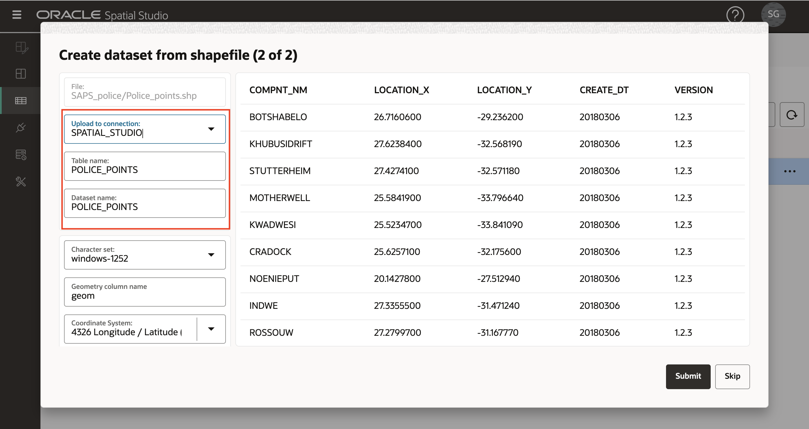

# Cargar datos espaciales

## Introducción

Spatial Studio funciona en datos almacenados en bases de datos Oracle. En Spatial Studio se trabaja con "Conjuntos de datos", que son tablas y vistas de base de datos a las que se accede a través de conexiones de base de datos. Los juegos de datos son punteros a tablas y vistas de base de datos y se les pueden asignar nombres fáciles de recordar para que sean más autodescriptivos que el nombre de vista o tabla de base de datos subyacente.

Los usuarios a menudo necesitan incorporar datos adquiridos de varias fuentes. Para ello, Spatial Studio proporciona funciones para cargar datos de formatos estándar en Oracle Database. Esto incluye la carga de los 2 formatos más comunes para el intercambio de datos espaciales: archivos de forma y archivos GeoJSON. Este laboratorio le guiará por los pasos para cargar datos espaciales en estos formatos mediante Spatial Studio.

Además de cargar formatos espaciales, Spatial Studio admite la carga de hojas de cálculo. En ese caso, se necesita una preparación adicional para derivar geometrías de atributos espaciales como direcciones ("geocodificación de dirección") y coordenadas de latitud/longitud ("índice de coordenadas"). Estos casos no están cubiertos en este laboratorio, pero serán objeto de un laboratorio separado.

Tiempo de laboratorio estimado: 15 minutos

### Objetivos

*   Aprenda a cargar datos espaciales desde Shapefiles y GeoJSON
*   Aprender a definir campos clave para conjuntos de datos

### Requisitos

*   Este laboratorio requiere acceso a Spatial Studio y Oracle Database.
*   Para desplegarlos desde Oracle Cloud Marketplace, vaya a la lista [aquí](https://cloud.oracle.com/marketplace/application/71472162/overview) (se le pedirá que se conecte a su cuenta de Oracle Cloud) y, a continuación, siga las instrucciones [aquí](https://blogs.oracle.com/database/post/oracle-spatial-studio-221-now-on-cloud-marketplace).
*   No se requiere experiencia previa con Oracle Spatial.

## Tarea 1: Cargar datos de accidentes

Comienza cargando un juego de datos de accidentes de tráfico desde un archivo GeoJSON. Los datos son ficticios y se generaron para ubicaciones aleatorias a lo largo de las carreteras en Sudáfrica.

1.  Descargue el archivo GeoJSON en una ubicación conveniente: [accidents.geojson](https://objectstorage.us-ashburn-1.oraclecloud.com/p/VEKec7t0mGwBkJX92Jn0nMptuXIlEpJ5XJA-A6C9PymRgY2LhKbjWqHeB5rVBbaV/n/c4u04/b/livelabsfiles/o/data-management-library-files/accidents.geojson).
    
2.  En Spatial Studio, en el menú del panel izquierdo, navegue hasta la página Juegos de datos, haga clic en **Crear juego de datos** y arrastre y suelte accidents.geojson. También puede hacer clic en la región de carga y navegar para seleccionar el archivo. 
    
3.  Se mostrará una vista previa de los datos de GeoJSON. Seleccione la conexión de destino para esta carga. En este taller estamos utilizando la conexión SPATIAL\_STUDIO (el repositorio de metadatos de Spatial Studio), pero en un escenario de producción tendría otras conexiones para dichos datos de negocio, separadas del repositorio de metadatos. Defina los tipos de dato para NR\_VEHICLES y SEVERITY en NUMERIC. Haga clic en **Enviar** para iniciar la carga. 
    
4.  El juego de datos ACCIDENTS cargado se mostrará con un pequeño icono de advertencia para indicar que se necesita un paso de preparación. En este caso, necesitamos agregar una clave de conjunto de datos. Aunque esto no es necesario para el mapeo básico, agregaremos la clave ahora, ya que la necesitaremos para análisis en secciones posteriores del taller. Haga clic en el icono de advertencia y, a continuación, en el enlace **Ir a Columnas de Juego de Datos** 
    
5.  Si nuestros datos de ACCIDENTS tuvieran una columna de identificador única, podríamos asignarla como clave. Pero estos datos ficticios no tienen tal columna, por lo que haremos que Spatial Studio cree una. Haga clic en **Crear columna de clave**, defina el nombre como ACCIDENT\_ID y haga clic en **Aplicar**.  Observe el juego de datos ACCIDENTS que ahora se muestra sin advertencias, lo que significa que está preparado para la asignación y los análisis espaciales. 
    

## Tarea 2: Cargar datos de la estación de policía

A continuación, cargue las estaciones y los límites de las estaciones del Servicio de Policía de Sudáfrica (SAPS) de Shapefiles almacenados en un solo archivo zip.

1.  Descargue el archivo zip que contiene Shapefiles en una ubicación conveniente: [SAPS\_police.zip](https://objectstorage.us-ashburn-1.oraclecloud.com/p/VEKec7t0mGwBkJX92Jn0nMptuXIlEpJ5XJA-A6C9PymRgY2LhKbjWqHeB5rVBbaV/n/c4u04/b/livelabsfiles/o/data-management-library-files/SAPS_police.zip).
    
2.  Vaya a la página Juegos de datos, haga clic en **Crear juego de datos** y arrastre y suelte SAPS\_police.zip. Spatial Studio extraerá los Shapefiles del archivo zip y los procesará individualmente. 
    
3.  El primer Shapefile extraído serán los límites de las comisarías, es decir, las áreas geográficas patrulladas por las estaciones. Seleccione la conexión de destino y defina los nombres de tabla y juego de datos en POLICE\_BOUNDS. 
    
4.  El segundo Shapefile extraído serán las Estaciones de Policía. Seleccione la conexión de destino y defina los nombres de tabla y juego de datos en POLICE\_POINTS. 
    
5.  Los juegos de datos POLICE\_BOUNDS y POLICE\_POINTS ahora se muestran con advertencias, ya que se deben definir claves. Haga clic en el icono de advertencia de POLICE\_BOUNDS y, a continuación, haga clic en el enlace **Ir a columnas de juego de datos**. 
    
6.  En el caso de que tengamos una columna única existente que utilizar como clave. Seleccione **Usar como clave** para la columna COMPNT\_NAME, haga clic en **Validar clave** y, a continuación, haga clic en **Aplicar**. 
    
    Repita los pasos 5 y 6 para definir la clave para el juego de datos POLICE\_POINTS.
    
7.  Todos los conjuntos de datos ya están listos para el mapeo y el análisis espacial 
    

Ahora puede [proceder al siguiente laboratorio](#next).

## Más información

*   \[Portal de productos de Spatial Studio\] (https://oracle.com/goto/spatialstudio)

## Reconocimientos

*   **Autor**: David Lapp, Database Product Management, Oracle
*   **Última actualización por/fecha**: Denise Myrick, Database Product Management, abril de 2023
*   **Caducidad de laboratorio** - 31 de marzo de 2024