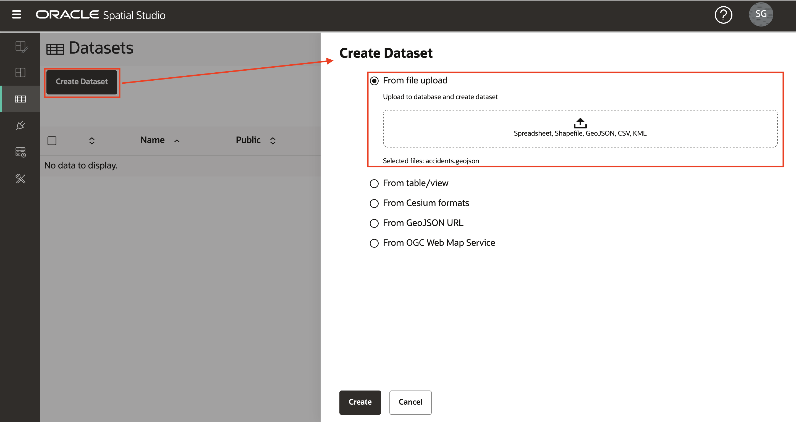
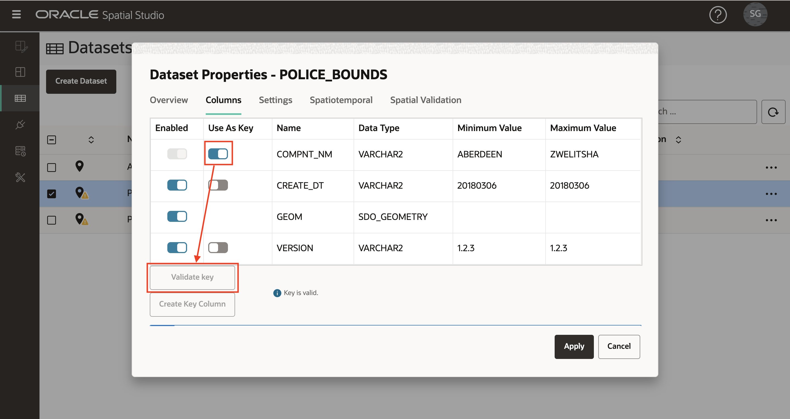
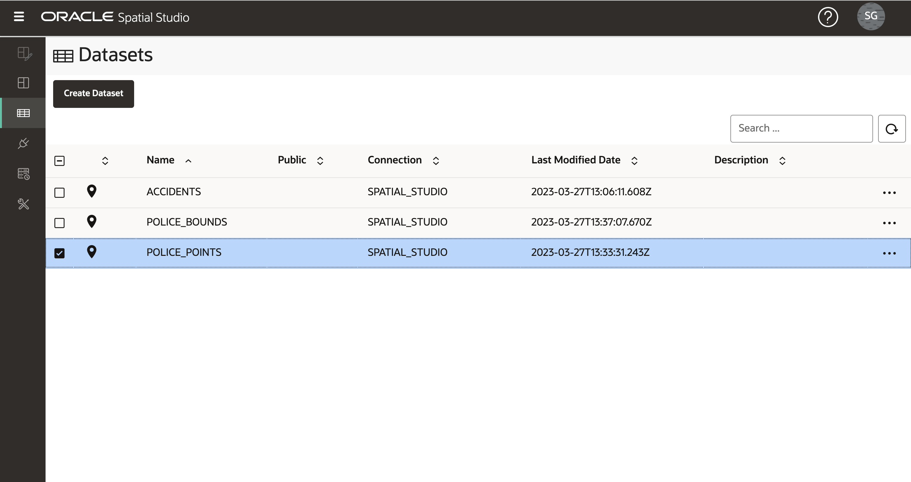

# Charger des données spatiales

## Présentation

Spatial Studio fonctionne sur des données stockées dans des bases de données Oracle. Dans Spatial Studio, vous utilisez des jeux de données, qui sont des tables et des vues de base de données accessibles via des connexions de base de données. Les jeux de données sont des pointeurs vers des tables et des vues de base de données. Ils peuvent avoir des noms conviviaux plus autodescriptifs que le nom de la table ou de la vue de base de données sous-jacente.

Les utilisateurs ont souvent besoin d'incorporer des données acquises à partir de différentes sources. Pour ce faire, Spatial Studio fournit des fonctionnalités permettant de charger des données dans Oracle Database à partir de formats standard. Cela inclut le chargement des 2 formats les plus courants pour l'échange de données spatiales : les fichiers Shapefiles et les fichiers GeoJSON. Cet atelier vous explique comment charger des données spatiales dans ces formats à l'aide de Spatial Studio.

En plus du chargement des formats spatiaux, Spatial Studio prend en charge le chargement des feuilles de calcul. Dans ce cas, une préparation supplémentaire est nécessaire pour dériver des géométries à partir d'attributs spatiaux tels que les adresses ("géocodage d'adresse") et les coordonnées latitude/longitude ("indexation de coordonnées"). Ces cas ne sont pas couverts dans ce laboratoire, mais feront l'objet d'un laboratoire distinct.

Temps de laboratoire estimé : 15 minutes

### Objectifs

*   Découvrez comment charger des données spatiales à partir de fichiers de forme et de GeoJSON
*   Apprendre à définir des champs clés pour les jeux de données

### Prérequis

*   Cet exercice nécessite l'accès à Spatial Studio et à Oracle Database.
*   Pour les déployer à partir d'Oracle Cloud Marketplace, accédez à la liste [ici](https://cloud.oracle.com/marketplace/application/71472162/overview) (vous serez invité à vous connecter à votre compte Oracle Cloud), puis suivez les instructions [ici](https://blogs.oracle.com/database/post/oracle-spatial-studio-221-now-on-cloud-marketplace).
*   Aucune expérience préalable d'Oracle Spatial n'est requise.

## Tâche 1 : Charger les données relatives aux accidents

Vous commencez par charger un ensemble de données d'accident de trafic à partir d'un fichier GeoJSON. Les données sont fictives et ont été générées pour des emplacements aléatoires le long des routes en Afrique du Sud.

1.  Téléchargez le fichier GeoJSON à un emplacement pratique : [accidents.geojson](https://objectstorage.us-ashburn-1.oraclecloud.com/p/VEKec7t0mGwBkJX92Jn0nMptuXIlEpJ5XJA-A6C9PymRgY2LhKbjWqHeB5rVBbaV/n/c4u04/b/livelabsfiles/o/data-management-library-files/accidents.geojson).
    
2.  Dans Spatial Studio, dans le menu du panneau de gauche, accédez à la page Ensembles de données, cliquez sur **Créer un ensemble de données**, puis glissez-déplacez accidents.geojson. Vous pouvez également cliquer sur la région de téléchargement et naviguer pour sélectionner le fichier. 
    
3.  Un aperçu des données GeoJSON sera affiché. Sélectionnez la connexion de destination pour ce téléchargement. Dans cet atelier, nous utilisons la connexion SPATIAL\_STUDIO (référentiel de métadonnées Spatial Studio), mais dans un scénario de production, vous auriez d'autres connexions pour ces données métier, distinctes du référentiel de métadonnées. Définissez les types de données pour NR\_VEHICLES et SEVERITY sur NUMERIC. Cliquez sur **Soumettre** pour lancer le chargement. 
    
4.  L'ensemble de données ACCIDENTS chargé sera répertorié avec une petite icône d'avertissement pour indiquer qu'une étape de préparation est nécessaire. Dans ce cas, nous devons ajouter une clé de jeu de données. Bien que cela ne soit pas nécessaire pour la cartographie de base, nous allons ajouter la clé maintenant car nous en aurons besoin pour les analyses dans les sections suivantes de l'atelier. Cliquez sur l'icône d'avertissement, puis sur le lien **Accéder aux colonnes de jeu de données**. 
    
5.  Si nos données ACCIDENTS contenaient une colonne d'identificateur unique, nous pourrions l'affecter en tant que clé. Mais ces données fictives n'ont pas une telle colonne, donc nous aurons Spatial Studio en créer une. Cliquez sur **Créer une colonne de clé**, définissez le nom sur ACCIDENT\_ID, puis cliquez sur **Appliquer**.  Observez l'ensemble de données ACCIDENTS répertorié sans avertissement, ce qui signifie qu'il est préparé pour la mise en correspondance et les analyses spatiales. 
    

## Tâche 2 : Charger les données du poste de police

Ensuite, vous chargez les stations du service de police sud-africain (SAPS) et les limites des stations à partir des fichiers Shapefiles stockés dans un fichier zip unique.

1.  Téléchargez le fichier ZIP contenant les fichiers de forme à un emplacement pratique : [SAPS\_police.zip](https://objectstorage.us-ashburn-1.oraclecloud.com/p/VEKec7t0mGwBkJX92Jn0nMptuXIlEpJ5XJA-A6C9PymRgY2LhKbjWqHeB5rVBbaV/n/c4u04/b/livelabsfiles/o/data-management-library-files/SAPS_police.zip).
    
2.  Accédez à la page Ensembles de données, cliquez sur **Créer un ensemble de données**, puis glissez-déplacez SAPS\_police.zip. Spatial Studio extrait les fichiers Shapefiles du fichier zip et les traite individuellement. 
    
3.  Le premier fichier Shapefile extrait sera les limites du poste de police, c'est-à-dire les zones géographiques surveillées par les postes. Sélectionnez la connexion de destination et définissez les noms de table et d'ensemble de données sur POLICE\_BOUNDS. 
    
4.  Le deuxième fichier Shapefile extrait sera Police Stations. Sélectionnez la connexion de destination et définissez les noms de table et d'ensemble de données sur POLICE\_POINTS. 
    
5.  Les ensembles de données POLICE\_BOUNDS et POLICE\_POINTS sont désormais répertoriés avec des avertissements car des clés doivent être définies. Cliquez sur l'icône d'avertissement de POLICE\_BOUNDS, puis sur le lien **Accéder aux colonnes d'ensemble de données**. 
    
6.  Dans ce cas, nous avons une colonne unique existante à utiliser comme clé. Sélectionnez **Utiliser comme clé** pour la colonne COMPNT\_NAME, cliquez sur **Valider la clé**, puis sur **Appliquer**. 
    
    Répétez les étapes 5 et 6 pour définir la clé de l'ensemble de données POLICE\_POINTS.
    
7.  Tous les jeux de données sont maintenant prêts pour la cartographie et l'analyse spatiale 
    

Vous pouvez maintenant [passer à l'exercice suivant](#next).

## En savoir plus

*   \[Portail produit Spatial Studio\] (https://oracle.com/goto/spatialstudio)

## Accusés de réception

*   **Auteur** - David Lapp, Database Product Management, Oracle
*   **Dernière mise à jour par/date** - Denise Myrick, Database Product Management, avril 2023
*   **Expiration de la main-d'oeuvre** - 31 mars 2024