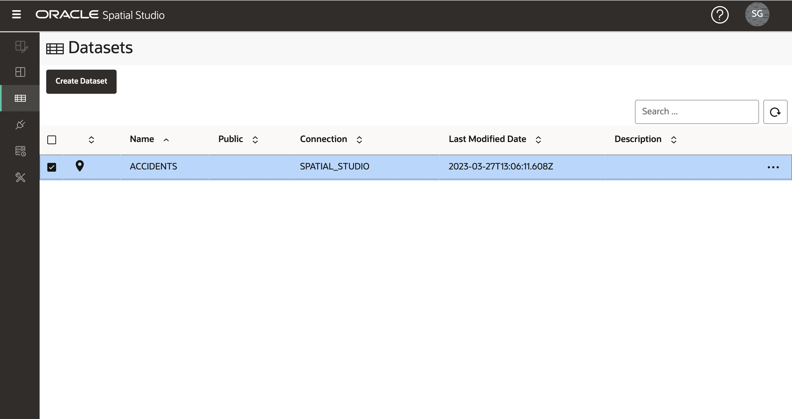

# 空間データのロード

## 概要

Spatial Studioは、Oracle Databasesに格納されているデータを操作します。Spatial Studioでは、データベース接続を介してアクセスされるデータベース表およびビューであるデータセットを使用します。データセットはデータベース表およびビューへのポインタであり、基礎となるデータベース表またはビュー名よりも自己記述的なわかりやすい名前を付けることができます。

多くの場合、ユーザーは様々なソースから取得したデータを組み込む必要があります。これをサポートするために、Spatial Studioには標準フォーマットからOracle Databaseにデータをロードする機能が用意されています。これには、空間データを交換するための最も一般的な2つの形式のロード(シェイプファイルおよびGeoJSONファイル)が含まれます。このラボでは、Spatial Studioを使用してこれらの形式の空間データをロードするステップについて説明します。

Spatial Studioでは、空間フォーマットのロードに加えて、スプレッドシートのロードもサポートされています。その場合、アドレス(アドレス・ジオコーディング)や緯度/経度座標(座標索引付け)などの空間属性からジオメトリを導出するために、追加の準備が必要です。これらのケースは、この演習では説明しませんが、別の演習の対象となります。

推定ラボ時間: 15分

### 目標

*   シェイプファイルおよびGeoJSONから空間データをロードする方法を学習します
*   データセットのキー・フィールドの設定方法を学習します

### 前提条件

*   このラボでは、Spatial StudioおよびOracle Databaseへのアクセスが必要です。
*   これらをOracle Cloud Marketplaceからデプロイするには、[ここ](https://cloud.oracle.com/marketplace/application/71472162/overview)のリストに移動し(Oracle Cloudアカウントにログインするように求められます)、[ここ](https://blogs.oracle.com/database/post/oracle-spatial-studio-221-now-on-cloud-marketplace)の手順に従ってください。
*   Oracle Spatialに関する経験は必要ありません。

## タスク1: 事故データのロード

まず、GeoJSONファイルから一連の交通事故データをロードします。データは架空であり、南アフリカの道路沿いのランダムな場所に生成されました。

1.  GeoJSONファイルを[accidents.geojson](https://objectstorage.us-ashburn-1.oraclecloud.com/p/VEKec7t0mGwBkJX92Jn0nMptuXIlEpJ5XJA-A6C9PymRgY2LhKbjWqHeB5rVBbaV/n/c4u04/b/livelabsfiles/o/data-management-library-files/accidents.geojson)という便利な場所にダウンロードします。
    
2.  Spatial Studioで、左側のパネル・メニューから「データセット」ページに移動し、**「データセットの作成」**をクリックして、accidents.geojsonをドラッグ・アンド・ドロップします。アップロード・リージョンをクリックしてファイルを選択することもできます。 
    
3.  GeoJSONデータのプレビューが表示されます。このアップロードの宛先接続を選択します。このワークショップでは、SPATIAL\_STUDIO接続(Spatial Studioメタデータ・リポジトリ)を使用していますが、本番シナリオでは、メタデータ・リポジトリとは別の、このようなビジネス・データ用の他の接続を使用します。NR\_VEHICLESおよびSEVERITYのデータ型をNUMERICに設定します。**「送信」**をクリックしてアップロードを開始します。 
    
4.  アップロードされたACCIDENTSデータセットは、準備ステップが必要であることを示す小さな警告アイコンとともにリストされます。この場合、データセット・キーを追加する必要があります。これは基本的なマッピングには必要ありませんが、後のワークショップ・セクションで分析に必要になるため、ここでキーを追加します。警告アイコンをクリックし、**「データセット列に移動」**リンクをクリックします 
    
5.  ACCIDENTSデータに一意の識別子列がある場合は、それをキーとして割り当てることができます。しかし、この架空のデータにはそのような列がないため、Spatial Studioで作成します。**「キー列の作成」**をクリックし、名前をACCIDENT\_IDに設定して、**「適用」**をクリックします。 ACCIDENTSデータセットが警告なしでリストされるようになったことを確認します。つまり、マッピングおよび空間分析用に準備されています。 
    

## タスク2: 警察署データのロード

次に、South African Police Service (SAPS) StationsとStation Boundariesを単一のzipファイルに保存したShapefilesからロードします。

1.  Shapefilesを含むzipファイルを便利な場所([SAPS\_police.zip](https://objectstorage.us-ashburn-1.oraclecloud.com/p/VEKec7t0mGwBkJX92Jn0nMptuXIlEpJ5XJA-A6C9PymRgY2LhKbjWqHeB5rVBbaV/n/c4u04/b/livelabsfiles/o/data-management-library-files/SAPS_police.zip))にダウンロードします。
    
2.  「データセット」ページに移動し、**「データセットの作成」**をクリックして、SAPS\_police.zipをドラッグ・アンド・ドロップします。Spatial Studioは、zipファイルからShapefilesを抽出し、個別に処理します。 
    
3.  最初に抽出されたShapefileは、警察署の境界、すなわち、駅によってパトロールされた地理的領域である。宛先接続を選択し、表およびデータセット名をPOLICE\_BOUNDSに設定します。 
    
4.  二つ目は警察署です。宛先接続を選択し、表およびデータセット名をPOLICE\_POINTSに設定します。 
    
5.  キーを定義する必要があるため、POLICE\_BOUNDSおよびPOLICE\_POINTSデータセットが警告とともにリストされるようになりました。POLICE\_BOUNDSの警告アイコンをクリックし、**「データセット列に移動」**リンクをクリックします。 
    
6.  この場合、キーとして使用する既存の一意列があります。列COMPNT\_NAMEの**「キーとして使用」**を選択し、**「キーの検証」**をクリックして、**「適用」**をクリックします。 
    
    ステップ5と6を繰り返して、データセットPOLICE\_POINTSのキーを設定します。
    
7.  すべてのデータセットがマッピングおよび空間分析の準備ができました 
    

[次の演習に進む](#next)ことができます。

## さらに学ぶ

*   \[Spatial Studio製品ポータル\] (https://oracle.com/goto/spatialstudio)

## 謝辞

*   **著者** - Oracle、データベース製品管理、David Lapp氏
*   **最終更新者/日付** - Denise Myrick、Database Product Management、2023年4月
*   **ラボの失効** - 2024年3月31日