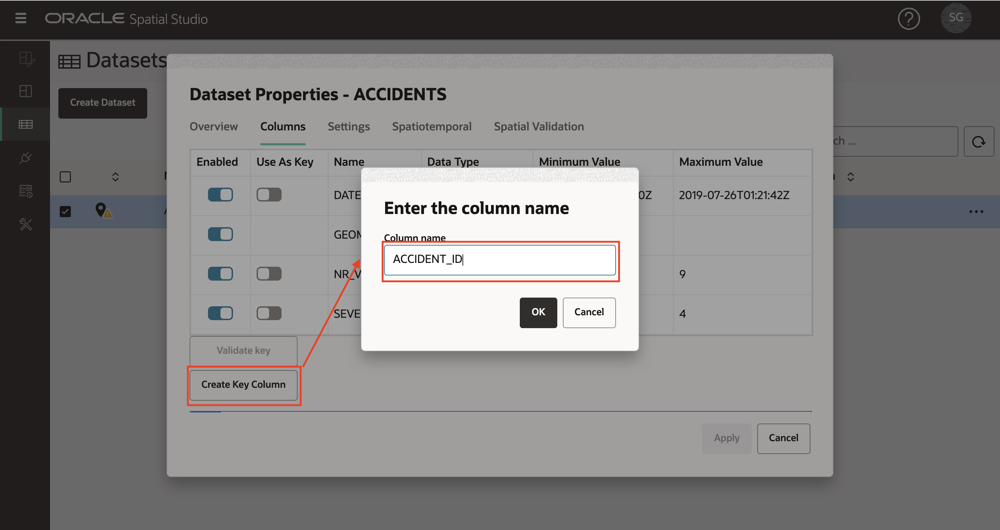

# Carregar Dados Espaciais

## Introdução

O Spatial Studio opera em dados armazenados em Bancos de Dados Oracle. No Spatial Studio, você trabalha com "Conjuntos de Dados", que são tabelas e views de banco de dados acessadas por meio de conexões de banco de dados. Os conjuntos de dados são ponteiros para tabelas e views de banco de dados e podem receber nomes amigáveis para serem mais autodescritivos do que a tabela de banco de dados subjacente ou o nome da view.

Os usuários geralmente precisam incorporar dados adquiridos de várias fontes. Para oferecer suporte a isso, o Spatial Studio fornece recursos para carregar dados de formatos padrão para o Oracle Database. Isso inclui o carregamento dos 2 formatos mais comuns para troca de dados espaciais: Shapefiles e arquivos GeoJSON. Este laboratório orienta você pelas etapas para carregar dados espaciais nesses formatos usando o Spatial Studio.

Além de carregar formatos espaciais, o Spatial Studio suporta o carregamento de planilhas. Nesse caso, é necessária uma preparação adicional para derivar geometrias de atributos espaciais, como endereços ("geocodificação de endereço") e coordenadas de latitude/longitude (" indexação de coordenadas"). Esses casos não são abordados neste laboratório, mas serão objeto de um laboratório separado.

Tempo de Laboratório Estimado: 15 minutos

### Objetivos

*   Saiba como carregar dados espaciais de Shapefiles e GeoJSON
*   Saiba como definir campos-chave para conjuntos de dados

### Pré-requisitos

*   Este laboratório requer acesso ao Spatial Studio e ao Oracle Database.
*   Para implantá-los no Oracle Cloud Marketplace, navegue até a listagem [aqui](https://cloud.oracle.com/marketplace/application/71472162/overview) (será solicitado que você faça login na sua conta do Oracle Cloud) e siga as instruções [aqui](https://blogs.oracle.com/database/post/oracle-spatial-studio-221-now-on-cloud-marketplace).
*   Nenhuma experiência anterior com o Oracle Spatial é necessária.

## Tarefa 1: Carregar dados de Acidentes

Você começa carregando um conjunto de dados de acidente de tráfego de um arquivo GeoJSON. Os dados são fictícios e foram gerados para locais aleatórios ao longo de estradas na África do Sul.

1.  Faça download do arquivo GeoJSON em um local conveniente: [accidents.geojson](https://objectstorage.us-ashburn-1.oraclecloud.com/p/VEKec7t0mGwBkJX92Jn0nMptuXIlEpJ5XJA-A6C9PymRgY2LhKbjWqHeB5rVBbaV/n/c4u04/b/livelabsfiles/o/data-management-library-files/accidents.geojson).
    
2.  No Spatial Studio, no menu do painel esquerdo, navegue até a página Conjuntos de Dados, clique em **Criar Conjunto de Dados** e arraste e solte accidents.geojson. Você também pode clicar na região de upload e navegar para selecionar o arquivo. 
    
3.  Uma visualização dos dados GeoJSON será exibida. Selecione a Conexão de destino para este upload. Neste workshop, estamos usando a conexão SPATIAL\_STUDIO (o repositório de metadados do Spatial Studio), mas em um cenário de produção, você teria outras conexões para esses dados de negócios, separadas do repositório de metadados. Defina os tipos de dados para NR\_VEHICLES e SEVERITY como NUMERIC. Clique em **Enviar** para iniciar o upload. 
    
4.  O conjunto de dados ACCIDENTS carregado será listado com um pequeno ícone de aviso para indicar que uma etapa de preparação é necessária. Nesse caso, precisamos adicionar uma chave de conjunto de dados. Embora isso não seja necessário para o mapeamento básico, adicionaremos a chave agora, pois precisaremos dela para análises em seções posteriores do workshop. Clique no ícone de aviso e, em seguida, clique no link **Ir para Colunas do Conjunto de Dados** 
    
5.  Se nossos dados ACCIDENTS tivessem uma coluna de identificador exclusiva, poderíamos atribuí-la como uma chave. Mas esses dados fictícios não têm essa coluna, então teremos o Spatial Studio criando uma. Clique em **Criar Coluna de Chaves**, defina o nome como ACCIDENT\_ID e clique em **Aplicar**.  Observe o conjunto de dados ACCIDENTS agora listado sem advertências, o que significa que está preparado para mapeamento e análises espaciais. 
    

## Tarefa 2: Carregar dados da Delegacia de Polícia

Em seguida, você carrega estações do Serviço de Polícia da África do Sul (SAPS) e limites de estação de arquivos de forma armazenados em um único arquivo zip.

1.  Faça download do arquivo zip que contém Arquivos de Forma para um local conveniente: [SAPS\_police.zip](https://objectstorage.us-ashburn-1.oraclecloud.com/p/VEKec7t0mGwBkJX92Jn0nMptuXIlEpJ5XJA-A6C9PymRgY2LhKbjWqHeB5rVBbaV/n/c4u04/b/livelabsfiles/o/data-management-library-files/SAPS_police.zip).
    
2.  Navegue até a página Conjuntos de Dados, clique em **Criar Conjunto de Dados** e arraste e solte SAPS\_police.zip. O Spatial Studio extrairá os Shapefiles do arquivo zip e os processará individualmente. 
    
3.  O primeiro Shapefile extraído será o Police Station Boundaries, ou seja, as áreas geográficas patrulhadas por estações. Selecione a Conexão de destino e defina os nomes da tabela e do Conjunto de Dados como POLICE\_BOUNDS. 
    
4.  O segundo Shapefile extraído será Police Stations. Selecione a Conexão de destino e defina os nomes da tabela e do Conjunto de Dados como POLICE\_POINTS. 
    
5.  Os Conjuntos de Dados POLICE\_BOUNDS e POLICE\_POINTS agora são listados com advertências, pois as chaves precisam ser definidas. Clique no ícone de aviso de POLICE\_BOUNDS e, em seguida, clique no link **Ir para Colunas do Conjunto de Dados**. 
    
6.  No caso de termos uma coluna exclusiva existente para usar como chave. Selecione **Usar como Chave** para a coluna COMPNT\_NAME, clique em **Validar chave** e, em seguida, clique em **Aplicar**. 
    
    Repita as etapas 5 e 6 para definir a chave para o Conjunto de Dados POLICE\_POINTS.
    
7.  Todos os conjuntos de dados agora estão prontos para mapeamento e análise espacial 
    

Agora você pode [prosseguir para o próximo laboratório](#next).

## Saiba Mais

*   \[Portal de produtos do Spatial Studio\] (https://oracle.com/goto/spatialstudio)

## Agradecimentos

*   **Autor** - David Lapp, Database Product Management, Oracle
*   **Última Atualização em/Data** - Denise Myrick, Database Product Management, abril de 2023
*   **Lab Expiry** - 31 de março de 2024