# 加载空间数据

## 简介

Spatial Studio 对存储在 Oracle 数据库中的数据进行操作。在 Spatial Studio 中，您可以使用“数据集”，即通过数据库连接访问的数据库表和视图。数据集是指向数据库表和视图的指针，并且可能被赋予友好的名称，以比基础数据库表或视图名称更能自我描述。

用户通常需要整合从各种来源获取的数据。为了支持这一点，Spatial Studio 提供了将数据从标准格式加载到 Oracle Database 的功能。这包括加载用于交换空间数据的 2 种最常用的格式：Shapefiles 和 GeoJSON 文件。此实验室将指导您完成使用 Spatial Studio 加载这些格式的空间数据的步骤。

除了加载空间格式外，Spatial Studio 还支持加载电子表格。在这种情况下，需要额外准备从空间属性（如地址（“地址地理编码”）和纬度/经度坐标（“坐标索引”）推导几何。这些病例不在本实验室中，但将成为独立实验室的主题。

估计的实验室时间：15 分钟

### 目标

*   了解如何从 Shapefiles 和 GeoJSON 加载空间数据
*   了解如何设置数据集的关键字段

### 先备条件

*   此实验室需要访问 Spatial Studio 和 Oracle Database。
*   要从 Oracle Cloud Marketplace 部署这些应用程序，请导航到[此处](https://cloud.oracle.com/marketplace/application/71472162/overview)的列表（系统将提示您登录到 Oracle Cloud 账户），然后按照[此处](https://blogs.oracle.com/database/post/oracle-spatial-studio-221-now-on-cloud-marketplace)的说明进行操作。
*   以前不需要具备 Oracle Spatial 经验。

## 任务 1：加载事故数据

首先从 GeoJSON 文件加载一组交通事故数据。这些数据是虚构的，为南非道路上的随机位置生成。

1.  将 GeoJSON 文件下载到方便的位置：[accidents.geojson](https://objectstorage.us-ashburn-1.oraclecloud.com/p/VEKec7t0mGwBkJX92Jn0nMptuXIlEpJ5XJA-A6C9PymRgY2LhKbjWqHeB5rVBbaV/n/c4u04/b/livelabsfiles/o/data-management-library-files/accidents.geojson) 。
    
2.  在 Spatial Studio 中，从左侧面板菜单导航到“数据集”页，单击**创建数据集**，然后拖放 accidents.geojson。您还可以单击上载区域并导航到该文件。 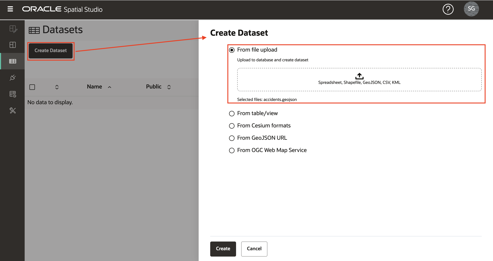
    
3.  将显示 GeoJSON 数据的预览。选择此上载的目标连接。在本研讨会中，我们将使用 SPATIAL\_STUDIO 连接（Spatial Studio 元数据资料档案库），但在生产方案中，您将具有用于此类业务数据的其他连接（与元数据资料档案库分开）。将 NR\_VEHICLES 和 SEVERITY 的数据类型设置为 NUMERIC。单击**提交**以启动上载。 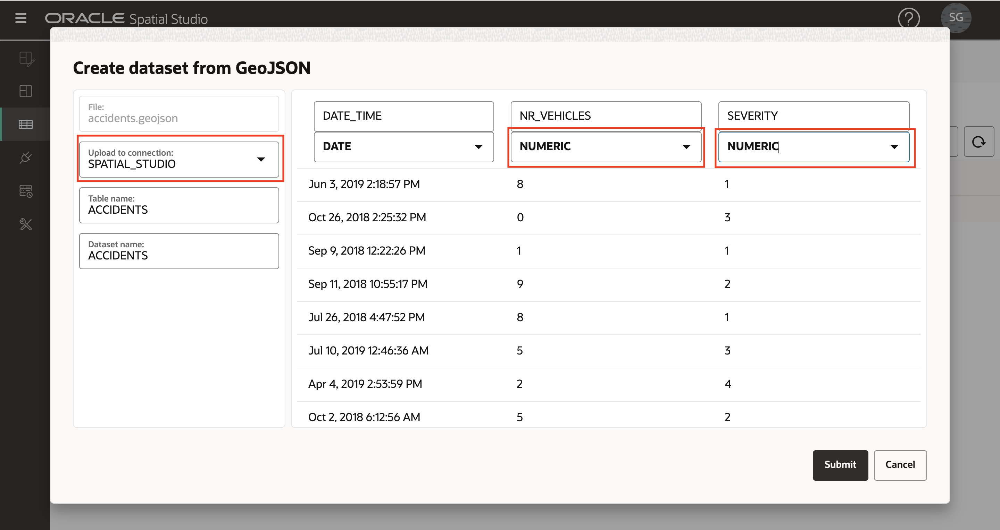
    
4.  上载的 ACCIDENTS 数据集将以小警告图标列出，以指示需要准备步骤。在这种情况下，我们需要添加数据集密钥。虽然基本映射不需要这一点，但现在我们将添加该键，因为我们需要它在后面的研讨会部分中进行分析。单击警告图标，然后单击链接**转至数据集列** 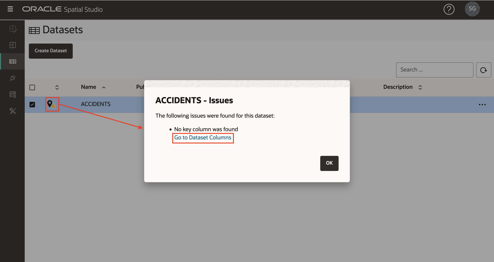
    
5.  如果 ACCIDENTS 数据具有唯一的标识符列，则可以将其指定为键。但是这个虚构的数据没有这样的列，所以我们将让 Spatial Studio 创建一个。单击**创建关键字列**，将名称设置为 ACCIDENT\_ID，然后单击**应用**。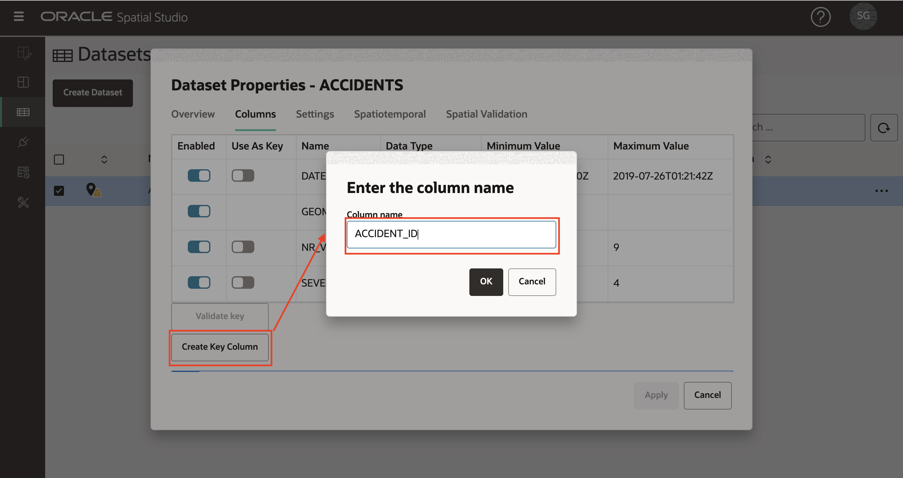 观察现在列出的 ACCIDENTS 数据集，但没有出现警告，这意味着已准备好进行映射和空间分析。 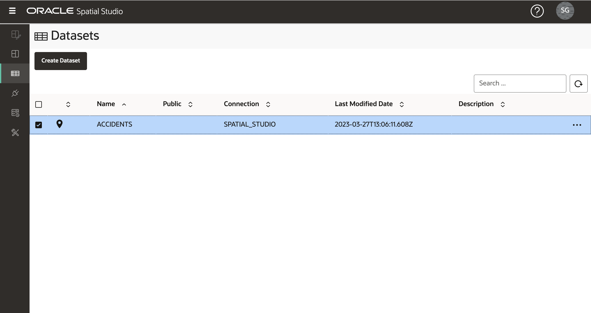
    

## 任务 2：加载警察局数据

接下来，您将从存储在单个 zip 文件中的 Shapefiles 加载南非警察局 (SAPS) 站和站边界。

1.  将包含 Shapefiles 的 zip 文件下载到方便的位置：[SAPS\_police.zip](https://objectstorage.us-ashburn-1.oraclecloud.com/p/VEKec7t0mGwBkJX92Jn0nMptuXIlEpJ5XJA-A6C9PymRgY2LhKbjWqHeB5rVBbaV/n/c4u04/b/livelabsfiles/o/data-management-library-files/SAPS_police.zip) 。
    
2.  导航到“数据集”页，单击**创建数据集**，然后拖放 SAPS\_police.zip。Spatial Studio 将从 zip 文件中提取 Shapefiles 并单独处理它们。 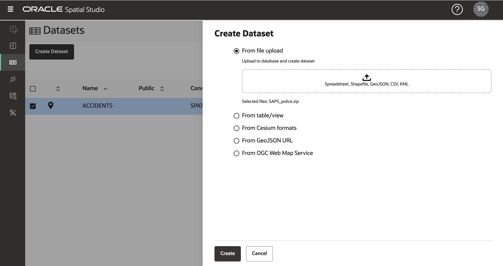
    
3.  第一个提取的 Shapefile 将是警察局边界，即由警察局巡逻的地理区域。选择目标连接并将表和数据集名称设置为 POLICE\_BOUNDS。 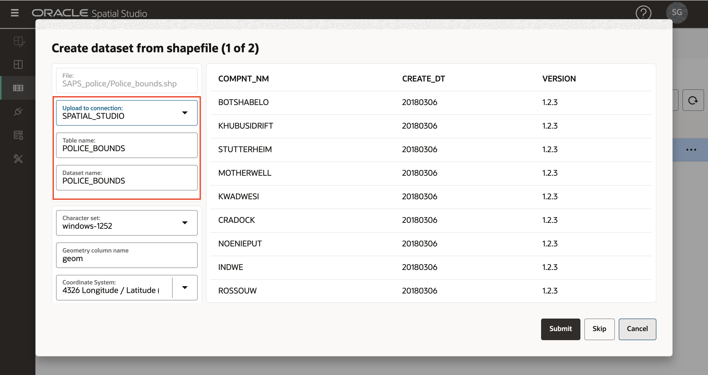
    
4.  第二次提取的 Shapefile 将是警察局。选择目标连接并将表和数据集名称设置为 POLICE\_POINTS。 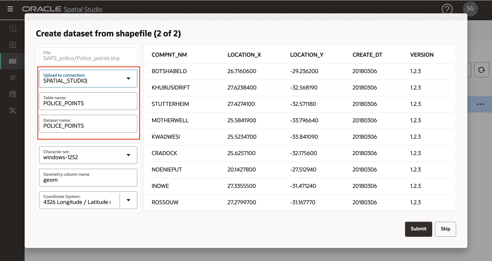
    
5.  POLICE\_BOUNDS 和 POLICE\_POINTS 数据集现在已列出，但出现警告，因为需要定义密钥。单击 POLICE\_BOUNDS 的警告图标，然后单击链接**转到数据集列**。 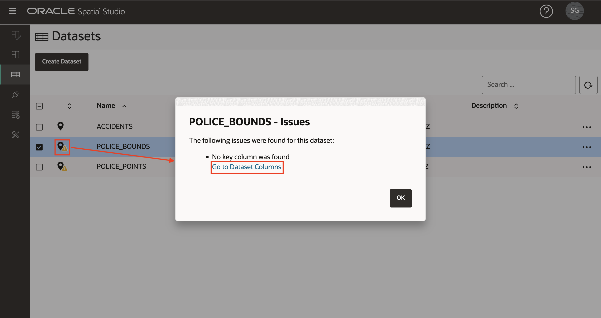
    
6.  在这种情况下，我们有现有的唯一列用作键。为列 COMPNT\_NAME 选择**用作关键字**，单击**验证关键字**，然后单击**应用**。 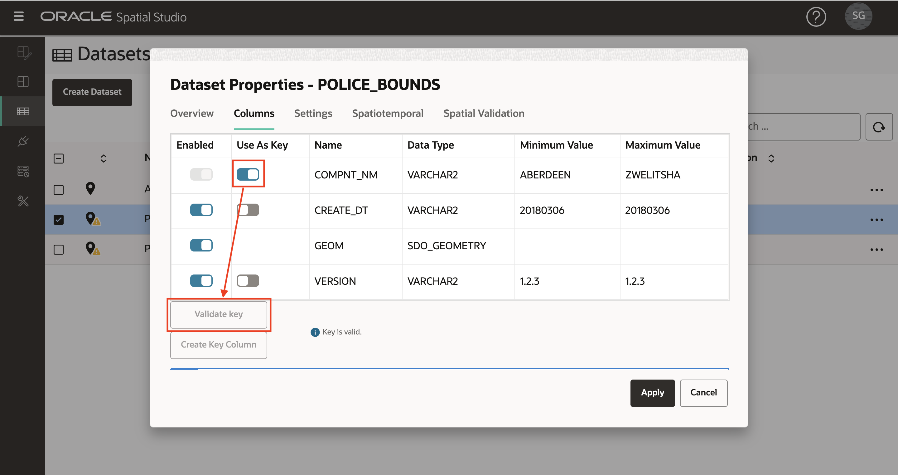
    
    重复步骤 5 和 6 以设置数据集 POLICE\_POINTS 的键。
    
7.  所有数据集现已准备好进行映射和空间分析 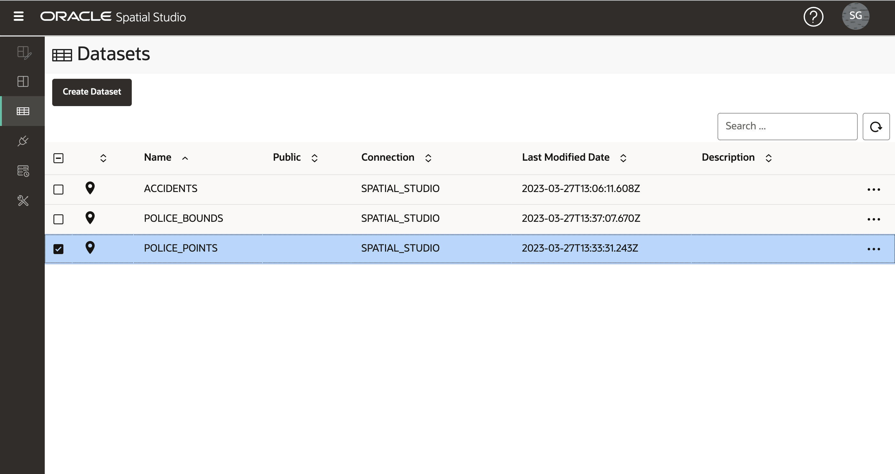
    

现在，您可以[进入下一个练习](#next)。

## 了解详细信息

*   ［Spatial Studio 产品门户］ (https://oracle.com/goto/spatialstudio)

## 确认

*   **作者** - David Lapp，Oracle 数据库产品管理
*   **上次更新者/日期** - Denise Myrick，数据库产品管理，2023 年 4 月
*   **实验室到期** - 2024 年 3 月 31 日