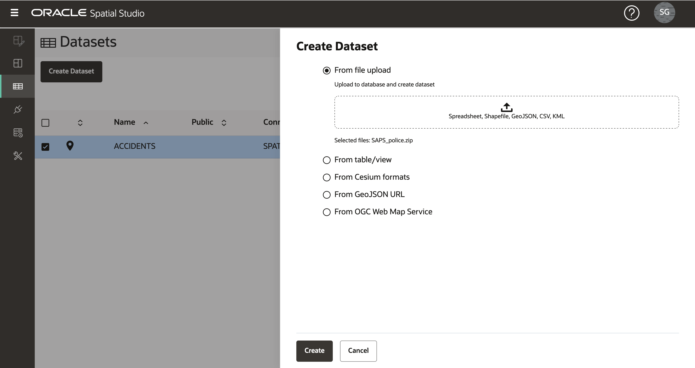
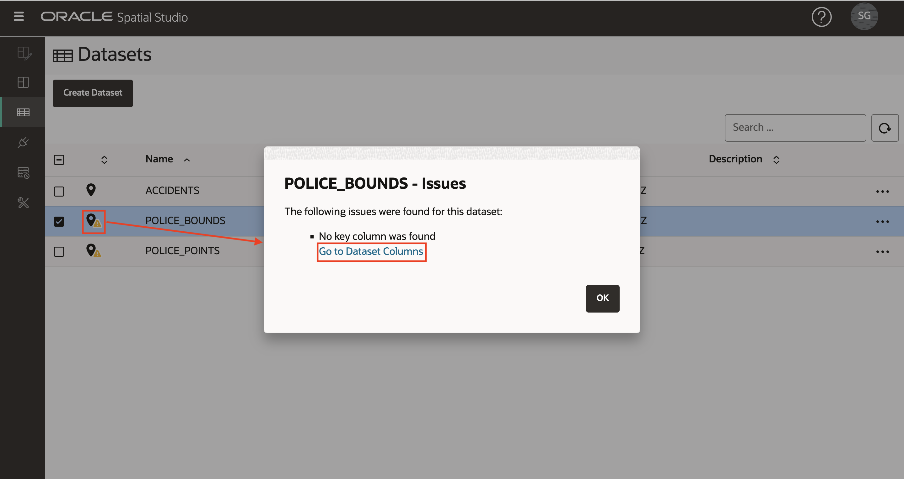

# 載入空間資料

## 簡介

Spatial Studio 會針對儲存在 Oracle 資料庫中的資料運作。在 Spatial Studio 中，您使用「資料集」，這是透過資料庫連線存取的資料庫表格和視觀表。資料集是資料庫表格和視觀表的指標，而且可能給予易記名稱，使其比基礎資料庫表格或視觀表名稱更具有自我描述性。

使用者通常需要結合從各種來源取得的資料。為了支援此功能，Spatial Studio 提供將資料從標準格式載入 Oracle Database 的功能。這包括載入兩個最常見的空間資料交換格式：Shapefiles 和 GeoJSON 檔案。這個實驗室會逐步引導您使用 Spatial Studio 載入這些格式的空間資料。

除了載入空間格式之外，Spatial Studio 還支援載入試算表。在此情況下，需要進行額外的準備，才能從空間屬性 (例如地址 (地址地理編碼) 和緯度 / 經度座標 (協調索引) 衍生幾何圖形。這些個案未涵蓋在此實驗室中，但將會是個別實驗室的主題。

預估實驗室時間：15 分鐘

### 目標

*   瞭解如何從 Shapefiles 和 GeoJSON 載入空間資料
*   瞭解如何設定資料集的關鍵欄位

### 先決條件

*   這個實驗室需要存取 Spatial Studio 和 Oracle Database。
*   若要從 Oracle Cloud Marketplace 部署這些項目，請瀏覽至[此處](https://cloud.oracle.com/marketplace/application/71472162/overview) (系統會提示您登入您的 Oracle Cloud 帳戶)，然後依照[此處](https://blogs.oracle.com/database/post/oracle-spatial-studio-221-now-on-cloud-marketplace)的指示進行。
*   不需要使用 Oracle Spatial 的使用經驗。

## 任務 1：載入意外事件資料

首先，您要從 GeoJSON 檔案載入一組交通事故資料。這些數據是虛構的，在南非的道路上隨機的產生。

1.  將 GeoJSON 檔案下載到方便的位置：[accidents.geojson](https://objectstorage.us-ashburn-1.oraclecloud.com/p/VEKec7t0mGwBkJX92Jn0nMptuXIlEpJ5XJA-A6C9PymRgY2LhKbjWqHeB5rVBbaV/n/c4u04/b/livelabsfiles/o/data-management-library-files/accidents.geojson) 。
    
2.  在 Spatial Studio 中，從左側面板功能表瀏覽至「資料集」頁面，按一下**建立資料集**，然後拖放 accidents.geojson。您也可以按一下上傳區域，然後瀏覽以選取檔案。 
    
3.  將會顯示 GeoJSON 資料的預覽。選取此上傳的目的地連線。在本研討會中，我們使用 SPATIAL\_STUDIO 連線 (Spatial Studio 描述資料儲存區域)，但在生產環境中，您會有這些業務資料的其他連線 (與描述資料儲存區域分開)。將 NR\_VEHICLES 與 SEVERITY 的資料類型設定為 NUMERIC。按一下**送出**以起始上傳。 
    
4.  上傳的 ACCIDENTS 資料集將會列出小警告圖示，以指示需要準備步驟。在此情況下，我們需要新增資料集索引鍵。雖然基本對應不需要此項目，但我們現在將新增此關鍵，因為我們會在稍後的研討會區段中需要分析。按一下警告圖示，然後按一下連結**前往資料集資料欄** 
    
5.  如果我們的 ACCIDENTS 資料有唯一的 ID 資料欄，可以將它指定為索引鍵。但此虛構資料沒有此資料欄，因此我們將建立 Spatial Studio。按一下**建立索引鍵資料欄**，將名稱設為 ACCIDENT\_ID，然後按一下**套用**。 觀察現在列出的 ACCIDENTS 資料集沒有警告，也就是準備進行對應和空間分析。 
    

## 作業 2：載入警署資料

接下來，您從儲存於單一 zip 檔中的 Shapefiles 載入南非警察局 (SAPS) 站和車站界限。

1.  將包含 Shapefiles 的 zip 檔案下載至方便的位置：[SAPS\_police.zip](https://objectstorage.us-ashburn-1.oraclecloud.com/p/VEKec7t0mGwBkJX92Jn0nMptuXIlEpJ5XJA-A6C9PymRgY2LhKbjWqHeB5rVBbaV/n/c4u04/b/livelabsfiles/o/data-management-library-files/SAPS_police.zip) 。
    
2.  瀏覽至「資料集」頁面，按一下**建立資料集**，然後拖放 SAPS\_police.zip。Spatial Studio 會從壓縮檔擷取資源配置檔，並個別處理它們。 
    
3.  抽取的第一個形狀檔是警察局邊界，即車站巡邏的地理區域。選取目的地連線，並將表格與資料集名稱設為 POLICE\_BOUNDS。 
    
4.  抽取的第二個形狀檔將是警察局。選取目的地連線，並將表格與資料集名稱設為 POLICE\_POINTS。 
    
5.  現在會列出 POLICE\_BOUNDS 和 POLICE\_POINTS 資料集並顯示警告，因為需要定義金鑰。按一下 POLICE\_BOUNDS 的警告圖示，然後按一下**前往資料集資料欄**連結。 
    
6.  如果我們有現有的唯一資料欄作為索引鍵使用。選取資料欄 COMPNT\_NAME 的**作為索引鍵**，按一下**驗證索引鍵**，然後按一下**套用**。 
    
    重複步驟 5 和 6 以設定資料集 POLICE\_POINTS 的索引鍵。
    
7.  所有資料集現在都已準備好進行對應和空間分析 
    

您現在可以[進入下一個實驗室](#next)。

## 進一步瞭解

*   \[Spatial Studio 產品入口網站 \] (https://oracle.com/goto/spatialstudio)

## 確認

*   **作者** - Oracle 資料庫產品管理 David Lapp
*   **上次更新者 / 日期** - Denise Myrick，Database Product Management，2023 年 4 月
*   **實驗室到期** - 2024 年 3 月 31 日