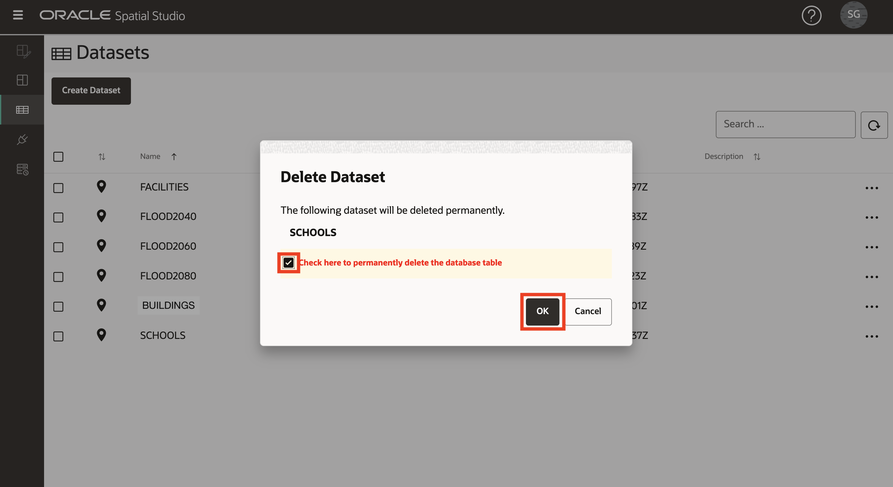

# Spatial Studio und ADB auf Pre-Workshop-Status zurücksetzen

## Einführung

In dieser Übung werden alle in den vorherigen Übungen erstellten Elemente entfernt, sodass Sie bei Bedarf von vorne beginnen können.

Geschätzte Laborzeit: 5 Minuten

Sehen Sie sich das Video unten an, um einen schnellen Durchgang des Labors zu erhalten.

[Spatial Studio und ADB auf Pre-Workshop-Status zurücksetzen](videohub:1_z4mhzd51)

### Ziele

In dieser Übung führen Sie folgende Schritte aus:

*   Entfernen Sie Spatial Studio- und ADB-Artefakte, die in den vorherigen Übungen erstellt wurden.

### Voraussetzungen

*   Spatial Studio, das über den Oracle Cloud Marketplace bereitgestellt wird

## Aufgabe 1: Projekte löschen

1.  Navigieren Sie zur Seite **Projekte**. Wählen Sie im Aktionsmenü für veröffentlichte Projekte die Option **Löschen** aus.
    
    
    
2.  Wählen Sie im Aktionsmenü für Projekte die Option **Löschen** aus.
    
    
    

## Aufgabe 2: Datasets löschen

1.  Navigieren Sie zur Seite **Datensets**. Wählen Sie im Aktionsmenü für das Analysedatenset **SCHOOLS IN FLOOD2060** die Option **Löschen** aus.
    
    
    
2.  Wiederholen Sie den vorherigen Schritt für andere Analysedatensätze in der folgenden Reihenfolge: 1) GEBÄUDE FLOOD CONTACT, 2) EINRICHTUNGEN IN DER NÄHE FLOOD2060 DISTANCE, 3) EINRICHTUNGEN IN DER NÄHE FLOOD2060
    
3.  Wählen Sie im Aktionsmenü für das Datenset FACILITIES die Option **Löschen** aus.
    
    
    
4.  Wählen Sie im Bestätigungs-Popup die Option zum Löschen der verknüpften Datenbanktabelle.
    
    
    
5.  Wiederholen Sie den Vorgang für alle verbleibenden Datasets.
    

Spatial Studio und ADB werden jetzt auf ihren Pre-Workshop-Status zurückgesetzt.

## Weitere Informationen

*   [Oracle Spatial-Produktseite](https://www.oracle.com/database/spatial)
*   [Erste Schritte mit Spatial Studio](https://www.oracle.com/database/technologies/spatial-studio/get-started.html)
*   [Dokumentation zu Spatial Studio](https://docs.oracle.com/en/database/oracle/spatial-studio)

## Danksagungen

*   **Autor** - David Lapp, Database Product Management, Oracle
*   **Mitwirkende** - Denise Myrick
*   **Zuletzt aktualisiert am/um** - David Lapp, August 2023