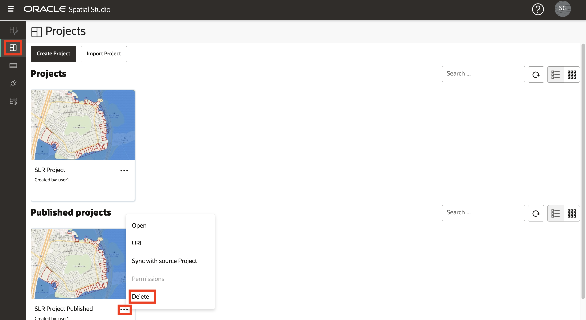
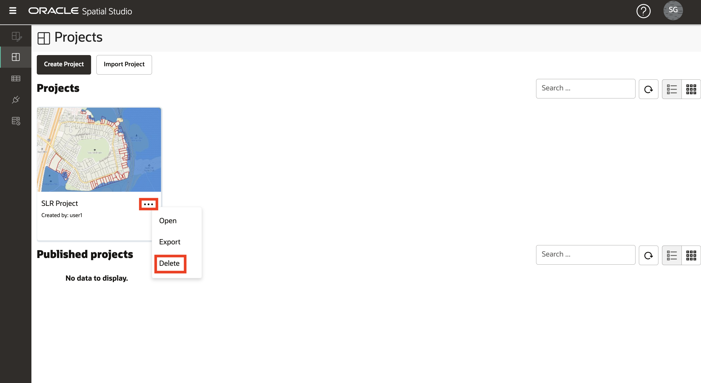
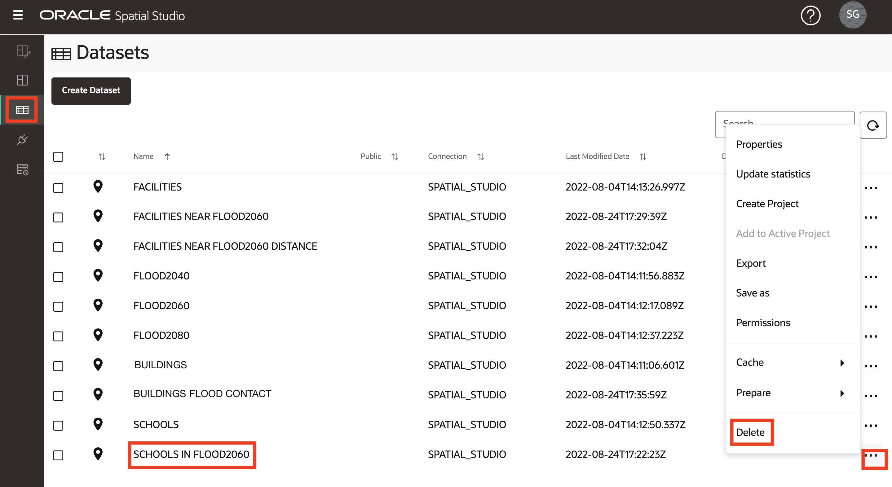
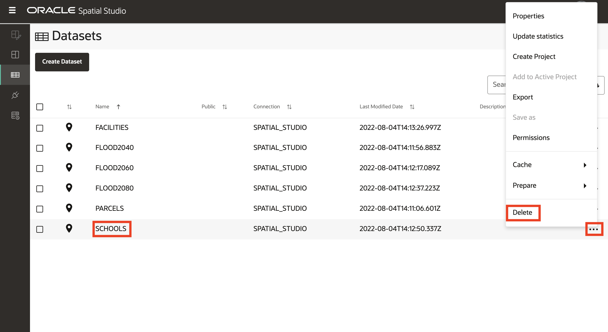
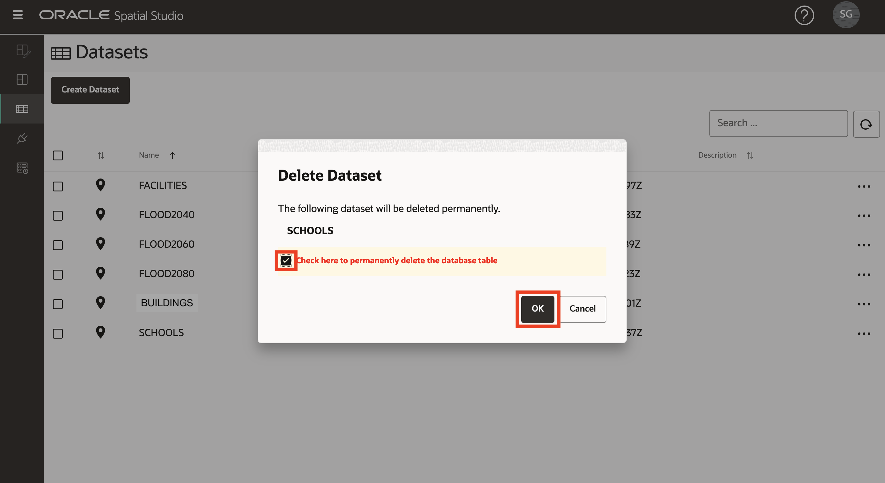

# Spatial StudioおよびADBをワークショップ前の状態にリセット

## 概要

この演習では、前の演習で作成したものをすべて削除して、必要に応じてやり直すことができます。

推定ラボ時間: 5分

ラボのクイック・ウォークスルーについては、次のビデオをご覧ください。

[Spatial StudioおよびADBをワークショップ前の状態にリセット](videohub:1_z4mhzd51)

### 目標

この演習では、次のことを行います。

*   前の演習で作成したSpatial StudioおよびADBアーティファクトを削除します。

### 前提条件

*   Oracle Cloud MarketplaceからデプロイされたSpatial Studio

## タスク1: プロジェクトの削除

1.  **「プロジェクト」**ページにナビゲートします。「公開済プロジェクト」のアクション・メニューから、**「削除」**オプションを選択します。
    
    
    
2.  プロジェクトのアクション・メニューから、**「削除」**オプションを選択します。
    
    
    

## タスク2: データセットの削除

1.  **「データセット」**ページにナビゲートします。**SCHOOLS IN FLOOD2060**分析データセットのアクション・メニューから、**「削除」**オプションを選択します。
    
    
    
2.  次の順序で、他の分析データセットに対して前のステップを繰り返します: 1) BUILDINGS FLOOD CONTACT、2) FACILITIES NEAR FLOOD2060 DISTANCE、3) FACILITIES NEAR FLOOD2060
    
3.  FACILITIESデータセットのアクション・メニューから、**「削除」**オプションを選択します。
    
    
    
4.  確認ポップアップで、関連するデータベース表を削除するオプションを選択します。
    
    
    
5.  残りのすべてのデータセットに対して繰り返します。
    

Spatial StudioとADBは、ワークショップ前の状態にリセットされます。

## さらに学ぶ

*   [Oracle Spatial製品ページ](https://www.oracle.com/database/spatial)
*   [Spatial Studioの開始](https://www.oracle.com/database/technologies/spatial-studio/get-started.html)
*   [Spatial Studioのドキュメント](https://docs.oracle.com/en/database/oracle/spatial-studio)

## 確認

*   **著者** - Oracle、データベース製品管理、David Lapp氏
*   **貢献者** - Denise Myrick
*   **最終更新者/日付** - David Lapp、2023年8月